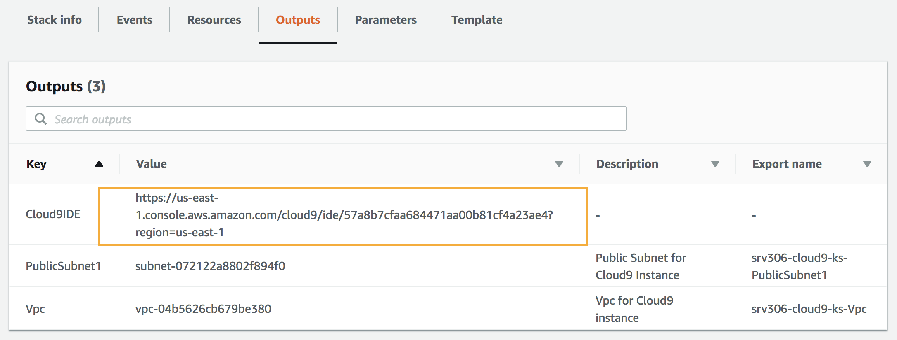
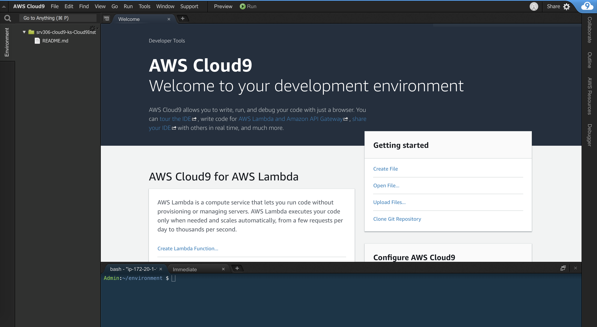

# Getting Started: Workshop Prerequisites and Setup

This section outlines the prerequisites to complete the workshop and instructions for launching a Cloud9 IDE environment that you will use throughout the workshop.

## Prerequisites

### AWS Account

In order to complete this workshop, you'll need an AWS account and access to create and manage the AWS resources that are used in this workshop, including Cloud9, Cognito, API Gateway, Lambda, DynamoDB, and IAM policies and roles. *The IAM user/role used for this workshop will require administrative and IAM full access permissions*.

The code and instructions in this workshop assume only one participant is using a given AWS account at a time. If you attempt sharing an account with another participant, you may encounter naming conflicts for certain resources. You can work around this by using distinct Regions, but the instructions do not provide details on the changes required to make this work.

Please make sure not to use a production AWS environment or account for this workshop. It is recommended to instead use a development account which provides full access to the necessary services so that you do not run into permissions issues.

### Region Selection

Use a single region for the entirety of this workshop. This workshop supports three regions in North America, three regions in Europe, and three in Asia Pacific. Choose one region from the launch stack links below and continue to use that region for all of the Auth workshop activities.

### AWS Cloud9 IDE

[AWS Cloud9](https://aws.amazon.com/cloud9/) is a cloud-based integrated development environment (IDE) that lets
you write, run, and debug your code with just a browser. It includes a code
editor, debugger, and terminal. Cloud9 comes pre-packaged with essential tools
for popular programming languages and the AWS Command Line Interface (CLI)
pre-installed so you don’t need to install files or configure your laptop for
this workshop. 

## Cloud9 IDE Setup

In this section you will launch a CloudFormation stack that will create a a new [Amazon VPC](https://aws.amazon.com/vpc/) environment and a [Cloud9 IDE](https://aws.amazon.com/cloud9/) Instance that you will use in the rest of the workshop.

Region Name | Region Code | Launch
------|-----|-----
US East (N. Virginia) | us-east-1 | [](https://console.aws.amazon.com/cloudformation/home?region=us-east-1#/stacks/new?stackName=WildRydes-Cloud9&templateURL=https://s3.amazonaws.com/wildrydes-us-east-1/Auth/0_GettingStarted/Cloud9WithNewVPC.yaml)
US East (Ohio) | us-east-2 | [](https://console.aws.amazon.com/cloudformation/home?region=us-east-2#/stacks/new?stackName=WildRydes-Cloud9&templateURL=https://s3.amazonaws.com/wildrydes-us-east-2/Auth/0_GettingStarted/Cloud9WithNewVPC.yaml)
US West (Oregon) | us-west-2 | [](https://console.aws.amazon.com/cloudformation/home?region=us-west-2#/stacks/new?stackName=WildRydes-Cloud9&templateURL=https://s3.amazonaws.com/wildrydes-us-west-2/Auth/0_GettingStarted/Cloud9WithNewVPC.yaml)
EU (Ireland) | eu-west-1 | [](https://console.aws.amazon.com/cloudformation/home?region=eu-west-1#/stacks/new?stackName=WildRydes-Cloud9&templateURL=https://s3.amazonaws.com/wildrydes-eu-west-1/Auth/0_GettingStarted/Cloud9WithNewVPC.yaml)
Asia Pacific (Singapore) | ap-southeast-1 | [](https://console.aws.amazon.com/cloudformation/home?region=ap-southeast-1#/stacks/new?stackName=WildRydes-Cloud9&templateURL=https://s3.amazonaws.com/wildrydes-ap-southeast-1/Auth/0_GettingStarted/Cloud9WithNewVPC.yaml)

<details>
<summary><strong>Step-by-step instructions (expand for details)</strong></summary><p>

1. Launch the CloudFormation stack from the links above, choosing the link appropriate for the region you selected for this workshop.

1. On the next screen, Step 2, confirm the stack name is  `WildRydes-Cloud9` and click **Next**.

1. On the Configure Stack Options page, accept all the defaults and click **Next**.

1. On the Review page, review the summary details then click **Create stack**.

1. It will take a few minutes for the Stack to create. Choose the **Stack Info** tab to go to the overall stack status page and wait until the stack is fully launched and shows a status of *CREATE_COMPLETE*. Click the refresh icon periodically to see progress update.

1. With the *WildRydes-Cloud9* stack selected, click on the **Outputs** tab and copy the value shown for the *Cloud9IDE* to the clipboard. Browse to that URL in a new browser tab to load your IDE environment.

	> Note: When you launch the stack, CloudFormation deploys a nested CloudFormation stack to launch the Cloud9 resources. You can safely ignore that template which is prefixed with "aws-cloud9-WildRydes-".

	

</p></details>

Once you have launched and navigated to your Cloud9 workspace URL shown in your CloudFormation stack outputs, you should have an IDE environment as shown below:



You can run AWS CLI commands in here just like you would on your local computer. Verify that your user is logged in by running the following:

```
aws sts get-caller-identity
```

You should see output indicating your account and user information:

```
{
    "Account": "123456789012",
    "UserId": "AKIAI44QH8DHBEXAMPLE",
    "Arn": "arn:aws:iam::123456789012:user/Alice"
}
```

Keep your AWS Cloud9 IDE opened in a tab throughout this workshop as you'll be using it for most all activities.

### Download Workshop Code

1. Switch to the tab where you have your Cloud9 IDE opened.

1. Clone the workshop repository to your IDE environment by running the following command in the Cloud9 terminal window:

    ```console
    git clone https://github.com/aws-samples/aws-serverless-workshops.git
    ```

### Initialize your developer workspace

1. Run the following commands to upgrade your Node.js version to the latest version of Node.js 8. The [AWS Amplify](https://aws-amplify.github.io/) JavaScript library which we will be using requires Node.js 8 or higher.

    ```console
    nvm i 8
    nvm alias default 8
    ```

2. Install the yarn package manager and website dependencies by running the following commands

    ```console
    npm install -g yarn
    cd ~/environment/aws-serverless-workshops/Auth/website/
    yarn install
    ```

### Tips

:bulb: Keep an open scratch pad in Cloud9 or a text editor on your local computer
for notes.  When the step-by-step directions tell you to note something such as
an ID or Amazon Resource Name (ARN), copy and paste that into the scratch pad tab.

### Recap

* Use a unique personal or development AWS Account where you have permissions to create resources and create IAM policies and roles
* Use a single, consistent region throughout all modules of this Auth workshop
* Keep your [AWS Cloud9 IDE](#aws-cloud9-ide) opened in a tab at all times

### Next

Once you have your Cloud9 workspace fully working, proceed back to the main workshop page to review the workshop steps and begin - [Next Steps](../README.md).
