# Module 1: User Authentication

In this module, you will create an Amazon Cognito User Pool and Identity Pool for the Wild Rydes application.
The Cognito User Pool will store user profile information and provide sign-up and sign-in capabilities, with the Cognito Identity Pool providing the ability to assume an Identity and Access Management (IAM) role from within the application.

Since Wild Rydes is a ride sharing application, a key requirement is that all users must sign-up and sign-in before they're allowed to request a ride. You will configure the application to integrate with [Amazon Cognito](https://aws.amazon.com/cognito/) for these purposes via the [AWS Amplify](https://aws-amplify.github.io/) JavaScript library.

## Solution Architecture

The architecture for this module is very straightforward. All of your static web content including HTML, CSS, JavaScript, images and other files will be served locally from your Cloud9 workspace. As you make changes to the website application code, all changes will be automatically updated and shown in your browser via live reload capabilities.

For this module, we will be creating a Cognito User Pool as our secure user directory then configuring our application to use the AWS Amplify library to easily integrate Amazon Cognito into our application.

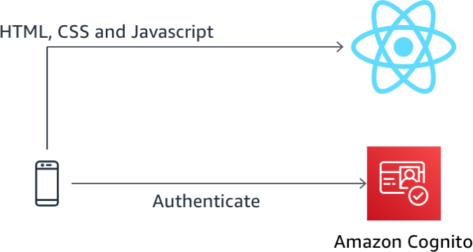

## Implementation Overview

Each of the following sections provides an implementation overview and detailed, step-by-step instructions. The high-level overview should provide context for you to complete the implementation yourself if you're comfortable with the AWS Management Console and are comfortable exploring the services and documentation yourself without following a walkthrough.

If you're using the latest version of the Chrome, Firefox, or Safari web browsers the step-by-step instructions won't be visible until you expand the section.

### 1. Running the website locally

1. From your Cloud9 workspace, select the terminal window and when you are within your *~/environment/aws-serverless-workshops/Auth/website* directory, run the following command to start the local web server 

    ```console
    yarn start
    ```

    Wait for the development server to start. You can ignore any message saying *Compiled with warnings* as we will resolve these warnings as we add our functionality to the application.


2. Now that the development server has started, click **Preview Running Application** in the top of the screen next to the Run button.

    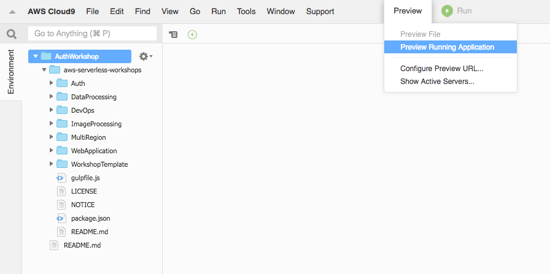  

3. The web application will load in a small window next to the terminal at the bottom of the Cloud9 IDE. Click the **re-size button** next to the word **Browser** to open this window in a new tab.

    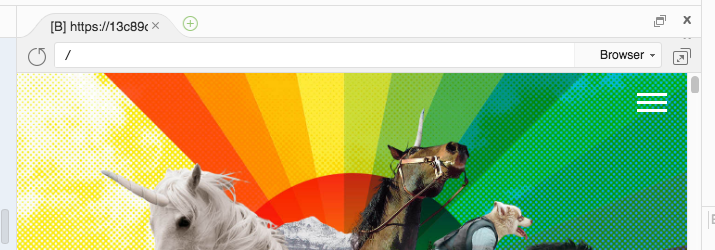   

   As you make changes to the web application, this tab will automatically refresh to reflect your changes. Leave this tab open and return to the Cloud9 IDE tab to continue the workshop.

   Though the Wild Rydes website may look functional, there is currently no integration for sign-up or sign-in requests to go anywhere.

### 2. Creating a Cognito User Pool

Amazon Cognito User Pools lets you add user sign-up and sign-in capabilities to your web and mobile apps quickly and easily. In this step, we'll create a Cognito user pool for our Wild Rydes app.

#### High-Level Instructions

Use the AWS console to create an Amazon Cognito User Pool requiring e-mail verification.

> The console's region will default to the last region you were using previously. Change this to the same region where you launched your Cloud9 environment previously.

<details>
<summary><strong>Step-by-step instructions (expand for details)</strong></summary><p>

1. In the AWS Management Console choose **Services** then select **Cognito** under Security, Identity, and Compliance.

2. Choose your desired **Region** in top-right of the console if not already selected. This should match the region where you launched your Cloud9 environment previously.

3. Choose **Manage User Pools**.

4. Choose **Create a User Pool** in the top right of the console.

5. Provide a name for your user pool such as `WildRydes`.

6. Choose **Step through settings** to configure our user pool options.

	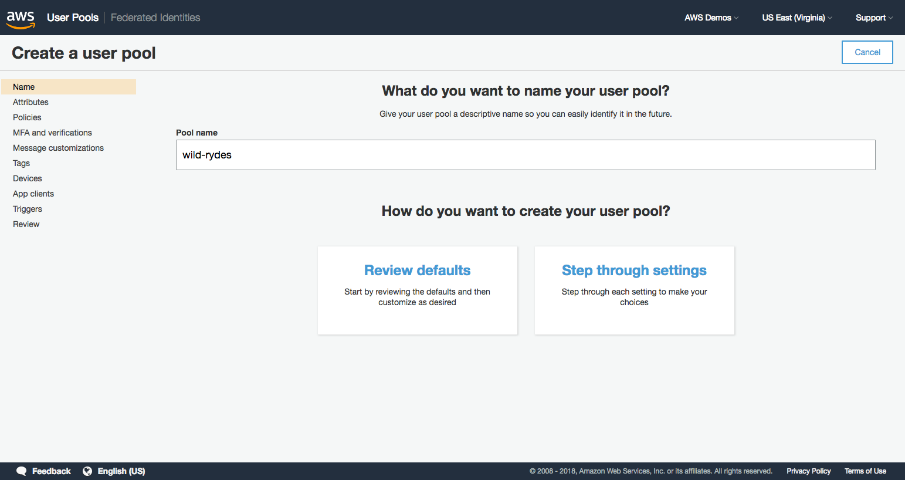

7. Leave **Username** selected, but additionally select **Also allow sign in with verified email address** and **Also allow sign in with verified phone number**.

8. Leave all other attribute defaults as-is.

9. Choose **Next step**.

	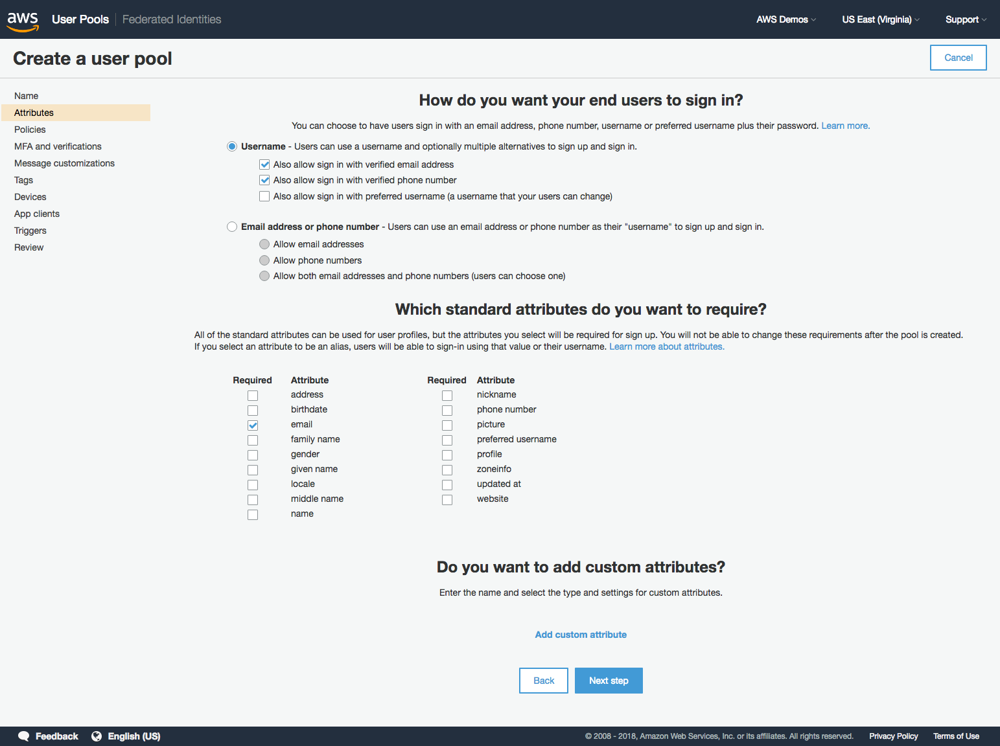

10. Leave password policies and user sign up settings set to default settings and choose **Next step**.

	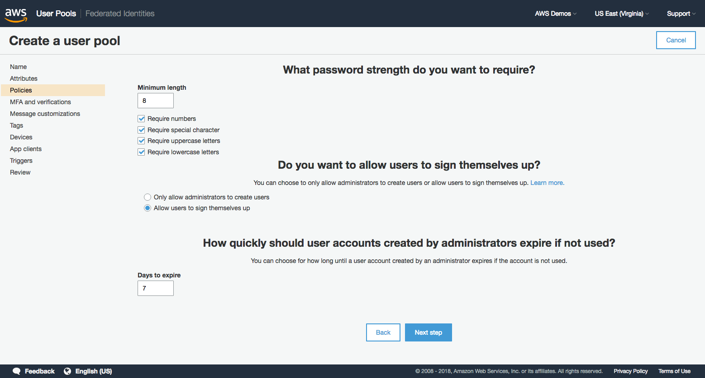

11. Leave **MFA set to Off** for this workshop.

12. Leave the default setting selected of requiring e-mail verification.

13. Choose **Next step**.

	

14. Leave all message and SES defaults as-is and choose **Next step**.

15. Skip adding any tags and click **Next step**.

16. Choose **No** to not remember your user's devices then click **Next step**.

	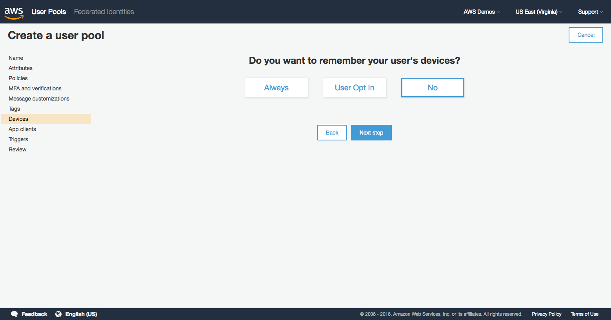

17. In the next screen, click the **Add an app client** *link*.

18. Input `wildrydes-web-app` as the app client name.

19. **Uncheck** *Generate client secret*. Client secrets are used for server-side applications authentication and are not needed for JavaScript applications.

20. Choose **Create app client**.

21. Choose **Next step**.

	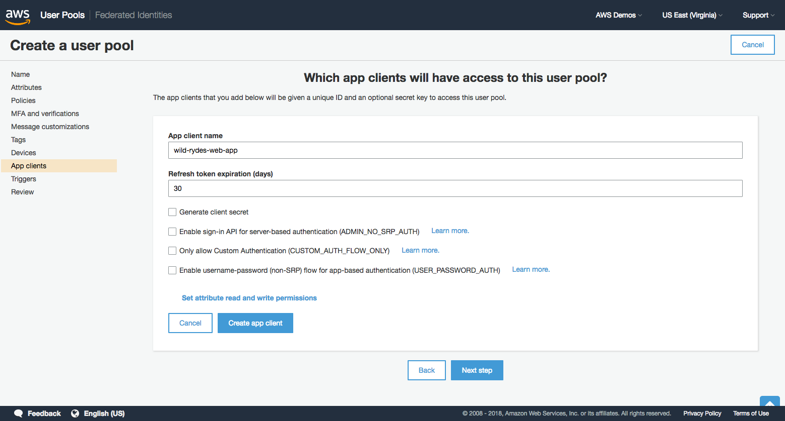

22. Leave all Lambda trigger settings set to *none*. These trigger settings allow you to extend the out-of-the-box sign-up and sign-in flows with your own custom logic, but we will not be using this feature in this workshop.

23. Choose **Next step**.

24. Review summary of all provided settings for accuracy then choose **Create pool**.

	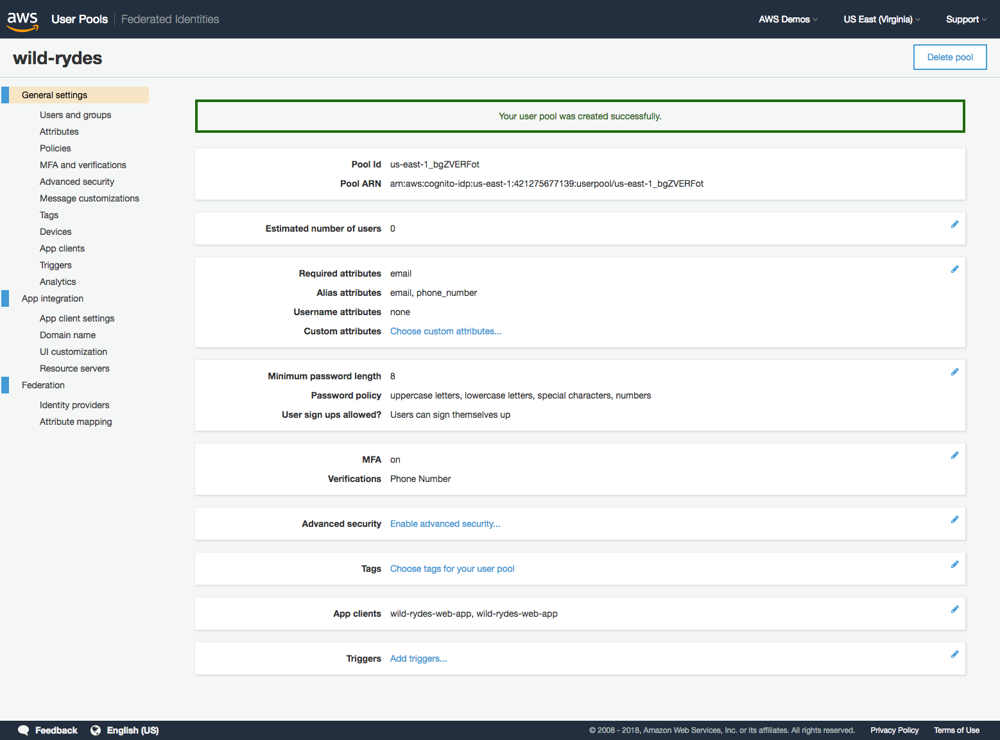

25. Within Cloud9, click the **+** symbol and choose to create **New File**. You will use this new blank editor tab as a scratchpad for various resource names and variables.

	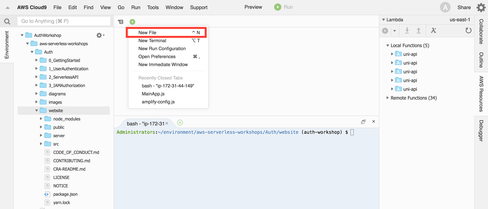

26. Back in the AWS Cognito console, copy your new *User Pool Id* into the scratchpad tab.

	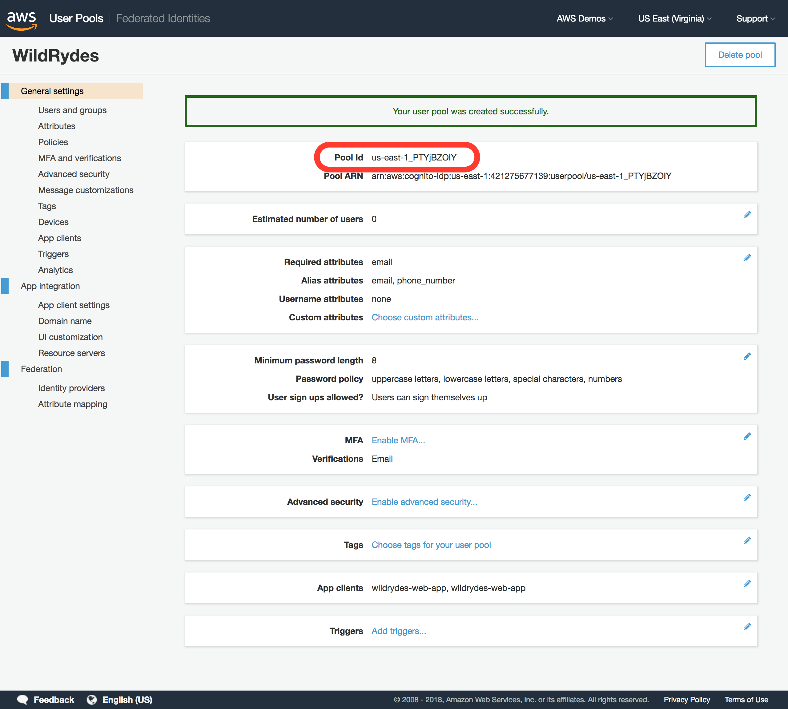

27. Choose **App clients** heading under *General settings* within the Cognito navigation panel.

28. Copy the *App client ID* over to your scratchpad. You will be using both of these values later on.

	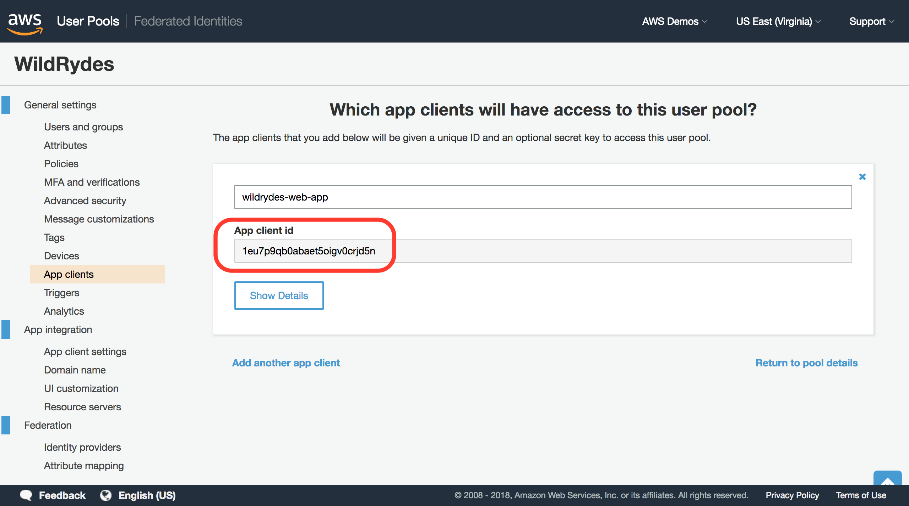

</p></details>

### 3. Creating a Cognito Identity Pool

Cognito Identity Pools are used to provide AWS credentials via IAM roles to end-user applications. Since we'll be integrating our Cognito deployment and users with other AWS services, we'll go ahead and create this identity pool now.

#### High-Level Instructions

You will need to create a Cognito Identity Pool linked to the Cognito User Pool and app client ID you just created. Your application will not require un-authenticated users to access any AWS resources, so you do not need to enable access to unauthenticated identities. 

<details>
<summary><strong>Step-by-step instructions (expand for details)</strong></summary><p>

1. In the Cognito console, choose **Federated Identities** in the header bar to switch to the console for Cognito Federated Identities.

1. Choose **Create new Identity pool**.

1. Input `wildrydes_identity_pool` as the Identity pool name.

1. Expand **Authentication providers**.

1. Within the Cognito tab, input the User Pool ID and App client Id you copied previously to the scratchpad tab.

	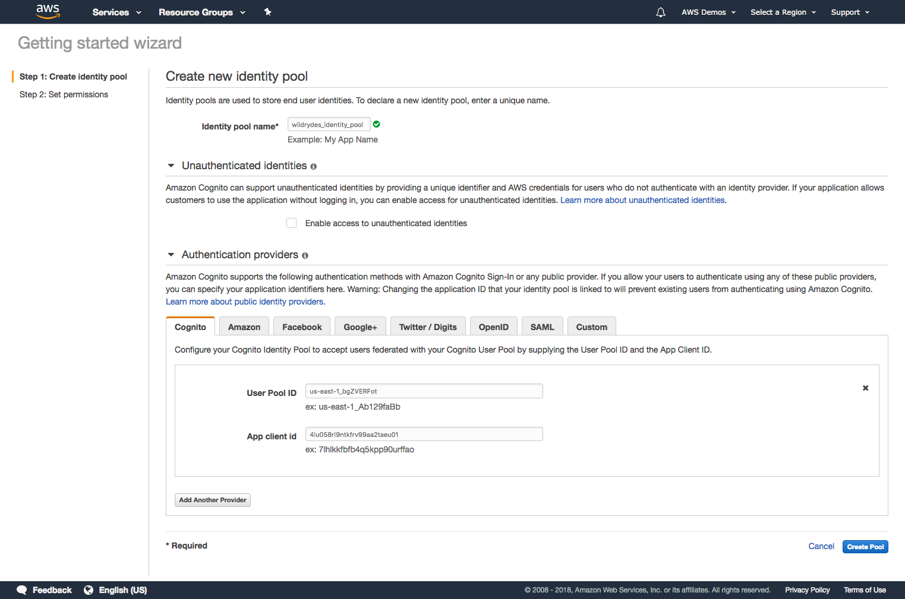

1. Choose **Create Pool**.

1. Choose **Allow** to allow Cognito Identity Pools to setup IAM roles for your application's users. Permissions and settings of these roles can be customized later.

1. Copy/paste the *Identity Pool ID*, highlighted in red within the code sample in the Get AWS Credentials section, into your Cloud9 scratchpad editor tab.

	> Do not copy the quotation marks, but include the region code and ":" character.

	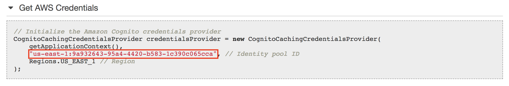
	
1. Your scratchpad should now have values for the following Cognito resources:

	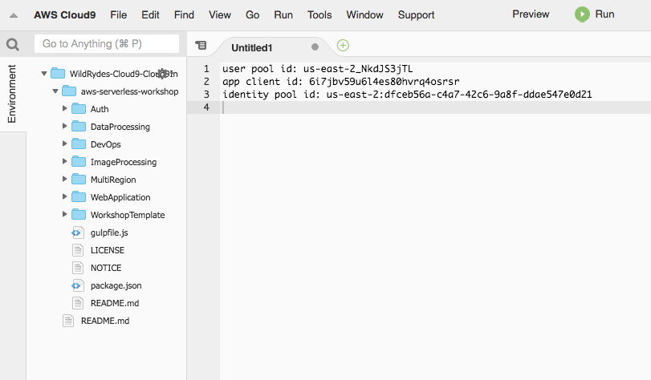

</p></details>

### 4. Integrating your application with Amazon Cognito using AWS Amplify

Now that you've created and configured your Cognito User Pool and Identity Pool, you need to configure your application to integrate to Amazon Cognito so it can store user profiles and enable sign-up and sign-in.

#### High-Level Instructions

You will import the [AWS Amplify](https://aws-amplify.github.io/) JavaScript library into the project then add sign-up and sign-in utility classes to integrate with our existing UI and front-end components.

You'll need to complete the implementation of the onSubmitForm and onSubmitVerification methods within the */Auth/website/src/auth/signIn.js* file, as well as the methods of the same name within the */Auth/website/src/auth/signIn.js* file. Finally, you'll need to complete the implementation of a method to check whether the user is authenticated within the */Auth/website/src/index.js* page.

<details>
<summary><strong>Step-by-step instructions (expand for details)</strong></summary><p>

1. Before using any AWS Amplify modules, we first need to configure Amplify to use our newly created Cognito resources by updating */Auth/website/src/amplify-config.js*.

1. After opening this file in your Cloud9 IDE editor, copy the following parameter values from your previous scratchpad into the config value parameter placeholders:
	- `identityPoolId`
	- `region`
	- `userPoolId`
	- `userPoolWebClientId`

	> Be sure to fill in the **'' blanks** with your config values. You do not need to modify the example values shown in the comments as they are just for reference and not leveraged by your application.

1. **Save your changes** to the Amplify config file so your new  settings take effect. Any unsaved changes to a file are indicated by a dot icon in the tab of the editor so if you see a gray dot next to the file name, you may have forgotten to save.

1. Next, edit the *website/src/index.js* file to add the following lines to the **top of the file** **(but below all the other imports)** to configure Amplify then save your changes:

	```
	import Amplify from 'aws-amplify';
	import awsConfig from './amplify-config';
	
	Amplify.configure(awsConfig);
	```
	
	> After making this changes, your imports should be in the following order:
	
	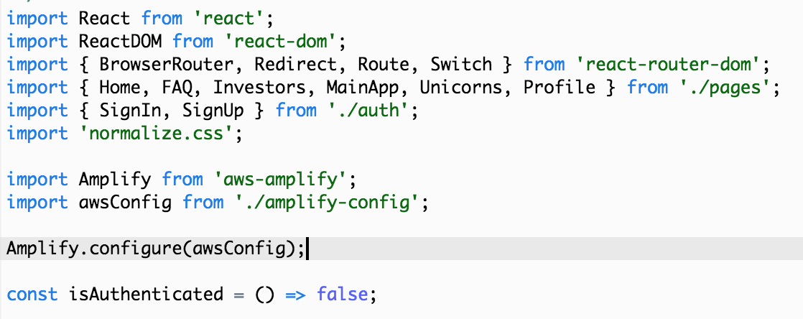
	
1. **Save your changes** to the *website/src/index.js* file.

1. Next, we need to ensure our application evaluates the user's authenticated state. In the same */website/src/index.js* file, find and replace the **isAuthenticated method** with the code below to use our Amplify library's built-in user session to check this status.

	```
	const isAuthenticated = () => Amplify.Auth.user !== null;
	```
	
1. **Save your changes** to the */website/src/index.js* file.

1. Now that we've imported the Amplify and configured the Amplify library, we need to update our application's code to sign-up users using Amplify and Cognito User Pools by finding and replacing the following methods within the */website/src/auth/SignUp.js* file with the following code.

	> You only need to replace these two methods. The rest of the SignUp.js file should not be modified.
	
	> The onSubmitForm method handles the event when the registration form is submitted. This calls the Auth.signUp method from the AWS Amplify library which registers the user with your Cognito User Pool.
	
	> The onSubmitVerification method handles the event when the verification code entry form is submitted after the initial registration request. This calls the Auth.confirmSignUp method from the AWS Amplify library which confirms the user registration within your Cognito User Pool.

	```
	async onSubmitForm(e) {
	  e.preventDefault();
	  try {
	      const params = {
	          username: this.state.email.replace(/[@.]/g, '|'),
	          password: this.state.password,
	          attributes: {
		          email: this.state.email,
		          phone_number: this.state.phone
	          },
	          validationData: []
	      };
	      const data = await Auth.signUp(params);
	      console.log(data);
	      this.setState({ stage: 1 });
	  } catch (err) {
	    if (err === "No userPool") {
	      // User pool not defined in Amplify config file
	      console.error("User Pool not defined");
	      alert("User Pool not defined. Amplify config must be updated with user pool config");
	    } else if (err.message === "User already exists") {
	        // Setting state to allow user to proceed to enter verification code
	        this.setState({ stage: 1 });
	    } else {
	        if (err.message.indexOf("phone number format") >= 0) {err.message = "Invalid phone number format. Must include country code. Example: +14252345678"}
	        alert(err.message);
	        console.error("Exception from Auth.signUp: ", err);
	        this.setState({ stage: 0, email: '', password: '', confirm: '' });
	    }
	  }
	}
	
	async onSubmitVerification(e) {
	    e.preventDefault();
	    try {
	      const data = await Auth.confirmSignUp(
	          this.state.email.replace(/[@.]/g, '|'),
	          this.state.code
	      );
	      console.log(data);
	      // Go to the sign in page
	      this.props.history.replace('/signin');
	    } catch (err) {
	      alert(err.message);
	      console.error("Exception from Auth.confirmSignUp: ", err);
	    }
	}
	```
	
1. **Save your changes** to the */website/src/auth/SignUp.js* file.

1. You additionally need to integrate the sign-in capability to use AWS Amplify and Cognito by finding and replacing the following methods within the */website/src/auth/SignIn.js* file with the code below.

	> You only need to replace these two methods. The rest of the SignIn.js file should not be modified.
	
	> The onSubmitForm method initiates the signin request with your Cognito User Pool by invoking the Auth.signIn method from AWS Amplify then sets the local state appropriately to indicate the user has signed in successfully.
	
	> The onSubmitVerification method is used to submit a verification code whenever multi-factor authentication is required to authenticate. For this workshop, this method will not be invoked since you did not require multi-factor authentication earlier when configuring your Cognito User Pool.  

    ```
	async onSubmitForm(e) {
	    e.preventDefault();
	    try {
	        const userObject = await Auth.signIn(
	          this.state.email.replace(/[@.]/g, '|'),
	          this.state.password
	        );
	        console.log('userObject', userObject);
	        if (userObject.challengeName) {
	          // Auth challenges are pending prior to token issuance
	          this.setState({ userObject, stage: 1 });
	        } else {
	          // No remaining auth challenges need to be satisfied
	          const session = await Auth.currentSession();
	          // console.log('Cognito User Access Token:', session.getAccessToken().getJwtToken());
	          console.log('Cognito User Identity Token:', session.getIdToken().getJwtToken());
	          // console.log('Cognito User Refresh Token', session.getRefreshToken().getToken());
	          this.setState({ stage: 0, email: '', password: '', code: '' });
	          this.props.history.replace('/app');
	        }
	    } catch (err) {
	        alert(err.message);
	        console.error('Auth.signIn(): ', err);
	    }
	}

	async onSubmitVerification(e) {
	    e.preventDefault();
	    try {
	      const data = await Auth.confirmSignIn(
	        this.state.userObject,
	        this.state.code
	      );
	      console.log('Cognito User Data:', data);
	      const session = await Auth.currentSession();
	      // console.log('Cognito User Access Token:', session.getAccessToken().getJwtToken());
	      console.log('Cognito User Identity Token:', session.getIdToken().getJwtToken());
	      // console.log('Cognito User Refresh Token', session.getRefreshToken().getToken());
	      this.setState({ stage: 0, email: '', password: '', code: '' });
	      this.props.history.replace('/app');
	    } catch (err) {
	      alert(err.message);
	      console.error('Auth.confirmSignIn(): ', err);
	    }
	}
    ```
1. **Save your changes** to the */website/src/auth/SignIn.js* file.

</p></details>

### 5. Validate sign-up and sign-in are now working with Amazon Cognito

Now that you have integrated our Amplify code into our application, you need to test the site to see that authentication is working end-to-end.

#### High-Level Instructions

Return to your browser tab where you started your Wild Rydes application earlier after popping out from the Cloud9 IDE once in preview mode. This page automatically refreshes after you save any code changes so should now reflect all of your changes and be ready for testing.

Visit the */register* path to sign-up as a new user, providing a valid phone number with `+country_code` first preceding the number. For a US-based phone number, an example would be `+14251234567`. You should then see that a verification message is sent with a one-time code upon registering, which is required before you're able to sign-in.

After signing up as a new user, sign-in with the same user at the */signin* path. If the page loads a map, sign-in was successful and you have successfully integrated Cognito for app authentication.

<details>
<summary><strong>Step-by-step instructions (expand for details)</strong></summary><p>

1. Visit `/register` path of your Cloud9's website to go to the registration page.

1. Input your e-mail address, phone number with `+country_code` first preceding the number, as well as your password twice. For a US-based phone number, an example would be `+14251234567`.

	> Your password must include 8 characters, including uppercase and lowercase characters, and at least 1 number and 1 special character.

1. Choose **Let's Ryde** to submit registration.

1. On the verify e-mail screen, enter the one-time code sent to your e-mail address provided then choose **Verify**.

	> Be sure to check your spam folder for the e-mail with your verification code if you do not see it in your inbox.

1. Assuming no errors were encountered, you will be redirected to the Sign-in screen. Now, re-enter the same e-mail address and password you chose at registration.

1. If the page then loads a map, sign-in was successful and you have successfully integrated Cognito for app authentication.

1. *Optionally*, you may scroll down beyond the map to copy your user's identity token and decode it by pasting it into the 'encoded' input box at [JWT.io](http://jwt.io). You will see all of your user's attributes are encoded within the token, along with other standard attributes such as the time the token was issued, the time the token expires, the user's unique ID, and more.

</p></details>

Once you have finished this section, you may proceed to the next module, [Serverless API Auth](../2_ServerlessAPI).

