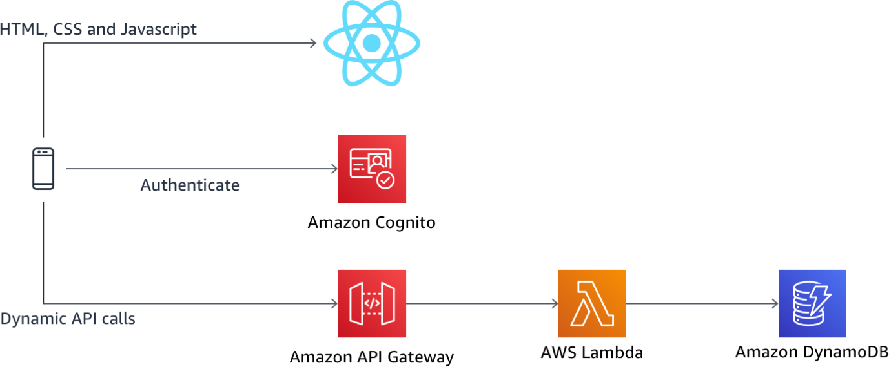
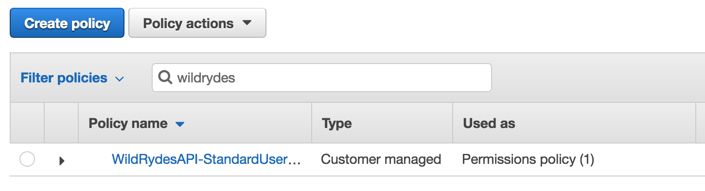
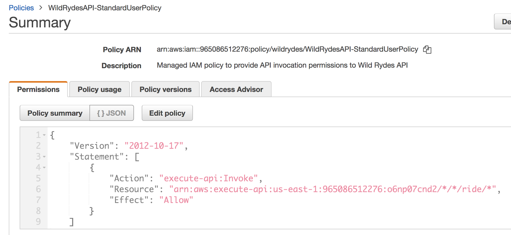
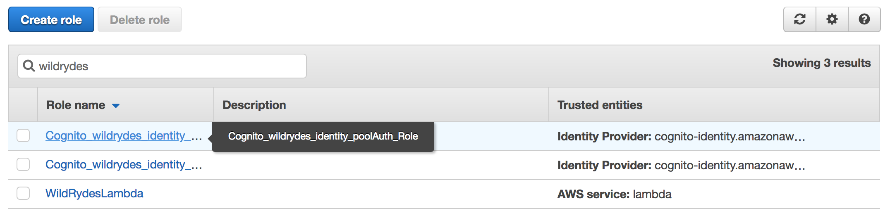
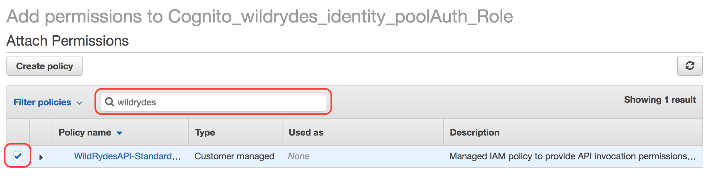
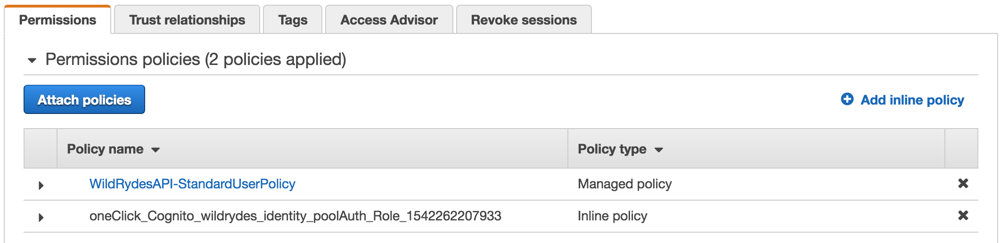
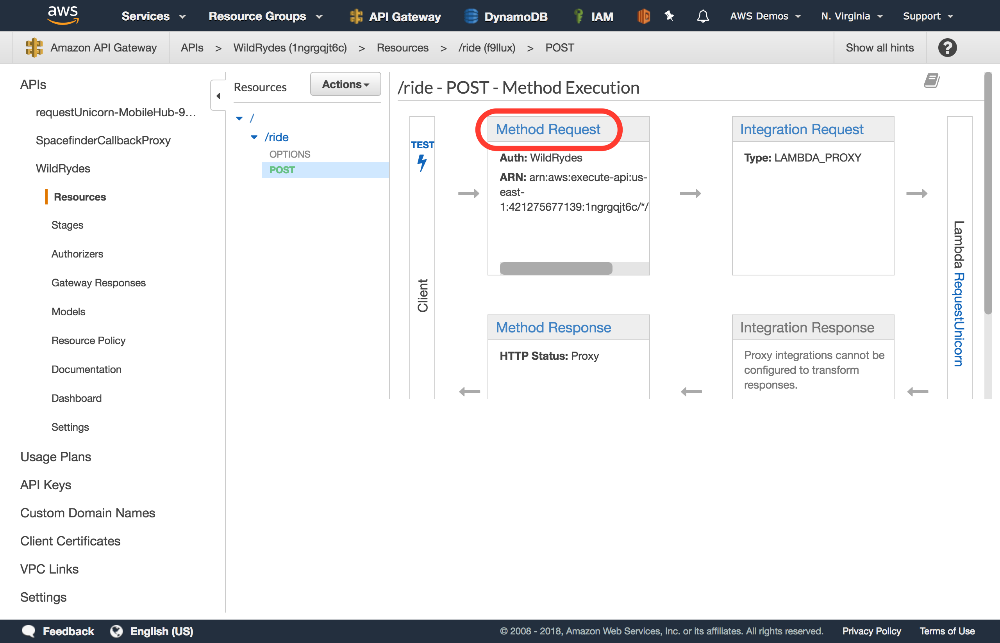
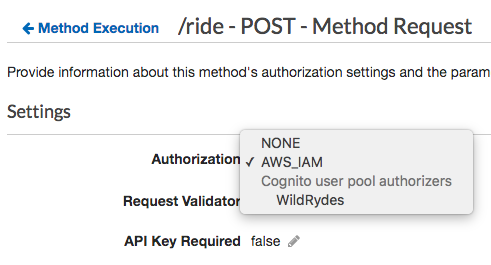
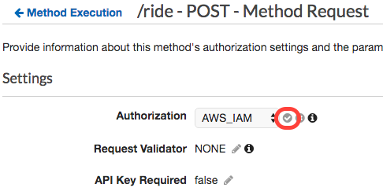

# Optional Module 2 Extension: Serverless APIs with IAM-based Authorization

In this **optional extension to module 2**, you will update your serverless backend for your Wild Rydes application leveraging [Amazon API Gateway](https://aws.amazon.com/api-gateway/) and [AWS Lambda](https://aws.amazon.com/lambda/) to use request signing with IAM-based authorization as a more secure authentication option.

**If you would like to skip this optional extension**, you are able to proceed to module 3 directly, [IAM-based Authorization](../3_IAMAuthorization).

## Solution Architecture

Building on Module 2, this module updates our Serverless backend built earlier using Amazon API Gateway and AWS Lambda to use IAM-based authorization. This extends our authorization capability to offer fine-grained access control authorizing differently per API operation and enhancing security via request signing. By enabling IAM-based authorization, you will use the same type of authentication, authorization, and request signing used by all AWS services and SDKs.

[Request signing](https://docs.aws.amazon.com/general/latest/gr/signing_aws_api_requests.html) is a more secure implementation of API request authentication where each API request made is signed with a signature unique to the request itself. Hence, no static API keys or bearer tokens are directly sent to the backend service and any man-in-the-middle attacks would not be able to use such API keys or bearer tokens to impersonate a valid user with the backend resources. AWS APIs and SDKs use a request signing algorithm nammed [Signature V4 (Sigv4)](https://docs.aws.amazon.com/general/latest/gr/signature-version-4.html) which is what you will enable your API to use in this module.

> For production APIs, you should use either the token-based authorization OR request signing authorization via IAM demonstrated in this module, but not use both for the same API.



## Implementation Overview

Each of the following sections provides an implementation overview and detailed, step-by-step instructions. The overview should provide enough context for you to complete the implementation if you're already familiar with the AWS Management Console or you want to explore the services and documentation yourself without following a walkthrough.

If you're using the latest version of the Chrome, Firefox, or Safari web browsers the step-by-step instructions won't be visible until you expand the section.

### 1. Associate an API Gateway IAM policy with your Cognito authenticated users' role

#### Background
For us to be able to use request signing and IAM-based fine-grained access control, we'll first need to associate an IAM policy that provides permissions to invoke API operations for your API Gateway deployment. For further details, you can review [controlling access to an API with IAM permissions](https://docs.aws.amazon.com/apigateway/latest/developerguide/permissions.html) documentation.

#### High-Level Instructions
In the IAM console, assocate the *WildRydesAPI-StandardUserPolicy* with your Cognito Identity Pool's authenticated user role to provide all authenticated users access to invoke operations the */ride* path.

<details>
<summary><strong>Step-by-step instructions (expand for details)</strong></summary><p>

1. Go the AWS Management Console, click **Services** then select **IAM** under Security, Identity, and Compliance.

1. Choose **Policies**.

1. Search for *WildRydes* to see the *WildRydesAPI-StandardUserPolicy* which was created by the Serverless Backed CloudFormation template.

	
	
1. Click the **WildRydesAPI-StandardUserPolicy** policy name.

1. Review the policy which was created by CloudFormation to authorize requests to your API Gateway deployment.

	
	> This policy allows access to invoke any method on the /ride path for any API stage of your API gateway backend. For more details about authoring IAM policies for API Gateway, visit the [controlling access to an API with IAM permissions](https://docs.aws.amazon.com/apigateway/latest/developerguide/permissions.html) documentation.

1. Choose **Roles**.

1. Search for *WildRydes* to find the two roles which were created by Cognito Identity Pools when you created the Identity Pool in module one. Should you not be able to find the roles here, you can alternatively go to the **Cognito Federated Identities** console, find the correct identity pool, then click **Edit Identity Pool** in the top-right corner to see the roles listed. Each identity pool has both an Unauthenticated user role and an Authenticated user role.

1. Once you have found the names of the roles, go back to the IAM console and **select the *Auth* role** for your authenticated users.
	
	> If the full name of the role is hidden from view due to column width, you can hover over the partially visible name of the role to see the full name of the role as a tool tip.
	
	

1. Choose **Attach policies**.

1. Search for `WildRydes` and check the box next to the policy named *WildRydesAPI-StandardUserAccess*.

	

1. Choose **Attach policy**.

1. You should now see the *WildRydesAPI-StandardUserAccess* policy associated with your Cognito IAM auth role.

	

</p></details>


### 2. Enable API Gateway authorization with AWS Identity and Access Management (IAM)

#### Background
In addition to using JSON Web Tokens (JWTs) for authentication, API Gateway can leverage AWS request signing and parse the request signature to determine the requesting user. In this step, you'll update your authorization type to *IAM* for your API which will then use AWS's Identity and Access Management (IAM) capabilities to authorize requests via IAM policies.

#### High-Level Instructions
In the Amazon API Gateway console, update the authorization type to *AWS_IAM* for the *POST* method on the */ride* resource. Next, re-deploy the API to make your change take effect.

<details>
<summary><strong>Step-by-step instructions (expand for details)</strong></summary><p>

1. In the AWS Management Console choose **Services** then select **API Gateway** under Networking and Content Delivery.

2. Choose the API named *WildRydes*.

3. Browse to **Resources** while within your Wild Rydes API in the API Gateway console.

4. Select the **POST** method under the */ride* resource path.

5. Choose **Method Request**

    

6. Choose the pencil icon next to `Authorization` to edit the setting.

7. Select *AWS_IAM* from the list of authorization options presented.

  

8. **Save** your selection by clicking the checkmark icon next to the drop down.

  

9. Next, choose the **Actions** button at the top of the resources list.

10. Choose **Deploy API** from the list of options presented.

11. For deployment stage, select `prod` then click **Deploy**.

12. You've now successfully deployed your new authentication integration to your API's production environment.

**Configure your Wild Rydes web app to authenticate API requests**

Now that you've deployed the new authorizer configuration to production, all API requests must be authenticated to be processed.

13. Return to your Wild Rydes app, sign in at */signin* if necessary, and attempt to request a ride.

14. You should receive an *Error finding unicorn*. If you open the developer console, you will see that we received a HTTP 401 error, which means it was an unauthorized request.

	> If at first your requests go through without any errors, try requesting a ride again in 30-60 seconds to allow time for the API Gateway changes to fully propagate.

15. Go back to Cloud9 and open the */website/src/pages/MainApp.js* files.

16. Update your current *getData* method to the following method, which removes the *Authorization* header and adds debugging information to show us the request signature as requests are sent. The default behavior of the AWS Amplify library is the sign all requests with SigV4 signing when no authorization header is specified, so this will automatically sign all requests using this algorithm without extra development effort. **Save your changes** after making this update.

	```
	  async getData(pin) {
		 Amplify.Logger.LOG_LEVEL = 'DEBUG';
	    const apiRequest = {
	      body: {
	        PickupLocation: {
	          Longitude: pin.longitude,
	          Latitude: pin.latitude
	        }
	      },
	      headers: {
	        'Content-Type': 'application/json'
	      }
	    };
	    console.log('API Request:', apiRequest);
	    return await API.post(apiName, apiPath, apiRequest);
	  }
	```

17. Allow the application to refresh, sign-in again, and request a ride.

18. The unicorn ride request should be fulfilled as before now. To see the full request headers which were sent, look at the developer console for an message which includes the API Request details, including the full signature and headers of the request.

	> This message starts with POST /prod/ride then shows the headers of the request made.
	
	> You may notice that there were both x-amz-date and x-amz-security-token headers sent among other headers. These two headers are part of the overall request signature, along with the Authorization header.

</p></details>
<br>

If your API now invokes correctly and application funcions as expected summoning unicorns again, you can proceed to the next module, [IAM-based Authorization](../3_IAMAuthorization).
