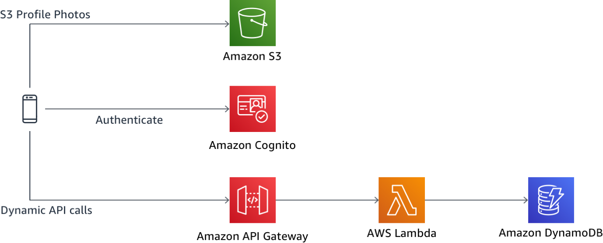

# Module 3: AWS integration with IAM-based authorization

In this module, you will expand your Wild Rydes application by enabling a profile management and profile photo management capabilities. [Amazon Cognito](https://aws.amazon.com/cognito/) will be used to store your user's profile information and custom attributes whereas [Amazon S3](https://aws.amazon.com/s3/) will store your user's profile pictures, with a link to the photo only being stored in the user's profile directly.

## Solution Architecture

Building on Modules 1 and 2, this module will add photo storage and management via an Amazon S3 bucket. For AWS resource access from a web application, Amazon Cognito will issue not only JWTs as we saw earlier, but then also allow users to assume an IAM role from within the app. This AWS IAM role will then allow their application to securely connect to upload and download photos from S3 (though any other AWS API would also work with this capability). To secure access to the photo storage and bucket, you will leverage IAM policies for fine-grained control.



## Implementation Overview

Each of the following sections provides an implementation overview and detailed, step-by-step instructions. The overview should provide enough context for you to complete the implementation if you're already familiar with the AWS Management Console or you want to explore the services yourself without following a walkthrough.

If you're using the latest version of the Chrome, Firefox, or Safari web browsers the step-by-step instructions won't be visible until you expand the section.

### 1. Setup S3 bucket for use with AWS Amplify

You will need for your S3 bucket to be properly associated with Amplify for seamless upload and data of data. To save time, the CloudFormation template that created the serverless backend for this workshop also created an S3 bucket for this purpose with the cross-origin resource sharing (CORS) settings already set. You just need to associate this bucket with your application's code.

#### High-Level Instructions

Browse to your CloudFormation stack created in the earlier modules and find the name of the S3 bucket under Outputs. Once you have the name, open your amplify-config.js file again and update the storage section with the bucket name and region.

<details>
<summary><strong>Step-by-step instructions (expand for details)</strong></summary><p>

1. Go the AWS Management Console, click **Services** then select **CloudFormation** under Management Tools.

1. In the CloudFormation console, click on your Wild Rydes stack name, such as `WildRydesAPI`.

1. Click on the **Outputs** tab.

1. Copy your bucket name to your clipboard. It is the name shown under `Value` for the key called `WildRydesProfilePicturesBucket`.

1. Next, return to your Cloud9 IDE and open the file `/website/src/amplify-config.js`.

1. Fill in values for both the bucket name, which you just copied, as well as the region where you created the bucket.

1. Your final structure for the storage configuration of `amplify-config.js` should look like the following.

```
    Storage: {
        bucket: 'wildrydes-profilepicturesbucket-1rmvuic97osxd',
        region: 'us-east-1'
    }
```

</p></details>

### 2. Configure IAM permissions for your users

Though you could now attempt uploading photos via AWS Amplify, Amplify would use your Cognito Identity Pool roles that were created in module 1 which currently has no policies associated so you would not have access to the S3 bucket created. You need to next update our roles to have policies that grant access to our S3 photo bucket.

#### High-Level Instructions

Browse to the IAM console and find your Cognito Identity Pool's authenticated user role. Create an in-line policy which provides for protected and private level access per-user by leveraging IAM policy variables.

<details>
<summary><strong>Step-by-step instructions (expand for details)</strong></summary><p>

1. Go the AWS Management Console, click **Services** then select **IAM** under Security, Identity, and Compliance.

1. Choose **Roles**.

1. Search for `WildRydes` to find the two roles which were created by Cognito Identity Pools when you created the Identity Pool in module one. Should you not be able to find the roles here, you can alternatively go to the **Cognito Federated Identities** console, find the correct identity pool, then click **Edit Identity Pool** in the top-right corner to see the roles listed. Each identity pool has both an Unauthenticated user role and an Authenticated user role.

1. Once you have found the names of the roles, go back to the IAM console and select the `Auth` role for your authenticated users.

1. We want to grant permissions to this role which are only applicable to this role so we will use an inline policy, which would be deleted if this role were ever deleted.

1. Choose **Add inline policy** on the right-hand side to create a new inline policy associated to this IAM role.

1. Choose the **JSON** tab to allow you to free-form edit the new policy.

1. Paste the following IAM policy statements for S3 access. After pasting, you will need to go **replace the bucket name** listed in all caps with your bucket name (a total of 4 times). Be sure to leave the parts of the resource names before and after the replacement value alone and not accidentally modify them.

```
{
    "Version": "2012-10-17",
    "Statement": [
        {
            "Effect": "Allow",
            "Action": [
                "s3:PutObject",
                "s3:GetObject",
                "s3:GetObjectVersion",
                "s3:DeleteObject",
                "s3:DeleteObjectVersion"
            ],
            "Resource": "arn:aws:s3:::REPLACE_ME_WITH_YOUR_BUCKET_NAME/private/${aws:userid}/*"
        },
        {
            "Effect": "Allow",
            "Action": [
                "s3:GetObject",
                "s3:GetObjectVersion"
            ],
            "Resource": "arn:aws:s3:::REPLACE_ME_WITH_YOUR_BUCKET_NAME/protected/*"
        },
        {
            "Effect": "Allow",
            "Action": [
                "s3:PutObject",
                "s3:DeleteObject",
                "s3:DeleteObjectVersion"
            ],
            "Resource": "arn:aws:s3:::REPLACE_ME_WITH_YOUR_BUCKET_NAME/protected/${aws:userid}/*"
        },
        {
            "Effect": "Allow",
            "Action": [
                "s3:PutObject",
                "s3:GetObject",
                "s3:GetObjectVersion",
                "s3:DeleteObject",
                "s3:DeleteObjectVersion"
            ],
            "Resource": "arn:aws:s3:::REPLACE_ME_WITH_YOUR_BUCKET_NAME/public/*"
        }
    ]
}
```
1. Choose **Review policy**.

1. Name the policy `WildRydes-S3Access`.

1. After reviewing for accuracy and any syntax errors, choose **Create policy**.

</p></details>

### 3. Update application to upload photos with AWS Amplify

Now that your IAM policies and Amplify SDK are initialized, you will be able to upload photos and render S3 photos with minimal code using Amplify's built-in UI components. S3 image is the component used to both render image objects for a React application, as well as embeding an image picker to help with uploads.

#### High-Level Instructions

Authenticate in the Wild Rydes app if you're not already logged in, then browse to the /profile path. You will see that your Cognito User Pool attributes are being read dynamically by the system. Next you will add an image picker and rendering UI component to personalize the rider experience so unicorns know who to look for when picking up passengers. Go to the Profile page and implement a functional image picker.

<details>
<summary><strong>Step-by-step instructions (expand for details)</strong></summary><p>

1. After logging in to Wild Rydes (if you're not authenticated already), browse to the **/profile** path.

1. You should see that your e-mail address and phone number you registered with are displayed (which are all of your currently populated attributes).

1. Open your Cloud9 IDE environment and open the file at `/website/src/pages/Profile.js`.

1. Uncomment the line that says **S3Image**. This instantiates an Amplify UI component for React apps for image rendering and uploading and only requires this single line of code.

1. Go back to the Wild Rydes app and visit the **/profile** path after logging in. You should now be able to upload photos with the new image picker.

</p></details>

### 4. Store profile picture links in Cognito User Pools profile

With our image uploads now working, all will work as expected until you close your browser, but at that point the reference between your profile and your profile picture will be lost. To fix this, you will leverage a Cognito User Pools user attribute called `picture` to persist the S3 object key so the same image can be loaded upon each login or to the unicorns when you request a ride.

#### High-Level Instructions

Implement a method to persist the images uploaded to the current user's Cognito profile each time the image is changed.

<details>
<summary><strong>Step-by-step instructions (expand for details)</strong></summary><p>

1. Open your Cloud9 IDE environment and open the file at `/website/src/pages/Profile.js`.

1. The S3Image UI component has a built-in method called `onImageLoad` which provides in its invocation the full URL of any image uploaded. We will make use of this built-in function to persist our image URLs out to Cognito.

1. Replace the existing `onImageLoad` function with the following code:

```
async onImageLoad(url) {
    if (!this.state.user.getSession) { return };
    console.log('Profile Picture URL:', url);
    try {
        let result = await Auth.updateUserAttributes(this.state.user, {
            'picture': this.state.image_key
        });
        console.log(result);
    } catch (ex) {
        console.error('Attribute update error:', ex);
    }
}
```

1. Now with this new method in place, upload a new photo after logging into Wild Rydes then close your browser. Open a new window and try logging in again. Your photo should load as it did previously.

</p></details>

## Conclusion

Congratulations! You've completed the Wild Rydes Auth workshop. We hope that this time and interactive learning has been valuable for you. For further learning on this topic, please see our list of [Serverless Auth Resources](../Resources.md).

Please remember to run through the [Clean up steps](../9_CleanUp) to ensure you decommission all resources spun up during the workshop today.

Thank you for participating in this workshop!