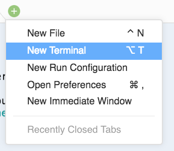
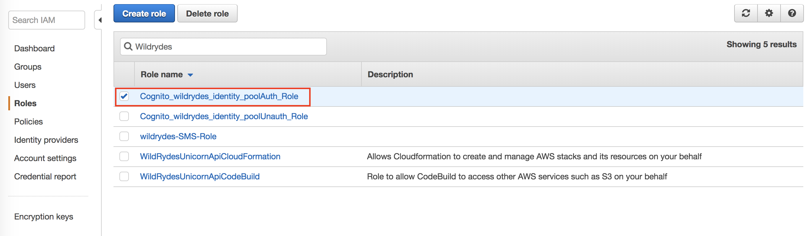

# Cleanup

#### *To prevent your account from accruing additional charges, you should remove any resources that are no longer needed.*

#### Empty S3 Bucket Contents and Remove Bucket

1. First, you need to empty the ***S3 bucket*** that was created by the Serverless Backend CloudFormation template.
2. Go the AWS Management Console, click **Services** then select **CloudFormation** under Management Tools.
3. In the **CloudFormation** console, click on your *Wild Rydes* stack name, such as `WildRydesBackend`.
4. Click on the **Outputs** tab.
5. Copy your bucket name to your clipboard. It is the name shown under Value for the key called `WildRydesProfilePicturesBucket`.
6. Open your Cloud9 developer environment.
7. Within the Cloud9 IDE, open up a terminal. You can do this by clicking the `+` icon in the lower pane and selecting **New Terminal**.

	

8. Paste the following command and be sure to update your S3 bucket name:
	```
	$ aws s3 rb s3://MY-BUCKET-NAME --force 
	```

#### Remove the Cognito Resources

1. From your **Cloud9 developer environment** run the following:
	
	```
	aws cognito-identity delete-identity-pool --identity-pool-id YOUR-IDENTITY-POOL-ID-HERE
	```
	> Copy and paste your Cognito identity pool ID from your scratch pad (example: us-west-2:b4b755cd-d359-42a1-9b49-f0e73f5b2571).

	> If you closed your scratch pad with your Cognito identity pool ID, you can run the following list call via CLI to find the proper identity pool ID, then run the delete call above.
	
	```
	aws cognito-identity list-identity-pools --max-results 10
	```

2. Next, run the following command to delete the Cognito User Pool you created:

	```
	aws cognito-idp delete-user-pool --user-pool-id YOUR-USER-POOL-ID-HERE
	```
	
	> Copy and paste your user pool ID from your scratch pad (example: us-west-2:us-west-2_srLwFQiEC)
	
	> If you closed your scratch pad with your user pool ID, you can run the following list call via CLI to find the proper user pool id, then run the delete call above.

	```
	aws cognito-idp list-user-pools --max-results 10
	```
	
#### Detach CognitoIdentityPoolAuthStandardPolicy IAM Policy

1. Before you delete the backend stack, you will need to remove the IAM Policy that you manually attached to the **Auth** role.

	Navigate to the Identity and Access Management (IAM) Console and search for the **Auth** role and click into it.

	
	
2. On the Role Summary page, find the policy named **WildRydesAPI-StandardUserPolicy** in the Permissions tab. Once you locate the policy, click the **X** to remove this policy from the IAM Role. A popup window will ask you to confirm that you want to remove it - click the red **Detach** button.

#### Remove WildRydes Backend

1. Next, you will need to remove the *CloudFormation stack* for the API. This stack should be named **WildRydesBackend**. Once again, from the your terminal window, run:

	```
	aws cloudformation delete-stack --stack-name WildRydesBackend
	```
	> If you changed the name of your stack from the default, you will need to update the stack name to what you changed it to.  If you clicked the quick link in the instructions, no adjustment to the above command is needed. You can run `aws cloudformation describe-stacks` to find the your stack name.

#### Remove Cloud9 and VPC Stack

1. Lastly, you will need to remove the *CloudFormation Stack* for the **Cloud9 instance** and the its VPC. This stack should be named **WildRydes-Cloud9**. Deleting this stack will **shut down and permanently delete your Cloud9 environment** and all code or projects within so be sure you want to proceed before executing this command.

	```
	aws cloudformation delete-stack --stack-name WildRydes-Cloud9
	```
	
	
	> If you changed the name of your stack from the default, you will need to update the stack name to what you changed it to.  If you clicked the quick link in the instructions, no adjustment to the command above is needed.  You can run `aws cloudformation describe-stacks` to find your stack name.
