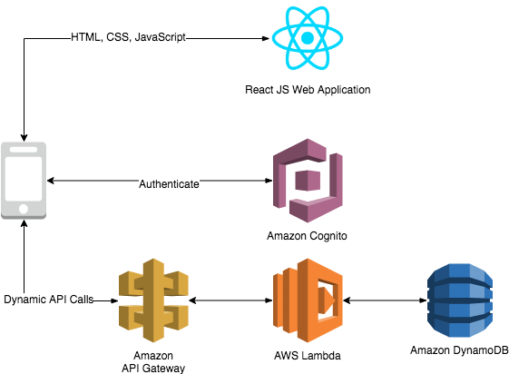

# Serverless Identity Management, Authentication, and Authorization Workshop

In this workshop, you will build a serverless microservices application that enables users to request unicorn rides from the Wild Rydes fleet. The application will present users with a user interface for signing-up, signing-in, indicating their location to request a ride, and managing their rider profile.

This application architecture demonstrates end-to-end authentication and authorization patterns through the use of [Amazon Cognito](https://aws.amazon.com/cognito/), [Amazon API Gateway](https://aws.amazon.com/api-gateway/), [AWS Lambda](https://aws.amazon.com/lambda/), and [AWS Identity and Access Management (IAM)](https://aws.amazon.com/iam/). A single page [React JS](https://reactjs.org/) web app hosts the HTML, CSS, and JavaScript to render the front-end which then connects to a public serverless backend API built using Amazon API Gateway and AWS Lambda. Amazon Cognito provides user identity management and authentication functions to secure the backend API. Finally, DynamoDB provides a persistence layer where data is stored and retrieved via the API's Lambda function.

See the diagram below for a depiction of the complete architecture.

## Modules

This workshop is split into multiple modules. Each module builds upon the previous module as you expand the Wild Rydes application. You must complete each module before proceeding to the next.

1. **User Authentication** - In this module, you will create a Cognito User Pool for identity management and user authentication and will integrate it with a pre-existing WildRydes React JS Web Application. You will also configure Cognito Identity Pools, which provides the ability to assume an Identity and Access Management (IAM) role from within an application.

2. **Serverless Backend** - In this module, you will add a serverless backend to our Wild Rydes application leveraging API Gateway and Lambda. You will then enable authentication and authorization on your API to secure the backend to only accept valid, authorized requests.

3. **IAM Authorization** - In this module, you will expand your Wild Rydes application by enabling profile management and profile photo management capabilities. Amazon Cognito will be used to store your user's profile information and attributes whereas Amazon S3 will store your user's profile pictures, with a link to the photo stored in the user's profile information.

## Getting Started

Before you begin, make sure you have completed the steps in the [Getting Started Module](./0_GettingStarted).

Once you have completed those steps, you may proceed to [Module 1 - User Authentication](./1_UserAuthentication).
