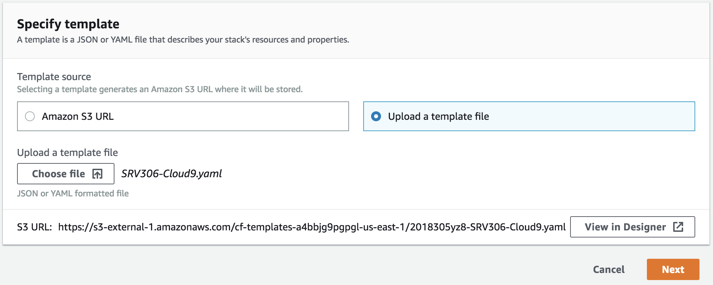

# Serverless Identity Management, Authentication, and Authorization Workshop

In this workshop, you will build a serverless microservices application that demonstrates end-to-end authentication and authorization through the use of [Amazon Cognito](https://aws.amazon.com/cognito/), [Amazon API Gateway](https://aws.amazon.com/api-gateway/), [AWS Lambda](https://aws.amazon.com/lambda/), and [AWS Identity and Access Management (IAM)](https://aws.amazon.com/iam/).

This directory should be used as a basic template for building new workshops.

The primary README.md file in the main workshop directory should contain a brief overview of the topics being covered and set expectations for the student about what they should expect to learn. It should also instruct students to complete the Pre Lab before starting the workshop to ensure they have the appropriate background knowledge and to verify that their environment and AWS account is configured correctly in order for them to successfully complete the modules.

Keep the workshop summary relatively short. One or two paragraphs is fine. Detailed discussion of architectural topics should be done in each module or potentially in a standalone page linked to from the primary landing page.

The main README.md file of your workshop should serve as an appropriate landing page for complete newcomers to the Wild Rydes repo. Expect that there will be links directly to this page and that a self-serve student should be able to easily complete your workshop based on the information and links provided.

## Prerequisites

Provide a list of prerequisites that are required to successfully complete your workshop. This should include setting up an AWS account (note if you support multiple students sharing a single account), installing and configuring the CLI, and setting up any other tools students may need. Additionally, if there are specific skills or technologies students need to have existing knowledge of, you should list those here.

Add a subsection for each prerequisite.

### AWS Account

In order to complete this workshop, you'll need an AWS account and access to
create and manage the AWS services that are used in this workshop, including Lambda, API Gateway, S3, Cloud9, DynamoDB, and Cognito.

The code and instructions in this workshop assume only one participant is using
a given AWS account at a time. If you attempt sharing an account with another
participant, you will encounter naming conflicts for certain resources. You can
work around this by either using a suffix in your resource names or using
distinct Regions, but the instructions do not provide details on the changes
required to make this work.

Please make sure not to use a production AWS environment for this workshop. It is also recommended to instead use a development account which provides full access to the necessary services so that you do not run into permissions issues.

### Region

Use **US East (N. Virginia)**, **US West (Oregon)**, or **EU (Ireland)** for
this workshop. Each supports the complete set of services covered in the
material. Consult the [Region Table][region-table] to determine which services
are available in a Region.

### AWS Cloud9 IDE

[AWS Cloud9](https://aws.amazon.com/cloud9/) is a cloud-based integrated development environment (IDE) that lets
you write, run, and debug your code with just a browser. It includes a code
editor, debugger, and terminal. Cloud9 comes pre-packaged with essential tools
for popular programming languages and the AWS Command Line Interface (CLI)
pre-installed so you don’t need to install files or configure your laptop for
this workshop. 

In this workshop, you will use a Cloud9 environment which will have access to the same AWS resources as the user with which you logged into the AWS Management Console.

## Setup

In this section you will launch a CloudFormation stack that will create a a new [Amazon VPC](https://aws.amazon.com/vpc/) environment and a Cloud9 IDE Instance that you will use in the rest of the workshop.

**Step-by-step Instructions**

INCLUDE A CREATE STACK BUTTON/LINK THAT OPENS THE CLOUDFORMATION TEMPLATE DIRECTLY INTO THE CONSOLE FOR SIMPLICITY.

1. Go the AWS Management Console, click **Services** then select **CloudFormation** under Management Tools.

2. In the CloudFormation console, click **Create stack** and in Step 1, choose **Upload a template file**. Upload the **SRV306-Cloud9.yaml** CloudFormation template that was provided with this workshop and click **Next**.

	

3. On the next screen, Step 2, enter a Stack such as `srv306-cloud9-<YOUR INITIALS>` and click **Next**

4. On the Configure Stack Options page, accept all the defaults and click **Next**. Finally on the Review page, click **Create stack**.

5. It will take a few minutes for the Stack to create. Wait until the stack is fully launched and shows a Status of **CREATE_COMPLETE**.

6. When the stack creation is complete, click the **Outputs** tab for the stack and select the value for **Cloud9IDE**. Open that URL in a new browswer tab to load your IDE environment.

	

	Once you have navigated to the Cloud9 URL, you should have an IDE environment as shown below:

	
	
	You can run AWS CLI commands in here just like you would on your local computer. Verify that your user is logged in by running `aws sts get-caller-identity`.

    ```console
    aws sts get-caller-identity
    ```
<button class="btn btn-outline-primary copy">Copy to Clipboard</button>

    You'll see output indicating your account and user information:

    ```console
    Admin:~/environment $ aws sts get-caller-identity
    ```
    ```json
    {
        "Account": "123456789012",
        "UserId": "AKIAI44QH8DHBEXAMPLE",
        "Arn": "arn:aws:iam::123456789012:user/Alice"
    }
    ```

	Keep your AWS Cloud9 IDE opened in a tab throughout this workshop as you'll use
it for activities like building and running a sample app in a Docker container
and using the AWS CLI.

### Download Workshop Code

1. Switch to the tab where you have your Cloud9 environment opened.

1. Clone the workshop repository to your IDE environmen by running the following command in the Cloud9 terminal window:

    ```console
    INSERT GIT CLONE COMMAND HERE TO DOWNLOAD WORKSHOP REPOSITORY
    ```

### Tips

:bulb: Keep an open scratch pad in Cloud9 or a text editor on your local computer
for notes.  When the step-by-step directions tell you to note something such as
an ID or Amazon Resource Name (ARN), copy and paste that into the scratch pad.

### Recap

* Use a unique personal or development AWS Account
* Use one of the **US East (N. Virginia)**, **US West (Oregon)**, or **EU
(Ireland)** [Regions](#region)
* Keep your [AWS Cloud9 IDE](#aws-cloud9-ide) opened in a tab

### Next

Proceed to the first module. Insert instructions here for first module.

## Modules

A workshop consists of multiple modules. Each module should cover a single, cohesive topic and take between 30 and 60 minutes for all students to complete. Consider the least experienced students who are likely to take this workshop when scoping your modules.

You should strongly consider providing CloudFormation templates that students can use to launch any required resources from previous modules to enable students to jump ahead to later modules without having to complete the preceeding modules manually.

Provide a numbered list with links to each module

1. [Example Module 1](1_ExampleTemplate)
2. [Example Module 2](2_Example2)
