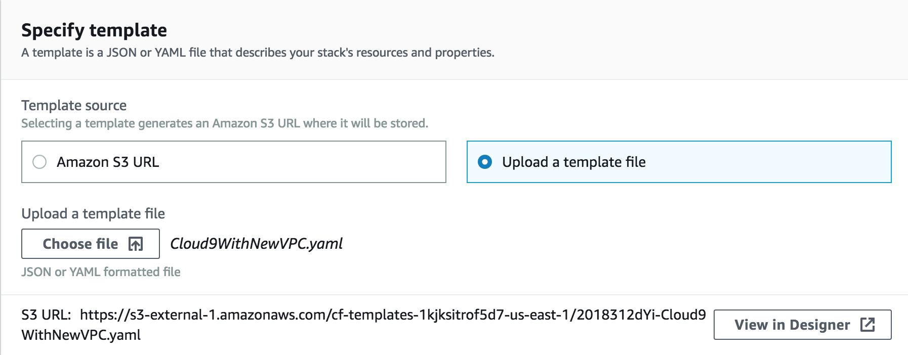

# Serverless Identity Management, Authentication, and Authorization Workshop

In this workshop, you will build a serverless microservices application that enables users to request unicorn rides from the Wild Rydes fleet. The application will present users with a web user interface for signing-up, signing-in, indicating their location to request a ride, and managing their rider profile.

This application architecture demonstrates end-to-end authentication and authorization patterns through the use of [Amazon Cognito](https://aws.amazon.com/cognito/), [Amazon API Gateway](https://aws.amazon.com/api-gateway/), [AWS Lambda](https://aws.amazon.com/lambda/), and [AWS Identity and Access Management (IAM)](https://aws.amazon.com/iam/). A single page [React JS](https://reactjs.org/) web app hosts the HTML, CSS, and JavaScript to render the front-end which then connects to a public serverless backend API built using API Gateway and AWS Lambda. Amazon Cognito provides user identity management and authentication functions to secure the backend API. Finally, DynamoDB provides a persistence layer where data is stored and retrieved via the API's Lambda function.

See the diagram below for a depiction of the complete architecture.


## Prerequisites

### AWS Account

In order to complete this workshop, you'll need an AWS account and access to
create and manage the AWS services that are used in this workshop, including Cloud9, Cognito, API Gateway, Lambda, and DynamoDB.

The code and instructions in this workshop assume only one participant is using a given AWS account at a time. If you attempt sharing an account with another participant, you will encounter naming conflicts for certain resources. You can work around this by using distinct Regions, but the instructions do not provide details on the changes required to make this work.

Please make sure not to use a production AWS environment/account for this workshop. It is recommended to instead use a development account which provides full access to the necessary services so that you do not run into permissions issues.

### Region Selection

Use **US East (N. Virginia)**, **US West (Oregon)**, or **EU (Ireland)** or **Asia Pacific (Sydney)** for this workshop. Each supports the complete set of services covered in the material. Consult the [Region Table](https://aws.amazon.com/about-aws/global-infrastructure/regional-product-services/) to determine which services
are available in a Region.

### AWS Cloud9 IDE

[AWS Cloud9](https://aws.amazon.com/cloud9/) is a cloud-based integrated development environment (IDE) that lets
you write, run, and debug your code with just a browser. It includes a code
editor, debugger, and terminal. Cloud9 comes pre-packaged with essential tools
for popular programming languages and the AWS Command Line Interface (CLI)
pre-installed so you don’t need to install files or configure your laptop for
this workshop. 

In this workshop, you will use a Cloud9 environment which will have access to the same AWS resources as the user with which you logged into the AWS Management Console.

## Setup

In this section you will launch a CloudFormation stack that will create a a new [Amazon VPC](https://aws.amazon.com/vpc/) environment and a Cloud9 IDE Instance that you will use in the rest of the workshop.

**Step-by-step Instructions**

1. Go the AWS Management Console, click **Services** then select **CloudFormation** under Management Tools.

2. In the CloudFormation console, click **Create stack** and in Step 1, choose **Upload a template file**. Upload the `Cloud9WithNewVPC.yaml` CloudFormation template within the `0_GettingStarted` folder that was provided with this workshop and click **Next**.

	

3. On the next screen, Step 2, enter a Stack such as `WildRydes-Cloud9-<YOUR INITIALS>` and click **Next**

4. On the Configure Stack Options page, accept all the defaults and click **Next**. Finally on the Review page, click **Create stack**.

5. It will take a few minutes for the Stack to create. Wait until the stack is fully launched and shows a Status of **CREATE_COMPLETE**.

6. When the stack creation is complete, click the **Outputs** tab for the stack and select the value for **Cloud9IDE**. Open that URL in a new browswer tab to load your IDE environment.

	

	Once you have navigated to the Cloud9 URL, you should have an IDE environment as shown below:

	
	
	You can run AWS CLI commands in here just like you would on your local computer. Verify that your user is logged in by running `aws sts get-caller-identity`.

    ```
    aws sts get-caller-identity
    ```

    You'll see output indicating your account and user information:

    ```
    Admin:~/environment $ aws sts get-caller-identity
    ```
    ```
    {
        "Account": "123456789012",
        "UserId": "AKIAI44QH8DHBEXAMPLE",
        "Arn": "arn:aws:iam::123456789012:user/Alice"
    }
    ```

Keep your AWS Cloud9 IDE opened in a tab throughout this workshop as you'll be using it for most all activities.

### Download Workshop Code

1. Switch to the tab where you have your Cloud9 environment opened.

1. Clone the workshop repository to your IDE environmen by running the following command in the Cloud9 terminal window:

    ```console
    git clone https://github.com/justonian/aws-serverless-workshops.git
    ```

### Initialize your developer workspace

1. Run the following commands to upgrade your Node.js version to v10

    ```console
    nvm i 10
    nvm alias default 10
    ```

2. Install the yarn package manager and website dependencies by running the following commands

    ```console
    npm install -g yarn
    cd aws-serverless-workshops/Auth/website
    yarn install
    ```

### Tips

:bulb: Keep an open scratch pad in Cloud9 or a text editor on your local computer
for notes.  When the step-by-step directions tell you to note something such as
an ID or Amazon Resource Name (ARN), copy and paste that into the scratch pad.

### Recap

* Use a unique personal or development AWS Account
* Use one of the **US East (N. Virginia)**, **US West (Oregon)**, or **EU (Ireland)** or **Asia Pacific (Sydney)**  [Regions](https://aws.amazon.com/about-aws/global-infrastructure/regional-product-services/)
* Keep your [AWS Cloud9 IDE](#aws-cloud9-ide) opened in a tab at all times

### Next

Once you have your Cloud9 workspace fully working, proceed to the first module, [User Authentication](./1_UserAuthentication).
