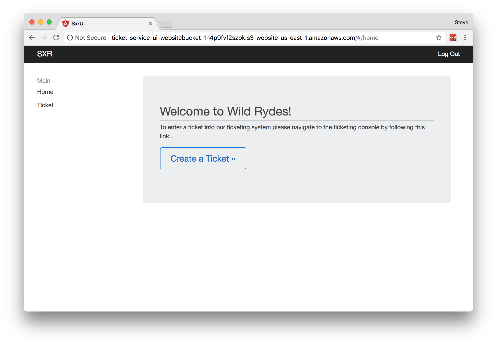

# Building a UI layer

Now that we have a working API, let's deploy a UI that can expose this
functionality to our users.

Navigate to the `2_UI/cfn` folder in your local Git repository.

## 1. Create the AWS Cognito Identity Pool and S3 hosting bucket

Our first task is to setup AWS Cognito to allow our UI application to
authenticate users and gain access credentials to allow our UI to call the
API. As in module 1, a CloudFormation template is available to create all the
necessary resources for us. This template does not rely on any local code so
no package step is needed.

You can go ahead and deploy this template in the primary region using the `aws
cloudformation deploy` CLI command as before.

For the Ireland region, the full command will look like:

    aws cloudformation deploy \
    --region eu-west-1 \
    --template-file web-ui-stack.yaml \
    --stack-name ticket-service-ui \
    --capabilities CAPABILITY_IAM

Change the `--region` parameter when deploying to your second region.

Again, you can confirm that this was created successfully and see the resource
in the AWS Console. Navigate to the CloudFormation service and take a look at
the Outputs tab. This time you will see two keys:

* `CognitoIdentityPoolId`
* `BucketName`
* `BucketURL`

Take note of the values for each of these, you will need them in the next steps.

## 2. Configure Federated Identity with Cognito

You have the option here of which identity provider you would like to
integrate. Choose either Amazon, Facebook or both. You will need a developer
account for either of these options.

Configure with Amazon instructions (expand for details)

***TODO***

Configure with Facebook instructions (expand for details)

Go into your Facebook Developer account and create an new application by
[following these steps](https://developers.facebook.com/docs/apps/register/).
Once you've created your app, under settings you'll want to add a Platform and
choose the Website platform. You will need to configure your Facebook
application with the Bucket URL created in the above step. Once you have done
this, take note of your App ID as you will need it next.

Next, we must configure the Cognito Identity Pool to use Facebook as our
identity provider. To do this, open up the AWS Console in your browser and
navigate to Cognito from the menu. Double check that you are still in the
primary region (EU Ireland).

1. Choose Manage Federated Identities and select the SXRIdentityPool.
2. Click the Edit Identity Pool button in the top right
3. Take note of the Identity pool ID noted at the top of this page
4. Navigate to the Authentication Providers section.
5. Select the Facebook tab, hit Unlock then specify your Facebook App ID
6. Save Changes at the bottom of the page.

## 3. Configure and build the application code

Our application will need to know the location of the API in order to push and
pull data from it. In addition, the application will need to know our Facebook
App ID and Cognito Identity Pool ID so it can authenticate our users. See the
Prerequisites section at the beginning of this guide if you have not already
setup your Facebook Developer account and App ID.

***TODO: Detailed insturctions on how to retrieve ticketAPI ***
***TODO: Add Amazon instructions ***
***TODO: Improve Facebook instructions ***

All of these attributes must be configured in
`/src/environments/environment.ts`. Open up your favorite text editor and edit
this file before moving on.

You will need Node Package Manager (NPM) installed on your local machine in
order to build the application. You can follow instructions TODO to set up a
dev instance. Once you have created your dev instance build your project by
executing the following:

- navigate to the root folder of the ui project, i.e. 2_UI.
- run `npm install` to install project dependencies
- build your app with by running `npm run build`

If you get an error about NPM command not found, then go back and check the
prerequisites section of the README to find instructions to install NPM.

This will produce a `dist/` folder containing the compiled application with your
custom settings.

## 4. Upload the application

Next, you'll need to upload the UI to the S3 bucket specified in step 1. You can
do this with:

    aws s3 sync --acl public-read dist/ s3://[bucket_name]

Note that you must replace `[bucket-name]` in this command with the bucket
name output from the CloudFormation stack in step 1.

To confirm everything went as expected, navigate to your bucket URL. You
should see a simple ticketing application. Go ahead and login using Facebook
and submit a couple of tickets to check that everything is working.

If you have trouble in this step, double check your configured settings and
Facebook App configuration. Note that if you change any of the settings you
will need to build and deploy the code again.

## Completion

Congratulations! You have successfully deployed a user interface for our users
on S3. In the next module you will learn how to replicate this app to a second
region and configure automatic failover using Route53.

Module 3: [Replicate to a second region](../3_Replication/README.md)
