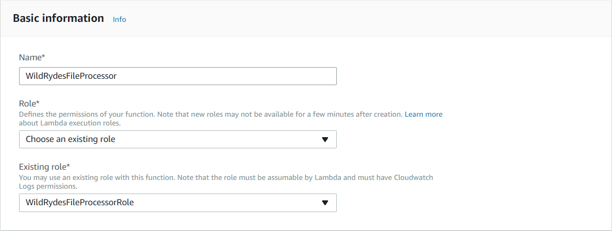
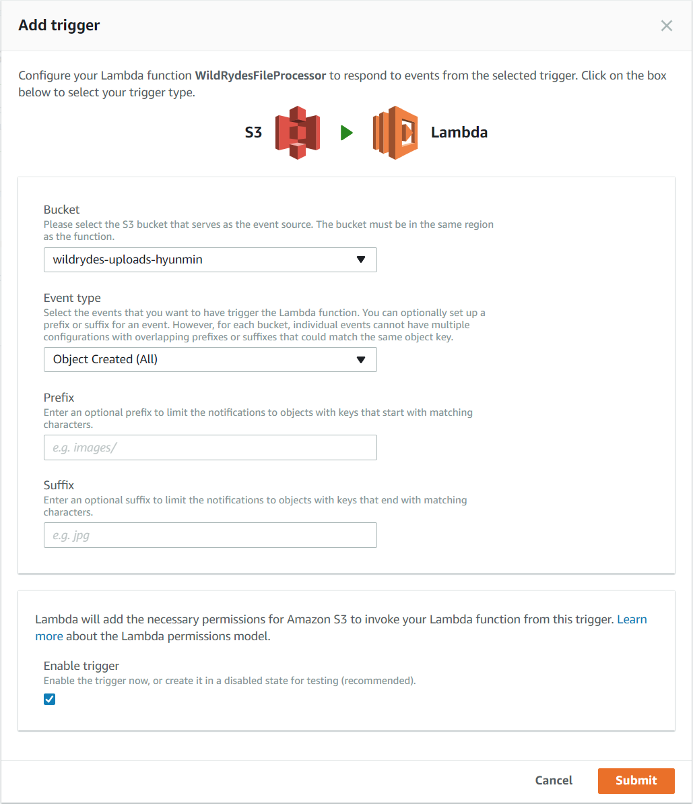
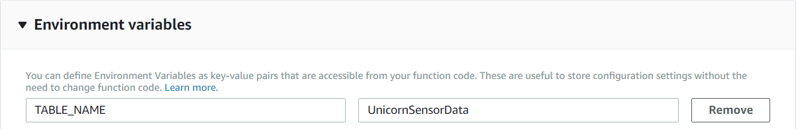
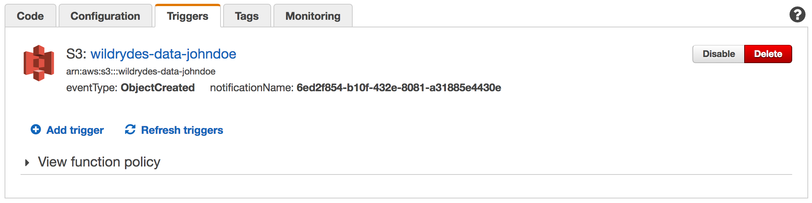

# 모듈 1: 파일 처리 (File Processing)

이 모듈에서는 Amazon Simple Storage Service (S3), AWS Lamdba 및 Amazon DynamoDB 를 사용해서 JSON 파일의 데이터를 처리합니다. Amazon S3 버킷에서 생성된 객체는 AWS Lambda 함수를 트리거하여 새 파일을 처리합니다. Lambda 함수는 데이터를 읽고 레코드를 Amazon DynamoDB 테이블에 채웁니다.

## 아키텍쳐 개요

<kbd></kbd>

우리의 생산자(producer)는 유니콘(Shadowfax) 에 연결된 센서로, 현재 Wild Ryde 에서 승객을 태우고 있습니다. 이 센서는 유니콘이 이동한 거리와 이전 분의 최대 및 최소 매직 포인트 및 히트 포인트 값을 포함하여 매분 마다 센서 데이터를 수집합니다. 이러한 센서 수집 값은 매일 Amazon S3 에 업로드 되는 [데이터 파일][data/shadowfax-2016-02-12.json] 에 저장됩니다.

Amazon S3 버킷에는 파일을 검색하고 처리하며 Amazon DynamoDB 테이블을 채울 AWS Lambda 함수를 트리거 하도록 구성된 [이벤트 알림 (event-notifications)][event-notifications] 이 있습니다.

## 구현 지침

### 1. Amazon S3 버킷 생성

콘솔 또는 AWS CLI를 사용해서 S3 버킷을 생성합니다. 버킷의 이름은 전 세계적으로 고유해야합니다. `wildrydes-uploads-yourname` 와 같은 이름을 사용할 것을 권장합니다.

<details>
<summary><strong>단계별 지침 (자세한 내용을 보려면 펼쳐주세요)</strong></summary><p>

1. AWS Console 에서 **Services** 를 선택한 다음 Storage 아래의 **S3** 를 선택하십시오.

1. **+Create Bucket** 을 선택하십시오.

1. `wildrydes-uploads-yourname` 와 같은 버킷에 대해서 전 세계적으로 고유한 이름을 넣어주십시오..

1. 버킷의 지역을 선택하십시오.

   <kbd></kbd>

1. 기본값을 사용하고 나머지 섹션을 통해 **Next** 를 선택한 다음 review section 애서 **Create Bucket** 을 선택하십시오.

</p></details>

### 2. Amazon DynamoDB 테이블 만들기

Amazon DynamoDB 콘솔을 사용해서 새로운 DynamoDB 테이블을 생성하십시오. `UnicornSensorData` 라는 테이블을 만들고, **Partition key** 는 이름은 `Name`, type 은 **String** 을 설정하고, **Sort key** 는 이름은 `StatusTime`, type 은  **Number** 로 설정하십시오. 다른 모든 설정에는 기본값을 사용합니다.

테이블을 생성한 다음 뒷부분에서 사용하기 위해서 생성한 Amazon DynamoDB 의 Amazon Resource Name (ARN) 을 메모장등에 복사해놓으십시오.

<details>
<summary><strong>단계별 지침 (자세한 내용을 보려면 펼쳐주세요)</strong></summary><p>

1. AWS Management Console 에서 **Services** 를 선택한 다음, Databases 에서 **DynamoDB** 를 선택합니다.

1. **Create table** 을 선택합니다.

1. **Table name** 에 `UnicornSensorData` 를 입력하십시오.

1. **Partition key** 에 `Name` 을 입력하고, 키 유형(key type)으로 **String** 을 선택하십시오.

1. **Add sort key** 체크박스를 선택하십시오. **Sort key** 에 대해 `StatusTime` 을 입력하고, 키 유형(key type)으로 **Number** 를 선택하십시오.

1. **Use default settings** 체크박스를 선택하고. **Create** 버튼을 선택하십시오..

	<kbd></kbd>

1. 새로 생성된 테이블의 개요 섹션(Overview section) 화면의 아래로 스크롤 해서 **ARN** 을 확인하십시오. 다음 섹션에서 사용할 수 있도록 메모장에 복사해두면 편리합니다.

</p></details>

### 3. 람다 함수에 대한 IAM 역할(IAM role) 만들기

IAM 콘솔을 사용해서 새 역할(role)을 만듭니다. `WildRydesFileProcessorRole` 같은 이름을 주고 역할 유형으로 AWS Lambda 를 선택하십시오. `AWSLambdaBasicExecutionRole` 관리 정책(policy)을 이 역할에 첨부하여 함수가 Amazon CloudWatch Logs에 로깅할 수 있는 권한을 부여하십시오.

이전 섹션에서 작성한 S3 버킷 및 Amazon DynamoDB 테이블에 액세스 하려면 다음과 같은 역할 권한을 부여해야합니다.

- 이전 섹션에서 생성한 Amazon DynamoDB 테이블에 대한 `ddb:PutItem` 액션(action)에 대한 역할 액세스를 허용하는 인라인 정책(inline policy)를 만듭니다.

- 이전 섹션에서 생성한 S3 버킷에 대한 `s3:GetObject` 액션(action)에 대한 역할 액세스를 허용하는 인라인 정책(inline policy)를 만듭니다.

<details>
<summary><strong>단계별 지침 (자세한 내용을 보려면 펼쳐주세요)</strong></summary><p>

1. AWS Console 에서, **Services** 를 선택한 다음 Security, Identity & Compliance 섹션에서 **IAM** 을 선택하십시오.

1. 좌측의 탐색 메뉴에서 **Roles** 을 선택한 다음 **Create new role** 를 클릭하십시오.

1. **AWS Service Role** 에서 역할 유형으로 **AWS Lambda** 를 선택하십시오.

    **참고:** 역할 유형을 선택하면 AWS 서비스가 사용자를 대신하여 이 역할을 맡을 수 있도록 역할에 대한 신뢰 정책이 자동으로 생성됩니다. CLI, AWS CloudFormation 또는 다른 방식으로 역할을 작성하는 경우 직접 트러스트 정책을 지정해야합니다.

1. **Filter** 입력칸에서 `AWSLambdaBasicExecutionRole` 를 입력하고 해당 역할 옆의 체크 박스를 선택하십시오.

1. **Next Step** 을 클릭하십시오.

1. **Role Name** 에 `WildRydesFileProcessorRole` 을 입력하십시오.

1. **Create role** 을 클릭하십시오.

1. 역할 페이지의 필터 입력칸에 `WildRydesFileProcessorRole` 을 입력하고, 방금 전 작성한 역할을 클릭하십시오.

1. 사용 권한(Permissions) 탭에서, **Inline Policies** 섹션을 펼친다음 링크를 클릭하여 새 인라인 정책(inline policy)을 만듭니다.

	<kbd></kbd>

1. **Policy Generator** 가 선택되있는지 확인하고 **Select** 을 클릭합니다.

1. **AWS Service**  드롭 다운에서 **Amazon DynamoDB** 를 선택하십시오.

1. Actions 목록에서 **BatchWriteItem** 을 선택하십시오.

1. 이전 섹션에서 생성한 DynamoDB 테이블의 ARN을 **Amazon Resource Name (ARN)** 입력칸에 넣어줍니다. ARN 형식은 다음과 같습니다.

	```
	arn:aws:dynamodb:REGION:ACCOUNT_ID:table/UnicornSensorData
	```

	예를 들어, US East (N. Virginia) 에서 AWS 계정 ID가 123456789012 인 경우, 테이블 ARN 은 다음과 같습니다:

	```
	arn:aws:dynamodb:us-east-1:123456789012:table/UnicornSensorData
	```

	AWS Management Console 에서 AWS 계정 ID 번호를 찾으려면 우측 상단의 탐색 메뉴에서, **Support** 를 클릭한 다음, **Support Center** 를 클릭하십시오. 현재 로그인한 계정 ID가 지원 메뉴 아래의 오른쪽 상단에 나타납니다.

	<kbd></kbd>

1. **Add Statement** 를 클릭하십시오.

	<kbd></kbd>

1. **AWS Service** 드롭 다운에서 **Amazon S3** 를 선택하십시오.

1. Actions 목록에서 **GetObject** 를 선택하십시오.

1. 이전 섹션에서 생성한 S3 버킷의 ARN을 **Amazon Resource Name (ARN)** 입력칸에 넣어줍니다. ARN 형식은 다음과 같습니다:

	```
	arn:aws:s3:::YOUR_BUCKET_NAME_HERE/*
	```

	예를 들어, 버킷 이름을 `wildrydes-uploads-johndoe` 로 지정한 경우 버킷 ARN은 다음과 같습니다:

	```
	arn:aws:s3:::wildrydes-uploads-johndoe/*
	```

	<kbd></kbd>

1. **Add Statement** 를 클릭하십시오.

	<kbd></kbd>

1. **Next Step** 를 클릭한 다음 **Apply Policy** 를 클릭하십시오.

</p></details>

### 4. 데이타 처리를 위한 람다 함수 만들기

콘솔을 사용해서 `WildRydesFileProcessor` 라는 새로운 람다 함수를 생성합니다. 이 함수는 첫번째 섹션에서 생성된 버킷에 새로운 객체가 생성될 때마다 트리거됩니다.

함수 코드에 제공된 [index.js](lambda/WildRydesFileProcessor/index.js) 샘플 소스 코드를 사용해서 해당 파일의 내용을 람다 함수의 편집기에 붙여 넣습니다. 키(key)를 `TABLE_NAME` 을, 값(value)으로 `UnicornSensorData` 를 넣어서 환경 변수(Environment variable)를 생성하십시오.

이전 섹션에서 작성한 `WildRydesFileProcessorRole` IAM 역할 (IAM role) 을 사용하도록 함수를 구성했는지 확인하십시오.

<details>
<summary><strong>단계별 지침 (자세한 내용을 보려면 펼쳐주세요)</strong></summary><p>

1. AWS 콘솔에서 **Services** 를 클릭한 다음 Compute 섹션에서 **Lambda** 를 선택하십시오.

1. **Create function** 를 클릭하십시오.

1. **Author from scratch** 를 클릭하십시오.

1. Basic information 화면에서 **Name** 입력칸에 `WildRydesFileProcessor` 를 넣어주십시오.

1. **Role** 드롭 다운 메뉴에서 `Choose an existing role` 을 선택하십시오.

1. **Existing Role** 드롭 다운 메뉴에서 `WildRydesFileProcessorRole` 을 선택하십시오. 

	<kbd></kbd>
	
1. **Create function** 버튼을 클릭하십시오.

1. **Triggers** 탭을 선택 후, **+Add trigger** 버튼을 누른뒤, 점선으로 된 윤곽선을 클릭하고 **S3** 를 선택하십시오. **Bucket** 에서 **wildrydes-uploads-yourname** 를 선택하고, **Event type** 에서 **Object Created (All)** 항목을 체크하고 , **Enable trigger** 체크 박스를 선택하십시오.

	<kbd></kbd>

1. **Submit** 버튼을 클릭하십시오.

1. **Configuration** 탭을 선택 후, **Runtime** 드랍박스 메뉴에서 **Node.js 6.10** 를 선택하십시오.

1. [index.js](lambda/WildRydesFileProcessor/index.js) 의 코드를 복사해서 코드 입력 영역에 붙여넣습니다.

	<!-- <kbd></kbd> -->

1. **Environment variables** 에서 키 값(key)을 `TABLE_NAME` 으로 값(value)을 `UnicornSensorData` 으로 환경 변수를 입력하십시오.

	<kbd></kbd>

1. **Handler** 입력칸에 대해서는 `index.handler` 기본값을 그대로 둡니다.

1. 큰 파일을 처리하기 위해서는 **Advanced settings** 에서 **Timeout** 설정값을 **5** minutes 으로 설정하십시오.

1. 상단의 **Save** 버튼을 클릭해서 람다 함수 설정을 저장하십시오.

	<!-- <kbd></kbd> -->

</p></details>

## 구현한 내용 확인하기

1. AWS Management Console 또는 AWS 커맨드 라인 인터페이스를 사용해서 제공된 [data/shadowfax-2016-02-12.json][data/shadowfax-2016-02-12.json] 데이타 파일을 첫번째 섹션에서 생성한 Amazon S3 버킷에 복사하십시오.

	이 파일을 웹 브라우저를 통해서 다운로드 한뒤 AWS Management Console 을 사용해서 업로드 하거나, 또는 AWS CLI를 사용해서 직접 복사할수도 있습니다:

	```console
	aws s3 cp s3://wildrydes-data-processing/data/shadowfax-2016-02-12.json s3://YOUR_BUCKET_NAME_HERE
	```

1. AWS 콘솔에서 **Services** 를 클릭한 다음 Database 섹션에서 **DynamoDB** 를 선택하십시오.

1. 좌측 메뉴에서 **Tables** 를 선택한 다음, **UnicornSensorData** 를 선택하십시오.

1. **Items** 탭을 클릭하고 테이블에 데이터 파일의 항목이 채워졌는지 확인하십시오.

	<kbd></kbd>

테이블에서 JSON 파일의 항목이 표시되면 실시간 데이터 스트리밍 모듈로 이동할 수 있습니다: [실시간 데이터 스트리밍 Real-time Data Streaming][data-streaming-module].

## 추가 과제

- 형식이 잘못된 JSON이 있는 데이타를 정상적으로 처리하도록 구현을 향상시킵니다. 조작된 라인을 포함하도록 파일을 편집하고, 함수가 파일을 처리할 수 있는지 확인하십시오. 운영 환경에서 구현할때 처리할 수 없는 라인을 처리하는 방법을 고려해보십시오.
- Lambda 함수와 관련된 Amazon CloudWatch Logs 스트림을 검사하고 함수가 실행되는 시간을 확인합니다. DynamoDB 테이블의 프로비저닝 된 쓰기 처리량을 변경하고 파일을 버킷에 새 오브젝트로 다시 복사하십시오. 로그를 한번 더 확인하고 더 낮은 시간을 기록하십시오.

[event-notifications]: http://docs.aws.amazon.com/AmazonS3/latest/dev/NotificationHowTo.html
[data/shadowfax-2016-02-12.json]: https://s3.amazonaws.com/wildrydes-data-processing/data/shadowfax-2016-02-12.json
[data-streaming-module]: ../2_DataStreaming/README.md
