# Module 1: File Processing

In this module you'll use Amazon Simple Storage Service (S3), AWS Lamdba, and Amazon DynamoDB to process data from JSON files. Objects created in the Amazon S3 bucket will trigger an AWS Lambda function to process the new file. The Lambda function will read the data and populate records into an Amazon DynamoDB table.

## Architecture Overview

<kbd>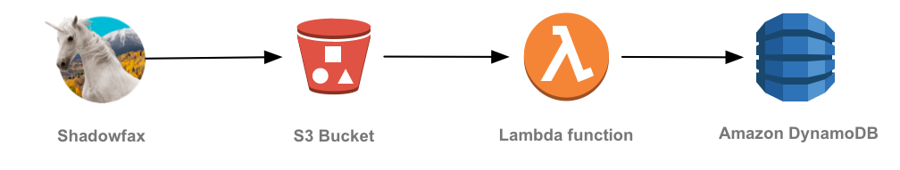</kbd>

Our producer is a sensor attached to a unicorn - Shadowfax - currently taking a passenger on a Wild Ryde. This sensor aggregates sensor data every minute including the distance the unicorn traveled and maximum and minimum magic points and hit points readings in the previous minute. These readings are stored in [data files][data/shadowfax-2016-02-12.json] which are uploaded on a daily basis to Amazon S3.

The Amazon S3 bucket has an [event notification][event-notifications] configured to trigger the AWS Lambda function that will retrieve the file, process it, and populate the Amazon DynamoDB table.

## Implementation Instructions

### 1. Create an Amazon S3 bucket

Use the console or CLI to create an S3 bucket. Keep in mind, your bucket's name must be globally unique. We recommend using a name like `wildrydes-uploads-yourname`.

<details>
<summary><strong>Step-by-step instructions (expand for details)</strong></summary><p>

1. From the AWS Console click **Services** then select **S3** under Storage.

1. Click **+Create Bucket**

1. Provide a globally unique name for your bucket such as `wildrydes-uploads-yourname`.

1. Select a region for your bucket.

   <kbd>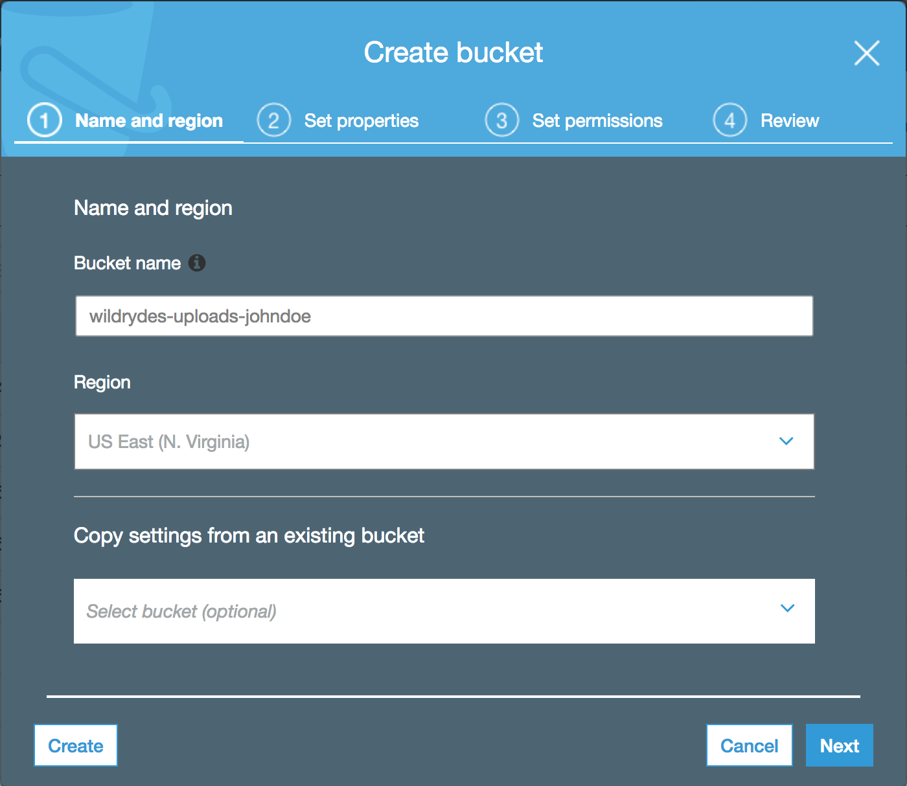</kbd>

1. Use the default values and click **Next** through the rest of the sections and click **Create Bucket** on the review section.

</p></details>

### 2. Create an Amazon DynamoDB Table

Use the Amazon DynamoDB console to create a new DynamoDB table. Call your table `UnicornSensorData` and give it a **Partition key** called `Name` of type **String** and a **Sort key** called `StatusTime` of type **Number**. Use the defaults for all other settings.

After you've created the table, note the Amazon Resource Name (ARN) for use in the next section.

<details>
<summary><strong>Step-by-step instructions (expand for details)</strong></summary><p>

1. From the AWS Management Console, choose **Services** then select **DynamoDB** under Databases.

1. Choose **Create table**.

1. Enter `UnicornSensorData` for the **Table name**.

1. Enter `Name` for the **Partition key** and select **String** for the key type.

1. Tick the **Add sort key** checkbox. Enter `StatusTime` for the **Sort key** and select **Number** for the key type.

1. Check the **Use default settings** box and choose **Create**.

	<kbd>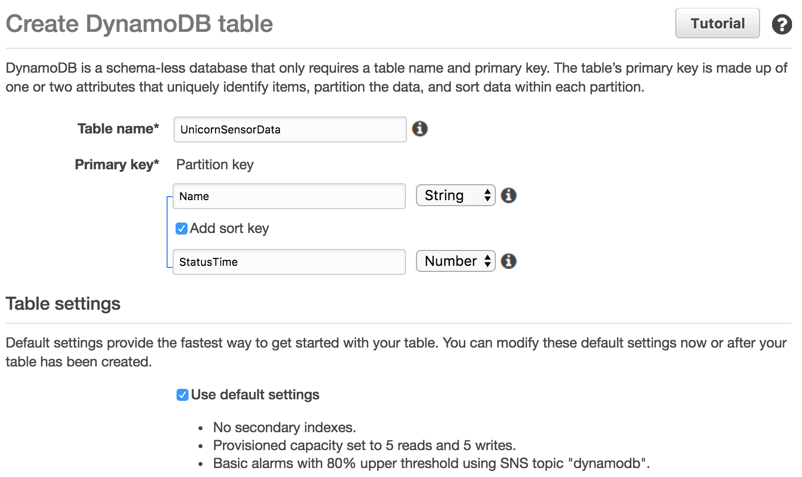</kbd>

1. Scroll to the bottom of the Overview section of your new table and note the **ARN**. You will use this in the next section.

</p></details>

### 3. Create an IAM role for your Lambda function

Use the IAM console to create a new role. Give it a name like `WildRydesFileProcessorRole` and select AWS Lambda for the role type. Attach the managed policy called `AWSLambdaBasicExecutionRole` to this role in order to grant permissions for your function to log to Amazon CloudWatch Logs.

You'll need to grant this role permissions to access both the S3 bucket and Amazon DynamoDB table created in the previous sections:

- Create an inline policy allowing the role access to the `ddb:BatchWriteItem` action for the Amazon DynamoDB table you created in the previous section.

- Create an inline policy allowing the role access to the `s3:GetObject` action for the S3 bucket you created in the first section.

<details>
<summary><strong>Step-by-step instructions (expand for details)</strong></summary><p>

1. From the AWS Console, click on **Services** and then select **IAM** in the Security, Identity & Compliance section.

1. Select **Roles** from the left navigation and then click **Create new role**.

1. Select **AWS Lambda** for the role type from **AWS Service Role**.

    **Note:** Selecting a role type automatically creates a trust policy for your role that allows AWS services to assume this role on your behalf. If you were creating this role using the CLI, AWS CloudFormation or another mechanism, you would specify a trust policy directly.

1. Begin typing `AWSLambdaBasicExecutionRole` in the **Filter** text box and check the box next to that role.

1. Click **Next Step**.

1. Enter `WildRydesFileProcessorRole` for the **Role Name**.

1. Click **Create role**.

1. Type `WildRydesFileProcessorRole` into the filter box on the Roles page and click the role you just created.

1. On the Permissions tab, expand the **Inline Policies** section and click the link to create a new inline policy.

	<kbd>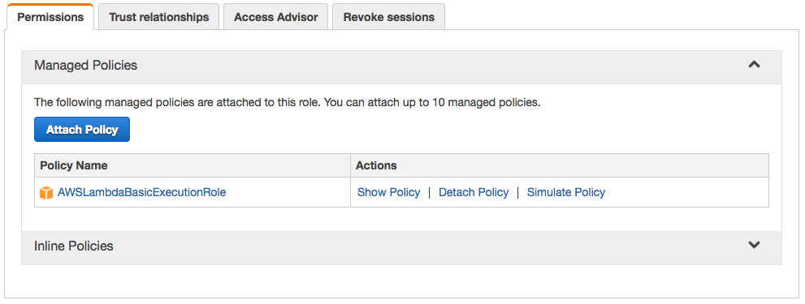</kbd>

1. Ensure **Policy Generator** is selected and click **Select**.

1. Select **Amazon DynamoDB** from the **AWS Service** dropdown.

1. Select **BatchWriteItem** from the Actions list.

1. Type the ARN of the DynamoDB table you created in the previous section in the **Amazon Resource Name (ARN)** field. The ARN is in the format of:

	```
	arn:aws:dynamodb:REGION:ACCOUNT_ID:table/UnicornSensorData
	```

	For example, if you've deployed to US East (N. Virginia) and your account ID is 123456789012, your table ARN would be:

	```
	arn:aws:dynamodb:us-east-1:123456789012:table/UnicornSensorData
	```

	To find your AWS account ID number in the AWS Management Console, click on **Support** in the navigation bar in the upper-right, and then click **Support Center**. Your currently signed in account ID appears in the upper-right corner below the Support menu.

	<kbd>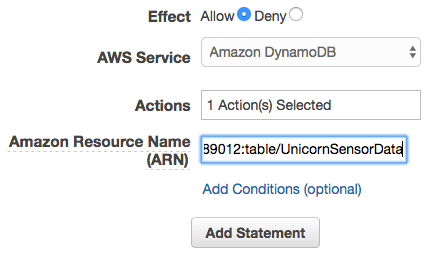</kbd>

1. Click **Add Statement**.

	<kbd>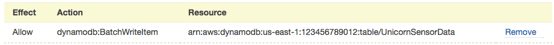</kbd>

1. Select **Amazon S3** from the **AWS Service** dropdown.

1. Select **GetObject** from the Actions list.

1. Type the ARN of the S3 table you created in the first section in the **Amazon Resource Name (ARN)** field. The ARN is in the format of:

	```
	arn:aws:s3:::YOUR_BUCKET_NAME_HERE/*
	```

	For example, if you've named your bucket `wildrydes-uploads-johndoe`, your bucket ARN would be:

	```
	arn:aws:s3:::wildrydes-uploads-johndoe/*
	```

	<kbd>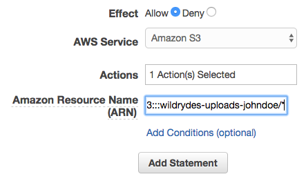</kbd>

1. Click **Add Statement**.

	<kbd>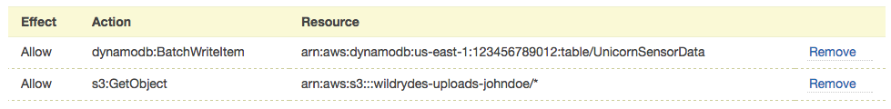</kbd>

1. Click **Next Step** then **Apply Policy**.

</p></details>

### 4. Create a Lambda function for processing

Use the console to create a new Lambda function called `WildRydesFileProcessor` that will be triggered whenever a new object is created in the bucket created in the first section.

Use the provided [index.js](lambda/WildRydesFileProcessor/index.js) example implementation for your function code by copying and pasting the contents of that file into the Lambda console's editor. Ensure you create an environment variable with the key `TABLE_NAME` and the value `UnicornSensorData`.

Make sure you configure your function to use the `WildRydesFileProcessorRole` IAM role you created in the previous section.

<details>
<summary><strong>Step-by-step instructions (expand for details)</strong></summary><p>

1. Click on **Services** then select **Lambda** in the Compute section.

1. Click **Create function**.

1. Click on **Author from scratch**.

1. Enter `WildRydesFileProcessor` in the **Name** field.

1. Select `WildRydesFileProcessorRole` from the **Existing Role** dropdown.
	<kbd>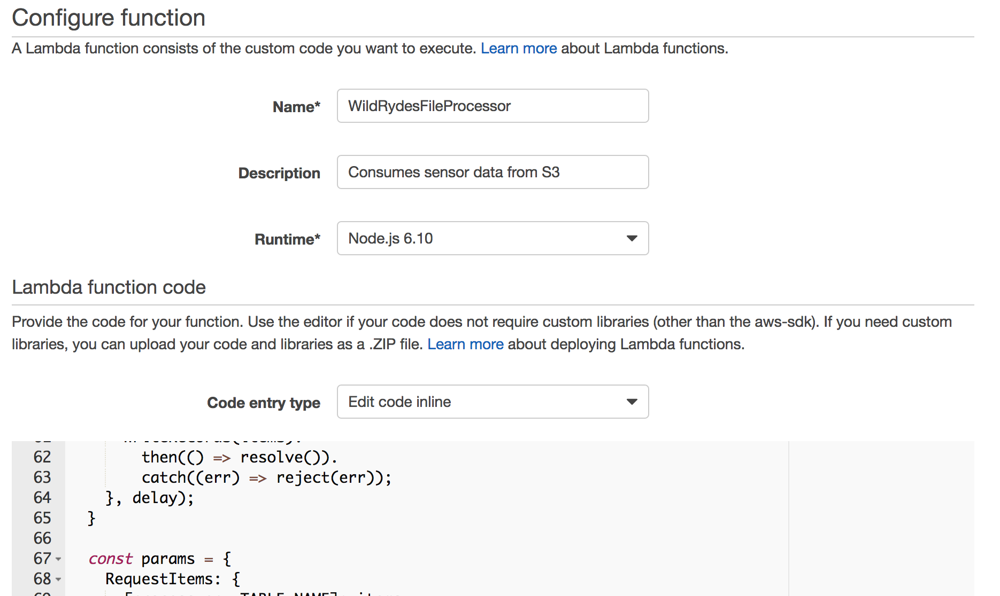</kbd>

1. Click on **Create function**.

1. Click on **Triggers** then click **+ Add trigger**

1. Click on the dotted outline and select **S3**. Select **wildrydes-uploads-yourname** from **Bucket**, **Object Created (All)** from **Event type**, and tick the **Enable trigger** checkbox.
	<kbd></kbd>

1. Click **Submit**.

1. Click **Configuration**.

1. Select **Node.js 6.10** for the **Runtime**.

1. Leave the default of `index.handler` for the **Handler** field.

1. Copy and paste the code from [index.js](lambda/WildRydesFileProcessor/index.js) into the code entry area.

1. Extend **Environment variables** under the entry area

1. In **Environment variables**, enter an environment variable with key `TABLE_NAME` and value `UnicornSensorData`.
	<kbd>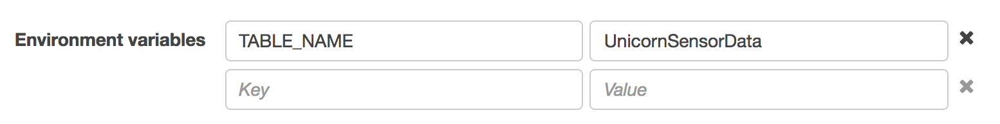</kbd>
1. Scroll down to **Basic settings** and set **Timeout** to **5** minutes to accommodate large files.
	<kbd>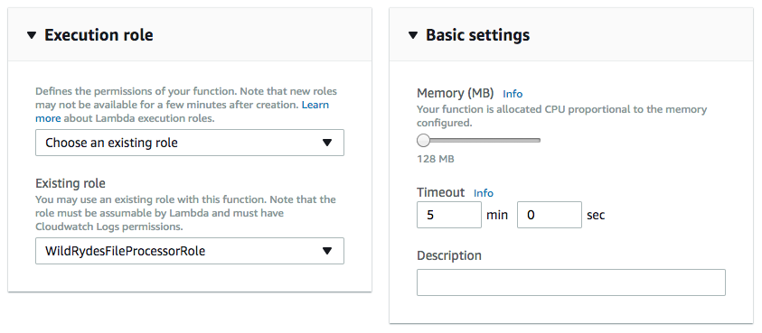</kbd>
1. Optionally enter a description under Timeout.

1. Scroll to top and click **"Save"** (**Not** "Save and test" since we haven't configured any test event)

</p></details>

## Implementation Validation

1. Using either the AWS Management Console or AWS Command Line Interface, copy the provided [data/shadowfax-2016-02-12.json][data/shadowfax-2016-02-12.json] data file to the Amazon S3 bucket created in the first section.

	You can either download this file via your web browser and upload it using the AWS Management Console, or you use the AWS CLI to copy it directly:

	```console
	aws s3 cp s3://wildrydes-data-processing/data/shadowfax-2016-02-12.json s3://YOUR_BUCKET_NAME_HERE
	```

1. Click on **Services** then select **DynamoDB** in the Database section.

1. Click on **UnicornSensorData**.

1. Click on the **Items** tab and verify that the table has been populated with the items from the data file.

	<kbd>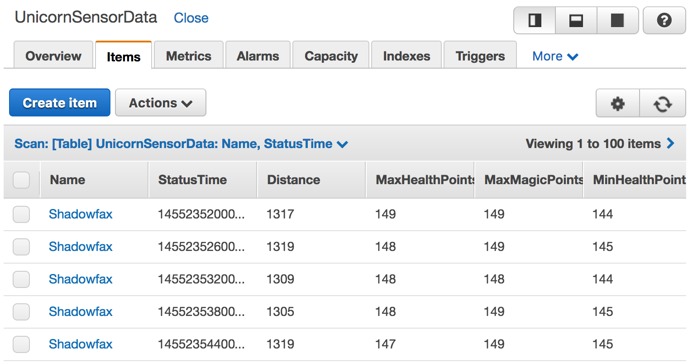</kbd>

When you see items from the JSON file in the table, you can move onto the next module: [Real-time Data Streaming][data-streaming-module].

## Extra Credit

- Enhance the implementation to gracefully handle lines with malformed JSON. Edit the file to include a malformed line and verify the function is able to process the file. Consider how you would handle unprocessable lines in a production implementation.
- Inspect the Amazon CloudWatch Logs stream associated with the Lambda function and note the duration the function executes. Change the provisioned write throughput of the DynamoDB table and copy the file to the bucket once again as a new object. Check the logs once more and note the lower duration.

[event-notifications]: http://docs.aws.amazon.com/AmazonS3/latest/dev/NotificationHowTo.html
[data/shadowfax-2016-02-12.json]: https://s3.amazonaws.com/wildrydes-data-processing/data/shadowfax-2016-02-12.json
[data-streaming-module]: ../2_DataStreaming/README.md
