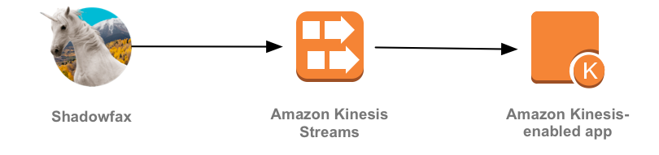
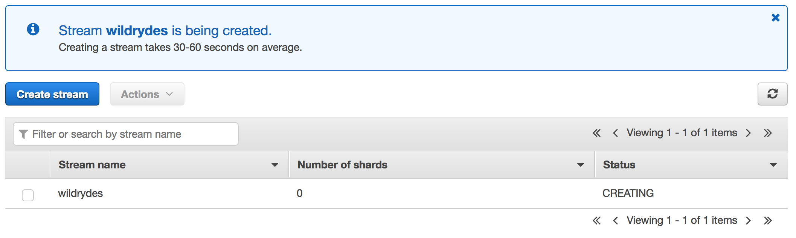
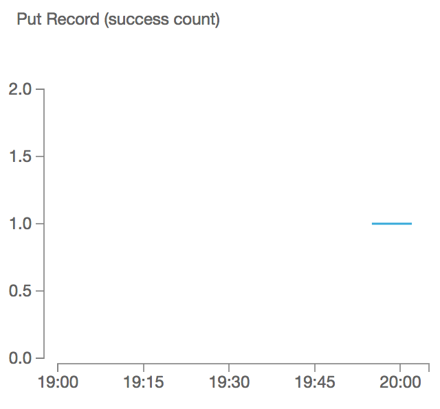

# Module 2: Real-time Data Streaming

In this module you'll create a Amazon Kinesis stream to collect and store sensor data from your unicorn fleet. Using the provided command-line clients, you'll produce sensor data from a unicorn on a Wild Ryde and read from the stream. In subsequent modules you'll add functionality to analyze and persist this data using Amazon Kinesis Analytics, AWS Lambda, and Amazon DynamoDB.

## Architecture Overview

The architecture for this module involves an Amazon Kinesis stream, a producer, and a consumer:

<kbd></kbd>

Our producer is a sensor attached to a unicorn - Shadowfax - currently taking a passenger on a Wild Ryde. This sensor emits data every second including the unicorn's current location, distance traveled in the previous second, and magic points and hit points so that our operations team can monitor the health of the unicorn fleet from Wild Rydes headquarters.

The Amazon Kinesis stream stores data sent by the producer  and provides an interface to allow consumers to process and analyze those data. Our consumer is a simple command-line utility that tails the stream and outputs the data points from the stream in effectively real-time so we can see what data is being stored in the stream.

Before beginning the module ensure that you have the Kinesis command-line clients downloaded by following the [installation instructions][client-installation].

## Implementation Instructions

### 1. Create an Amazon Kinesis stream

Use the Amazon Kinesis Streams console to create a new stream named **wildrydes** with **1** shard.

<details>
<summary><strong>Step-by-step instructions (expand for details)</strong></summary><p>

1. From the AWS Console click **Services** then select **Kinesis** under Analytics.

1. Click **Go to the Streams console**.

1. Click **Create Kinesis stream**.

1. Enter `wildrydes` into **Kinesis stream name** and `1` into **Number of shards**, then click **Create Kinesis stream**.

1. Within 60 seconds, your Kinesis stream will be **ACTIVE** and ready to store real-time streaming data.

	<kbd></kbd>

</p></details>

### 2. Produce Messages into the stream

Use the command-line producer for macOS, Linux, or Windows to produce messages into the stream.

<details>
<summary><strong>Step-by-step instructions (expand for details)</strong></summary><p>

1. Run the producer to start emiting sensor data to the stream. Replace **YOUR\_REGION\_HERE** with your Region. For example, if you've created the stream in US West (Oregon), you'd replace the placeholder with us-west-2.

	```console
	./producer -region YOUR_REGION_HERE
	```

	The producer emits a message a second to the stream and prints a period to the screen.

	```console
	$ ./producer -region us-east-1
	..................................................
	```

1. In the Amazon Kinesis Streams console, click on **wildrydes** and click on the **Monitoring** tab.

1. After several minutes, you will see the **Put Record (success count)** graph begin to record a single put a second:

	<kbd></kbd>

</p></details>

## Implementation Validation

1. Run the consumer to start reading sensor data from the stream. Replace **YOUR\_REGION\_HERE** with your Region. For example, if you've created the stream in US West (Oregon), you'd replace the placeholder with us-west-2.

	```console
	./consumer -region YOUR_REGION_HERE
	```

	The consumer will print the messages being sent by the producer:

	```json
	{
	    "Name": "Shadowfax",
	    "StatusTime": "2017-06-05 09:17:08.189",
	    "Latitude": 42.264444250051326,
	    "Longitude": -71.97582884770408,
	    "Distance": 175,
	    "MagicPoints": 110,
	    "HealthPoints": 150
	}
	{
	    "Name": "Shadowfax",
	    "StatusTime": "2017-06-05 09:17:09.191",
	    "Latitude": 42.265486935100476,
	    "Longitude": -71.97442977859625,
	    "Distance": 163,
	    "MagicPoints": 110,
	    "HealthPoints": 151
	}
	```

1. Experiment with the producer:

	1. Stop the producer by pressing Control + C and notice the messages stop.

	1. Start the producer again and notice the messages resume.

	1. Start another instance of the producer in another tab or console. Provide a specific unicorn name and notice data points for both unicorns in consumer's output:

		```console
		./producer -region YOUR_REGION_HERE -name Bucephalus
		```

After you've finished experimenting with the producer, you can move onto the next module: [Streaming Aggregation][streaming-aggregation-module].

## Extra Credit

- Write a consumer for the **wildrydes** stream in the programming language of your choice using the [AWS SDKs][sdks]. Experiment with the output format.

[sdks]: https://aws.amazon.com/tools/
[streaming-aggregation-module]: ../3_StreamingAggregation/README.md
[client-installation]: ../README.md#kinesis-command-line-clients
