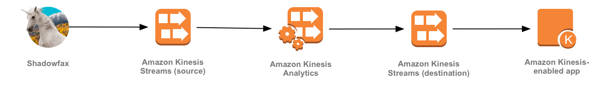
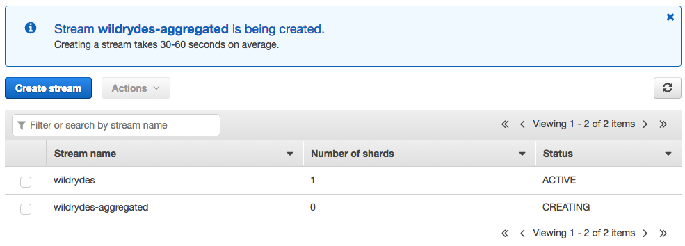
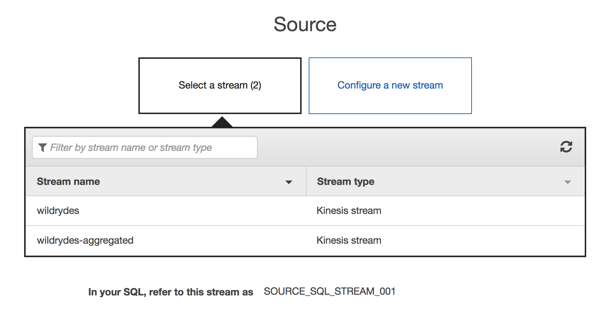
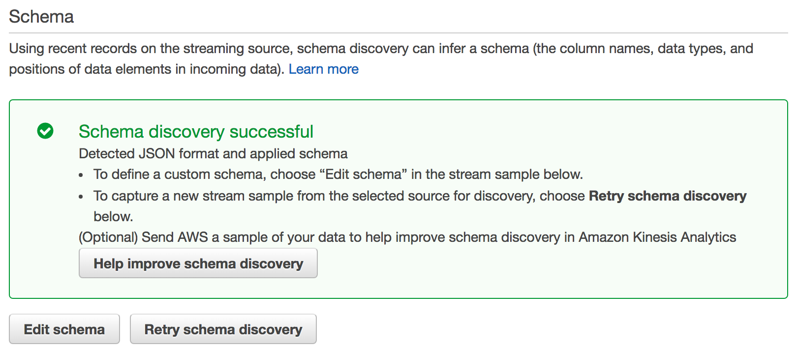
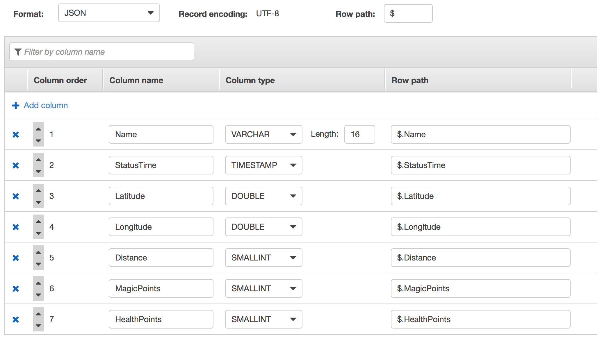
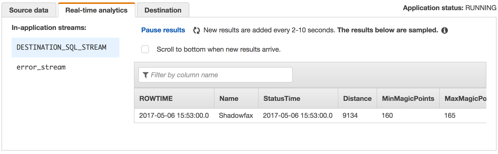
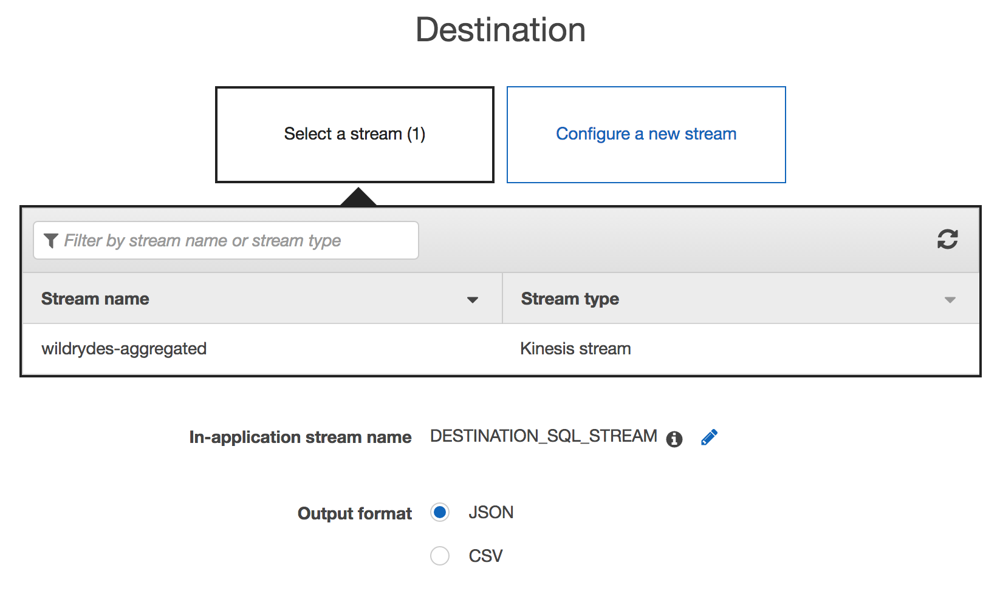

# Module 3: Streaming Aggregation

In this module you'll create an Amazon Kinesis Analytics application to aggregate sensor data from your unicorn fleet in real-time. The application will read from the stream, calculate the total distance traveled and minimum and maximum health and magic points for each unicorn currently on a Wild Ryde and output these aggregated statistics to an Amazon Kinesis stream every minute.

## Architecture Overview

The architecture for this module involves an Amazon Kinesis Analytics application, source and destination Amazon Kinesis streams, and the producer and consumer command-line clients:

<kbd></kbd>

Our producer is a sensor attached to a unicorn - Shadowfax - currently taking a passenger on a Wild Ryde. This sensor emits data every second including the unicorn's current location, distance traveled in the previous second, and magic points and hit points so that our operations team can monitor the health of our unicorns from Wild Rydes headquarters.

The Amazon Kinesis Analytics application processes data from the source Amazon Kinesis stream that you created in the previous module and aggregates it on a per-minute basis. Each minute, the application will emit data including the total distance traveled in the last minute as well as the minimum and maximum readings from health and magic points for each unicorn in our fleet. These data points will be sent to a destination Amazon Kinesis stream for processing by other components in our system.

Before beginning the module ensure that you have the Kinesis command-line clients downloaded by following the [installation instructions][client-installation].

## Implementation Instructions

### 1. Create an Amazon Kinesis stream

Use the Amazon Kinesis Streams console to create a new stream named **wildrydes-aggregated** with **1** shard.

<details>
<summary><strong>Step-by-step instructions (expand for details)</strong></summary><p>

1. From the AWS Console click **Services** then select **Kinesis** under Analytics.

1. Click **Go to Streams console**.

1. Click **Create Kinesis stream**.

1. Enter `wildrydes-aggregated` into **Kinesis stream name** and `1` into **Number of shards**, then click **Create Kinesis stream**.

1. Within 60 seconds, your stream will be **ACTIVE** and ready to store real-time streaming data.

    <kbd></kbd>

</p></details>

### 2. Create an Amazon Kinesis Analytics application

Build an Amazon Kinesis Analytics application which reads from the **wildrydes** stream built in the previous module and emits a JSON object with the following attributes each minute:

- **Name**: Unicorn name
- **StatusTime**: The ROWTIME provided by Amazon Kinesis Analytics
- **Distance**: The sum of distance traveled by the unicorn
- **MinMagicPoints**: The minimum data point of the _MagicPoints_ attribute
- **MaxMagicPoints**: The maximum data point of the _MagicPoints_ attribute
- **MinHealthPoints**: The minimum data point of the _HealthPoints_ attribute
- **MaxHealthPoints**: The maximum data point of the _HealthPoints_ attribute

Set the destination stream of the application to **wildrydes-aggregated**.

<details>
<summary><strong>Step-by-step instructions (expand for details)</strong></summary><p>

1. Run the producer to start emiting sensor data to the stream. Replace **YOUR\_REGION\_HERE** with your Region. For example, if you've created the stream in US West (Oregon), you'd replace the placeholder with us-west-2.

	```console
	./producer -region YOUR_REGION_HERE
	```

	The producer emits a message a second to the stream and prints a period to the screen.

	```console
	$ ./producer -region us-east-1
	..................................................
	```

	Activately producing sensor data while we're building our application will allow Amazon Kinesis Analytics to auto-detect our schema.

1. From the AWS Console click **Services** then select **Kinesis** under Analytics.

1. Click **Go to the Analytics console**.

1. Click **Create application**.

1. Enter `wildrydes` into **Application name** and then click **Create application**.

1. Click **Connect to a source** and click **wildrydes**.

	<kbd></kbd>

1. Scroll down to and ensure our schema was properly auto-discovered:

	<kbd></kbd>

1. Click **Edit schema** to explore the schema:

	<kbd></kbd>

	Ensure that the data types in your auto-discovered schema match with the screenshot above. If not, adjust the data types and click **Save schema and update stream samples**.

1. Click **Exit** and **Save and continue**.

1. Click **Go to SQL editor**. This will open up an interactive query session where we can build a query on top of our real-time Amazon Kinesis stream. If promoted, click **Yes, start application**.

1. Copy and paste the following SQL query:

	```sql
	CREATE OR REPLACE STREAM "DESTINATION_SQL_STREAM" (
	  "Name"                VARCHAR(32),
	  "StatusTime"          TIMESTAMP,
	  "Distance"            SMALLINT,
	  "MinMagicPoints"      SMALLINT,
	  "MaxMagicPoints"      SMALLINT,
	  "MinHealthPoints"     SMALLINT,
	  "MaxHealthPoints"     SMALLINT
	);

	CREATE OR REPLACE PUMP "STREAM_PUMP" AS
	  INSERT INTO "DESTINATION_SQL_STREAM"
	    SELECT STREAM "Name", "ROWTIME", SUM("Distance"), MIN("MagicPoints"),
	                  MAX("MagicPoints"), MIN("HealthPoints"), MAX("HealthPoints")
	    FROM "SOURCE_SQL_STREAM_001"
	    GROUP BY FLOOR("SOURCE_SQL_STREAM_001"."ROWTIME" TO MINUTE), "Name";
	```

1. Click **Save and run SQL**. Each minute, you will see rows arrive containing the aggregated data:

	<kbd></kbd>
	
1. Click the **exit (done)** link.

1. Click the **Destination** tab and click on **Add destination**.

	<kbd></kbd>

1. Click **wildrydes-aggregated** to set the destination stream and click **Save and continue**.

</p></details>

## Implementation Validation

1. Run the consumer to start reading sensor data from the aggregated stream. Replace **YOUR\_REGION\_HERE** with your Region. For example, if you've created the stream in US West (Oregon), you'd replace the placeholder with us-west-2.

	```console
	./consumer -region YOUR_REGION_HERE -stream wildrydes-aggregated
	```

	The consumer will print the aggregated data being sent by the application every minute:

	```json
	{
	    "Name": "Shadowfax",
	    "StatusTime": "2017-05-06 17:47:00.000",
	    "Distance": 9413,
	    "MinMagicPoints": 153,
	    "MaxMagicPoints": 159,
	    "MinHealthPoints": 150,
	    "MaxHealthPoints": 157
	}
	{
	    "Name": "Shadowfax",
	    "StatusTime": "2017-05-06 17:48:00.000",
	    "Distance": 9407,
	    "MinMagicPoints": 144,
	    "MaxMagicPoints": 155,
	    "MinHealthPoints": 153,
	    "MaxHealthPoints": 157
	}
	```

1. Experiment with the producer:

	1. Stop the producer by pressing Control + C and notice the messages stop.

	1. Start the producer again and notice the messages resume.

	1. Start another instance of the producer in another tab or console. Provide a specific unicorn name and notice data points for both unicorns in consumer's output:

		```console
		./producer -region YOUR_REGION_HERE -name Bucephalus
		```

After you've finished experimenting with the producer, you can move onto the next module: [Stream Processing][stream-processing-module].

## Extra Credit

- Build another Kinesis Analytics application which reads from the **wildrydes** stream and selects data points where a unicorn's magic points vital sign is below 100 points.

[stream-processing-module]: ../4_StreamProcessing/README.md
[client-installation]: ../README.md#kinesis-command-line-clients
