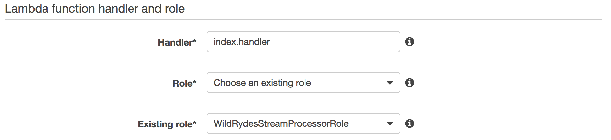

# 모듈 4: Stream 처리

이번 모듈에서는 AWS Lambda를 사용하여 이전 모듈에서 생성한 `wildrydes-aggregated` Amazon Kinesis 스트림의 데이터를 처리합니다. 이 Lambda 함수는 스트림에서 데이터를 읽고 첫번째 모듈에서 생성한 `UnicornSensorData` Amazon DynamoDB 테이블에 기록을 합니다.

## Architecture 개요

<kbd></kbd>

우리의 producer는 승객을 태우고 있는 Wild Ryde 유니콘 - Shadowfax - 에 부착된 센서 입니다. 이 센서는 유니콘의 현재 위치, 1초에 이동한 거리, Wild Rydes 본부 운영팀에서 유니콘의 건강 상태를 파악할때 필요한 magic 점수와 hit 점수를 매초 마다 데이터를 생성합니다.


Amazon Kinesis 분석 어플리케이션은 매초단위의 데이터를 취합하여 각 유니콘들의 이동거리 및 magic 점수와 health 점수의 최대, 최소 값을 단일 레코드로 매분 기록합니다. 이렇게 취합한 자료는 또 다른 Amazon Kinesis Stream으로 전달 됩니다.

이번 모듈에서는 취합된 스트림 데이터를 Amazon DynamoDB 테이블에 기록 하는 AWS Lambda 함수를 작성합니다. 

이번 모듈을 실행하기 앞서 Kinesis command-line 클라이언트를 [installation instructions][client-installation] 본 링크를 참조하여 설치하여 주시기 바랍니다.

## 실행 지침 가이드

### 1. Lambda 함수에 사용할 IAM 역할 생성

AWS 콘솔에서 IAM 선택 `create a new role`을 클릭하여 새로운 역할을 생성합니다. 새로운 역할의 이름으로는 `WildRydesStreamProcessorRole` 와 같은 형식으로 지정합니다. 그리고 역할 종류로는 AWS Lambda를 선택합니다. 방금 생성한 역할에 `AWSLambdaKinesisExecutionRole` managed policy를 선택하여 추가하여 줍니다. 이 역할은 Lambda 함수로 하여금 Amazon Kinesis streams으로 부터 데이터를 읽을 수 있고 또한 Amazon CloudWatch 로그를 생성할 수 있도록 합니다.

`inline policy`에서 `dynamodb:BatchWriteItem`를 추가하여 이전 모듈 [File Processing module][file-processing-module]에서 생성한 Amazon DynamoDB 테이블에 쓸수 있는 권한을 부여 하셔야 합니다.


<details>
<summary><strong>자세한 단계별 가이드(클릭하여 펼쳐주시기 바랍니다.)</strong></summary><p>

1. AWS 콘솔에서 **Services** 선택 Security, Identity & Compliance 하위 항목중 **IAM** 선택

1. 왼쪽 탐색 창에서 **Roles** 선택 **Create new role** 선택

1. **AWS Service Role**에서 역할 종류에서 **AWS Lambda**를 선택

    **주의:** 콘솔에서 역할 종류를 선택할 경우 사용자를 대신해서 AWS services가 이 역할을 허락는 trust policy를 자동적으로 생성합니다. 역할을 CLI 혹은 AWS CloudFormation 이나 또다른 방법으로 생성할 시에는 trust policy를 직접 생성해 주셔야  .

1. **Filter**입력창에 `AWSLambdaKinesisExecutionRole` 를 입력 후 좌측 체크 박스를 체크

1. **Next Step** 클릭

1. **Role Name**에 `WildRydesStreamProcessorRole` 입력

1. **Create role** 클릭

1. 역할 페이지에서 `filter` 박스에 `WildRydesStreamProcessorRole` 를 입력 후 방금 생성한 역할 선택

1. `Permissions` 탭을 열어 **Inline Policies** 를 클릭하고 새로운 `create a new inline policy` 선택

   <kbd></kbd>

1. **Policy Generator**가 선택 되었는지를 확인하고 **Select** 클릭

1. **AWS Service** 선택 스크롤에서 **Amazon DynamoDB** 선택

1. `Actions list`에서 **BatchWriteItem** 선택

1. **Amazon Resource Name (ARN)** 항목에 방금전 생성한 DynamoDB 테이블의 ARN을 입력합니다. ARN은 아래 형식과 같습니다:

	```
	arn:aws:dynamodb:REGION:ACCOUNT_ID:table/UnicornSensorData
	```

	예를 들어 US East (N. Virginia)에 생성하셨다고 account ID가 123456789012 라면 전송 스트림의 ARN은 아래와 같을 것 입니다.

	```
	arn:aws:dynamodb:us-east-1:123456789012:table/UnicornSensorData
	```

	AWS account ID 숫자를 확인 하는 방법은 AWS Management 콘솔에서 우측 상단에 있는 **Support** 클릭, 그리고 **Support Center**를 클릭하시면 됩니다. 우측 상단 `Support` 메뉴아래 현재 접속되어 있는 계정의 `account ID`를 확인하실 수 있으십니다.

    <kbd></kbd>

1. **Add Statement** 클릭

    <kbd></kbd>

1. **Next Step** 클릭 **Apply Policy** 클릭

</p></details>

### 2. 데이터 처리 Lambda 함수 생성

AWS 콘솔을 이용하여 `WildRydesStreamProcessor` 이름으로 새로운 Lambda 함수를 생성합니다. 이 람다 함수는 이전 단계 [Streaming Aggregation module][streaming-aggregation-module]에서 생성한 Amazon Kinesis **wildrydes-aggregated** 스트림에 데이터가 들어 올때 마다 트리거가 됩니다.

이번 랩에서는 사전에 준비된 예제 코드를 사용하여 Lambda 콘솔 설정 창에 [index.js](lambda/WildRydesStreamProcessor/index.js) 의 내용을 복사 붙여넣기를 합니다. 추가적으로 key `TABLE_NAME` 와 value `UnicornSensorData`를 이용하여 Lambda 함수의 환경변수를 설정 합니다.

이전 단계에서 생성한 `WildRydesStreamProcessorRole` IAM 역활을 사용하시기 바랍니다.

<details>
<summary><strong>자세한 단계별 가이드(클릭하여 펼쳐주시기 바랍니다.)</strong></summary><p>

1. **Services** 클릭, Compute 항목 아래 있는 **Lambda** 선택

1. **Create a Lambda function** 클릭 

1. **Blank Function** `blueprint` 클릭

1. Lambda 함수의 이벤트 트리거 조건으로 **Kinesis** 선택. **Kinesis stream**에서 **wildrydes-aggregated** 선택, **Starting position**에서 **Trim horizon** 선택, **Enable trigger** 체크.

    <kbd></kbd>

    Starting position은 AWS Lambda함수가 읽기 시작하는 스트림의 지점을 의미합니다. Trim horizon 설정은 샤드의 가장 오래된 자료부터 시작함을 의미 합니다. 더 자세한 내용은 Amazon Kinesis API Reference의 [ShardIteratorType][shard-iterator-type-documentation] 부분을 참고 하시기 바랍니다.

1. **Next** 클릭

1. **Name** 입력란에 `WildRydesStreamProcessor` 입력

1. 필요하다면 Description 추가적으로 입력

1. **Runtime** 에서 **Node.js 6.10** 선택

1. 코드 입력란에 [index.js](lambda/WildRydesStreamProcessor/index.js) 를 복사 붙여넣기 하십시오.

    <kbd></kbd>

1. **Environment variables** 클릭. 환경변수 key 입력란에 `TABLE_NAME` 입력, value 입력란에 `UnicornSensorData` 입력

    <kbd></kbd>

1. **Handler** 항목에 기본값인 `index.handler` 확인

1. **Existing Role** 드롭다운 메뉴에서 `WildRydesStreamProcessorRole` 선택

    <kbd></kbd>

1. **Next** 클릭, 리뷰 페이지에서 **Create function** 클릭

</p></details>

## 정상 동작 확인

1. 프로듀서를 시작하시면 센서데이터와 유니콘 이름를 스트림으로 전송하기 시작합니다. 아래 코드에서 **YOUR\_REGION\_HERE** 부분을 현재 사용하시는 리전으로 변경해 주시기 바랍니다. 예를 들어 스트림을 US West (Oregon)에 생성하셨다면 us-west-2를 입력해 주세요.

	```console
	./producer -region YOUR_REGION_HERE -name Rocinante
	```

1. **Services** 클릭 Database 항목에서 **DynamoDB** 선택

1. **UnicornSensorData** 클릭

1. **Items** 탭 클릭, **Add Filter** 클릭, **Enter attribute** 입력란에 `Name` 입력, **Enter value** 란에 `Rocinante` 입력. 취합 스트림으로 부터 DynamoDb 테이블로 레코드가 정상적으로 추가되고 있는지 확인하시기 바랍니다.

    <kbd></kbd>

테이블에 스트림 자료가 보인다면 다음 Data 저장 모듈로 진행하 실 수 있으십니다: [Data Archiving][data-archiving-module].

## 추가 도전 과제

- 스트림으로 부터 데이터를 읽어들여 만약 유니콘의 magic 점수가 50점 미만으로 떨어질 경우 운영자에게 사전 경고 알람을 주는 새로운 Lambda 함수를 생성해 보세요.

[file-processing-module]: ../1_FileProcessing/README.md
[streaming-aggregation-module]: ../3_StreamingAggregation/README.md
[data-archiving-module]: ../5_DataArchiving/README.md
[client-installation]: ../README.md#kinesis-command-line-clients
[shard-iterator-type-documentation]: http://docs.aws.amazon.com/kinesis/latest/APIReference/API_GetShardIterator.html#Streams-GetShardIterator-request-ShardIteratorType
