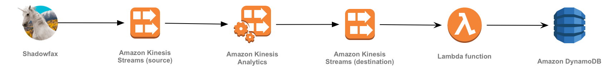
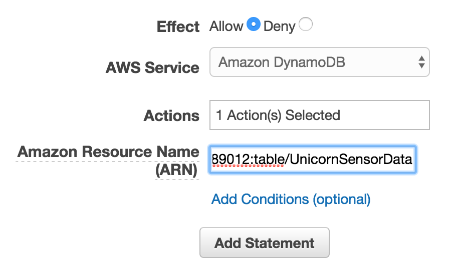
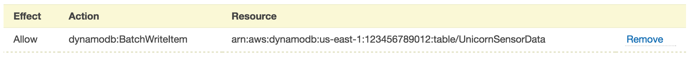
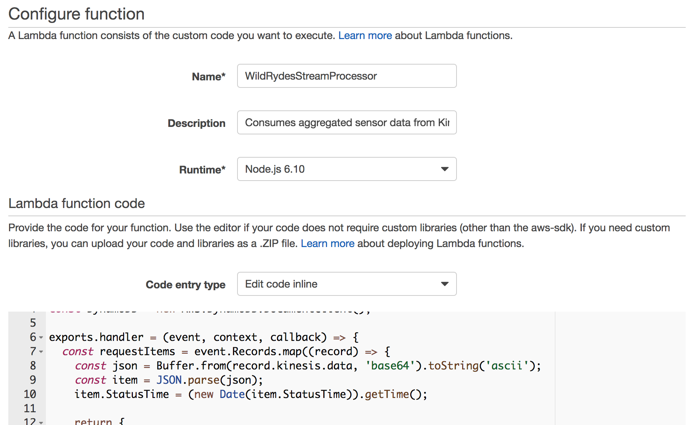
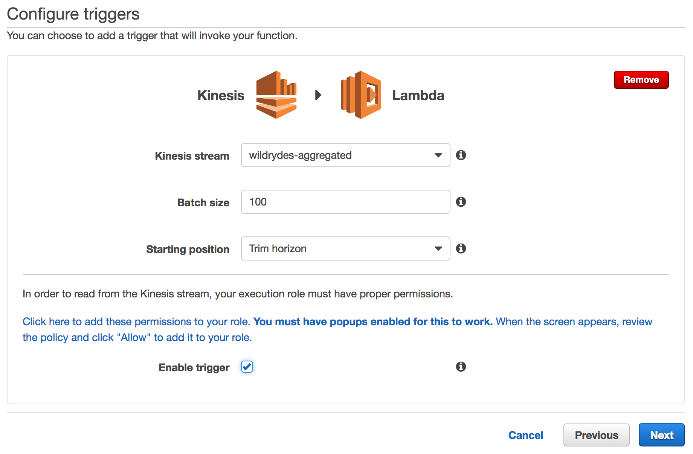
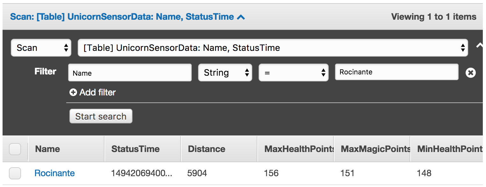

# Module 4: Stream Processing

In this module you'll use AWS Lambda to process data from the `wildrydes-aggregated` Amazon Kinesis Stream created in the last module. The Lambda function will read from the stream and write records to the `UnicornSensorData` Amazon DynamoDB table created in the first module.

## Architecture Overview

<kbd></kbd>

Our producer is a sensor attached to a unicorn - Shadowfax - currently taking a passenger on a Wild Ryde. This sensor emits data every second including the unicorn's current location, distance traveled in the previous second, and magic points and hit points so that our operations team can monitor the health of our unicorns from Wild Rydes headquarters.

The Amazon Kinesis Analytics application aggregates the per-second data and emits a single record each minute with a sum of distance traveled and minimum and maximum magic and health points for each unicorn. These aggregated messages are sent to another Amazon Kinesis Stream.

In this module you'll create an AWS Lambda function to process the aggregated stream and write those records to an Amazon DynamoDB table.

Before beginning the module ensure that you have the Kinesis command-line clients downloaded by following the [installation instructions][client-installation].

## Implementation Instructions

### 1. Create an IAM role for your Lambda function

Use the IAM console to create a new role. Give it a name like `WildRydesStreamProcessorRole` and select AWS Lambda for the role type. Attach the managed policy called `AWSLambdaKinesisExecutionRole` to this role in order to grant permissions for your function to read from Amazon Kinesis streams and to log to Amazon CloudWatch Logs.

You'll need to grant this role permissions to access the Amazon DynamoDB table create in the previous sections. Create an inline policy allowing the role access to the `dynamodb:BatchWriteItem` action for the Amazon DynamoDB table you created in the [File Processing module][file-processing-module].

<details>
<summary><strong>Step-by-step instructions (expand for details)</strong></summary><p>

1. From the AWS Console, click on **Services** and then select **IAM** in the Security, Identity & Compliance section.

1. Select **Roles** from the left navigation and then click **Create new role**.

1. Select **Lambda** for the role type from **AWS Service Role**.

    **Note:** Selecting a role type automatically creates a trust policy for your role that allows AWS services to assume this role on your behalf. If you were creating this role using the CLI, AWS CloudFormation or another mechanism, you would specify a trust policy directly.

1. Click **Next: Permissions**.

1. Begin typing `AWSLambdaKinesisExecutionRole` in the **Filter** text box and check the box next to that role.

1. Click **Next: Review**.

1. Enter `WildRydesStreamProcessorRole` for the **Role Name**.

1. Click **Create role**.

1. Type `WildRydesStreamProcessorRole` into the filter box on the Roles page and click the role you just created.

1. On the Permissions tab, click **Add inline policy** link to create a new inline policy.
	<kbd></kbd>

1. Ensure **Policy Generator** is selected and click **Select**.

1. Select **Amazon DynamoDB** from the **AWS Service** dropdown.

1. Select **BatchWriteItem** from the Actions list.

1. Type the ARN of the DynamoDB table you created in the previous section in the **Amazon Resource Name (ARN)** field. The ARN is in the format of:

	```
	arn:aws:dynamodb:REGION:ACCOUNT_ID:table/UnicornSensorData
	```

	For example, if you've deployed to US East (N. Virginia) and your account ID is 123456789012, your table ARN would be:

	```
	arn:aws:dynamodb:us-east-1:123456789012:table/UnicornSensorData
	```

	To find your AWS account ID number in the AWS Management Console, click on **Support** in the navigation bar in the upper-right, and then click **Support Center**. Your currently signed in account ID appears in the upper-right corner below the Support menu.

    <kbd></kbd>

1. Click **Add Statement**.

    <kbd></kbd>

1. Click **Next Step** then **Apply Policy**.

</p></details>

### 2. Create a Lambda function for processing

Use the console to create a new Lambda function called `WildRydesStreamProcessor` that will be triggered whenever a new record is available in the **wildrydes-aggregated** stream created in the [Streaming Aggregation module][streaming-aggregation-module].

Use the provided [index.js](lambda/WildRydesStreamProcessor/index.js) example implementation for your function code by copying and pasting the contents of that file into the Lambda console's editor. Ensure you create an environment variable with the key `TABLE_NAME` and the value `UnicornSensorData`.

Make sure you configure your function to use the `WildRydesStreamProcessorRole` IAM role you created in the previous section.

<details>
<summary><strong>Step-by-step instructions (expand for details)</strong></summary><p>

1. Click on **Services** then select **Lambda** in the Compute section.

1. Click **Create function**.

1. Click on **Author from scratch**.

1. Enter `WildRydesStreamProcessor` in the **Name** field.

1. Select `WildRydesStreamProcessorRole` from the **Existing Role** dropdown.

	<kbd></kbd>

1. Click on **Create function**.

1. Click on **Triggers** then click **+ Add trigger**

1. Click on the dotted outline and select **Kinesis**. Select **wildrydes-aggregated** from **Kinesis stream**, select **Trim horizon** from **Starting position**, and tick the **Enable trigger** checkbox.

	<kbd></kbd>

	Starting position refers to the position in the stream where AWS Lambda should start reading and trim horizon configures this to the oldest data record in the shard. See [ShardIteratorType][shard-iterator-type-documentation] in the Amazon Kinesis API Reference for more details.

1. Click **Submit**.

1. Click **Configuration**.

1. Select **Node.js 6.10** for the **Runtime**.

1. Leave the default of `index.handler` for the **Handler** field.

1. Copy and paste the code from [index.js](lambda/WildRydesStreamProcessor/index.js) into the code entry area.
	<kbd></kbd>

1. Extend **Environment variables** under the entry area

1. In **Environment variables**, enter an environment variable with key `TABLE_NAME` and value `UnicornSensorData`.
	<kbd></kbd>

1. Scroll to top and click **"Save"** (**Not** "Save and test" since we haven't configured any test event)

</p></details>

## Implementation Validation

1. Run the producer to start emiting sensor data to the stream with a unique unicorn name. Replace **YOUR\_REGION\_HERE** with your Region. For example, if you've created the stream in US West (Oregon), you'd replace the placeholder with us-west-2.

	```console
	./producer -region YOUR_REGION_HERE -name Rocinante
	```

1. Click on **Services** then select **DynamoDB** in the Database section.

1. Click on **UnicornSensorData**.

1. Click on the **Items** tab, click **Add Filter**, enter `Name` in **Enter attribute**, and enter `Rocinante` in **Enter value**. Verify that the table is being populated with the data from the aggregated stream.

    <kbd></kbd>

When you see items from the stream in the table, you can move onto the next module: [Data Archiving][data-archiving-module].

## Extra Credit

- Create a new Lambda function to read from the stream and send proactive alerts to operations personnel if a unicorn's magic points vital sign falls below 50 points.

[file-processing-module]: ../1_FileProcessing/README.md
[streaming-aggregation-module]: ../3_StreamingAggregation/README.md
[data-archiving-module]: ../5_DataArchiving/README.md
[client-installation]: ../README.md#kinesis-command-line-clients
[shard-iterator-type-documentation]: http://docs.aws.amazon.com/kinesis/latest/APIReference/API_GetShardIterator.html#Streams-GetShardIterator-request-ShardIteratorType
