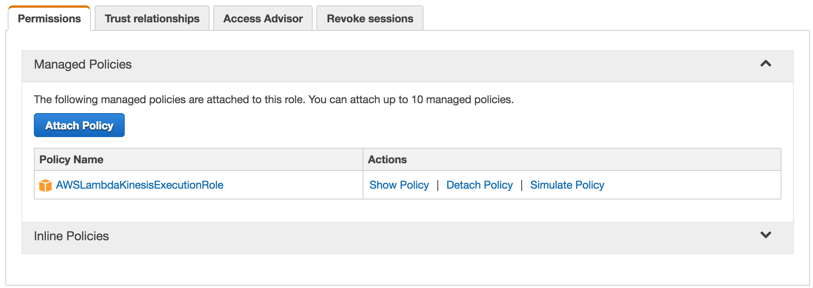
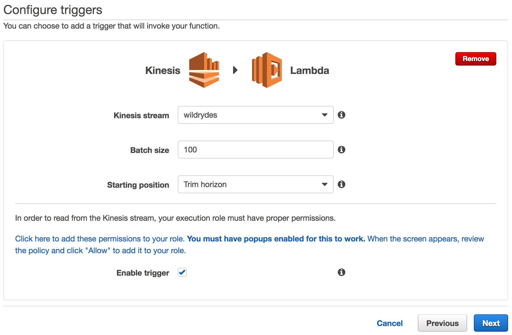
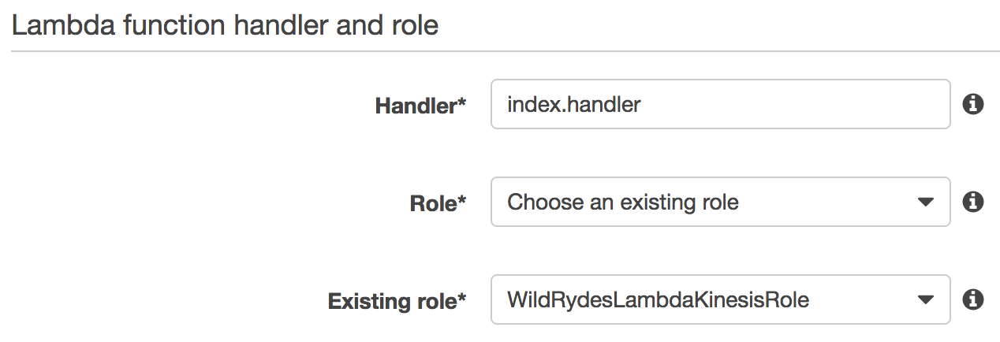

# 모듈 5: Data 수집

이번 모듈에서는 이전 [Real-time Data Streaming Module][streaming-data-module] 모듈에서 생성한 Amazon Kinesis Stream로 부터 데이터를 받아 이를  Amazon Simple Storage Service (S3)에 저장하는 Amazon Kinesis Firehose를 생성할 것 입니다. 다음에 S3에 저장된 Raw 데이터에 Amazon Athena를 사용하여 쿼리를 실행할 것 입니다.

## Architecture 개요

[Streaming Data Module][streaming-data-module]에서 생성한 Amazon Kinesis Stream와 함께 새로운 AWS Lambda 함수를 연동하여 Amazon Kinesis Firehose에 데이터를 전달하는 구조 입니다. 이후 Firehose 배치 형식으로 Amazon S3에 데이터를 저장 할 것입니다. 최종적으로 Amazon Athena를 이용하여 앞서 Amazon S3 버킷에 저장한 데이터에 ad-hoc 쿼리를 수행할 것입니다.

<kbd></kbd>

우리의 producer는 승객을 태우고 있는 Wild Ryde 유니콘 - Shadowfax - 에 부착된 센서 입니다. 이 센서는 유니콘의 현재 위치, 1초에 이동한 거리, Wild Rydes 본부 운영팀에서 유니콘의 건강 상태를 파악할때 필요한 magic 점수와 hit 점수를 매초 마다 데이터를 생성합니다. 이번 모듈에서는 command-line 툴을 이용하여 센서 데이터를 생성하도록 하겠습니다.

센서로 부터 스트림되고 있는 데이터를 AWS Lambda 함수를 생성하여 Amazon Kinesis Firehose로 넘겨주고 Firehose는 쌓여진 데이터를 일괄 처리 할 것 입니다. Firehose에서는 몇분마다 일괄적으로 싸여진 데이터를 Amazon S3 버킷에 저장 함으로써 자료를 영구적으로 보관 및 추후에 자료를 활용 할 수 있게 합니다. Amazon Athena를 이용하면 S3에 저장된 원본 자료에 별도의 추가적인 설정 없이도 쿼리를 수행 할 수 있습니다.

이번 모듈을 실행하기 앞서 Kinesis command-line 클라이언트를 [installation instructions][client-installation] 본 링크를 참조하여 설치하여 주시기 바랍니다.

## 실행 지침 가이드

### 1. Amazon S3 버킷 생성

콘솔 혹은 CLI를 이용하여 `wildrydes-data-yourname`와 같은 이름으로 버킷을 생성하시기 바랍니다. S3 버킷 이름은 전 세계적으로 유일해야 함을 잊지 말아주세요.

버킷 리전을 선택하실때 AWS Lambda, Amazon Kinesis Streams, Amazon Kinesis Firehose, and Amazon Athena를 사용할 수 있는 리전을 선택하여 주세요. 참고로 US East (N. Virginia)와 US West (Oregon)에서는 위 서비스 모두를 지원합니다.

<details>
<summary><strong>자세한 단계별 가이드(클릭하여 펼쳐주시기 바랍니다.)</strong></summary><p>

1. AWS 콘솔에서 **Services** 를 클릭 Storage 하위 항목에서 **S3**를 선택

1. **+Create Bucket**을 클릭

1. 다음 이름과 같은 형식으로 (yourname부분은 수정하여 주시기 바랍니다.) `wildrydes-data-yourname` 전 세계적으로 유일한 버킷 생성

1. 버킷의 리전 선택

    <kbd></kbd>

1. 이후 항목들은 모두 기본값을 사용합니다. **Next**를 클릭, 리뷰 항목의 **Create Bucket** 선택

</p></details>

### 2. Amazon Kinesis Firehose 생성하기

방금전 생성한 버킷으로 데이터를 저장하기위한 Amazon Kinesis Firehose 전송 스트림을 **wildrydes** 이름으로 생성하도록 하겠습니다.

<details>
<summary><strong>자세한 단계별 가이드(클릭하여 펼쳐주시기 바랍니다.)</strong></summary><p>

1. AWS 콘솔에서  **Services** Analytics 하위 항목에서 **Kinesis** 선택

1. **Go to the Firehose console** 선택

1. **Create Delivery Stream** 선택

1. **Destination** 항목에서 **Amazon S3**를 선택, **Delivery stream name** 이름 항목에 `wildrydes` 를 입력  **S3 bucket** 이름 선택 항목에서 방금 전에 생성한 버킷 이름 선택, **Next** 클릭

    <kbd></kbd>

1. **S3 Buffer** 아래 항목에서 **Buffer interval**을 `60`로 입력합니다. S3로 저장하는 주기를 1분에 한번씩으로 설정 하기 위함 입니다.

1. **IAM role** 항목에서 아래로 스크롤하여 **Firehose delivery IAM role**를 선택합니다. 이는 Firehose를 사용하기 위한 새로운 역할을 생성 할 것입니다.

1. **Allow** 클릭, **Next** 클릭, **Create Delivery Stream** 클릭

    <kbd></kbd>

</p></details>

### 3. Lambda 함수의 IAM role 생성하기

AWS 콘솔에서 IAM 선택 `create a new role`을 클릭하여 새로운 역할을 생성합니다. 새로운 역할의 이름으로는 `WildRydesLambdaKinesisRole`와 같은 형식으로 지정합니다. 그리고 역할 종류로는 AWS Lambda를 선택합니다. 방금 생성한 역할에 `AWSLambdaKinesisExecutionRole` managed policy를 선택하여 추가하여 줍니다. 이 역할은 Lambda 함수로 하여금 Amazon Kinesis streams으로 부터 데이터를 읽을 수 있고 또한 Amazon CloudWatch 로그를 생성할 수 있도록 합니다.

`inline policy`에서 `firehose:PutRecordBatch`를 추가하여 방금전 생성한 Amazon Kinesis Firehose 전송 스트림이 일괄적으로 S3에 저장 할 수 있도록 권한을 부여 하셔야 합니다.

<details>
<summary><strong>자세한 단계별 가이드(클릭하여 펼쳐주시기 바랍니다.)</strong></summary><p>

1. AWS 콘솔에서 **Services** 선택 Security, Identity & Compliance 하위 항목중 **IAM** 선택

1. 왼쪽 탐색 창에서 **Roles** 선택 **Create new role** 선택

1. **AWS Service Role**에서 역할 종류에서 **AWS Lambda**를 선택

    **주의:** 콘솔에서 역할 종류를 선택할 경우 사용자를 대신해서 AWS services가 이 역할을 허락는 trust policy를 자동적으로 생성합니다. 역할을 CLI 혹은 AWS CloudFormation 이나 또다른 방법으로 생성할 시에는 trust policy를 직접 생성해 주셔야 합니다.

1. **Filter**입력창에 `AWSLambdaKinesisExecutionRole`를 입력 후 좌측 체크 박스를 체크

1. **Next Step** 클릭

1. **Role Name**에 `WildRydesLambdaKinesisRole` 입력

1. **Create role** 클릭

1. 역할 페이지에서 `filter` 박스에 `WildRydesLambdaKinesisRole`를 입력 후 방금 생성한 역할 선택

1. `Permissions` 탭을 열어 **Inline Policies** 를 클릭하고 새로운 `create a new inline policy` 선택

   <kbd></kbd>

1. **Policy Generator**가 선택 되었는지를 확인하고 **Select** 클릭

1. **AWS Service** 선택 스크롤에서 **Amazon Kinesis Firehose**를 선택

1. `Actions list`에서 **PutRecordBatch**를 선택

1. **Amazon Resource Name (ARN)** 항목에 방금전 생성한 전송 스트림의 ARN을 입력합니다. ARN은 아래 형식과 같습니다:

	```
	arn:aws:firehose:REGION:ACCOUNT_ID:deliverystream/wildrydes
	```

	예를 들어 US East (N. Virginia)에 생성하셨다고 account ID가 123456789012 라면 전송 스트림의 ARN은 아래와 같을 것 입니다.

	```
	arn:aws:firehose:us-east-1:123456789012:deliverystream/wildrydes
	```

	AWS account ID 숫자를 확인 하는 방법은 AWS Management 콘솔에서 우측 상단에 있는 **Support** 클릭, 그리고 **Support Center**를 클릭하시면 됩니다. 우측 상단 `Support` 메뉴아래 현재 접속되어 있는 계정의 `account ID`를 확인하실 수 있으십니다.

    <kbd></kbd>

1. **Add Statement** 클릭

    <kbd></kbd>

1. **Next Step** 클릭, **Apply Policy** 클릭

</p></details>

### 4. 일괄 처리 Lambda function 생성

AWS 콘솔을 이용하여 `WildRydesStreamToFirehose` 이름으로 새로운 Lambda 함수를 생성합니다. 이 람다 함수는 Amazon Kinesis 스트림으로 부터 데이터를 읽어 Amazon Kinesis Firehose 전달 스트림으로 데이터를 일괄 처리 형태로 전달 합니다. Kinesis **wildrydes** 스트림을 트리거 조건으로 Lambda 함수를 설정 합니다.

이번 랩에서는 사전에 준비된 예제 코드를 사용하여 Lambda 콘솔 설정 창에 [index.js](lambda/WildRydesStreamToFirehose/index.js)의 내용을 복사 붙여넣기를 합니다. 추가적으로 key **DELIVERY\_STREAM\_NAME**와 value **wildrydes**를 이용하여 Lambda 함수의 환경변수를 설정 합니다.

이전 단계에서 생성한 `WildRydesLambdaKinesisRole` IAM 역활을 사용하시기 바랍니다.

<details>
<summary><strong>자세한 단계별 가이드(클릭하여 펼쳐주시기 바랍니다.)</strong></summary><p>

1. **Services** 클릭, Compute 항목 아래 있는 **Lambda** 선택

1. **Create a Lambda function** 클릭 

1. **Blank Function** `blueprint` 클릭

1. Lambda 함수의 이벤트 트리거 조건으로 **Kinesis** 선택. **Kinesis stream**에서 **wildrydes** 선택, **Starting position**에서 **Trim horizon** 선택, **Enable trigger** 체크.

    <kbd></kbd>

    Starting position은 AWS Lambda함수가 읽기 시작하는 스트림의 지점을 의미합니다. Trim horizon 설정은 샤드의 가장 오래된 자료부터 시작함을 의미 합니다. 더 자세한 내용은 Amazon Kinesis API Reference의 [ShardIteratorType][shard-iterator-type-documentation] 부분을 참고 하시기 바랍니다.

1. **Next** 클릭

1. **Name** 입력란에 `WildRydesStreamToFirehose` 입력

1. 필요하다면 Description 추가적으로 입력

1. **Runtime** 에서 **Node.js 6.10** 선택

1. 코드 입력란에 [index.js](lambda/WildRydesStreamToFirehose/index.js)를 복사 붙여넣기 하십시오.

    <kbd></kbd>

1. **Environment variables** 클릭. 환경변수 key 입력란에 `DELIVERY_STREAM_NAME` 입력, value 입력란에 `wildrydes` 입력

    <kbd></kbd>

1. **Handler** 항목에 기본값인 `index.handler` 확인

1. **Existing Role** 드롭다운 메뉴에서 `WildRydesLambdaKinesisRole` 선택

    <kbd></kbd>

1. **Next** 클릭, 리뷰 페이지에서 **Create function** 클릭

1. Trigger 상태 화면의 **Last processing result** 항목이 대략 일분정도의 시간뒤에 **No records processed**에서 **OK**로 바뀌어야 합니다. 

    <kbd></kbd>

    만약 보이지 않는 다면 **OK**가 나올때까지 약 일분 마다 **Refresh triggers** 클릭

</p></details>

### 5. Amazon Athena 테이블 생성

JSON SerDe를 이용하여 Amazon S3에 있는 원본 데이터에 쿼리를 실행하기 위한 Amazon Athena 테이블을 생성하도록 하겠습니다. **wildrydes**의 이름으로 테이블을 생성 하고 원본 데이터 속성 및 형식을 아래와 같이 입력합니다.

- **Name** (string)
- **StatusTime** (timestamp)
- **Latitude** (float)
- **Longitude** (float)
- **Distance** (int)
- **MagicPoints** (int)
- **HealthPoints** (int)

<details>
<summary><strong>자세한 단계별 가이드(클릭하여 펼쳐주시기 바랍니다.)</strong></summary><p>

1. **Services** 클릭 Analytics 항목아래 **Athena** 선택

1. 아래 쿼리를 복사한 다음 SQL 입력창에 붙여넣기를 하여 새로운 테이블을 생성 합니다. `주의` LOCATION 부분의 버킷 이름 **username**을 앞서 생성한 버킷 이름으로 수정합니다. 
 
	```sql
	CREATE EXTERNAL TABLE IF NOT EXISTS wildrydes (
       Name string,
       StatusTime timestamp,
       Latitude float,
       Longitude float,
       Distance int,
       HealthPoints int,
       MagicPoints int
     )
     ROW FORMAT SERDE 'org.apache.hive.hcatalog.data.JsonSerDe'
     LOCATION 's3://wildrydes-data-username/';
	```

1. **Run query** 클릭

1. 좌측 탐색창의 테이블 리스트에 **wildrydes** 이름의 테이블이 있는지 확인합니다.

</p></details>

## 정상 동작 확인

1. **Services** Storage 항목 아래 **S3** 선택

1. **Search for buckets** 입력창에 첫번째 단계에서 생성한 버킷 이름 입렵

1. 버킷을 선택후 year, month, day, 그리고 hour 폴더가 생성되었고 안에 파일들이 정상적으로 저장 되어 있는지 확인합니다.

    <kbd></kbd>

1. **Services** Analytics 항목 아래 **Athena**를 선택

1. 아래 SQL 쿼리를 복사 붙여넣기 하세요.

	```sql
	SELECT Name, SUM(Distance)
	  FROM wildrydes
	  GROUP BY Name
	```

1. **Run query**를 클릭하세요

    <kbd></kbd>

## 추가 도전 과제

- Write additional Amazon Athena queries:
	- 유니콘이 이동한 위도와 경도를 반환하는 쿼리를 작성하고 지도상에 유니콘의 이동 경로를 출력
	- 유니콘의 생명력(vital))이 100이하인 모든 데이터를 반환하는 쿼리 작성
	- 특정 timestamp 이후 수집된 모든 데이터를 반환하는 쿼리 작성

[client-src]: client/src
[go-language]: https://golang.org/
[go-sdk]: https://aws.amazon.com/sdk-for-go/
[streaming-data-module]: ../2_DataStreaming
[client-installation]: ../README.md#kinesis-command-line-clients
[shard-iterator-type-documentation]: http://docs.aws.amazon.com/kinesis/latest/APIReference/API_GetShardIterator.html#Streams-GetShardIterator-request-ShardIteratorType
