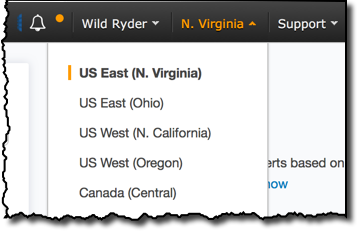

<!-- $theme: default -->

# 모듈 0: CodeStar 프로젝트

이 모듈에서는 [AWS CodeStar](https://aws.amazon.com/codestar/) 서비스를 사용하여 새로운 프로젝트를 생성할 것 입니다.

* [AWS CodeCommit](https://aws.amazon.com/codecommit/) 깃 저장소로 Node.js로 작성된 RESTful API가 사전에 저장되어 있습니다.
* [AWS CodeBuild](https://aws.amazon.com/codebuild/) 프로젝트를 빌드 합니다.
* [AWS CodePipeline](https://aws.amazon.com/codepipeline/) 지속적 통합 및 전달 파이프라인 입니다.

## CodeStar 개요

## 구현 지침

본 모듈은 여러 섹션으로 구성되어 있으며 매 섹션 시작에는 개괄적인 개요가 준비되어 있습니다. 섹션 마다 구현을 위한 자세한 내용은 단계별 지침안에서 확인 하실 수 있으십니다. 이미 AWS Management Console에 익숙하시거나 둘러보기를 거치지 않고 직접 서비스를 탐색하시려는 분들을 위해 구현을 완료하는 데 필요한 내용을 각 섹션의 개요에서 제공하고 있습니다.

최신 버젼의 크롬, 파이어폭스, 사파리 웹 브라우저를 사용하신다면 **단계별 지침**을 클릭하셔서 자세한 내용을 확인하시기 바랍니다.

### 0. AWS 리전 선택

이번 워크샵에서 다루는 전체 서비스는 아래와 같습니다.

* Amazon API Gateway
* Amazon DynamoDB
* Amazon S3
* AWS CodeBuild
* AWS CodePipeline
* AWS CodeStar
* AWS Lambda
* AWS X-Ray

본 워크샵에 필요한 모든 서비스를 지원하는 AWS 리전들은 N. Virginia, Ohio, N. California, Oregon, Ireland, Frankfurt, Singapore, Sydney 입니다. 자세한 서비스별 지원 리전을 확인하시려면 [AWS 리전 테이블](https://aws.amazon.com/about-aws/global-infrastructure/regional-product-services/)을 참조 하시기 바랍니다.

본 워크샵의 가이드는 한 리전에서 모든 서비스를 배포하는 것을 가정하고 작성되었습니다. 따라서 서비스를 배포하시기 전 다른 서비스들과 같은 리전에서 배포가 진행 되는지 AWS 콘솔 화면에서 확인하시기 바랍니다.

### 1. CodeStar 프로젝트 생성

AWS Console을 사용하여 Node.js Lambda Webservice 템플레이트를 바탕으로 `uni-api`의 이름으로 새로운 CodeStar 프로젝트를 생성합니다. HTTP client를 사용하여 CodeStar를 이용하여 생성한 API Gateway 종단이 정상적으로 동작하는지 확인합니다. 정상적으로 생성되었다면 `{"Output":"Hello World!"}` 응답을 보실수 있으십니다.

<strong>단계별 지침 (자세한 내용을 보려면 펼쳐주세요)</strong>

1. AWS Management 콘솔에서 **Services**를 선택한 다음 Developer Tools 섹션에서 **CodeStar** 를 선택하십시오.

1. 만약에 이전에 CodeStar 프로젝트를 사용하셨다면 4단계로 넘어가 주시기 바랍니다. 처음 CodeStar 프로젝트를 생성하시는 경우에는 아래와 같은 환영 메시지 화면을 보실수 있으십니다. **Start a project** 버튼을 클릭하여 다음 단계로 진행하시기 바랍니다.

    

1. 처음 CodeStar 프로젝트를 생성하시는 경우에는 아래 그림과 같은 화면을 보실 수 있으십니다. 확인 메시지의 내용은 CodeStar를 사용하는데 필요한 CodeCommit repositories, CodePipeline pipelines, CodeBuild와 같이 필요한 자원들을 AWS가 사용자를 대신해서 생성 할 수 있도록 CodeStar에게 역할 권한을 허락 하는 내용 입니다. **Yes, create role** 버튼을 클릭하여 다음 단계로 진행하시기 바랍니다.

    

1. 만약에 이전에 CodeStar 프로젝트를 사용하셨다면 프로젝트 목록를 보실 수 있으십니다. **Create a new project** 버튼을 클릭하여 다음 단계로 넘어시기 바랍니다.

    

1. 왼쪽 네비게이션에서 CodeStar 프로젝트 범위를  **Web service**, **Node.js**, **AWS Lambda**를 선택하시기 바랍니다. 정상적으로 선택을 하셨다면 프로젝트 템플레이트 선택 옵션이 **Express.js** AWS Lambda를 사용하는 웹서비스만을 보실 수 있으십니다. **Express.js**를 선택하여 다음 단계로 진행하시기 바랍니다.

    

1. **Project name**에 `uni-api`를 입력하시고 우측 하단의 **Create Project** 버튼을 클릭하여 다음 단계로 진행하시기 바랍니다.

    

1. **Display Name**에 이름을 입력하시고 **Email**을 확인하시기 바랍니다. 아래 그림에는 보여 지고는 있지 않습니다만 여러분의 IAM 사용자 계정 정보가 입력란에 보여야 합니다. 모두 작성하셨다면 우측 하단의 **Next** 버튼을 클릭하여 다음 단계로 진행하시기 바랍니다.

    

1. 다음 화면에서는 프로젝트 코드를 어떻게 수정할 것인지 문의하는 화면을 보실 수 있으십니다. 이 설정화면은 뒤의 섹션에서 다시 설정을 할 것입니다. 지금은 우측 하단의 **Skip** 버튼을 클릭하여 다음 단계로 진행하시기 바랍니다.

    

1. CodeStar 프로젝트 상황판에서 여러분의 프로젝트를 확인 하실 수 있으십니다. 새로운 프로젝트를 생성한 뒤에는 CodeStar가 프로젝트에 필요한 CodeCommit, CodeBuild, CodePipeline 및 추가로 선택한 템플레이트에 필요한 자원들을 생성하는데 약간의 시간이 소요됩니다. 우측 상단의 진행율 상태가 100%가 되면 프로젝트에 필요한 자원들의 생성이 완료되었음을 의미 합니다.

    

1. 프로젝트 생성후 처음으로 실행되는 CodePipeline은 자동적으로 실행 됩니다. 자원 생성이 완료가 되면 여러분이 실행을 하지 않더라도 자동적으로 CodePipeline을 실행합니다. CodePipeline은 아래와 같이 총 3 단계로 이루어져 있습니다.

1. Once provisioning is complete, there will be a brief delay as the CodePipeline pipeline executes for the first time.  The pipeline consists of three stages:

    * Source stage: 소스 코드가 CodeCommit 저장소로 부터 복사 됩니다.
    * Build stage: CodeBuild 프로젝트는 buildspec.yml 파일에 정의된 명령들을 수행하여 소스코드로 부터 배포가능한 컴파일된 결과물을 생성합니다. 이 실습의 경우 서버리스 어플리케이션 모델 (Serverless Application Model (SAM))이 생성 됩니다.
    * Deploy stage: CloudFormation을 사용하여 배포가능한 SAM 결과물이 해당 Lambda 함수 및 API Gateway 환경에 배포 됩니다.

    모든 단계가 완료되면 API Gateway **Application endpoint** 접근 가능한 종단이 상황판에 표시가 됩니다.

    

1. **Application endpoint** 를 열어 `{"Output":"Hello World!"}` 응답 메시지를 확인하시기 바랍니다.

    

1. 축하합니다. CodeStar를 사용하여 서버리스 웹 서비스 프로젝트를 성공적으로 생성하였습니다. 다음 섹션에서는 깃 클라이언트를 사용하여 여러분의 로컬 컴퓨터로 프로젝트를 복제 하도록 하겠습니다.

### 2. CodeCommit 깃 저장소 복제

CodeStar 프로젝트 상황판에서 `uni-api` 선택하시고 CodeCommit 가이드를 따라 깃 저장소를 여러분의 로컬 환경에 복제하시기 바랍니다.

<strong>단계별 지침 (자세한 내용을 보려면 펼쳐주세요)</strong>

1. CodeStar 프로젝트 상황판의 우측 상단의 **Connect Tools** 버튼을 클릭 하시기 바랍니다.

    
    만약에 이전에 CodeStar 프로젝트를 사용하셨다면  **Connect** 버튼이 좌측 하단 **Commit** 부분에도 있습니다.
    

1. **Visual Studio**, **Eclipse**, **Command line tools**을 이용하여 CodeCommit 저장소를 복제하는 가이드를 보실 수 있습니다. 운영체제별 **macOS**, **Windows**, **Linux** 및 **HTTPS**, **SSH**와 같은 접근 방식에 따른 가이드를 제공하고 있습니다. 이번 워크숍의 이후 모듈들에서는 `git` 명령어 및 `aws cli`를 사용하셔야 합니다. 여러분의 운영체제에 맞는 **Command line tools**를 설치하시길 권장 드립니다. AWS에서 제공하는 가이드를 따라서 깃 저장소를 여러분의 로컬 컴퓨터에 복제하시기 바랍니다.

    

1. 축하합니다. `uni-api` 프로젝트를 로컬 컴퓨터에 복제를 완료 하였습니다. 다음 모듈에서는 로컬에서 소스 코드 수정 및 커밋을 수행하고 프로젝트 깃 저장소에 푸쉬(변경 사항을 업로드)를 하여 자동으로 지속적 통합 및 전달 파이프라인을 실행 하도록 하겠습니다.

## 완료

축하합니다! 여러분의 CodeStar 프로젝트를 성공적으로 생성하셨습니다. 예제 REST API의 정상 동작을 확인 하셨고 로컬 컴퓨터에 프로젝트 깃 저장소를 복제 하였습니다. 다음 [서버리스 어플리케이션 모델(Serverless Application Model(SAM))](../1_ServerlessApplicationModel) 모듈에서는 서버리스 어플리케이션 모델(SAM)에 대해서 자세히 알아보고 API를 변경하기 위해서는 어떻게 해야 하는지 알아보도록 하겠습니다.
