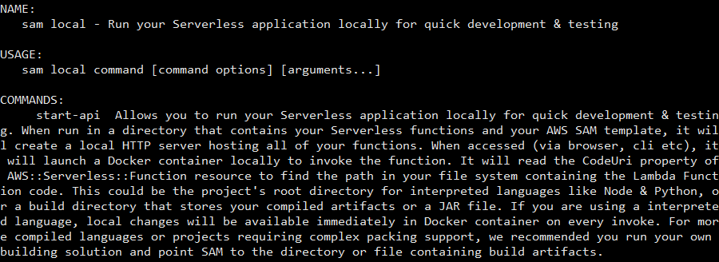
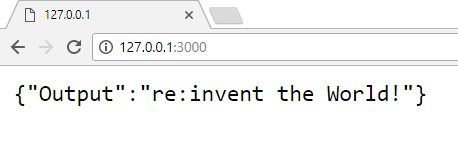

# Module 1: Serverless Application Model

In this module you'll learn about the [Serverless Application Model (SAM)](https://github.com/awslabs/serverless-application-model) and how you can use it to define a serverless RESTful API.  You will also use [SAM Local](http://docs.aws.amazon.com/lambda/latest/dg/test-sam-local.html) to locally develop and rapidly test an API.

#### SAM Local Installation

Later in this module you will be using SAM Local.  If you already have SAM Local installed, you can skip this section. SAM Local emulates AWS Lambda execution environment and requires Docker to run Linux Containers.  

<details>
<summary><strong>Amazon Linux (EC2) SAM Local Installation</strong></summary>

You can use EC2 instance with Amazon Linux to perform exercises in this section.  In this case, you will not be performing work locally on your laptop, instead you will connect remotely into an EC2 instance to perform editing and testing.  Here are the installation steps:

### Launch and Configure Amazon Linux EC2 Instance
1. Create a keypair, if you do not have one already
2. Launch an EC2 instance with:
  1. OS: Amazon Linux
  2. Public IP address
  3. Minimum size t2.micro
  4. Security Group allows SSH access from your laptop
3. Once launched, use SSH client such as Putty or Bitvise to connect to the instance (you can find instructions for connecting from Windows using Putty here: [Connecting to Your Linux Instance from Windows Using PuTTY](http://docs.aws.amazon.com/AWSEC2/latest/UserGuide/putty.html))
4. Execute the command line below to install prerequisites and SAM Local:

```bash

sudo yum install -y git docker & \

sudo service docker start & \

sudo chmod 666 /var/run/docker.sock & \

curl -o- https://raw.githubusercontent.com/creationix/nvm/v0.32.0/install.sh | bash & \

. ~/.nvm/nvm.sh & \

nvm install 6.11.4 & \

npm install -g aws-sam-local

```

Test by running sam local and you should see output with help text for sam local command:

```bash

sam local

```

output should looks similar to this: 



#### Setup Port Forwarding Configuration

SAM Local can start an HTTP server locally on EC2 instance on port 3000.  In order to view content on that HTTP server through the browser on your laptop, you need to configure port forwarding.

##### Port Forwarding with Putty on Windows

In your putty configuration, select **Connection** , **SSH** , **Tunnels** and add a mapping:

```

Source port: 3000

Destination: 127.0.0.1:3000

```

The configuration should look like this:


##### Port Forwarding with Bitvise SSH Client on Windows

In **Profile** window, select **C2S** tab, create an entry with this configuration:

```

Listen Interface: 127.0.0.1

List. Port: 3000

Destination Host: localhost

Dest. Port: 3000

```

C2S configuration should look similar to this:


</details>

<details>
<summary><strong>Windows SAM Local Installation</strong></summary>

*Note*: Security policies applied to your Windows configuration may interfere with installation of prerequisites for SAM Local.  For this workshop, you may find it easier to use SAM Local on an Amazon Linux EC2 instance (see instructions above).

If you intend to use Windows on your local machine, note that the key requirement is to run Docker Linux containers.  Depending on the local configuration of Windows, you may be able to install Docker Toolbox. SAM Local will use the DOCKER\_HOST environment variable to contact the docker daemon.

The procedure to setup requirements and SAM Local:

1. Install [Docker Toolbox](https://download.docker.com/win/stable/DockerToolbox.exe)
2. Run a few docker commands from CLI (e.g. 'docker ps') to verify the installation
3. Install [NodeJS](https://nodejs.org/dist/v6.11.4/node-v6.11.4-x64.msi)
4. Install [Git for Windows](https://git-scm.com/download/win) – test that you can use git from command line
5. Use NPM to install SAM Local

```bash

npm install -g aws-sam-local

```

Test by executing sam local, you should see help contents displayed.

```bash

sam local

```

output should looks similar to this: 


</details>

<details>
<summary><strong>Mac OS SAM Local Installation</strong></summary>

1. Install Docker
2. Install NodeJS
3. Use NPM to install SAM Local

```bash

npm install -g aws-sam-local

```

Test by executing sam local, you should see help contents displayed.

```bash

sam local

```

output should looks similar to this: 


</details>

## Architecture Overview

The architecture for the Unicorn API uses API Gateway to define an HTTP interface that trigger Lambda functions to read and write data to the DynamoDB database.


## Serverless Application Model (SAM) Overview

AWS SAM is a model used to define serverless applications on AWS.

AWS SAM is based on [AWS CloudFormation](https://aws.amazon.com/cloudformation/). A serverless application is defined in a [CloudFormation template](http://docs.aws.amazon.com/AWSCloudFormation/latest/UserGuide/gettingstarted.templatebasics.html) and deployed as a [CloudFormation stack](http://docs.aws.amazon.com/AWSCloudFormation/latest/UserGuide/updating.stacks.walkthrough.html). An AWS SAM template is a CloudFormation template.

AWS SAM defines a set of objects which can be included in a CloudFormation template to describe common components of serverless applications easily.  In order to include objects defined by AWS SAM within a CloudFormation template, the template must include a `Transform` section in the document root with a value of `AWS::Serverless-2016-10-31`.

The Unicorn API includes Amazon API Gateway HTTP endpoints that trigger AWS Lambda functions that read and write data to a Amazon DynamoDB database.  The SAM template for the Unicorn API describes a DynamoDB table with a hash key and Lambda functions to list, view and update Unicorns in the Wild Rydes stable.

The Unicorn API components are defined in the [app-sam.yaml](uni-api/app-sam.yaml) CloudFormation template.  Next we'll review the Unicorn API components in more detail.

### AWS::Serverless::SimpleTable

Below is the code snippet from the SAM template that describes the DynamoDB table resource.

```yaml
  Table:
    Type: 'AWS::Serverless::SimpleTable'
      Properties:
        PrimaryKey:
          Name: name
          Type: String
```

Unicorns are uniquely identified in the Wild Rydes stable by **name**, a single String attribute that is used as the primary key in the DynamoDB table.  The [AWS::Serverless::SimpleTable](https://github.com/awslabs/serverless-application-model/blob/master/versions/2016-10-31.md#awsserverlesssimpletable) resource meets this requirement and is used to define the DynamoDB table used by the API.  If a more complex configuration is required, you can substitute the SimpleTable with a [AWS::DynamoDB::Table](http://docs.aws.amazon.com/AWSCloudFormation/latest/UserGuide/aws-resource-dynamodb-table.html) resource definition.

### AWS::Serverless::Function

Below is the code snippet from a sample SAM template that describes the Lambda function that handles requests to view Unicorn data by Unicorn name.

```yaml
  ReadFunction:
    Type: 'AWS::Serverless::Function'
    Properties:
      FunctionName: 'uni-api-read'
      Runtime: nodejs6.10
      CodeUri: app
      Handler: read.lambda_handler
      Description: View Unicorn by name
      Timeout: 10
      Events:
        GET:
          Type: Api
          Properties:
            Path: /unicorns/{name}
            Method: get
      Environment:
        Variables:
          TABLE_NAME: !Ref Table
      Role:
        Fn::ImportValue:
          !Join ['-', [!Ref 'ProjectId', !Ref 'AWS::Region', 'LambdaTrustRole']]
```

There are several [properties](https://github.com/awslabs/serverless-application-model/blob/master/versions/2016-10-31.md#properties) defined for the [AWS::Serverless::Function](https://github.com/awslabs/serverless-application-model/blob/master/versions/2016-10-31.md#awsserverlessfunction) resource, which we'll review in turn.

#### FunctionName

The **FunctionName** property defines a custom name for the Lambda function.  If not specified, CloudFormation will generate a name using the CloudFormation Stack name, CloudFormation Resource name, and random ID.

#### Runtime

The example API shown above is implemented in **Node.js 6.10**.  Additional runtimes are available for AWS Lambda.  Please refer to the [Lambda Execution Environment and Available Libraries](http://docs.aws.amazon.com/lambda/latest/dg/current-supported-versions.html) for the complete list.

#### CodeUri

The **CodeUri** property defines the location to the function code on your workstation relative to the SAM template.  In this example, "**app**" is used for the property value because the function code is in the `app` directory relative to the SAM template.

#### Handler

The **Handler** property defines the entry point for the Lambda function.  For Javascript, This is formatted as "**file**.**function**", where **file** is the Javascript filename without the ".js" extension relative to the **CodeUri** path defined above and **function** is the name of the function in the file that will be executed with the Lambda function is invoked.

#### Events

The **Events** property defines the sources that trigger the Lambda function invocation.  An [Api](https://github.com/awslabs/serverless-application-model/blob/master/versions/2016-10-31.md#api) event source is defined to integrate the Lambda function with an API Gateway endpoint, however SAM supports Lamdba function triggers from a variety of [sources](https://github.com/awslabs/serverless-application-model/blob/master/versions/2016-10-31.md#event-source-types).

The **Api** event source to view details of a Unicorn is defined at the RESTful resource `/unicorns/{name}` accessed using the HTTP GET method.  SAM will transform the Api event to an API Gateway resource and map the **name** value in the URL to a [pathParameter](http://docs.aws.amazon.com/apigateway/latest/developerguide/getting-started-mappings.html) in the event used to invoke the Lambda function.

#### Environment

The [Environment](http://docs.aws.amazon.com/lambda/latest/dg/env_variables.html) property defines a list of variables and values that will be accessible in the Lambda function, according to the access method defined by the Runtime.

The Lambda functions communicate with DynamoDB to read and write data.  The DynamoDB table created by the CloudFormation Stack is referenced as the value for the `TABLE_NAME` environment variable, which can be referenced within the Lambda function.

#### Role

The **Role** property defines the IAM Role that specifies the access permissions to AWS resources in the [Lambda execution policy](http://docs.aws.amazon.com/lambda/latest/dg/intro-permission-model.html#lambda-intro-execution-role).  For each project, CodeStar generates a Lambda execution role that has access to a default set of AWS resources.  This role can be modified with additional policies.

## Implementation Instructions

Each of the following sections provide an implementation overview and detailed, step-by-step instructions. The overview should provide enough context for you to complete the implementation if you're already familiar with the AWS Management Console or you want to explore the services yourself without following a walkthrough.

If you're using the latest version of the Chrome, Firefox, or Safari web browsers the step-by-step instructions won't be visible until you expand the section.

### Region Selection

This workshop can be deployed in any AWS region that supports the following services:

- Amazon API Gateway
- Amazon S3
- Amazon DynamoDB
- AWS CodeBuild
- AWS CodePipeline
- AWS Lambda
- AWS X-Ray

You can refer to the [region table](https://aws.amazon.com/about-aws/global-infrastructure/regional-product-services/) in the AWS documentation to see which regions have the supported services. Among the supported regions you can choose are N. Virginia, Ohio, N. California, Oregon, Ireland, Frankfurt, and Sydney.

Once you've chosen a region, you should deploy all of the resources for this workshop there. Make sure you select your region from the dropdown in the upper right corner of the AWS Console before getting started.


### Clone Repository

You can skip this section if you have successfully cloned uni-api repo in Module 0 **and** you are using your local machine (not remote EC2 instance).  

<details>
<summary><strong>Cloning Code Repository to Local Disk</strong></summary>
If you are using remote EC2 instance or if you have not cloned the uni-api repository as instructed in Module 0, then follow these steps to clone uni-api repo:

1. In **AWS Console** , navigate to **CodeStar** service
2. Select **uni-api** project
3. Click on **Project** , then Connect tools
4. Select Command line tools and click Next
5. Select your Operating System and use HTTPS for Connection Method
6. Follow the instructions shown in the console

As a result, you should have uni-api code repository cloned to local directory.  Listing the directory should show you files stored in the repository:

```bash

$ ls  uni-api/

app.js  buildspec.yml  index.js  package.json  README.md  template.yml

```

After synchronizing the code to local machine, you are now ready to test local code development with SAM Local.
</details>


## SAM Local Development

Based on AWS SAM, SAM Local is an AWS CLI tool that provides an environment for you to develop, test, and analyze your serverless applications locally before uploading them to the Lambda runtime. You can use SAM Local to create a local testing environment that simulates the AWS runtime environment. Working with SAM Local also allows faster, iterative development of your Lambda function code because there is no need to redeploy your application package to the AWS Lambda runtime. 

## SAM Local Web Service Development

You will now use SAM Local to make modifications to a web service.  Since it executes locally, you are able to make quick changes and immediately test the web service.  Note that this step requires that you have cloned uni-api project from CodeCommit to your disk.  SAM Local commands will parse template and code in those files to emulate a local Lambda environment.

<details>
<summary><strong>Step-by-Step Instructions</strong></summary>

You will use start-api option wich creates a local HTTP server hosting all of your Lambda functions.  SAM Local will parse the SAM template file, in this case template.yml file.  

```yaml

  HelloWorld:
    Type: AWS::Serverless::Function
    Properties:
      Handler: index.handler
      Runtime: nodejs4.3
      Role:
        Fn::ImportValue:
          !Join ['-', [!Ref 'ProjectId', !Ref 'AWS::Region', 'LambdaTrustRole']]
      Events:
        GetEvent:
          Type: Api
          Properties:
            Path: /
            Method: get
        PostEvent:
          Type: Api
          Properties:
            Path: /
            Method: post

```

SAM Local will launch the Lambda function defined in **AWS::Serverless::Function** section.  You will be able to interact with the function using your browser.  After you make changes to the code, those will be immediately visible in your browser.

In command prompt, execute SAM Local start-api in the directory containing local copy of the code:

```bash

cd /home/ec2-user/uni-api/

npm install

sam local start-api

```

**Note:** adjust the path to match location of the uni-api repo on your disk.

SAM Local downloads the container image and starts its execution using local Docker service.  In addition, local HTTP server launches at [http://127.0.0.1:3000](http://127.0.0.1:3000).  


Open the browser on your local machine and view the output:


Now, make a modification to the app.  Edit **app.js** file in any text editor and find this section that responds to GET requests:

```javascript

app.get('/', function(req, res) {

  res.send({

    'Output': 'Hello World!';

  });

});

```

Modify the message **'Hello World!'** to **'re:invent the World!'** and save the file.  Refresh the browser and you will immediately see the updated message.



That's it!  You modified the code and got immediate feedback in your browser.  
</details>

To learn more about development with SAM Local, check out [AWS Documentation](http://docs.aws.amazon.com/lambda/latest/dg/test-sam-local.html) and SAM Local [GitHub repository](https://github.com/awslabs/aws-sam-local).  


## Completion

Congratulations!  You have successfully performed local development and testing of a RESTful serverless API using the Serverless Application Model.  Using SAM Local will help you to iterate code changes quickly while getting instant feedback. In the next [Continuous Delivery Pipeline Module](../2_ContinuousDeliveryPipeline), you will learn how to setup deployment of that API into AWS and to automate this deployment process using AWS CodePipeline and AWS CodeBuild.
