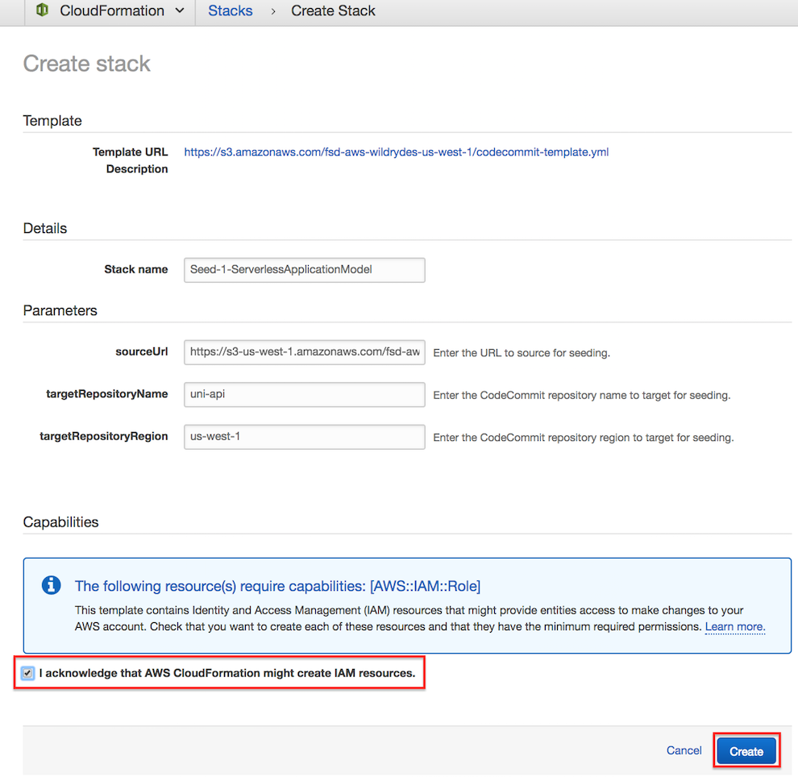
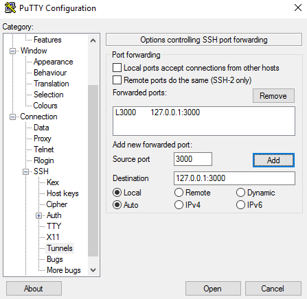
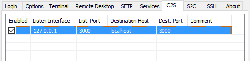
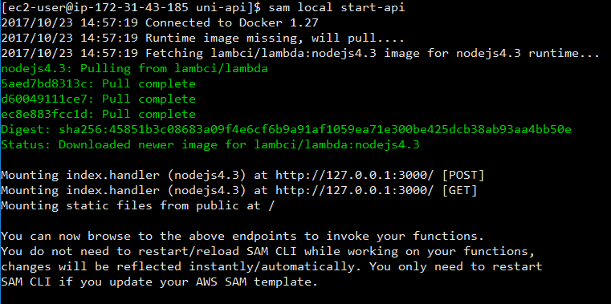
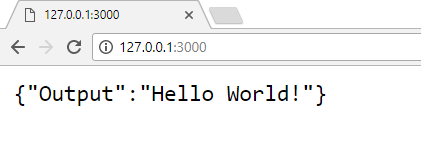
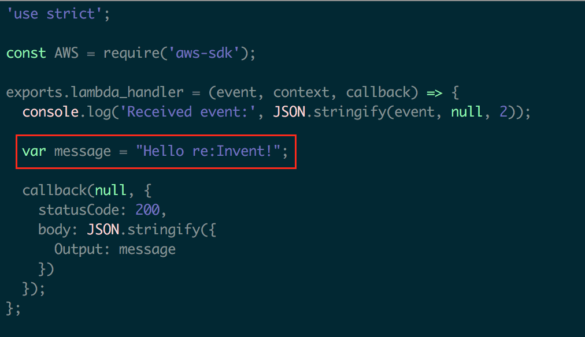
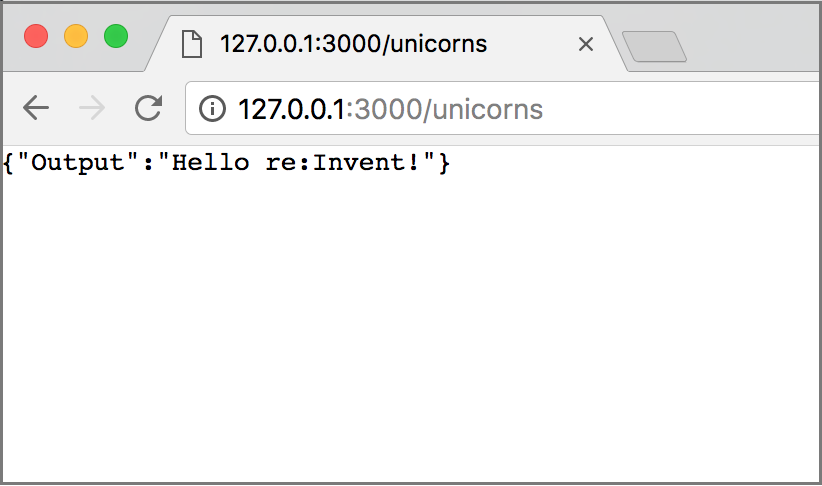

# Module 1: Serverless Application Model

In this module you'll learn about the [Serverless Application Model (SAM)](https://github.com/awslabs/serverless-application-model) and how you can use it to define a serverless RESTful API.  You will also use [SAM Local](http://docs.aws.amazon.com/lambda/latest/dg/test-sam-local.html) to locally develop and rapidly test an API.


## Serverless Application Model (SAM) Overview

AWS SAM is a model used to define serverless applications on AWS.

Serverless applications are applications composed of functions triggered by events. A typical serverless application consists of one or more AWS Lambda functions triggered by events such as object uploads to Amazon S3, Amazon SNS notifications, and API actions. Those functions can stand alone or leverage other resources such as Amazon DynamoDB tables or S3 buckets. The most basic serverless application is simply a function.

AWS SAM is based on [AWS CloudFormation](https://aws.amazon.com/cloudformation/). A serverless application is defined in a [CloudFormation template](http://docs.aws.amazon.com/AWSCloudFormation/latest/UserGuide/gettingstarted.templatebasics.html) and deployed as a [CloudFormation stack](http://docs.aws.amazon.com/AWSCloudFormation/latest/UserGuide/updating.stacks.walkthrough.html). An AWS SAM template is a CloudFormation template.

AWS SAM defines a set of resources that describe common components of serverless applications.  In order to include objects defined by AWS SAM within a CloudFormation template, the template must include a `Transform` section in the document root with a value of `AWS::Serverless-2016-10-31`.

The Unicorn API includes Amazon API Gateway HTTP endpoints that trigger AWS Lambda functions that read and write data to an Amazon DynamoDB database.  The SAM template for the Unicorn API describes a DynamoDB table with a hash key and Lambda functions to list, view and update Unicorns in the Wild Rydes stable.

In this module, you will be working with a Lambda function that simply displays a welcome message.  The Unicorn API components are defined in the [template.yml](uni-api/template.yml) SAM template.  Next we'll review the Lambda function component in more detail.


### AWS::Serverless::Function

Below is a code snippet from the SAM template to list Unicorns:

```yaml
  ListFunction:
    Type: 'AWS::Serverless::Function'
    Properties:
      FunctionName: 'uni-api-list'
      Runtime: nodejs6.10
      CodeUri: app
      Handler: list.lambda_handler
      Description: List Unicorns
      Timeout: 10
      Events:
        GET:
          Type: Api
          Properties:
            Path: /unicorns
            Method: get
      Role:
        Fn::ImportValue:
          !Join ['-', [!Ref 'ProjectId', !Ref 'AWS::Region', 'LambdaTrustRole']]
```

There are several [properties](https://github.com/awslabs/serverless-application-model/blob/master/versions/2016-10-31.md#properties) defined for the [AWS::Serverless::Function](https://github.com/awslabs/serverless-application-model/blob/master/versions/2016-10-31.md#awsserverlessfunction) resource, which we'll review in turn.

#### FunctionName

The **FunctionName** property defines a custom name for the Lambda function.  If not specified, CloudFormation will generate a name using the CloudFormation Stack name, CloudFormation Resource name, and random ID.

#### Runtime

The example API shown above is implemented in **Node.js 6.10**.  Additional runtimes are available for AWS Lambda.  Please refer to the [Lambda Execution Environment and Available Libraries](http://docs.aws.amazon.com/lambda/latest/dg/current-supported-versions.html) for the complete list.

#### CodeUri

The **CodeUri** property defines the location to the function code on your workstation relative to the SAM template.  In this example, "**app**" is used for the property value because the function code is in the `app` directory relative to the SAM template.

#### Handler

The **Handler** property defines the entry point for the Lambda function.  For Javascript, This is formatted as "**file**.**function**", where **file** is the Javascript filename without the ".js" extension relative to the **CodeUri** path defined above and **function** is the name of the function in the file that will be executed with the Lambda function is invoked.

#### Events

The **Events** property defines the sources that trigger the Lambda function invocation.  An [Api](https://github.com/awslabs/serverless-application-model/blob/master/versions/2016-10-31.md#api) event source is defined to integrate the Lambda function with an API Gateway endpoint, however SAM supports Lamdba function triggers from a variety of [sources](https://github.com/awslabs/serverless-application-model/blob/master/versions/2016-10-31.md#event-source-types).

The **Api** event source to view details of a Unicorn is defined at the RESTful resource `/unicorns/{name}` accessed using the HTTP GET method.  SAM will transform the Api event to an API Gateway resource and map the **name** value in the URL to a [pathParameter](http://docs.aws.amazon.com/apigateway/latest/developerguide/getting-started-mappings.html) in the event used to invoke the Lambda function.

#### Role

The **Role** property defines the IAM Role that specifies the access permissions to AWS resources in the [Lambda execution policy](http://docs.aws.amazon.com/lambda/latest/dg/intro-permission-model.html#lambda-intro-execution-role).  For each project, CodeStar generates a Lambda execution role that has access to a default set of AWS resources.  This role can be modified with additional policies.

## Environment Setup

Each of the following sections provide an implementation overview and detailed, step-by-step instructions. The overview should provide enough context for you to complete the implementation if you're already familiar with the AWS Management Console or you want to explore the services yourself without following a walkthrough.

If you're using the latest version of the Chrome, Firefox, or Safari web browsers the step-by-step instructions won't be visible until you expand the section.


### 1. Seed the `uni-api` CodeCommit Git repository

1. Each module has corresponding source code used to seed the CodeCommit Git repository for the CodeStart project.  To seed the CodeCommit Git repository, click on the **Launch Stack** button for your region below:

    Region| Launch
    ------|-----
    EU (Ireland) | [](https://console.aws.amazon.com/cloudformation/home?region=eu-west-1#/stacks/create/review?stackName=Seed-1-ServerlessApplicationModel&templateURL=https://s3.amazonaws.com/fsd-aws-wildrydes-eu-west-1/codecommit-template.yml&param_sourceUrl=https://s3-eu-west-1.amazonaws.com/fsd-aws-wildrydes-eu-west-1/uni-api-1-v2.zip&param_targetRepositoryName=uni-api&param_targetRepositoryRegion=eu-west-1)
    Asia Pacific (Sydney) | [](https://console.aws.amazon.com/cloudformation/home?region=ap-southeast-2#/stacks/create/review?stackName=Seed-1-ServerlessApplicationModel&templateURL=https://s3.amazonaws.com/fsd-aws-wildrydes-ap-southeast-2/codecommit-template.yml&param_sourceUrl=https://s3-ap-southeast-2.amazonaws.com/fsd-aws-wildrydes-ap-southeast-2/uni-api-1-v2.zip&param_targetRepositoryName=uni-api&param_targetRepositoryRegion=ap-southeast-2)


1. The CloudFormation template has been prepopulated with the necessary fields for this module.  No changes are necessary

1. Select the **I acknowledge that AWS CloudFormation might create IAM resources.** checkbox to grant CloudFormation permission to create IAM resources on your behalf

1. Click the **Create** button in the lower right corner of the browser window to create the CloudFormation stack and seed the CodeCommit repository.

    

1. There will be a short delay as the Git repository seeded with the new source code.  Upon successful completion, the CloudFormation will show Status ``CREATE_COMPLETE``.

    

### 2. Fetch CodeCommit Git Repository

Now that the CodeCommit Git repository has been seeded with new source code, you will need to fetch the changes locally so that you may modify the code.  Typically, this is accomplished using the `git pull` command, however for the workshop we have replaced the repository with a new history and different Git commands will be used.

Using your preferred Git client, run the commands on your local `uni-api` Git repository:

```bash
git fetch --all
git reset --hard origin/master
```


## SAM Local

[SAM Local](http://docs.aws.amazon.com/lambda/latest/dg/test-sam-local.html) is the AWS CLI tool for managing Serverless applications written with [Serverless Application Model (SAM)](https://github.com/awslabs/serverless-application-model).  SAM Local can be used to test functions locally, start a local API Gateway from a SAM template, validate a SAM template, and generate sample payloads for various event sources.  

### Installation

To complete this module, you will need to install SAM Local.  If you already have SAM Local installed, you can skip this section.

#### Prerequisites

Running Serverless projects and functions locally with SAM Local requires Docker to be installed and running. SAM Local will use the `DOCKER_HOST` environment variable to contact the docker daemon.

 - macOS: [Docker for Mac](https://store.docker.com/editions/community/docker-ce-desktop-mac)
 - Windows: [Docker Toolbox](https://download.docker.com/win/stable/DockerToolbox.exe)
 - Linux: Check your distro's package manager (e.g. yum install docker)

For macOS and Windows users: SAM local requires that the project directory (or any parent directory) is listed in Docker file sharing options.

Verify that docker is working, and that you can run docker commands from the CLI (e.g. `docker ps`). You do not need to install/fetch/pull any containers - SAM Local will do it automatically as required.


#### Windows, Linux, macOS with NPM [Recommended]

The easiest way to install **`sam`** is to use [NPM](https://www.npmjs.com).

```bash
npm install -g aws-sam-local
```

Verify the installation worked:
```bash
sam --version
```

If you get a permission error when using npm (such as `EACCES: permission denied`), please see the instructions on this page of the NPM documentation: [https://docs.npmjs.com/getting-started/fixing-npm-permissions](https://docs.npmjs.com/getting-started/fixing-npm-permissions).

#### Binary release

We also release the CLI as binaries that you can download and instantly use. You can find them under [Releases](https://github.com/awslabs/aws-sam-local/releases) in the SAM Local repo.


#### Alternative Installation: Amazon Linux (EC2)

If you're unable to install SAM Local on your workstation, you may find it easier to use SAM Local on an Amazon Linux EC2 instance.   In this case, you will not be performing work locally on your laptop, instead you will connect remotely into an EC2 instance to perform editing and testing.

<details>
<summary><strong>Amazon Linux (EC2) SAM Local Installation</strong></summary>
<p>

###### Launch and Configure Amazon Linux EC2 Instance

1. [Create a keypair](http://docs.aws.amazon.com/AWSEC2/latest/UserGuide/ec2-key-pairs.html), if you do not have one already.

1. To launch an EC2 instance with the required dependencies, click on the **Launch Stack** button for your region below.  You will need to select the keypair that you created in the previous step, as well as a VPC and Subnet for your EC2 instance:

    Region| Launch
    ------|-----
    EU (Ireland) | [](https://console.aws.amazon.com/cloudformation/home?region=eu-west-1#/stacks/create/review?stackName=DeveloperInstance&templateURL=https://s3.amazonaws.com/fsd-aws-wildrydes-eu-west-1/developer-instance.yml)
    Asia Pacific (Sydney) | [](https://console.aws.amazon.com/cloudformation/home?region=ap-southeast-2#/stacks/create/review?stackName=DeveloperInstance&templateURL=https://s3.amazonaws.com/fsd-aws-wildrydes-ap-southeast-2/developer-instance.yml)

1. Once the CloudFormation stack creation has completed, find the EC2 instance public DNS name by selecting the checkbox to the left of the **DeveloperInstance** Stack, and clicking the **Outputs** tab below the list of Stacks.  Find the output key labeled `PublicDnsName` and use the corresponding value in order to access the EC2 instance.
 
1. Use SSH client to connect to the instance.  If you are using Windows, use a client such as Putty or Bitvise (you can find instructions for connecting from Windows using Putty here: [Connecting to Your Linux Instance from Windows Using PuTTY](http://docs.aws.amazon.com/AWSEC2/latest/UserGuide/putty.html))

1. The Git repository has been cloned to the home directory on launch, `/home/ec2-user/uni-api`.

###### Setup Port Forwarding Configuration

SAM Local can start an HTTP server locally on EC2 instance on port 3000.  In order to view content on that HTTP server through the browser on your laptop, you need to configure port forwarding.

###### Port Forwarding on MacOS

On your workstation, open a new terminal and run the following command.  In the command, replace ***~/mykeypair.pem*** with the location and file name of your .pem file and replace ***ec2-###-##-##-###.compute-1.amazonaws.com*** with the public DNS name of your EC2 developer instance:

   ```
   ssh -i ~/mykeypair.pem -N -L 3000:ec2-###-##-##-###.compute-1.amazonaws.com:3000 ec2-user@ec2-###-##-##-###.compute-1.amazonaws.com
   ```

###### Port Forwarding with Putty on Windows

1. In your putty configuration, select **Connection** , **SSH** , **Tunnels** and add a mapping:

   ```
   Source port: 3000
   
   Destination: 127.0.0.1:3000
   ```

   The configuration should look like this:

   


###### Port Forwarding with Bitvise SSH Client on Windows

1. In **Profile** window, select **C2S** tab, create an entry with this configuration:

   ```
   Listen Interface: 127.0.0.1
   
   List. Port: 3000
   
   Destination Host: localhost
   
   Dest. Port: 3000
   ```

   C2S configuration should look similar to this:

   

</details>


## SAM Local Development

In this section, you will use SAM Local on your workstation to run the Unicorn API and test changes to it without having to deploy to AWS.

### Run API Gateway locally

1. From the **`uni-api`** directory, run the following command:

   ```bash
   sam local start-api
   ```
   
   If port forwarding from an EC2 developer instance, run the following command:

   ```bash
   sam local start-api --host 0.0.0.0
   ```

   This will spawn a local API Gateway to test HTTP request/response functionality. Features hot-reloading to allow you to quickly develop, and iterate over your functions.  **`sam`** will automatically find any functions within your SAM template that have `Api` event sources defined, and mount them at the defined HTTP paths.

   If this is your first time running SAM Local, there will be a delay as the Docker images are downloaded.  Once successful, you should see output similar to the screenshot below:

   

1. Open a browser and enter `http://127.0.0.1:3000/unicorns` in the address bar.  Confirm that you see the output below:

   

Congratulations!  You have successfully used SAM Local to start a local development environment.  Keep the window open that is running the `sam local start-api` command until this module is complete.

Next, let's look at how you can use SAM Local to test changes to your API.

### Test code changes locally

**Goal**: Update `app/list.js` to change the welcome message to `Hello re:Invent!`.  Remember, the local API Gateway supports hot-reloading of code changes.  There is no need to restart the `sam local start-api` process to see changes.

<details>
<summary><strong>
HOW TO update code and verify results (expand for details)
</strong></summary>

1. Open `app/list.js` in a text editor, update the message to read `Hello re:Invent!`, and save the changes.

   

1. Refresh the browser and confirm that you see the output below:

   
</details>
<p>

Congratulations!  You've successfully test changes to a Lambda function in a local development environment.  You may now kill the SAM Local running process.

To learn more about development with SAM Local, check out [AWS Documentation](http://docs.aws.amazon.com/lambda/latest/dg/test-sam-local.html) and SAM Local [GitHub repository](https://github.com/awslabs/aws-sam-local).  

## Completion

You have successfully performed local development and testing of a RESTful serverless API using the Serverless Application Model.  Please close the window running the `sam local start-api` command before preceding to the next module.

In the next [Continuous Delivery Pipeline Module](../2_ContinuousDeliveryPipeline), you will learn how to setup deployment of that API into AWS and to automate this deployment process using AWS CodePipeline and AWS CodeBuild.
