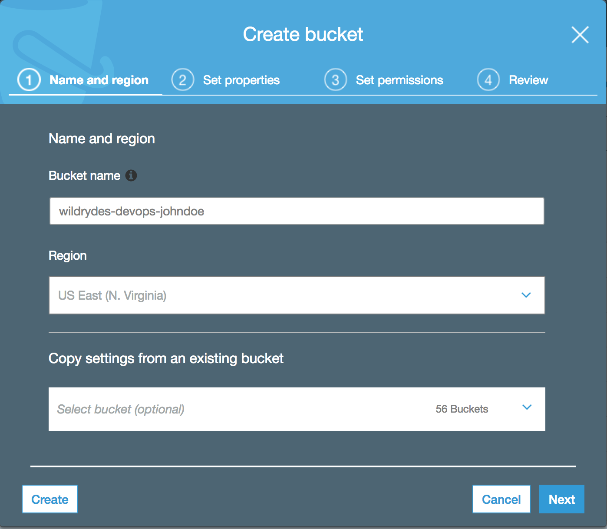
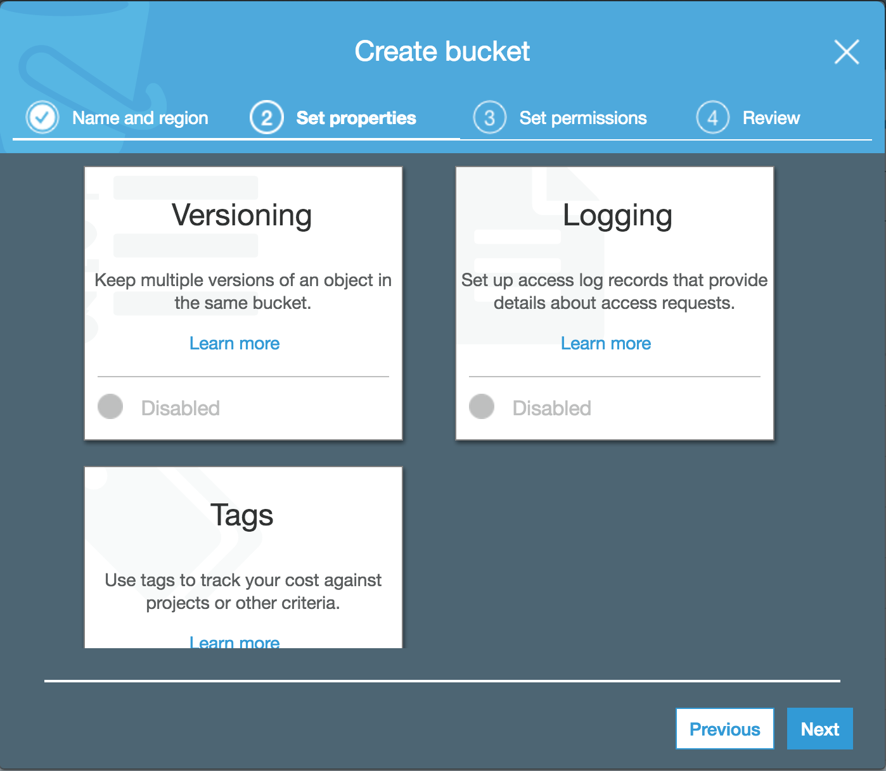
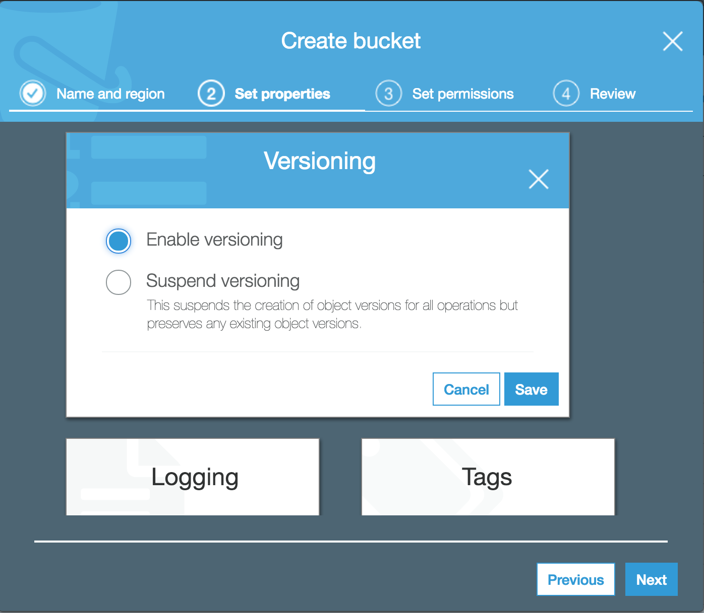
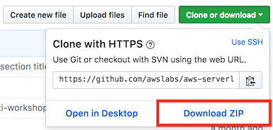

# Module 1: Serverless Application Model

In this module you'll use the [Serverless Application Model (SAM)](https://github.com/awslabs/serverless-application-model) to define a serverless RESTful API that has functionality to list, create, view, update, and delete the unicorns in the Wild Rydes stable.

## Architecture Overview

The architecture for the Unicorn API uses API Gateway to define an HTTP interface that trigger Lambda functions to read and write data to the DynamoDB database.


## Serverless Application Model (SAM) Overview

AWS SAM is a model used to define serverless applications on AWS.

AWS SAM is based on [AWS CloudFormation](https://aws.amazon.com/cloudformation/). A serverless application is defined in a [CloudFormation template](http://docs.aws.amazon.com/AWSCloudFormation/latest/UserGuide/gettingstarted.templatebasics.html) and deployed as a [CloudFormation stack](http://docs.aws.amazon.com/AWSCloudFormation/latest/UserGuide/updating.stacks.walkthrough.html). An AWS SAM template is a CloudFormation template.

AWS SAM defines a set of objects which can be included in a CloudFormation template to describe common components of serverless applications easily.  In order to include objects defined by AWS SAM within a CloudFormation template, the template must include a `Transform` section in the document root with a value of `AWS::Serverless-2016-10-31`.

The Unicorn API includes Amazon API Gateway HTTP endpoints that trigger AWS Lambda functions that read and write data to a Amazon DynamoDB database.  The SAM template for the Unicorn API describes a DynamoDB table with a hash key and Lambda functions to list, view and update Unicorns in the Wild Rydes stable.

The Unicorn API components are defined in the [app-sam.yaml](unicorn-api/app-sam.yaml) CloudFormation template.  Next we'll review the Unicorn API components in more detail.

### AWS::Serverless::SimpleTable

Below is the code snippet from the SAM template that describes the DynamoDB table resource.

```yaml
  DynamodbTable:
    Type: 'AWS::Serverless::SimpleTable'
      Properties:
        PrimaryKey:
          Name: name
          Type: String
```

Unicorns are uniquely identified in the Wild Rydes stable by **name**, a single String attribute that is used as the primary key in the DynamoDB table.  The [AWS::Serverless::SimpleTable](https://github.com/awslabs/serverless-application-model/blob/master/versions/2016-10-31.md#awsserverlesssimpletable) resource meets this requirement and is used to define the DynamoDB table used by the API.  If a more complex configuration is required, you can substitute the SimpleTable with a [AWS::DynamoDB::Table](http://docs.aws.amazon.com/AWSCloudFormation/latest/UserGuide/aws-resource-dynamodb-table.html) resource definition.

### AWS::Serverless::Function

Below is the code snippet from the SAM template that describes the Lambda function that handles requests to view Unicorn data by Unicorn name.

```yaml
  ReadFunction:
    Type: 'AWS::Serverless::Function'
    Properties:
      Runtime: nodejs6.10
      CodeUri: app
      Handler: read.lambda_handler
      Description: View Unicorn by name
      Events:
        ReadApi:
          Type: Api
          Properties:
            Path: /unicorns/{name}
            Method: get
      Environment:
        Variables:
          TABLE_NAME: !Ref DynamodbTable
      Policies:
        - Version: '2012-10-17'
          Statement:
            - Effect: Allow
              Resource: !Sub 'arn:aws:dynamodb:${AWS::Region}:${AWS::AccountId}:table/${DynamodbTable}'
              Action:
                - 'dynamodb:GetItem'
```

There are several [properties](https://github.com/awslabs/serverless-application-model/blob/master/versions/2016-10-31.md#properties) defined for the [AWS::Serverless::Function](https://github.com/awslabs/serverless-application-model/blob/master/versions/2016-10-31.md#awsserverlessfunction) resource, which we'll review in turn.

#### Runtime

The Unicorn API is implemented in **Node.js 6.10**.  Additional runtimes are available for AWS Lambda.  Please refer to the [Lambda Execution Environment and Available Libraries](http://docs.aws.amazon.com/lambda/latest/dg/current-supported-versions.html) for the complete list.

#### CodeUri

The **CodeUri** property defines the location to the function code on your workstation relative to the SAM template.  In this example, "**app**" is used for the property value because the function code is in the `app` directory relative to the SAM template.

#### Handler

The **Handler** property defines the entry point for the Lambda function.  For Javascript, This is formatted as "**file**.**function**", where **file** is the Javascript filename without the ".js" extension relative to the **CodeUri** path defined above and **function** is the name of the function in the file that will be executed with the Lambda function is invoked.

#### Events

The **Events** property defines the sources that trigger the Lambda function invocation.  An [Api](https://github.com/awslabs/serverless-application-model/blob/master/versions/2016-10-31.md#api) event source is defined to integrate the Lambda function with an API Gateway endpoint, however SAM supports Lamdba function triggers from a variety of [sources](https://github.com/awslabs/serverless-application-model/blob/master/versions/2016-10-31.md#event-source-types).

The **Api** event source to view details of a Unicorn is defined at the RESTful resource `/unicorns/{name}` accessed using the HTTP GET method.  SAM will transform the Api event to an API Gateway resource and map the **name** value in the URL to a [pathParameter](http://docs.aws.amazon.com/apigateway/latest/developerguide/getting-started-mappings.html) in the event used to invoke the Lambda function.

#### Environment

The [Environment](http://docs.aws.amazon.com/lambda/latest/dg/env_variables.html) property defines a list of variables and values that will be accessible in the Lambda function, according to the access method defined by the Runtime.

The Lambda functions communicate with DynamoDB to read and write data.  The DynamoDB table created by the CloudFormation Stack is referenced as the value for the `TABLE_NAME` environment variable, which can be referenced within the Lambda function.

#### Policies

The **Policies** property defines the access permissions to AWS resources in the [Lambda execution policy](http://docs.aws.amazon.com/lambda/latest/dg/intro-permission-model.html#lambda-intro-execution-role).  For each Unicorn API resource, an IAM policy s defined that describes only the actions required for that Lambda function when communicating with the DynamoDB table.  In this way, our application follows the IAM best practice of granting [*least privilege*](http://docs.aws.amazon.com/IAM/latest/UserGuide/best-practices.html#grant-least-privilege).

For the Unicorn API that views the details of a Unicorn, the Lambda function need only use the [GetItem](http://docs.aws.amazon.com/amazondynamodb/latest/APIReference/API_GetItem.html) method to find the Unicorn by its name, the primary key on the table.

Alternatively, the AWS::Serverless::Function **Role** property can be used to refer to an IAM Role that contains the list of IAM Policies that define the access permissions required by the Lambda execution policy.

Take a minute to review the SAM definitions in the app-sam.yaml file for the other API methods.  Note their simularities and differences.

Next, we'll look at how CloudFormation is used to deploy the SAM Unicorn API.

## Implementation Instructions

Each of the following sections provide an implementation overview and detailed, step-by-step instructions. The overview should provide enough context for you to complete the implementation if you're already familiar with the AWS Management Console or you want to explore the services yourself without following a walkthrough.

If you're using the latest version of the Chrome, Firefox, or Safari web browsers the step-by-step instructions won't be visible until you expand the section.

### Region Selection

This workshop can be deployed in any AWS region that supports the following services:

- Amazon API Gateway
- Amazon S3
- Amazon DynamoDB
- AWS CodeBuild
- AWS CodePipeline
- AWS Lambda
- AWS X-Ray

You can refer to the [region table](https://aws.amazon.com/about-aws/global-infrastructure/regional-product-services/) in the AWS documentation to see which regions have the supported services. Among the supported regions you can choose are N. Virginia, Ohio, Oregon, Ireland, Frankfurt, and Sydney.

Once you've chosen a region, you should deploy all of the resources for this workshop there. Make sure you select your region from the dropdown in the upper right corner of the AWS Console before getting started.


### 1. Create an S3 Bucket

Use the console or AWS CLI to create an Amazon S3 bucket with versioning enabled. Keep in mind that your bucket's name must be globally unique. We recommend using a name like `wildrydes-devops-yourname`.

<details>
<summary><strong>Step-by-step instructions (expand for details)</strong></summary><p>

1. In the AWS Management Console choose **Services** then select **S3** under Storage.

1. Choose **+Create Bucket**

1. Provide a globally unique name for your bucket such as `wildrydes-devops-yourname`.

1. Select the Region you've chosen to use for this workshop from the dropdown.

   

1. Choose **Next** in the lower right of the dialog.

1. Choose the **Versioning** properties box.

   

1. Choose **Enable versioning** and click **Save** in the dialog box.

   

1. Choose **Next** in the lower right of the dialog.

   

1. Choose **Next** in the lower right of the dialog.

1. Choose **Create Bucket** in the lower right of the dialog.

</p></details>

### 2. Clone or Download GitHub Repository

This workshop requires you to modify text files on your workstation and to package the application project for deployment.  To obtain a local copy, you will need to clone or download this GitHub Repository.

1.  In your web browser, open the following link to the [Wild Rydes Serverless Workshop](https://github.com/awslabs/aws-serverless-workshops).

#### 2a. Clone the GitHub Repository

1.  If you choose, follow the GitHub instructions to clone the repository to a directory on your workstation: [Cloning a Repository](https://help.github.com/articles/cloning-a-repository/)

#### 2b. Download the GitHub Repository

1.  If you are unfamiliar with git, you can also download the repository as a zip file.  The screenshot below illustrates where to click to download the zip file.

   

1. Once downloaded to your workstation, you will need expand the `aws-serverless-workshops-master.zip` file into a directory called `aws-serverless-workshops-master` that you will use to edit and package the application code.

### 2. Package the Unicorn API for Deployment

On your workstation:

1. Change directory to `aws-serverless-workshops-master/DevOps/1_ServerlessApplicationModel/unicorn-api`.

1. Use the AWS CLI to execute the [CloudFormation package](http://docs.aws.amazon.com/cli/latest/reference/cloudformation/package.html) command to upload the local code from the `unicorn-api` directory to S3.  Use the following command to do so.  Make sure you replace `YOUR_BUCKET_NAME` with the name you used in the previous section.

```
aws cloudformation package --template-file app-sam.yaml --s3-bucket YOUR_BUCKET_NAME --output-template-file app-sam-output.yaml
```

The **CloudFormation package** command archives the local source code, uploads it to the S3 location specified, and returns an new CloudFormation template to the `app-sam-output.yaml` file with the local CodeUri reference substituted with the location to the S3 object.  For example:

Before:

```yaml
  ReadFunction:
    Type: 'AWS::Serverless::Function'
    Properties:
      Handler: read.lambda_handler
      Runtime: nodejs6.10
      CodeUri: app
```

After:

```yaml
  ReadFunction:
    Type: 'AWS::Serverless::Function'
    Properties:
      Handler: read.lambda_handler
      Runtime: nodejs6.10
      CodeUri: s3://YOUR_BUCKET_NAME/540839c2fc11f0214f88f6c5dfacd389
```

### 3. Deploy the Unicorn API

1. Change directory to `aws-serverless-workshops-master/DevOps/1_ServerlessApplicationModel/unicorn-api`, if necessary.

2. Use the AWS CLI to execute the [CloudFormation deploy](http://docs.aws.amazon.com/cli/latest/reference/cloudformation/deploy/index.html) command to deploy the `app-sam-output.yaml` CloudFormation template returned by the package command, specifying the CloudFormation stack name `wildrydes-unicorn-api` and the `CAPABILITY_IAM` [CloudFormation capability](http://docs.aws.amazon.com/AWSCloudFormation/latest/APIReference/API_CreateStack.html) as the stack will be creating IAM trust and execution policies for the Lambda functions.  You can use the following command to do so.

```
aws cloudformation deploy --stack-name wildrydes-unicorn-api --template-file app-sam-output.yaml --capabilities CAPABILITY_IAM
```

## Implementation Validation

After the CloudFormation deploy command completes, you will use the browser to test your API.

1. In the AWS Management Console, click **Services** then select **API Gateway** under Application Services.

1. In the left nav, click on `wildrydes-unicorn-api`.

1. In the left nav, under the `wildrydes-unicorn-api` API click on **Stages**

1. In the list of **Stages**, expand the **Prod** stage section

1. Click on the **GET** link under the `/unicorns` resource

1. Open the **Invoke URL** in another browser window and confirm that the Unicorn API responds successfully with an empty JSON list:

   ```json
   []
   ```

## API Enhancement

Now that you've reviewed and deployed the Unicorn API, let's enhance the API with the ability to create or update a Unicorn in the Wild Rydes stables.  The code to do so is already present in the project, so you need to add an **AWS::Serverless::Function** resource in the SAM `app-sam.yaml` template.

### 1. Add Update Function to app-sam.yaml

Using a text editor, open the `app-sam.yaml` file and append a new **AWS::Serverless::Function** Resource labeled `UpdateFunction` that has the following definition.

> Note: whitespace is important in YAML files.  Please verify that the configuration below is added with the same space indentation as the CloudFormation Resources in the app-sam.yaml file.

1. **Runtime** is ``nodejs6.10``

1. **CodeUri** is ``app``

1. **Handler** is ``update.lambda_handler``

1. **Event** type is ``Api`` associated to the ``/unicorns/{name}`` **Path** and ``put`` **Method**

1. **Environment** variable named `TABLE_NAME` that references the `DynamodbTable` Resources for its value.

1. **Policies** should mirror other Functions, however the **Action** to allow is ``dynamodb:PutItem``

If you are unsure of the syntax to add to ``app-sam.yaml`` please refer to the code snippet below.

<details>
<summary><strong>app-sam.yaml additions to support Update function (expand for details)</strong></summary><p>

```yaml
  UpdateFunction:
    Type: 'AWS::Serverless::Function'
    Properties:
      Runtime: nodejs6.10
      CodeUri: app
      Handler: update.lambda_handler
      Description: Create or Update Unicorn
      Events:
        UpdateApi:
          Type: Api
          Properties:
            Path: /unicorns/{name}
            Method: put
      Environment:
        Variables:
          TABLE_NAME: !Ref DynamodbTable
      Policies:
        - Version: '2012-10-17'
          Statement:
            - Effect: Allow
              Resource: !Sub 'arn:aws:dynamodb:${AWS::Region}:${AWS::AccountId}:table/${DynamodbTable}'
              Action:
                - 'dynamodb:PutItem'
```

</p></details>

### 2. Package the Unicorn API for Deployment

Use the AWS CLI to execute the [CloudFormation package](http://docs.aws.amazon.com/cli/latest/reference/cloudformation/package.html) command to upload the local code from the `unicorn-api` directory to S3.  You can use the following command to do so.  Make sure you replace `YOUR_BUCKET_NAME` with the name you used for the previous package command.

```
aws cloudformation package --template-file app-sam.yaml --s3-bucket YOUR_BUCKET_NAME --output-template-file app-sam-output.yaml
```

### 3. Deploy the Unicorn API

Use the AWS CLI to execute the [CloudFormation deploy](http://docs.aws.amazon.com/cli/latest/reference/cloudformation/deploy/index.html) command to deploy the `app-sam-output.yaml` CloudFormation template returned by the package command, specifying the CloudFormation stack name `wildrydes-unicorn-api` and the `CAPABILITY_IAM` [CloudFormation capability](http://docs.aws.amazon.com/AWSCloudFormation/latest/APIReference/API_CreateStack.ht) as the stack will be creating IAM trust and execution policies for the Lambda functions.  You can use the following command to do so.

```
aws cloudformation deploy --stack-name wildrydes-unicorn-api --template-file app-sam-output.yaml --capabilities CAPABILITY_IAM
```

CloudFormation will generate a ChangeSet for the `wildrydes-unicorn-api` CloudFormation Stack and only update the resources that have changed since the previous deployment.  In this case, a new Lambda Function and API Gateway resource will be created for the `UpdateFunction` resource that you added to the SAM template.

## Enhancement Validation

After the CloudFormation deploy command completes, you will use the AWS API Gateway to test your API.

1. In the AWS Management Console, click **Services** then select **API Gateway** under Application Services.

1. In the left nav, click on `wildrydes-unicorn-api`.

1. From the list of API resources, click on the `PUT` link under the `/{name}` resource.

1. On the resource details panel, click the `TEST` link in the client box on the left side of the panel.

1. On the test page, enter `Shadowfox` in the **Path** field.

1. Scroll down the test page and enter the following as the **Request Body**:

    ```json
    {
      "breed": "Brown Jersey",
      "description": "Shadowfox joined Wild Rydes after completing a distinguished career in the military, where he toured the world in many critical missions. Shadowfox enjoys impressing his ryders with magic tricks that he learned from his previous owner."
    }
    ```

1. Click on the **Test** button.

1. Scroll to the top of the test page, and verify that on the right side of the panel that the **Status** code of the HTTP response is 200.

1. In the left nav, under the `wildrydes-unicorn-api` API click on **Stages**, expand the **Prod** stage, and choose the `GET` method below the `/unicorns` resource.

1. At the top of the **Prod Stage Editor** panel, choose the **Invoke URL** to display a list of Unicorns in the browser.  `Shadowfox` should be listed with the breed and description entered above.

## Completion

Congratulations!  You have successfully deployed a RESTful serverless API using the Serverless Application Model, and demonstrated that the same tools can be used to make modifications to the API.  In the next [Continuous Delivery Pipeline Module](../2_ContinuousDeliveryPipeline), you will learn how to automate this deployment process using AWS CodePipeline and AWS CodeBuild.
