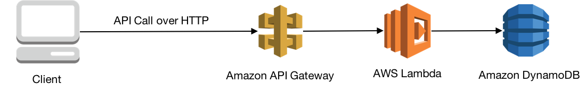
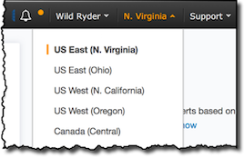
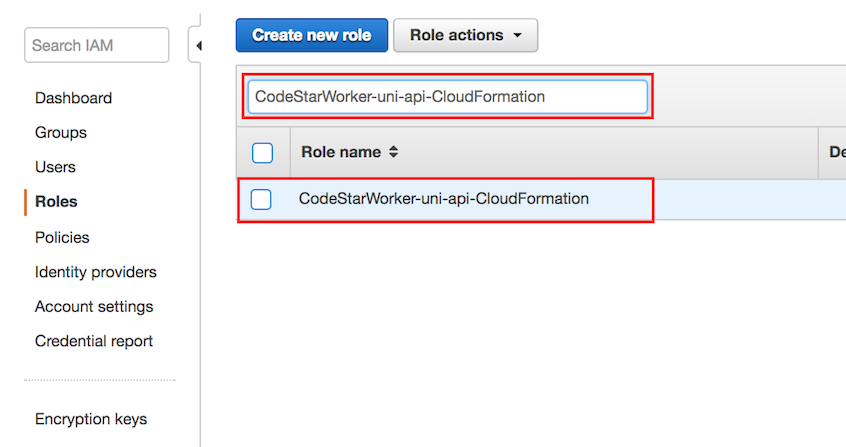
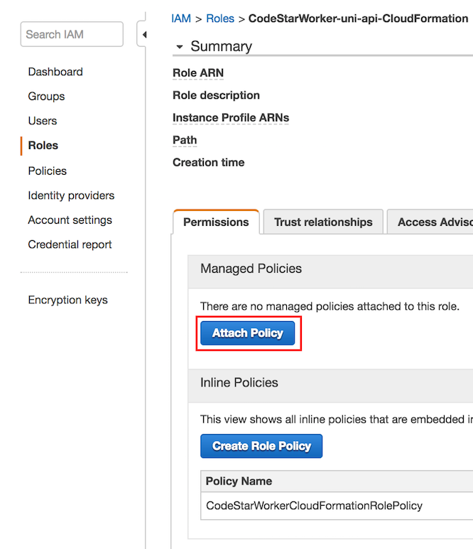
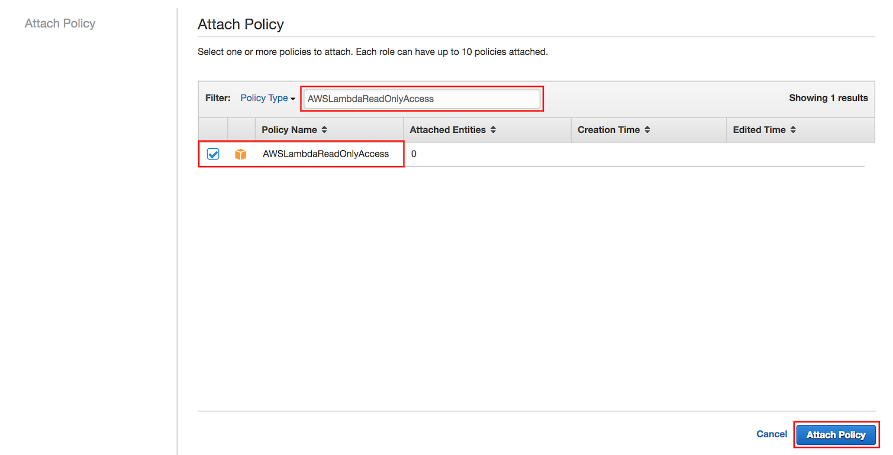
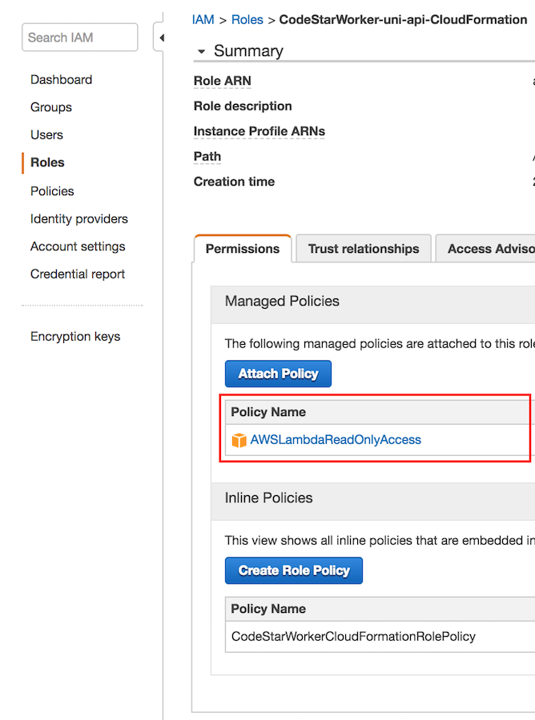
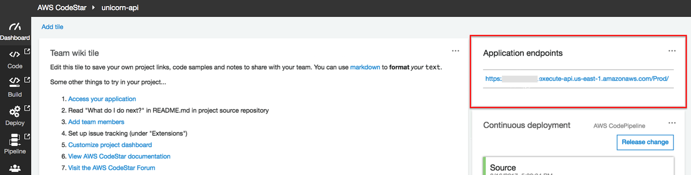
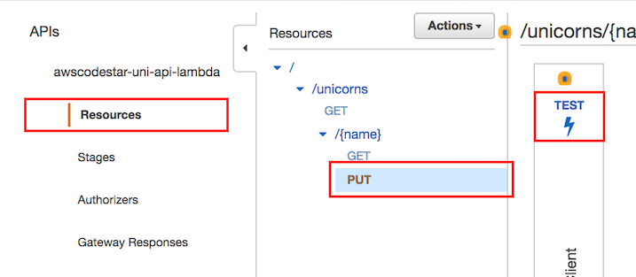
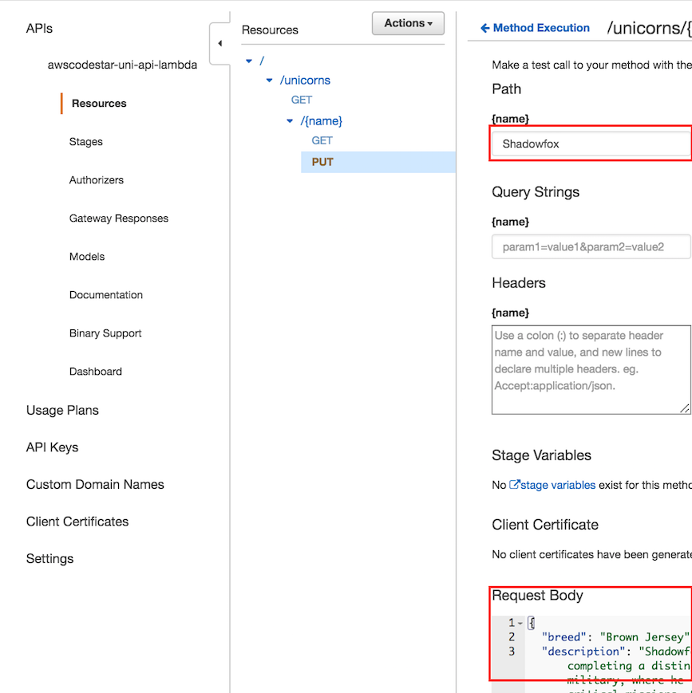

# 모듈 1: 서버리스 어플리케이션 모델 (Serverless Application Model (SAM))

이 모듈에서는 [Serverless Application Model (SAM)](https://github.com/awslabs/serverless-application-model)를 이용하여 서버리스 RESTful API를 개발 할 것 입니다. 이렇게 개발한 RESful API의 기능은 Wild Rydes stable(마굿간)의 유니콘들을 list, create, view, update, delete 할 수 있습니다.

## 아키텍쳐 개요

유니콘 API의 아키텍쳐는 DynamoDB 데이터베이스를 읽고 쓸 수 있는 Lambda 함수를 API Gateway를 통해 트리거 됩니다. 이 Lambda 함수가 트리거 될 수 있도록 API Gateway의 HTTP 인터페이스가 정의 되어 있습니다.



## 서버리스 어플리케이션 모델 개요

AWS 서버리스 어플리케이션 모델 (AWS SAM)은 AWS 환경에서 서버리스로 동작하는 어플리케이션을 정의 하는 모델입니다.

AWS SAM은 [AWS CloudFormation](https://aws.amazon.com/cloudformation/)을 기반으로 이루어져 있습니다. 서버리스 어플리케이션은 [CloudFormation template](http://docs.aws.amazon.com/AWSCloudFormation/latest/UserGuide/gettingstarted.templatebasics.html)에 정의 되어 있으며 [CloudFormation stack](http://docs.aws.amazon.com/AWSCloudFormation/latest/UserGuide/updating.stacks.walkthrough.html)을 통해 배포 됩니다. AWS SAM 템플레이트는 CloudFormation 템플레이트를 의미 합니다.

AWS SAM이란 CloudFormation 템플레이트에서 기술 할 수 있는 컴포넌트의 집합이라고 할 수 있습니다. CloudFormation 템플레이트는 공통적으로 사용하는 서버리스 어플리케이션들은 손 쉽게 기술 할 수 있게 해 줍니다. CloudFormation 템플레이트에 AWS SAM 컴포넌트를 정의하기 위해서는 템플레이트 root document에 `Transform` 섹션에 `AWS::Serverless-2016-10-31` 값이 정의 되어 있어야 합니다.

유니콘 API는 AWS Labmda 함수를 트리거 할 수 있는 Amazon API Gateway HTTP 엔드포인트를 포함 하고 있습니다. 이 Lambda 함수들은 Amazon DynamoDB 데이터 베이스를 읽거나 쓸 수 있습니다. 유니콘 API의 SAM 템플레이트에는 해쉬키를 가지고 있는 DynamoDB 테이블, Wild Rydes 마굿간의 유니콘들을 list, view , update 할 수 있는 Lambda 함수들을 정의 하고 있습니다.

유니콘 API의 컴포넌트들은 [app-sam.yaml](uni-api/app-sam.yaml) CloudFormation 템플레이트에 정의 되어 있습니다. 앞으로 이 유니콘 API들을 자세히 알아 보도록 하겠습니다.

### AWS::Serverless::SimpleTable

아래는 SAM 템플레이트의 DynamoDB 테이블 자원을 정의하는 코드의 일부분 입니다.

```yaml
  Table:
    Type: 'AWS::Serverless::SimpleTable'
      Properties:
        PrimaryKey:
          Name: name
          Type: String
```

Wild Rydes 마굿간에서 유니콘들의 **name**은 단일 문자열이며 고유 식별자입니다. 또한 유니콘의 이름은 DynamoDB 테이블의 primary key로 사용 할 수 있어야 합니다.

[AWS::Serverless::SimpleTable](https://github.com/awslabs/serverless-application-model/blob/master/versions/2016-10-31.md#awsserverlesssimpletable) 파일의 자원에서 정의된 DynamoDB 테이블은 위의 요구 조건을 만족시키며 유니콘 API가 템플레이트 파일에서 정의된 DynamoDB 테이블을 사용할 수 있게 해 줍니다. 만약 더 복잡한 기능을 구현이 필요하시다면 SimpleTable 부분을 [AWS::DynamoDB::Table](http://docs.aws.amazon.com/AWSCloudFormation/latest/UserGuide/aws-resource-dynamodb-table.html)의 자원 정의 부분으로 변경하여 사용하시기 바랍니다.

### AWS::Serverless::Function

아래는 SAM 템플레이트 중 유니콘의 이름으로 유니콘 정보를 요청하는 Lambda 함수 코드의 일부분 입니다.

```yaml
  ReadFunction:
    Type: 'AWS::Serverless::Function'
    Properties:
      FunctionName: 'uni-api-read'
      Runtime: nodejs6.10
      CodeUri: app
      Handler: read.lambda_handler
      Description: View Unicorn by name
      Timeout: 10
      Events:
        GET:
          Type: Api
          Properties:
            Path: /unicorns/{name}
            Method: get
      Environment:
        Variables:
          TABLE_NAME: !Ref Table
      Role:
        Fn::ImportValue:
          !Join ['-', [!Ref 'ProjectId', !Ref 'AWS::Region', 'LambdaTrustRole']]
```

여러 [속성값](https://github.com/awslabs/serverless-application-model/blob/master/versions/2016-10-31.md#properties)들이  [AWS::Serverless::Function](https://github.com/awslabs/serverless-application-model/blob/master/versions/2016-10-31.md#awsserverlessfunction)에 정의 되어 있습니다. 자세한 내용은 추후에 다시 살펴 보도록 하겠습니다.

#### FunctionName (함수이름)

**FunctionName** 속성은 Lambda 함수의 이름을 정의 합니다. 만약 정의 되어 있지 않다면 CloudFormation Stack 이름, CloudFormation 자원 이름, 랜덤 ID 값을 이용하여 CloudFormation이 알아서 생성 합니다.

#### Runtime (구동환경)

유니콘 API는 **Node.js 6.10**을 이용하여 구동됩니다. 다른 Runtime의 구동 환경의 추가적인 정보는 [Lambda Execution Environment and Available Libraries](http://docs.aws.amazon.com/lambda/latest/dg/current-supported-versions.html)에서 확인 하실 수 있습니다.

#### CodeUri

**CodeUri** 속성은 SAM 템플레이트로 부터 함수 코드의 상대적인 위치 정보를 의미합니다. 예를들어 "**app**"이 속성값으로 정의 되었다면 SAM 템플레이트의 위치로 부터 `app` 폴더에 함수 코드가 있음을 의미 합니다.

#### Handler (핸들러)

**Handler** 속성은 Lambda함수의 진입점를 의미합니다. Javascript의 경우 `Handler`는 "**file**.**function**"로 표현 됩니다.  **file**은 **CodeUri**에서 정의한 상대경로에서 Javascript의 ".js" 확장자를 제외한 파일이름 입니다. **function**은 해당 파일에서 Lambda함수가 호출되었을때 실행 할 함수 이름 입니다.

#### Events (이벤트)

**Events** 속성은 Lambda 함수를 호출을 요청한 트리거에 대한 정의 입니다. [Api](https://github.com/awslabs/serverless-application-model/blob/master/versions/2016-10-31.md#api)는 API Gateway 종단의 이벤트을 Lambda 함수 호출를 할 수 있는 트리거와 연동시키도록 하는 이벤트 소스입니다. SAM에서는 API Gateway 뿐만아니라 Lambda 함수를 호출 할 수 있는 다양한 트리거 이벤트를 제공하고 있습니다. 더 자세한 내용은 [sources](https://github.com/awslabs/serverless-application-model/blob/master/versions/2016-10-31.md#event-source-types)를 확인하시기 바랍니다.

HTTP GET 메소드를 사용하여 유니콘의 자세한 사항을 확인 할 수 있는 **Api** 이벤트 소스는 RESTful 자원인 `/unicorns/{name}`에 정의 되어 있습니다. SAM에서는 Api 이벤트를 API Gateway 자원으로 변환시켜 URL의 **name** 값를 이벤트의 [pathParameter](http://docs.aws.amazon.com/apigateway/latest/developerguide/getting-started-mappings.html)로 매칭시켜 Lambda 함수를 호출 합니다.

#### Environment (환경변수)

[Environment](http://docs.aws.amazon.com/lambda/latest/dg/env_variables.html) 속성은 Labmda 함수에서 접근 가능한 변수와 해당하는 변수의 값을 설정 할 수 있습니다. 해당 Runtime에서 환경변수 접근 방법을 이용하여 해당 변수를 접근 하실수 있으십니다.

Lambda 함수들은 데이터를 읽고 쓰기 위해 DynamoDB와 통신을 해야 합니다. CloudFormation 스택에서 생성한 DynamoDB 테이블의 자원 주소 참조값을 `TABLE_NAME`의 환경변수의 값으로 Lambda 함수가 접근 할 수 있도록 합니다.

#### Role (역활)

**Role** 속성은 Lambda 함수 실행 시 접근 할 수 있는 AWS 자원을 정의하는 [Lambda execution policy](http://docs.aws.amazon.com/lambda/latest/dg/intro-permission-model.html#lambda-intro-execution-role)의 IAM 역활을 설정 합니다. 각각의 프로젝트 마다 CodeStar에서는 기본적으로 설정되어있는 AWS 자원들에게 접근 할 수 있는 Lambda 실행 역활을 생성합니다. 이후 모듈에서 역할에 정책을 추가적으로 작성하여 수정해 보도록 하겠습니다.

다음은 CloudFormation을 이용하여 SAM Unicorn API를 배포하는 방법에 대해 알아보도록 하겠습니다.

## 구현 지침

본 모듈은 여러 섹션으로 구성되어 있으며 매 섹션 시작에는 개괄적인 개요가 준비되어 있습니다. 섹션 마다 구현을 위한 자세한 내용은 단계별 지침안에서 확인 하실 수 있으십니다. 이미 AWS Management Console에 익숙하시거나 둘러보기를 거치지 않고 직접 서비스를 탐색하시려는 분들을 위해 구현을 완료하는 데 필요한 충분한 내용을 각 섹션의 개요에서 제공하고 있습니다.

최신 버젼의 크롬, 파이어폭스, 사파리 웹 브라우저를 사용하신다면 단계별 지침을 클릭하셔서 자세한 내용을 확인하시기 바랍니다.

### AWS 리전 선택

이번 워크샵에서 다루는 전체 서비스는 아래와 같습니다.

- Amazon API Gateway
- Amazon S3
- Amazon DynamoDB
- AWS CodeBuild
- AWS CodePipeline
- AWS Lambda
- AWS X-Ray

본 워크샵에 필요한 모든 서비스를 지원하는 AWS 리전들은 N. Virginia, Ohio, N. California, Oregon, Ireland, Frankfurt, Singapore, Sydney 입니다. 자세한 서비스별 지원 리전을 확인하시려면 AWS 리전 테이블을 참조 하시기 바랍니다. [AWS 리전 테이블](https://aws.amazon.com/about-aws/global-infrastructure/regional-product-services/)

본 워크샵의 가이드는 한 리전에서 모든 서비스를 배포하는 것을 가정하고 작성되었습니다. 따라서 서비스를 배포하시기 전 다른 서비스들과 같은 리전에서 배포가 진행 되는지 AWS 콘솔 화면에서 확인하시기 바랍니다.



### 1. CodeStar IAM Role 업데이트

CodeStar는 AWS 자원 접근을 제어하는 IAM 역활과 정책을 생성합니다. 이번 모듈에서는 Lambda이름을 사용자 맞춤형식으로 표현할 수 있도록 IAM Managed 정책을 IAM 역할에 추가하고 권한을 부여 하도록 하겠습니다.

#### 1a. `CodeStarWorker-uni-api-CloudFormation` 역할에 AWSLambdaReadOnlyAccess 정책 추가하기

1. AWS Management 콘솔에서 **Services**를 선택한 다음 Security, Identity & Compliance 아래 **IAM**를 선택하십시오.

1. 왼쪽 네비게이션바에서 **Roles** 을 선택하고 **Filter** 입력란에 `CodeStarWorker-uni-api-CloudFormation`를 입력하고 해당 역할 옆의 확인란을 선택하십시오.

    
 
1. 역할 요약 페이지에서 **Permissions** 탭에서 **Managed Policies** 영역의 **Attach Policy** 버튼을 클릭하십시오.

    
 
1. **Filter** 입력 란에 `AWSLambdaReadOnlyAccess`을 입력한뒤 **AWSLambdaReadOnlyAccess**의 좌측 체크 박스를 선택하고 **Attach Policy** 버튼을 클릭하십시오.

    
 
1. 역할 요약 페이지에서 **Managed Policies** 리스트에 **AWSLambdaReadOnlyAccess** 정책이 추가가 되어 있는 것을 확인 하실 수 있습니다.

    
    
### 2. `uni-api` CodeCommit 깃 저장소 시작 하기

1. 각각의 모듈은 해당 워크숍 진행에 필요한 소스 코드와 CodeStar 및 CodeCommit 깃 저장소와 연동이 되어 있습니다. 깃 저장소를 시작하기 위해서는 여러분이 선택하신 리전의 **Launch Stack** 버튼을 클릭 하여 주시기 바랍니다.

    Region| Launch
    ------|-----
    US East (N. Virginia) | [](https://console.aws.amazon.com/cloudformation/home?region=us-east-1#/stacks/create/review?stackName=Seed-1-ServerlessApplicationModel&templateURL=https://s3.amazonaws.com/fsd-aws-wildrydes-us-east-1/codecommit-template.yml&param_sourceUrl=https://s3.amazonaws.com/fsd-aws-wildrydes-us-east-1/uni-api-1.zip&param_targetRepositoryName=uni-api&param_targetRepositoryRegion=us-east-1)
    US West (N. California) | [](https://console.aws.amazon.com/cloudformation/home?region=us-west-1#/stacks/create/review?stackName=Seed-1-ServerlessApplicationModel&templateURL=https://s3.amazonaws.com/fsd-aws-wildrydes-us-west-1/codecommit-template.yml&param_sourceUrl=https://s3-us-west-1.amazonaws.com/fsd-aws-wildrydes-us-west-1/uni-api-1.zip&param_targetRepositoryName=uni-api&param_targetRepositoryRegion=us-west-1)
    US West (Oregon) | [](https://console.aws.amazon.com/cloudformation/home?region=us-west-2#/stacks/create/review?stackName=Seed-1-ServerlessApplicationModel&templateURL=https://s3.amazonaws.com/fsd-aws-wildrydes-us-west-2/codecommit-template.yml&param_sourceUrl=https://s3-us-west-2.amazonaws.com/fsd-aws-wildrydes-us-west-2/uni-api-1.zip&param_targetRepositoryName=uni-api&param_targetRepositoryRegion=us-west-2)
    EU (Ireland) | [](https://console.aws.amazon.com/cloudformation/home?region=eu-west-1#/stacks/create/review?stackName=Seed-1-ServerlessApplicationModel&templateURL=https://s3.amazonaws.com/fsd-aws-wildrydes-eu-west-1/codecommit-template.yml&param_sourceUrl=https://s3-eu-west-1.amazonaws.com/fsd-aws-wildrydes-eu-west-1/uni-api-1.zip&param_targetRepositoryName=uni-api&param_targetRepositoryRegion=eu-west-1)
    EU (Frankfurt) | [](https://console.aws.amazon.com/cloudformation/home?region=eu-central-1#/stacks/create/review?stackName=Seed-1-ServerlessApplicationModel&templateURL=https://s3.amazonaws.com/fsd-aws-wildrydes-eu-central-1/codecommit-template.yml&param_sourceUrl=https://s3-eu-central-1.amazonaws.com/fsd-aws-wildrydes-eu-central-1/uni-api-1.zip&param_targetRepositoryName=uni-api&param_targetRepositoryRegion=eu-central-1)
    Asia Pacific (Sydney) | [](https://console.aws.amazon.com/cloudformation/home?region=ap-southeast-2#/stacks/create/review?stackName=Seed-1-ServerlessApplicationModel&templateURL=https://s3.amazonaws.com/fsd-aws-wildrydes-ap-southeast-2/codecommit-template.yml&param_sourceUrl=https://s3-ap-southeast-2.amazonaws.com/fsd-aws-wildrydes-ap-southeast-2/uni-api-1.zip&param_targetRepositoryName=uni-api&param_targetRepositoryRegion=ap-southeast-2)

1. CloudFormation 템플레이트는 이번 모듈을 진행하는데 있어서 필요한 항목들이 사전에 정의 되어 있습니다.

1. **I acknowledge that AWS CloudFormation might create IAM resources.** 체크 박스를 체크 하여 주시기 바랍니다. CloudFormation에 여러분을 대신하여 스택 생성에 필요한 IAM 자원을 생성 할 수 있도록 권한 부여를 허락함을 의미 합니다.

1. 브라우저창의 우측 하단의 **Create** 버튼을 클릭하여 주시기 바랍니다. 이번 모듈에 필요한 CloudFormation 스택을 생성 및 CodeCommit 저장소를 생성합니다.

    

1. 깃 저장소에 새로운 코드로 준비되기 까지는 약간의 지연이 발생 할 수 있습니다. 만약 모든 것이 성공적으로 생성이 되었다면 CloudFormation의 상태는 ``CREATE_COMPLETE`` 이어야 합니다.

    

### 3. CodeCommit 깃 저장소로 부터 Fetch 하기

새로운 코드가 추가된 CodeCommit 깃 저장소가 생성되었습니다. 코드를 수정 할 수 있도록 이 저장소의 변경사항을 여러분의 로컬 깃 저장소로 복사할 것 입니다. 일반적으로 리모트 깃 저장소의 업데이트된 내용은 `git pull` 명령어로 수행할 수 있습니다. 하지만 이번 워크숍에서는 저장소의 history가 새롭게 생성 되었기 때문에 `git pull`이 아닌 다른명령어를 사용 하셔야 합니다.

여러분이 사용하시 편한 깃 클라이언트를 이용해서 아래 명령어 들을 여러분의 로컬 **uni-api** 깃 저장소에서 실행해 주시기 바랍니다.

* `git fetch --all`
* `git reset --hard origin/master`

### 4. CodeStar에서 생성한 `uni-api` S3 버킷 확인 하기

CodeStar는 SAM을 기반한 프로젝트의 결과물을 저장할 S3 버킷을 생성합니다. S3 버킷 이름은 `{AWS::Region}`과 `{AWS::AccountId}`를 포한한 형식으로 되어 있습니다.

```bash
aws-codestar-{AWS::Region}-{AWS::AccountId}-uni-api-pipe
```

### 5. Unicorn 개발 API 패키징 하기

여러분의 로컬 컴퓨터에서:

1. 로컬 환경의 현재 경로를 **uni-api** 깃 저장소로 변경 하여 주시기 바랍니다.

1. AWS CLI를 이용하셔서 로컬 환경에 `uni-api` 디렉토리의 소스 코드를 S3로 업로드를 하는 [CloudFormation package](http://docs.aws.amazon.com/cli/latest/reference/cloudformation/package.html)  명령어를 실행 하시기 바랍니다. 아래 코드의 내용중 `YOUR_BUCKET_NAME`의 부분을 여러분께서 이전에 패키지 명령어를 사용하셨던 이름으로 변경한 뒤 사용하시기 바랍니다. (예: `aws-codestar-{AWS::Region}-{AWS::AccountId}-uni-api-pipe`)

```bash
aws cloudformation package --template-file app-sam.yaml --s3-bucket YOUR_BUCKET_NAME --output-template-file app-sam-output.yaml
```

**CloudFormation package** 명령어는 로컬의 소스코드를 압축하여 설정한 S3 위치로 압축한 파일의 업로드를 수행한 다음 새로운 CloudFormation 템플레이트를 `app-sam-output.yaml`의 이름으로 반환 합니다. 새로운 `app-sam-output.yaml` CloudFormation 템플레이트 파일에는 로컬 CodeUri의 값이 S3 오브젝트의 위치로 변경 되어 있습니다. 예를 들어:

실행 전:

```yaml
  ReadFunction:
    Type: 'AWS::Serverless::Function'
    Properties:
      FunctionName: 'uni-api-read'
      Handler: read.lambda_handler
      Runtime: nodejs6.10
      CodeUri: app
```

실행 후:

```yaml
  ReadFunction:
    Type: 'AWS::Serverless::Function'
    Properties:
      FunctionName: 'uni-api-read'
      Handler: read.lambda_handler
      Runtime: nodejs6.10
      CodeUri: s3://YOUR_BUCKET_NAME/540839c2fc11f0214f88f6c5dfacd389
```

### 6. Unicorn API 배포 하기

1. 로컬 환경의 현재 경로를 **uni-api** 깃 저장소로 변경 하여 주시기 바랍니다.

1. AWS CLI를 이용하셔서 package 명령어에 의해 반환된 `app-sam-output.yaml` CloudFormation 템플레이트를  [CloudFormation deploy](http://docs.aws.amazon.com/cli/latest/reference/cloudformation/deploy/index.html) 명령으로 배포 하시기 바랍니다. CloudFormation 스택이름으로는 `awscodestar-uni-api-lambda` 사용하며 또한 IAM trust를 `CAPABILITY_IAM` [CloudFormation capability](http://docs.aws.amazon.com/AWSCloudFormation/latest/APIReference/API_CreateStack.ht)를 사용하여 할 것 입니다. IAM trust는 스택에서 Lambda 함수 실행에 필요한 정책을 생성할 수 있게 합니다. 아래 명령어를 이용하여 실행하시기 바랍니다.

```bash
aws cloudformation deploy --stack-name awscodestar-uni-api-lambda --template-file app-sam-output.yaml --capabilities CAPABILITY_IAM --parameter-overrides ProjectId=uni-api
```

## 적용 사항 검증

CloudFormation의 배포 명령어가 완료가 되면 웹 브라우저를 이용하여 검증 하도록 하겠습니다.

1. AWS Management 콘솔에서 **Services**를 선택한 다음 Developer Tools 섹션에서 **CodeStar** 를 선택하십시오.

1. `uni-api` 프로젝트를 선택 하십시오.

    

1. 상황판 오른쪽에 있는 **Application endpoints** 창에서 URL 주소를 복사하십시오.

    

1. 웹 브라우저에서 방금 복사한 URL을 붙여넣기 한뒤 주소에 `/unicorns` 를 추가해 주시기 바랍니다. 아래 주소와 같은 형식이 되어야 합니다. `https://xxxxxxxxxx.execute-api.us-west-1.amazonaws.com/Prod/unicorns/`

1. 웹 브라우저에서 JSON 결과가 다음과 아래와 같이 비어 있음을 확인하시기 바랍니다.

```json
[]
```

## API 기능 추가

여러분은 Unicorn API 검토를 하시고 성공 적으로 배포를 완료 하셨습니다. 다음은 Wild Rydes 마굿간에 유니콘들을 추가 및 업데이트 하는 API를 추가 하도록 하겠습니다. 구현에 필요한 소스코드는 이미 여러분의 프로젝트에 포함 되어 있습니다. 따라서 여러분은 SAM `app-sam.yaml` 템플레이트에 **AWS::Serverless::Function** 자원을 추가하셔서 구현을 완료 해주시기 바랍니다.

### 1. app-sam.yaml에 Update 함수 추가 하기

텍스트 편집기를 이용하셔서 `app-sam.yaml` 파일을 열어 주시기 바랍니다. `UpdateFunction`의 이름으로 **AWS::Serverless::Function** 리소스를 추가 하시기 바랍니다.

> 주의: YAML 파일에서는 공백이 매우 중요합니다. app-sam.yaml 파일의 CloudFormation Resources 규칙과 동일한 공백 규칙을 사용하시기 바랍니다.

1. **FunctionName**은 `uni-api-update` 입니다.

1. **Runtime**은 `nodejs6.10` 입니다.

1. **CodeUri**는 `app` 입니다.

1. **Handler**는 `update.lambda_handler` 입니다.

1. **Description**은 `Create or Update Unicorn` 입니다.

1. **Timeout**는 `10` 입니다.

1. **Event** 타입은 `Api` 이며  **Path**를 `/unicorns/{name}`  와 연동하여 주시기 바랍니다. 그리고 **Method**는 `put` 입니다.

1. **Environment** 변수 이름은 `TABLE_NAME` 값으로는 `Table` 자원의 참조 주소를 입력하여 주시기 바랍니다.

1. **Role**은 다른 함수와 같이 사용합니다.

``app-sam.yaml`` 추가할 코드의 문법을 아래 코드를 참조하셔서 공백 규칙 및 문법을 확인 하시기 바랍니다.

<details>
<summary><strong>app-sam.yaml에 Update 함수 추가 하기 (자세한 내용을 보려면 펼쳐주세요)</strong></summary><p>

```yaml
  UpdateFunction:
    Type: 'AWS::Serverless::Function'
    Properties:
      FunctionName: 'uni-api-update'
      Runtime: nodejs6.10
      CodeUri: app
      Handler: update.lambda_handler
      Description: Create or Update Unicorn
      Timeout: 10
      Events:
        PUT:
          Type: Api
          Properties:
            Path: /unicorns/{name}
            Method: put
      Environment:
        Variables:
          TABLE_NAME: !Ref Table
      Role:
        Fn::ImportValue:
          !Join ['-', [!Ref 'ProjectId', !Ref 'AWS::Region', 'LambdaTrustRole']]
```

</p></details>

### 2. Unicorn 개발 API 패키징

1. AWS CLI를 이용하셔서 로컬 환경에 `uni-api` 디렉토리의 소스 코드를 S3로 업로드를 하는 [CloudFormation package](http://docs.aws.amazon.com/cli/latest/reference/cloudformation/package.html)  명령어를 실행 하시기 바랍니다. 아래 코드의 내용중 `YOUR_BUCKET_NAME`의 부분을 여러분께서 이전에 패키지 명령어를 사용하셨던 이름으로 변경한 뒤 사용하시기 바랍니다.

```bash
aws cloudformation package --template-file app-sam.yaml --s3-bucket YOUR_BUCKET_NAME --output-template-file app-sam-output.yaml
```

### 3. Unicorn API 배포

1. AWS CLI를 이용하셔서 package 명령어에 의해 반환된 `app-sam-output.yaml` CloudFormation 템플레이트를  [CloudFormation deploy](http://docs.aws.amazon.com/cli/latest/reference/cloudformation/deploy/index.html) 명령으로 배포 하시기 바랍니다. CloudFormation 스택이름으로는 `awscodestar-uni-api-lambda` 사용하며 또한 IAM trust를 `CAPABILITY_IAM` [CloudFormation capability](http://docs.aws.amazon.com/AWSCloudFormation/latest/APIReference/API_CreateStack.ht)를 사용하여 할 것 입니다. IAM trust는 스택에서 Lambda 함수 실행에 필요한 정책을 생성할 수 있게 합니다. 아래 명령어를 이용하여 실행하시기 바랍니다.

```bash
aws cloudformation deploy --stack-name awscodestar-uni-api-lambda --template-file app-sam-output.yaml --capabilities CAPABILITY_IAM
```

CloudFormation은 `awscodestar-uni-api-lambda` CloudFormation 스택에 ChangeSet를 생성하며 기존에 배포되어 있었던 스택에서 변경이 발생한 자원만을 업데이트 합니다. 이번 실습의 경우에는 CodeStar를 이용해서 생성한 `awscodestar-uni-api-lambda` CloudFormation 스택의 자원 중 Lambda 함수와 API Gateway의 변경 사항만을 업데이트 하게 됩니다.

## 기능 추가 사항 검증

CloudFormation의 배포 명령어가 완료가 되면 AWS API Gateway를 이용하여 검증 하도록 하겠습니다.

### 1. Unicorn 추가하기

1. AWS Management 콘솔에서 **Services**를 선택한 다음 Application Services 섹션에서 **API Gateway**를 선택하십시오.

1. 좌측 네비게이션에서 `awscodestar-uni-api-lambda`를 클릭하시기 바랍니다.

1. API resources 리스트에서 `/{name}` resource 아래 `PUT` 를 클릭하시기 바랍니다.

1. Resource 상세 항목 패널에서 클라이언트 박스 좌측의 `TEST`를 클릭하시기 바랍니다.

    

1. 테스트 페이지에서 **Path** 항목에 `Shadowfox`를 입력하시기 바랍니다.

1. 화면을 아래로 스크롤 하신 다음 **Request Body**에 다음을 입력하시기 바랍니다.

    ```json
    {
      "breed": "Brown Jersey",
      "description": "Shadowfox joined Wild Rydes after completing a distinguished career in the military, where he toured the world in many critical missions. Shadowfox enjoys impressing his ryders with magic tricks that he learned from his previous owner."
    }
    ```

    

1. 화면을 아래로 스크롤 하신 다음 **Test** 버튼을 클릭하시기 바랍니다.

1. 화면을 테스트 페이지의 맨 위로 올리신 다음, 패널의 오른쪽의 **Status** 코드에서 HTTP 응답이 200임을 확인 하시기 바랍니다.

    

### 2. Unicorns 목록확인

1. AWS Management 콘솔에서 **Services**를 선택한 다음 Developer Tools 섹션에서 **CodeStar** 를 선택하십시오.

1. `uni-api` 프로젝트를 선택 하십시오.

    

1. 상황판 오른쪽에 있는 **Application endpoints** 창에서 URL 주소를 복사하십시오.

    

1. 웹 브라우저에서 방금 복사한 URL을 붙여넣기 한뒤 주소에 `/unicorns` 를 추가해 주시기 바랍니다. 아래 주소와 같은 형식이 되어야 합니다. `https://xxxxxxxxxx.execute-api.us-east-1.amazonaws.com/Prod/unicorns/`

1. 웹 브라우저 JSON 결과 중 `Shadowfox`의 "breed" 와 "description" 항목이 이전 모듈에서 작성한 바와 같이 출력이 되는 지를 확인 하시기 바랍니다.

> Note: CodeStar 프로젝트 You may notice that your CodeStar project shows the Build stage has failed in the project pipeline.  That's to be expected, and will be corrected in the next module.

## 완료

축하합니다! 여러분은 Serverless Application Model(SAM)을 이용하여 성공적으로 RESTful 서버리스 API를 배포 및 수정 하셨습니다. 다음 [Continuous Delivery Pipeline Module](../2_ContinuousDeliveryPipeline) 모듈에서는 AWS CodePipeline 와 AWS CodeBuild를 이용하여 배포 작업을 자동화 하는 방법을 알아 보도록 하겠습니다.
