# Module 2: Continuous Delivery Pipeline

In this module, you'll use [AWS CodePipeline](https://aws.amazon.com/codepipeline/), [AWS CodeBuild](https://aws.amazon.com/codebuild/), and [Amazon S3](https://aws.amazon.com/s3/) to build a Continuous Delivery pipeline to automate a code deployment workflow for the Unicorn API.

## CodePipeline Overview

CodePipeline orchestrates the steps to build, test, and deploy your code changes.  Below is a screenshot of the CodePipeline you will build when have completed this module.


## CodeBuild Overview

CodeBuild compiles source code, runs tests, and produces software packages that are ready to deploy to environments.

The Unicorn API [buildspec.yml](buildspec.yml) defines the commands used to build the project and the output artifacts.

```yaml
version: 0.1
phases:
  install:
    commands:
      - echo "nothing to do in install"
  pre_build:
    commands:
      - echo "Installing dependencies - `pwd`"
  build:
    commands:
      - echo "Starting build `date` in `pwd`"
      - aws cloudformation package --template-file app-sam.yaml --s3-bucket $BUILD_OUTPUT_BUCKET --output-template-file app-sam-output.yaml
  post_build:
    commands:
      - echo "build completed on `date`"
artifacts:
  files:
    - app-sam-output.yaml
  discard-paths: yes
```

For the Unicorn API, the build command is the same **CloudFormation package** command used from the [Serverless Application Model: Step 2](../1_ServerlessApplicationModel#2-package-the-unicorn-api-for-deployment), except that the S3 bucket has been externalized to an environment variable that you will define in the CodeBuild project.

As a reminder, the **CloudFormation package** command packages the local source code, uploads it to S3, and returns a new CloudFormation template that has been modified to use the S3 references as the CodeUri.

For the Unicorn API, the output artifact is a zip archive that includes only the ``app-sam-output.yaml`` file.

## Implementation Instructions

Each of the following sections provide an implementation overview and detailed, step-by-step instructions. The overview should provide enough context for you to complete the implementation if you're already familiar with the AWS Management Console or you want to explore the services yourself without following a walkthrough.

If you're using the latest version of the Chrome, Firefox, or Safari web browsers the step-by-step instructions won't be visible until you expand the section.

### 1. Identify Wild Rydes S3 Bucket

You will reuse the S3 Bucket that you created in [Module 1: Serverless Application Model](../1_ServerlessApplicationModel/README.md#1-create-an-s3-bucket) from the DevOps Workshop.  If you have not completed this Module, please refer to the module instructions to create the S3 Bucket.

If you are unsure of your S3 Bucket's name, please follow the instructions below.

<details>
<summary><strong>Step-by-step instructions (expand for details)</strong></summary><p>

1. In the AWS Management Console choose **Services** then select **S3** under Storage.

1. Browse the list of Buckets or use the search box to identify the S3 Bucket.  `wildrydes-devops-yourname` was recommended as the Bucket name, however you may have chosen a different globaly unique name.

</p></details>

### 2. Create a Deployment Package

The CodePipeline that you will create in the next step will be triggered by updates to a deployment package in S3.

1. Change directory to `aws-serverless-workshops-master/DevOps/2_ContinuousDeliveryPipeline/unicorn-api`.

1. To create a deployment for this project, zip the contents of the `unicorn-api` directory into a file named **`unicorn-api.zip`**, which is your deployment package.  If you are unsure how to zip the files in the `unicorn-api` directory, follow the instructions for Microsoft workstations [here](https://support.microsoft.com/en-us/instantanswers/2df754f6-7039-824c-b5be-6dda11b5075e/zip-and-unzip-files), and macOS workstations [here](https://support.apple.com/kb/PH25411).

**Important**
> Zip the directory content, not the directory. The contents of the Zip file are available as the current working directory of the Lambda function. For example: /app-sam.yaml

### 3. Upload the Deployment Package to S3

1. In the AWS Management Console, choose **Services** then select **S3** under Storage.

1. Browse the list of Buckets or use the search box to find the S3 bucket that you identified previously.

1. Choose **Upload**

1. Choose **Add files**, select the local copy of `unicorn-api.zip` and then choose **Upload** in the bottom left corner of the dialog.

### 4. Create an IAM Policy for CodeBuild

Use the IAM console to create a new role. Name it `WildRydesUnicornApiCodeBuild` and select AWS CodeBuild for the role type. You'll need to attach policies that grant your CodeBuild project permissions to write CloudWatchLogs, get and put objects from the CodePipeline S3 bucket, and put objects to the S3 bucket that you identified previously.

1. From the AWS Management Console, click on **Services** and then select **IAM** in the Security, Identity & Compliance section.

1. Select **Roles** in the left navigation bar and then choose **Create New Role**.

1. Select **AWS CodeBuild** for the role type.

    **Note:** Selecting a role type automatically creates a trust policy for your role that allows AWS services to assume this role on your behalf. If you were creating this role using the CLI, AWS CloudFormation or another mechanism, you would specify a trust policy directly.

1. Choose **Next Step**.

1. Enter `WildRydesUnicornApiCodeBuild` for the **Role name**.

1. Choose **Create Role**.

1. Type `WildRydesUnicornApiCodeBuild` into the filter box on the Roles page and choose the role you just created.

1. On the Permissions tab, expand the **Inline Policies** section and choose the **click here** link to create a new inline policy.

   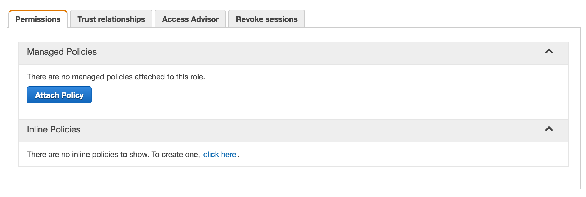

1. Ensure **Custom Policy** is selected and choose **Select**.

1. Enter `WildRydesUnicornApiCodeBuild` for the **Policy Name**.

1. Enter the following for the **Policy Document**.  Make sure you replace `YOUR_BUCKET_NAME` with the name you identified previously and `YOUR_REGION` with the name of the AWS Region that you chose in Module 1, for example `us-east-1`.

   ```json
   {
     "Version": "2012-10-17",
     "Statement": [
       {
         "Effect": "Allow",
         "Action": [
           "logs:CreateLogGroup",
           "logs:CreateLogStream"
         ],
         "Resource": [
           "arn:aws:logs:YOUR_REGION:::log-group:/aws/codebuild/wildrydes-unicorn-api"
         ]
       },
       {
         "Effect": "Allow",
         "Action": [
           "logs:PutLogEvents"
         ],
         "Resource": [
           "arn:aws:logs:YOUR_REGION:::log-group:/aws/codebuild/wildrydes-unicorn-api/*"
         ]
       },
       {
         "Effect": "Allow",
         "Action": [
           "s3:GetObject",
           "s3:GetObjectVersion",
           "s3:PutObject"
         ],
         "Resource": [
           "arn:aws:s3:::codepipeline-*/*"
         ]
       },
       {
         "Effect": "Allow",
         "Action": [
           "s3:PutObject"
         ],
         "Resource": [
           "arn:aws:s3:::YOUR_BUCKET_NAME/*"
         ]
       }
     ]
   }
   ```

1. Choose **Apply Policy**

### 5. Create a CodePipeline Pipeline

You have now prepared the dependencies required to create a pipeline.  Next, you'll create a CodePipeline with two stages, source and build.

#### 5a. Create Pipeline

1. From the AWS Management Console, click on **Services** and then select **CodePipeline** in the Developer Tools section.

1. Choose **Create Pipeline**.

1. Enter `wildrydes-unicorn-api` for the **Pipeline name**

   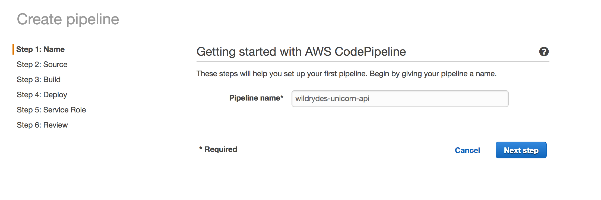

#### 5b. Create Source Stage

The source stage is triggered automatically when a new version of the Unicorn API zip artifact is uploaded to S3.  The source stage copies the archive from the S3 object, unzips the contents, rearchives the contents, and puts the archive to an encrypted CodePipeline S3 bucket.

1. Select `Amazon S3` for the **Source provider**

1. Enter `s3://YOUR_BUCKET_NAME/unicorn-api.zip` for the **Amazon S3 location**.  Make sure you replace `YOUR_BUCKET_NAME` with the name you identified previously.

   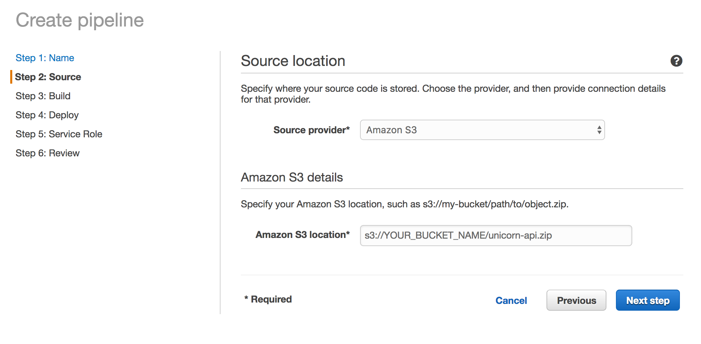

1. Choose **Next step**

#### 5c. Create Build Stage

The build stage is triggered automatically when a new version of the source stage is available.  You will configure the build stage to use CodeBuild transform the source code into an artifact that is ready to be deployed.

1. Select `AWS CodeBuild` for the **Build provider**.

1. Select `Create a new build project` under **Configure your project**.

1. Enter `wildrydes-unicorn-api` for the **Project name**.

   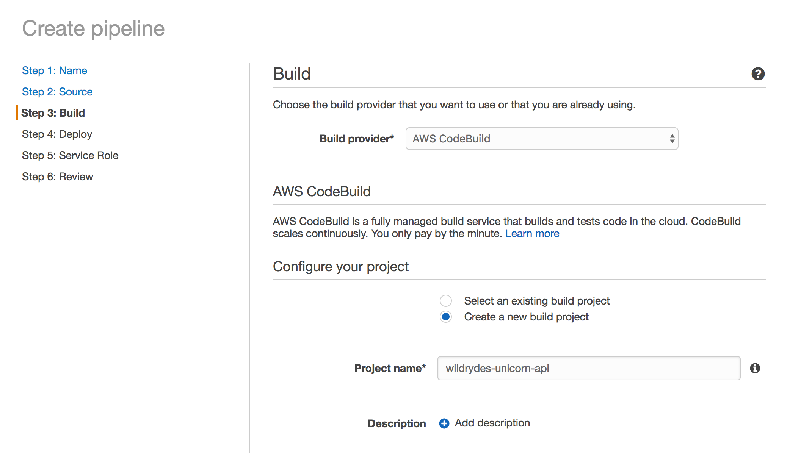

1. Select `Use an image maintained by AWS CodeBuild` for the **Environment image**.

1. Select `Ubuntu` for the **Operating System**.

1. Select `Node.js` for the **Runtime**.

1. Select `aws/codebuild/nodejs:6.3.1` for the **Version**.

1. Select `Use the buildspec.yml in the source code root directory` for the **Build specification**.

   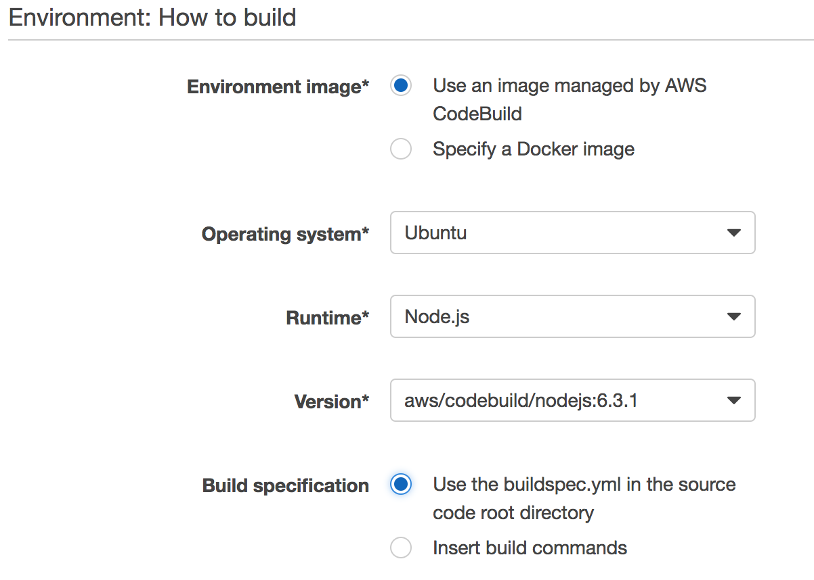

1. Select `Choose an existing service role from your account` and enter `WildRydesUnicornApiCodeBuild` as the **Role name**.

   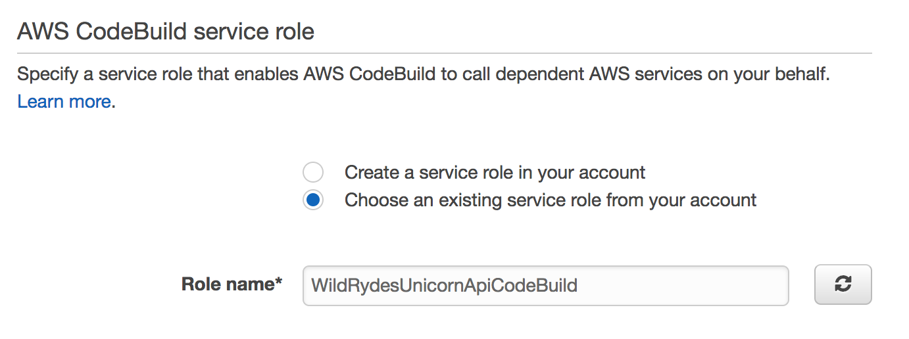

1. Expand the **Advanced** configuration section.

1. In the **Environment variables** section, enter `S3_BUCKET` for the variable **Name** and enter the name of the S3 bucket that you identified previously for the **Value**.

   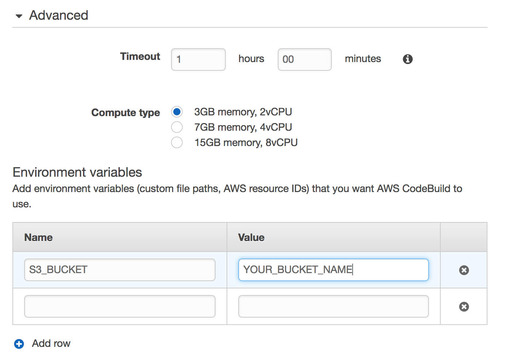

1. Choose **Save build project**

1. Choose **Next step**

#### 5d. Complete the Pipeline

1. Select `No Deployment` as the **Deployment provider**

1. Choose **Next step**

1. Choose **Create role**

1. A new browser window will open.  Choose **Create a new IAM Role** for **IAM Role**, and enter `WildRydesUnicornApiCodePipeline` for the **Role name**.

   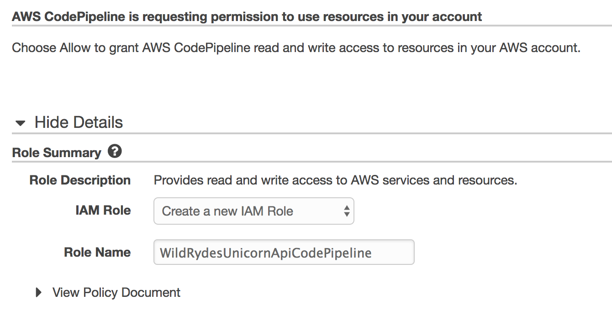

1. Choose **Allow**

1. The browser window will close, returning you to the CodePipeline UI with `WildRydesUnicornApiCodePipeline` populated for the **Role name**.

1. Choose **Next Step**

1. Review the details of the CodePipeline and choose **Create pipeline**

## Validation

After you have created the wildrydes-unicorn-api CodePipeline, you will see a pipeline with two stages, Source and Build.  When the pipeline completes successfully, each stage will be green, similar to the screenshot below.

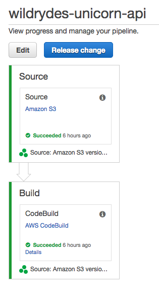

## Add Deploy Stage to CodePipeline

The CodePipeline that you have created so far pulls source code updates from S3 and builds a deployable artifact using CodeBuild.  Next, you will add a stage to deploy the `app-sam-output.yaml` CloudFormation Template to update a CloudFormation Stack using the same technique used from the command line in [Module 1](../1_ServerlessApplicationModel).

### 1. Create an IAM Policy for CloudFormation

Use the IAM console to create a new role. Name it `WildRydesUnicornApiCloudFormation` and select AWS CloudFormation for the role type. You'll need to attach policies that grant your CloudFormation project permissions to access Lambda, DynamoDB and API Gateway.

1. From the AWS Management Console, click on **Services** and then select **IAM** in the Security, Identity & Compliance section.

1. Select **Roles** in the left navigation bar and then choose **Create New Role**.

1. Select **AWS CloudFormation Role** for the role type.

    **Note:** Selecting a role type automatically creates a trust policy for your role that allows AWS services to assume this role on your behalf. If you were creating this role using the CLI, AWS CloudFormation or another mechanism, you would specify a trust policy directly.

1. Choose **Next Step**.

1. Enter `WildRydesUnicornApiCloudFormation` for the **Role name**.

1. Choose **Create Role**.

1. Type `WildRydesUnicornApiCloudFormation` into the filter box on the Roles page and choose the role you just created.

1. On the Permissions tab, choose the **Attach Policy** button to add a Managed Policy.

1. Enter `AWSLambdaFullAccess` into the filter box, select the checkbox to the left of the role, and clear the filter box

1. Enter `AmazonDynamoDBFullAccess` into the filter box, select the checkbox to the left of the role, and clear the filter box

1. Enter `AmazonAPIGatewayAdministrator` into the filter box, select the checkbox to the left of the role, and clear the filter box

1. Choose **Attach Policy**.

1. On the Permissions tab, expand the **Inline Policies** section and choose the **click here** link to create a new inline policy.

   

1. Ensure **Custom Policy** is selected and choose **Select**.

1. Enter `WildRydesUnicornApiCloudFormation` for the **Policy Name**.

1. Enter the following for the **Policy Document**.

   ```json
   {
     "Version": "2012-10-17",
     "Statement": [
       {
         "Effect": "Allow",
         "Action": [
             "cloudformation:CreateChangeSet",
             "cloudformation:ExecuteChangeSet",
             "iam:AttachRolePolicy",
             "iam:CreateRole",
             "iam:DeleteRole",
             "iam:DeleteRolePolicy",
             "iam:DetachRolePolicy",
             "iam:PutRolePolicy",
             "iam:GetRole"
         ],
         "Resource": [
            "*"
         ]
       }
     ]
   }
   ```

1. Choose **Apply Policy**

### 2. Edit CodePipeline

1. From the AWS Management Console, click on **Services** and then select **CodePipeline** in the Developer Tools section.

1. Choose `wildrydes-unicorn-api` from the list of pipelines.

1. Choose `Edit`.

#### 2a. Add Prod Stage

1. Choose `+Stage` at the bottom of the pipeline.

   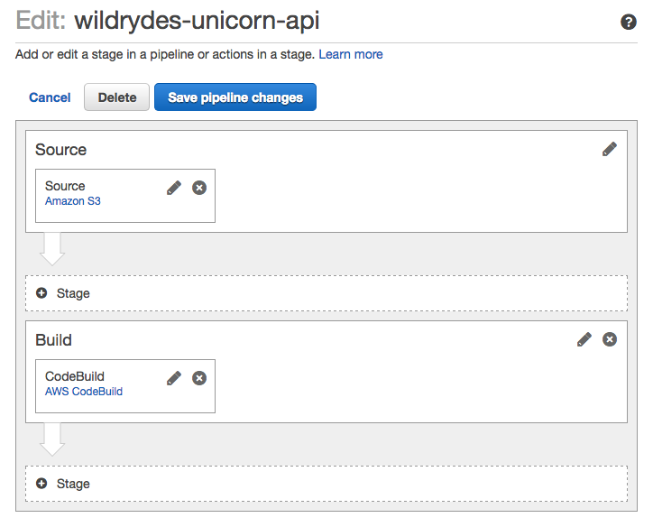

1. Enter `Prod` for the **Stage Name**.

1. Choose `+Action` below `Prod`.

#### 2b. Add CreateChangeSet Action to Prod Stage

1. In the **Add action** dialog, select `Deploy` for the **Action category**.

1. Enter `CreateChangeSet` for the **Action name**.

1. Select `AWS CloudFormation` for the **Deployment provider**.

   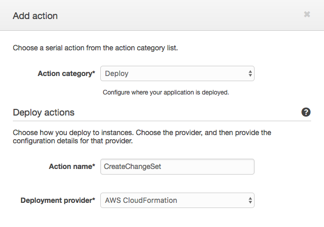

1. Select `Create or replace a change set` for **Action mode**

1. Enter `wildrydes-unicorn-api` for **Stack name**

1. Enter `wildrydes-unicorn-api-changeset` for **Change set name**

1. Enter `MyAppBuild::app-sam-output.yaml` for **Template**

1. Select `CAPABILITY_IAM` for **Capabilities**

1. Enter `WildRydesUnicornApiCloudFormation` for **Role name**

   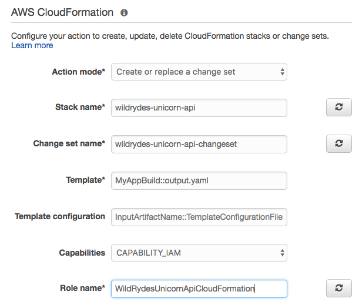

1. Enter `MyAppBuild` for **Input artifacts #1**

   

1. Choose **Add Action**

#### 2c. Add ExecuteChangeSet Action to Prod Stage

1. Choose `+Action` below `CreateChangeSet`.

   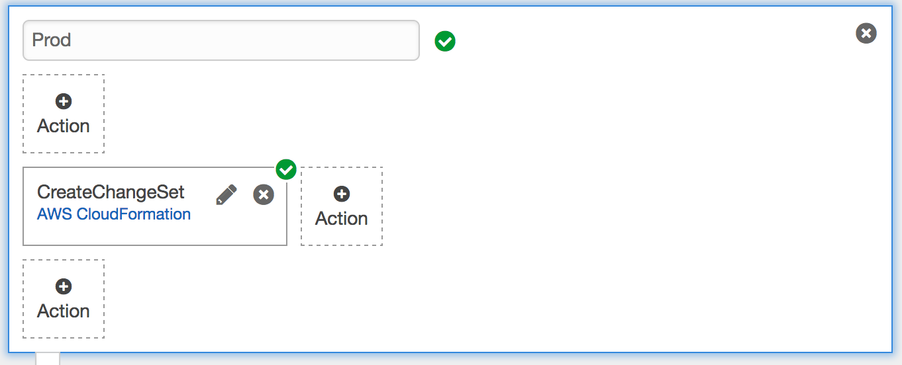

1. In the **Add action** dialog, select `Deploy` for the **Action category**.

1. Enter `ExecuteChangeSet` for the **Action name**.

1. Select `AWS CloudFormation` for the **Deployment provider**.

   

1. Select `Execute a change set` for **Action mode**

1. Enter `wildrydes-unicorn-api` for **Stack name**

1. Enter `wildrydes-unicorn-api-changeset` for **Change set name**

   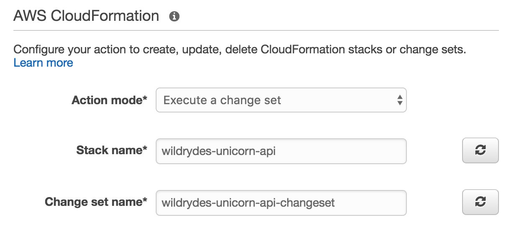

1. Choose **Add Action**

#### 2d. Save CodePipeline Changes

The pipeline should look like the following screenshot after adding the new Prod stage.

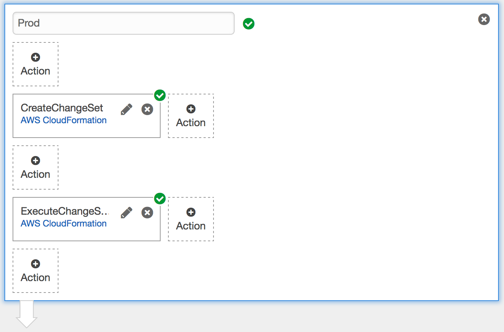

1. Scroll to the top of the pipeline and choose `Save pipeline changes`

1. Choose `Save and Continue` when prompted by the Save Pipeline Changes dialog.

## Prod Stage Validation

The addition of the deploy stage is complete.  You will now validate that the Prod stage is working by updating the Unicorn API with a new method to remove a Unicorn from the Wild Ryde stables, and deploying the change using CodePipeline.

### 1. Add Delete Function to app-sam.yaml

Using a text editor, open the `app-sam.yaml` file and append a new **AWS::Serverless::Function** Resource labeled `DeleteFunction` that has the following definition.

> Note: whitespace is important in YAML files.  Please verify that the configuration below is added with the same space indentation as the CloudFormation Resources in the app-sam.yaml file.

1. **CodeUri** is ``app``

1. **Runtime** is ``nodejs6.10``

1. **Handler** is ``delete.lambda_handler``

1. **Event** type is ``Api`` associated to the ``/unicorns/{name}`` **Path** and ``delete`` **Method**

1. **Environment** variable named `TABLE_NAME` that references the `DynamodbTable` Resources for its value.

1. **Policies** should mirror other Functions, however the **Action** to allow is ``dynamodb:DeleteItem``

If you are unsure of the syntax to add to ``app-sam.yaml`` please refer to the code snippet below.

<details>
<summary><strong>app-sam.yaml additions to support Delete function (expand for details)</strong></summary><p>

```yaml
  DeleteFunction:
    Type: 'AWS::Serverless::Function'
    Properties:
      Runtime: nodejs6.10
      CodeUri: app
      Handler: delete.lambda_handler
      Description: Remove Unicorn
      Events:
        UpdateApi:
          Type: Api
          Properties:
            Path: /unicorns/{name}
            Method: delete
      Environment:
        Variables:
          TABLE_NAME: !Ref DynamodbTable
      Policies:
        - Version: '2012-10-17'
          Statement:
            - Effect: Allow
              Resource: !Sub 'arn:aws:dynamodb:${AWS::Region}:${AWS::AccountId}:table/${DynamodbTable}'
              Action:
                - 'dynamodb:DeleteItem'
```

</p></details>

### 2. Create a Deployment Package

1. Change directory to `aws-serverless-workshops-master/DevOps/2_ContinuousDeliveryPipeline/unicorn-api`.

1. To create a deployment for this project, zip the contents of the `unicorn-api` directory into a file named **`unicorn-api.zip`**, which is your deployment package.  If you are unsure how to zip the files in the `unicorn-api` directory, follow the instructions for Microsoft workstations [here](https://support.microsoft.com/en-us/instantanswers/2df754f6-7039-824c-b5be-6dda11b5075e/zip-and-unzip-files), and macOS workstations [here](https://support.apple.com/kb/PH25411).

**Important**
> Zip the directory content, not the directory. The contents of the Zip file are available as the current working directory of the Lambda function. For example: /app-sam.yaml

### 3. Upload the Deployment Package to S3

1. In the AWS Management Console, choose **Services** then select **S3** under Storage.

1. Browse the list of Buckets or use the search box to find the S3 bucket that you identified previously.

1. Choose **Upload**

1. Choose **Add files**, select the local copy of `unicorn-api.zip` and then choose **Upload** in the bottom left corner of the dialog.

### 4. Confirm CodePipeline Completion

1. From the AWS Management Console, click on **Services** and then select **CodePipeline** in the Developer Tools section.

1. Choose `wildrydes-unicorn-api` from the list of pipelines.

1. Observe that each stage's color will turn blue during execution and green on completion.  Following the successful execution of all stages, the pipeline should look like the following screenshot.


### 4. Test Delete API Method

1. In the AWS Management Console, click **Services** then select **API Gateway** under Application Services.

1. In the left nav, click on `wildrydes-unicorn-api`.

1. From the list of API resources, click on the `DELETE` link under the `/{name}` resource.

1. On the resource details panel, click the `TEST` link in the client box on the left side of the panel.

1. On the test page, enter `Shadowfox` in the **Path** field.

1. Click on the **Test** button.

1. Scroll to the top of the test page, and verify that on the right side of the panel that the **Status** code of the HTTP response is 200.

1. In the left nav, under the `wildrydes-unicorn-api` API click on **Stages**, expand the **Prod** stage, and choose the `GET` method under the `/unicorns` resource.

1. At the top of the **Prod Stage Editor** panel, open the **Invoke URL** to a new browser window to display a list of Unicorns in the browser.  `Shadowfox` should not be in the list of Unicorns.

## Completion

Congratulations!  You have successfully created a Continuous Delivery Pipeline using CodePipeline to automate the deployment of the Unicorn API. In the next [X-Ray Module](../3_XRay), you will integrate AWS X-Ray to demonstrate how to troubleshoot the Unicorn API.
