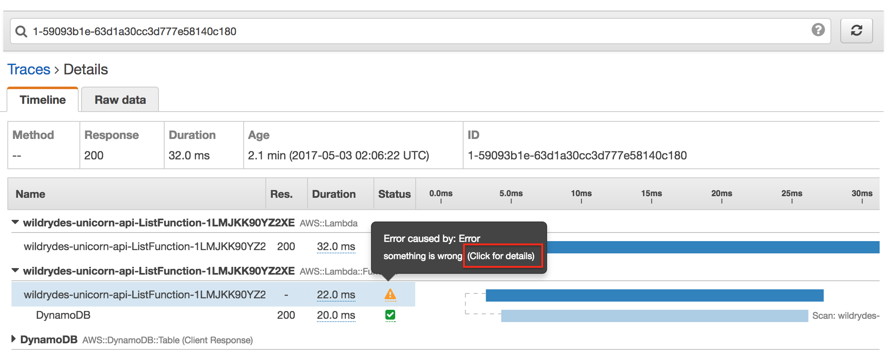
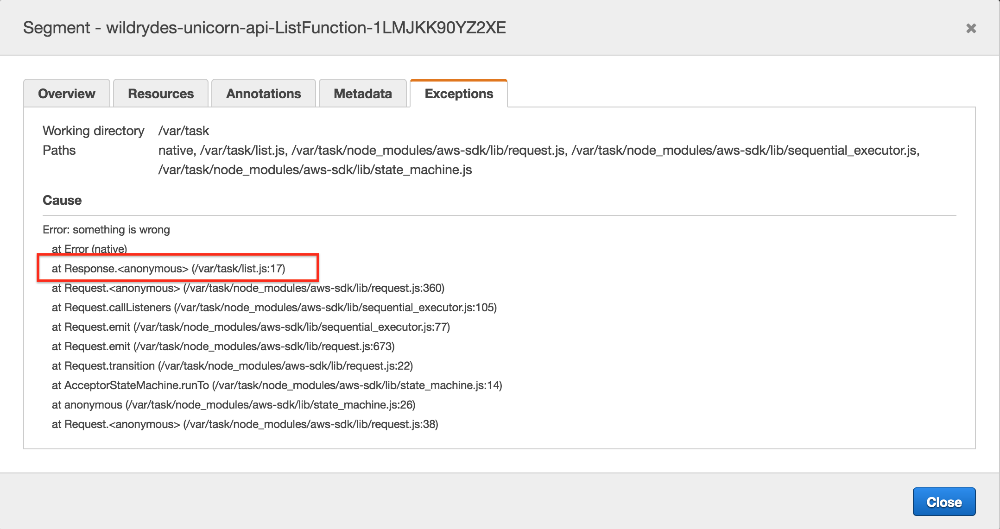
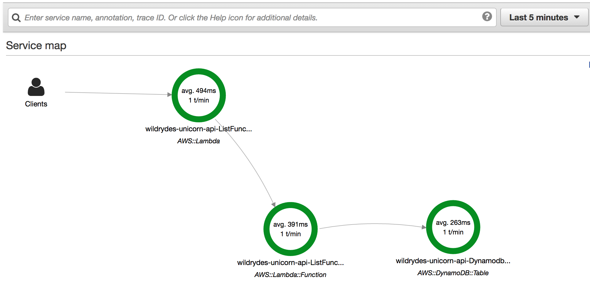

# Module 3: AWS X-Ray Integration

In this module, you'll use [AWS X-Ray](https://aws.amazon.com/xray/) to analyze and debug the Unicorn API after a code change is deployed through the [AWS CodePipeline](https://aws.amazon.com/codepipeline/) that you built in [Module 2: Continuous Delivery Pipeline](../2_ContinuousDeliveryPipeline).

## AWS X-Ray Overview

[AWS X-Ray](https://aws.amazon.com/xray/) helps you analyze and debug production, distributed applications. With X-Ray, you can understand how your application and its underlying services are performing to identify and troubleshoot the root cause of performance issues and errors. X-Ray provides an end-to-end view of requests as they travel through your application, and shows a map of your application's underlying components. You can use X-Ray to analyze both applications in development and in production.

In Module 3, you will use the CodePipeline that you built in Module 2 to deploy an updated version of the Unicorn API that includes a code bug.  X-Ray has been integrated into the Unicorn API, and you will use X-Ray to identify and troubleshoot the code bug.  Once you have corrected the bug, you will deploy your code changes through your pipeline and use X-Ray to validate the fix.  Next, we'll look at how to integrate X-Ray with Lambda.

## AWS X-Ray Integration with AWS Lambda

You can now use AWS X-Ray to trace requests made to your serverless applications built using AWS Lambda. This enables you to gain insights into the performance of serverless applications, allowing you to pinpoint the root cause of issues so that you can address them.

To integrate X-Ray with Lambda, a few changes are required to the Unicorn API from Module 2.  These changes are already included in the uni-api in Module 3, but we will review them so that you are familiar with the modifications.

### Enable Active Tracing on Lambda Functions

Each Lambda Function must be enabled for active tracing for X-Ray by adding a `Tracing` property with a value of `Active` ([see more](https://github.com/awslabs/serverless-application-model/blob/master/versions/2016-10-31.md#properties)).

### Integrate AWS X-Ray SDK with Lambda Function

Currently, you can use the X-Ray SDKs for Node.js and Java with Lambda.  To integrate the X-Ray SDK into the Node.js Unicorn API, the [aws-xray-sdk](https://www.npmjs.com/package/aws-xray-sdk) node module is added as a project dependency using [npm](https://www.npmjs.com/).  This has already been included in the `package.json` file in the `uni-api/app` directory, and will be included in the project during the Build stage with the addition of a new step in the **build** phase of the CodeBuild `uni-api/buildspec.yml` file:

```yaml
build:
  commands:
    - cd app && npm install
    - aws cloudformation package --template app-sam.yaml --s3-bucket $S3_BUCKET --output-template template-export.yml
```

With the addition of the [aws-xray-sdk](https://www.npmjs.com/package/aws-xray-sdk) library to the project, the library needs to be integrated into the application code.  Below are the Lambda function initialization code snippets before and after the X-Ray integration.

Before:

```javascript
const AWS = require('aws-sdk');
const docClient = new AWS.DynamoDB.DocumentClient();
const tableName = process.env.TABLE_NAME;
```

After:

```javascript
const AWSXRay = require('aws-xray-sdk');
const AWS = AWSXRay.captureAWS(require('aws-sdk'));
const docClient = new AWS.DynamoDB.DocumentClient();
const tableName = process.env.TABLE_NAME;
```

As you can see, the basic X-Ray integration into Lambda requires only two changes.  One new line of code to include the `aws-xray-sdk`, and a second modification to wrap the `aws-sdk` library with X-Ray.  This causes all the AWS API calls to be wrapped by X-Ray for instrumentation without having to change the code further.

## Implementation Instructions

Each of the following sections provide an implementation overview and detailed, step-by-step instructions. The overview should provide enough context for you to complete the implementation if you're already familiar with the AWS Management Console or you want to explore the services yourself without following a walkthrough.

If you're using the latest version of the Chrome, Firefox, or Safari web browsers the step-by-step instructions won't be visible until you expand the section.

### 1. Add the AWSXrayWriteOnlyAccess Policy to the `CodeStarWorker-uni-api-Lambda` Role

1. In the AWS Management Console choose **Services** then select **IAM** under Security, Identity & Compliance.

1. Select Role in the left navigation, type `CodeStarWorker-uni-api-Lambda` in the filter text box, and click the Role name link in the Role table.

    
 
1. On the Role Summary page, click the **Attach Policy** button in the **Managed Policies** section of the **Permissions** tab.

    
 
1. Type `AWSXRayWriteOnlyAccess` in the filter text box, select the checkbox next to the **AWSXRayWriteOnlyAccess** Managed Policy, and click the **Attach Policy** button.

    
 
1. The Role Summary will now include the **AWSXRayWriteOnlyAccess** policy in the list of **Managed Policies**.

    
 

### 2. Seed the `uni-api` CodeCommit Git repository

1. Each module has corresponding source code used to seed the CodeStar CodeCommit Git repository to support the workshop.  To seed the CodeCommit Git repository, click on the **Launch Stack** button for your region below:

    Region| Launch
    ------|-----
    US East (N. Virginia) | [](https://console.aws.amazon.com/cloudformation/home?region=us-east-1#/stacks/create/review?stackName=Seed-3-XRay&templateURL=https://s3.amazonaws.com/fsd-aws-wildrydes-us-east-1/codestar-template.yml&param_sourceUrl=https://s3.amazonaws.com/fsd-aws-wildrydes-us-east-1/uni-api-3.zip&param_targetProjectId=uni-api&param_targetProjectRegion=us-east-1)
    US West (N. California) | [](https://console.aws.amazon.com/cloudformation/home?region=us-west-1#/stacks/create/review?stackName=Seed-3-XRay&templateURL=https://s3.amazonaws.com/fsd-aws-wildrydes-us-west-1/codecommit-template.yml&param_sourceUrl=https://s3-us-west-1.amazonaws.com/fsd-aws-wildrydes-us-west-1/uni-api-3.zip&param_targetRepositoryName=uni-api&param_targetRepositoryRegion=us-west-1)

1. The CloudFormation template has been prepopulated with the necessary fields for this module.  No changes are necessary

1. Select the **I acknowledge that AWS CloudFormation might create IAM resources.** checkbox to grant CloudFormation permission to create IAM resources on your behalf

1. Click the **Create** button in the lower right corner of the browser window to create the CloudFormation stack and seed the CodeCommit repository.

    

1. There will be a short delay as the Git repository seeded with the new source code.  Upon successful completion, the CloudFormation will show Status ``CREATE_COMPLETE``.

    

### 3. Fetch CodeCommit Git Repository

Now that the CodeCommit Git repository has been seeded with new source code, you will need to fetch the changes locally so that you may modify the code.  Typically, this is accomplished using the `git pull` command, however for the workshop we have replaced the repository with a new history and different Git commands will be used.

Using your preferred Git client, run the commands on your local **uni-api** Git repository:

* `git fetch --all`
* `git reset --hard origin/master`

### 4. Validate CodePipeline Unicorn API Deployment

1. After the repository has been seeded, it will start a pipeline execution.  Monitor the pipeline until you observe the pipeline completion, indicated by the **Deploy** stage turning green.


### 5. Exercise List API Method

1. In the AWS Management Console choose **Services** then select **CodeStar** under Developer Tools.

1. Select the `uni-api` project

    

1. Copy the URL from the **Application endpoints** tile on the right side of the dashboard.

    

1. Paste the URL in a browser window and append `/unicorns` to the path and hit enter.  For example: `https://xxxxxxxxxx.execute-api.us-east-1.amazonaws.com/Prod/unicorns/`

1. Your browser should return an error, like the following.  Feel free to refresh your broser several times to register multiple visits to the REST API.

   ```json
   {
     "message": "Internal server error"
   }
   ```

Oh no!  A bug has been introduced in this version of Unicorn API.  Follow the steps in the next section to use X-Ray to identify an error occurred.

## Validation Using X-Ray

1. In the AWS Management Console, click **Services** then select **X-Ray** under Developer Tools.

   If this is your first visit to X-Ray, proceed to the next step to navigate the Getting Started page.  Otherwise, skip to Step 4.

1. Click **Get started**

    

1. Click **Cancel**

    

1. The X-Ray Console will open to a Service map that should look similar to the screenshot below:


**Important**
> There can be a slight delay for X-Ray to ingest and process the API calls.  If you don't see the above picture, try refreshing the browser window.

### Service Map

The image shows a client, your browser, connecting to the **AWS::Lambda** resource, which represents the instantiation of the Lambda function.  The second connection to the **AWS::Lambda::Function** represents the call to `list.lambda_handler`, which is the handler defined in the `app-sam.yaml` template.  The third connection to the **AWS::DynamoDB::Table** represents the queries to the DynamoDB table that persists the Unicorn Stable.

The orange circles around **AWS::Lambda** and **AWS::Lambda::Function** indicates there is an error when making the HTTP calls between these services.

### Traces

1. In the left nav, click on **Traces**.

1. In the **Trace Overview**, note that (in this scenario) there at 7 Errors in the list of Responses.

   

1. In the **Trace List** below the **Trace Overview**, click on the first Trace highlighted in orange above to open the **Trace Detail** page.

1. On the **Trace Detail** page, note the **Timeline** of HTTP calls, originating with the API Gateway, but extending to other distributed systems traced by X-Ray.  The Lambda function in the **Trace Detail** listed above the DynamoDB Table has an orange caution icon to indicate an **Error**.  Mousing over the caution icon displays a pop-up dialog with the cause of Error, in this case, `something is wrong`.

   

1. Click the caution icon to view the Trace **Segment** details (below):

   

1.  The **Segment Detail** shows the **Exception** that was raised and the line of code in `list.js` that caused the error, **line 17**.  Next, let's locate and fix the bug.

1.  Click the **Close** button to close the dialog.

Next, let's locate and fix the bug!

## Remediation

### 1. Fix Code Bug

1.  On your workstation, open the `app/list.js` file and naviagte to line 17, which should look like the following code snippet:

   ```
   docClient.scan(params, function(error, data) {
     // Comment or Delete the following line of code to remove simulated error
     error = Error("something is wrong");
   ```

1. Comment or delete Line 17 to fix the code bug

1. Save the `app/list.js` file.

### 2. Commit the change to local Git repository

1. Using your Git client, add the local changes to the Git index, and commit with a message.  For example:

    ```
    %> git add .
    %> git commit -m "Fix bug"
    ```

1. Using your Git client, push the Git repository updates to the origin.  For example:

    ```
    %> git push origin
    ```

### 3. Validate CodePipeline Unicorn API Deployment

After pushing your changes to the CodeStar project's CodeCommit git repository, you will confirm that the changes are build and deployed successfully using CodePipeline.

1. In the AWS Management Console choose **Services** then select **CodeStar** under Developer Tools.

1. Select the `uni-api` project

    

1. Observe that the continuous deployment pipeline on the right of the browser window now shows the Source stage to be blue, meaning that it is active.

    

1. Each stage's color will turn blue during execution and green on completion.  Following the successful execution of all stages, the pipeline should look like the following screenshot.

    
    
### 4. Excercise Unicorn API List Resource

1. In the AWS Management Console choose **Services** then select **CodeStar** under Developer Tools.

1. Select the `uni-api` project

    

1. Copy the URL from the **Application endpoints** tile on the right side of the dashboard.

    

1. Paste the URL in a browser window and append `/unicorns` to the path and hit enter.  For example: `https://xxxxxxxxxx.execute-api.us-east-1.amazonaws.com/Prod/unicorns/`

1. Your browser should return an error, like the following.  Feel free to refresh your broser several times to register multiple visits to the REST API.

1. Your browser should no longer return an error.  Feel free to refresh your browser several times to register multiple REST API requests.

   ```json
   [ ]
   ```

The bug has been fixed and the API now responds without error.  Let's use X-Ray to validate your results.

## Remediation Validation Using X-Ray

1. In the AWS Management Console, click **Services** then select **X-Ray** under Developer Tools.

1. The X-Ray Console will open to a Service map that should look similar to the screenshot below:



**Important**
> There can be a slight delay for X-Ray to ingest and process the API calls.  If you don't see the above picture, try refreshing the browser window.

## Completion

Congratulations!  You have successfully integrated AWS X-Ray and demonstrated how it can be used to identify errors, and their remediation.  In the next [Multiple Environments Module](../4_MultipleEnvironments), you will enhance the pipeline by adding a Beta stage to the pipeline, and incorporate testing in the Beta stage before deploying to Prod.
