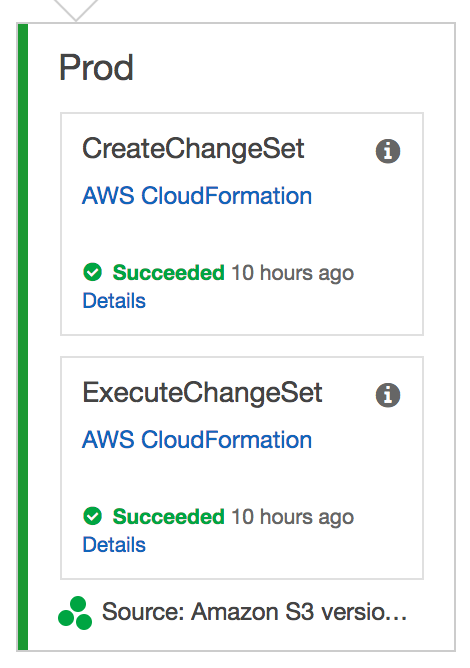

# Module 3: AWS X-Ray Integration

In this module, you'll use [AWS X-Ray](https://aws.amazon.com/xray/) to analyze and debug the Unicorn API after a code change is deployed through the [AWS CodePipeline](https://aws.amazon.com/codepipeline/) that you built in [Module 2: Continuous Delivery Pipeline](../2_ContinuousDeliveryPipeline).

## AWS X-Ray Overview

[AWS X-Ray](https://aws.amazon.com/xray/) helps you analyze and debug production, distributed applications. With X-Ray, you can understand how your application and its underlying services are performing to identify and troubleshoot the root cause of performance issues and errors. X-Ray provides an end-to-end view of requests as they travel through your application, and shows a map of your application’s underlying components. You can use X-Ray to analyze both applications in development and in production.

In Module 3, you will use the CodePipeline that you built in Module 2 to deploy an updated version of the Unicorn API that includes a code bug.  X-Ray has been integrated into the Unicorn API, and you will use X-Ray to identify and troubleshoot the code bug.  Once you have corrected the bug, you will deploy your code changes through your pipeline and use X-Ray to validate the fix.  Next, we'll look at how to integrate X-Ray with Lambda.

## AWS X-Ray Integration with AWS Lambda

You can now use AWS X-Ray to trace requests made to your serverless applications built using AWS Lambda. This enables you to gain insights into the performance of serverless applications, allowing you to pinpoint the root cause of issues so that you can address them.

To integrate X-Ray with Lambda, a few changes are required to the Unicorn API from Module 2.  These changes are already included in the unicorn-api in Module 3, but we will review them so that you are familiar with the modifications.

### Lambda Execution Policy Update

An additional IAM Managed Policy named `AWSXrayWriteOnlyAccess` must be added to the Lambda Execution Policy to allow it to write X-Ray traces.  Fortunately, because a SAM CloudFormation template is used to specify the Lambda functions and related IAM Policies, it's a simple one line update to each Lambda to add the new policy.  For example, note the addition of the `AWSXrayWriteOnlyAccess` to the ListFunction Lambda function specified in `app-sam.yaml`:

```yaml
  ListFunction:
    Type: 'AWS::Serverless::Function'
    Properties:
      Runtime: nodejs6.10
      CodeUri: app
      Handler: list.lambda_handler
      Description: List Unicorns
      Events:
        ListApi:
          Type: Api
          Properties:
            Path: /unicorns
            Method: get
      Environment:
        Variables:
          TABLE_NAME: !Ref DynamodbTable
      Policies:
        - AWSXrayWriteOnlyAccess
        - Version: '2012-10-17'
          Statement:
            - Effect: Allow
              Resource: !Sub 'arn:aws:dynamodb:${AWS::Region}:${AWS::AccountId}:table/${DynamodbTable}'
              Action:
                - 'dynamodb:Scan'
```

### Enable Active Tracing on Lambda Functions

In addition to the new `AWSXrayWriteOnlyAccess` IAM Policy, each Lambda Function must be enabled for active tracing for X-Ray.  This configuration change has been automated through the use of a CloudFormation Custom Resource, which is beyond the scope of this Module.

### Integrate AWS X-Ray SDK with Lambda Function

Currently, you can use the X-Ray SDKs for Node.js and Java with Lambda.  To integrate the X-Ray SDK into the Node.js Unicorn API, the [aws-xray-sdk](https://www.npmjs.com/package/aws-xray-sdk) node module is added as a project dependency using [npm](https://www.npmjs.com/).  This has already been included in the `package.json` file in the `unicorn-api/app` directory, and will be included in the project during the Build stage with the addition of a new step in the **pre_build** phase of the CodeBuild `unicorn-api/buildspec.yml` file:

```yaml
pre_build:
  commands:
    - echo "Installing dependencies - `pwd`"
    - cd app && npm install
```

With the addition of the [aws-xray-sdk](https://www.npmjs.com/package/aws-xray-sdk) library to the project, the library needs to be integrated into the application code.  Below are the Lambda function initialization code snippets before and after the X-Ray integration.

Before:

```javascript
const AWS = require('aws-sdk');
const docClient = new AWS.DynamoDB.DocumentClient();
const tableName = process.env.TABLE_NAME;
```

After:

```javascript
const AWSXRay = require('aws-xray-sdk');
const AWS = AWSXRay.captureAWS(require('aws-sdk'));
const docClient = new AWS.DynamoDB.DocumentClient();
const tableName = process.env.TABLE_NAME;
```

As you can see, the basic X-Ray integration into Lambda requires only two changes.  One new line of code to include the `aws-xray-sdk`, and a second modification to wrap the `aws-sdk` library with X-Ray.  This causes all the AWS API calls to be wrapped by X-Ray for instrumentation without having to change the code further.

## Implementation Instructions

Each of the following sections provide an implementation overview and detailed, step-by-step instructions. The overview should provide enough context for you to complete the implementation if you're already familiar with the AWS Management Console or you want to explore the services yourself without following a walkthrough.

If you're using the latest version of the Chrome, Firefox, or Safari web browsers the step-by-step instructions won't be visible until you expand the section.

### 1. Identify Wild Rydes S3 Bucket

You will reuse the S3 Bucket that you created in [Module 1: Serverless Application Model](../1_ServerlessApplicationModel/README.md#1-create-an-s3-bucket) from the DevOps Workshop.  If you have not completed this Module, please refer to the module instructions to create the S3 Bucket.

If you are unsure of your S3 Bucket's name, please follow the instructions below.

<details>
<summary><strong>Step-by-step instructions (expand for details)</strong></summary><p>

1. In the AWS Management Console choose **Services** then select **S3** under Storage.

1. Browse the list of Buckets or use the search box to identify the S3 Bucket.  `wildrydes-devops-yourname` was recommended as the Bucket name, however you may have chosen a different globaly unique name.

</p></details>

### 2. Create a Deployment Package

The CodePipeline that you will create in the next step will be triggered by updates to a deployment package in S3.

1. Change directory to `aws-serverless-workshops-master/DevOps/3_XRay/unicorn-api`.

1. To create a deployment for this project, zip the contents of the `unicorn-api` directory into a file named **`unicorn-api.zip`**, which is your deployment package.  If you are unsure how to zip the files in the `unicorn-api` directory, follow the instructions for Microsoft workstations [here](https://support.microsoft.com/en-us/instantanswers/2df754f6-7039-824c-b5be-6dda11b5075e/zip-and-unzip-files), and macOS workstations [here](https://support.apple.com/kb/PH25411).

**Important**
> Zip the directory content, not the directory. The contents of the Zip file are available as the current working directory of the Lambda function. For example: /app-sam.yaml

### 3. Upload the Deployment Package to S3

1. In the AWS Management Console, choose **Services** then select **S3** under Storage.

1. Browse the list of Buckets or use the search box to find the S3 bucket that you identified previously.

1. Choose **Upload**

1. Choose **Add files**, select the local copy of `unicorn-api.zip` and then choose **Upload** in the bottom left corner of the dialog.

### 4. Validate CodePipeline Unicorn API Deployment

1. As you observed in Module 2, updating the `unicorn-api.zip` in the S3 bucket will trigger the pipeline.  Monitor the pipeline until you observe the pipeline completion, indicated by a green bar to the left of the **Prod** stage.  See below.



### 5. Excercise Unicorn API List Resource

1. In the AWS Management Console, click **Services** then select **API Gateway** under Application Services.

1. In the left nav, click on `wildrydes-unicorn-api`.

1. In the left nav, under the `wildrydes-unicorn-api` API click on **Stages**, expand the **Prod** stage, and choose the `GET` method under the `/unicorns` resource.

1. At the top of the **Prod Stage Editor** panel, open the **Invoke URL** to a new browser window to display a list of Unicorns in the browser.

1. Your browser should return an error, like the following.  Feel free to refresh your broser several times to register multiple visits to the REST API.

   ```json
   {
     "message": "Internal server error"
   }
   ```

Oh no!  A bug has been introduced in this version of Unicorn API.  Follow the steps in the next section to use X-Ray to identify an error occurred.

## Validation Using X-Ray

1. In the AWS Management Console, click **Services** then select **X-Ray** under Developer Tools.

1. The X-Ray Console will open to a Service map that should look similar to the screenshot below:


**Important**
> There can be a slight delay for X-Ray to ingest and process the API calls.  If you don't see the above picture, try refreshing the browser window.

### Service Map

The image shows a client, your browser, connecting to the **AWS::Lambda** resource, which represents the instantiation of the Lambda function.  The second connection to the **AWS::Lambda::Function** represents the call to `list.lambda_handler`, which is the handler defined in the `app-sam.yaml` template.  The third connection to the **AWS::DynamoDB::Table** represents the queries to the DynamoDB table that persists the Unicorn Stable.

The orange circles around **AWS::Lambda** and **AWS::Lambda::Function** indicates there is an error when making the HTTP calls between these services.

### Traces

1. In the left nav, click on **Traces**.

1. In the **Trace Overview**, note that (in this scenario) there at 7 Errors in the list of Responses.

   

1. In the **Trace List** below the **Trace Overview**, click on the first Trace highlighted in orange above to open the **Trace Detail** page.

1. On the **Trace Detail** page, note the **Timeline** of HTTP calls, originating with the API Gateway, but extending to other distributed systems traced by X-Ray.  The Lambda function in the **Trace Detail** listed above the DynamoDB Table has an orange caution icon to indicate an **Error**.  Mousing over the caution icon displays a pop-up dialog with the cause of Error, in this case, `something is wrong`.

   

1. Click the caution icon to view the Trace **Segment** details (below):

   

1.  The **Segment Detail** shows the **Exception** that was raised and the line of code in `list.js` that caused the error, **line 17**.  Next, let's locate and fix the bug.

1.  Click the **Close** button to close the dialog.

Next, let's locate and fix the bug!

## Remediation

### 1. Fix Code Bug

1.  On your workstation, open the `unicorn-api/app/list.js` file and naviagte to line 17, which should look like the following code snippet:

   ```
   docClient.scan(params, function(error, data) {
     // Comment or Delete the following line of code to remove simulated error
     error = Error("something is wrong");
   ```

1. Comment or delete Line 17 to fix the code bug

1. Save the `unicorn-api/app/list.js` file.

### 2. Create a Deployment Package

The CodePipeline that you will create in the next step will be triggered by updates to a deployment package in S3.

1. Change directory to `aws-serverless-workshops-master/DevOps/3_XRay/unicorn-api`.

1. To create a deployment for this project, zip the contents of the `unicorn-api` directory into a file named **`unicorn-api.zip`**, which is your deployment package.  If you are unsure how to zip the files in the `unicorn-api` directory, follow the instructions for Microsoft workstations [here](https://support.microsoft.com/en-us/instantanswers/2df754f6-7039-824c-b5be-6dda11b5075e/zip-and-unzip-files), and macOS workstations [here](https://support.apple.com/kb/PH25411).

**Important**
> Zip the directory content, not the directory. The contents of the Zip file are available as the current working directory of the Lambda function. For example: /app-sam.yaml

### 3. Upload the Deployment Package to S3

1. In the AWS Management Console, choose **Services** then select **S3** under Storage.

1. Browse the list of Buckets or use the search box to find the S3 bucket that you identified previously.

1. Choose **Upload**

1. Choose **Add files**, select the local copy of `unicorn-api.zip` and then choose **Upload** in the bottom left corner of the dialog.

### 4. Validate CodePipeline Unicorn API Deployment

1. As you observed in Module 2, updating the `unicorn-api.zip` in the S3 bucket will trigger the pipeline.  Monitor the pipeline until you observe the pipeline completion, indicated by a green bar to the left of the **Prod** stage.  See below.


### 5. Excercise Unicorn API List Resource

1. In the AWS Management Console, click **Services** then select **API Gateway** under Application Services.

1. In the left nav, click on `wildrydes-unicorn-api`.

1. In the left nav, under the `wildrydes-unicorn-api` API click on **Stages**, expand the **Prod** stage, and choose the `GET` method under the `/unicorns` resource.

1. At the top of the **Prod Stage Editor** panel, open the **Invoke URL** to a new browser window to display a list of Unicorns in the browser.

1. Your browser should no longer return an error.  Feel free to refresh your browser several times to register multiple REST API requests.

   ```json
   [ ]
   ```

The bug has been fixed and the API now responds without error.  Let's use X-Ray to validate your results.

## Remediation Validation Using X-Ray

1. In the AWS Management Console, click **Services** then select **X-Ray** under Developer Tools.

1. The X-Ray Console will open to a Service map that should look similar to the screenshot below:


**Important**
> There can be a slight delay for X-Ray to ingest and process the API calls.  If you don't see the above picture, try refreshing the browser window.

## Completion

Congratulations!  You have successfully integrated AWS X-Ray and demonstrated how it can be used to identify errors, and their remediation.  In the next [Multiple Environments Module](../4_MultipleEnvironments), you will enhance the pipeline by adding a Beta stage to the pipeline, and incorporate testing in the Beta stage before deploying to Prod.
