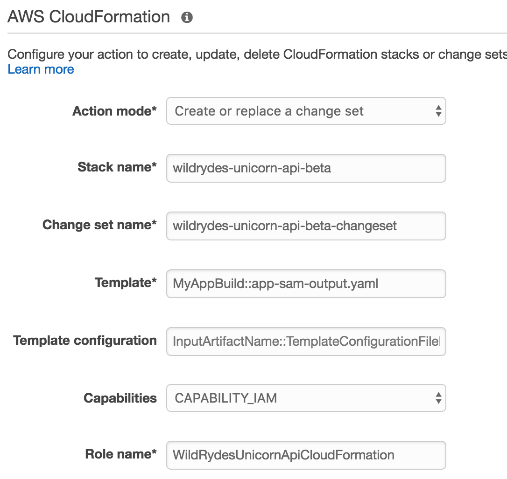

# Module 4: Multiple Environment CI/CD Pipeline

In this module, you'll enhance the [AWS CodePipeline](https://aws.amazon.com/codepipeline/) that you built in [Module 2](../2_ContinuousDeliveryPipeline/README.md) to add integration tests, and a Beta environment in which to test them.

## Integration Tests Overview

To add integration tests to the pipeline, a second test application has been introduced to the Unicorn API project.  Like the Unicorn API, the Test application consists of Lamdba Functions and a SAM CloudFormation template (`unicorn-api/test-sam.yaml`).  In addition to the Lambda Functions and SAM template updates to the Unicorn API, the [AWS CodeBuild](https://aws.amazon.com/codebuild/) `unicorn-api/buildspec.yml` has been modified to include a second set of commands that mirror the original application deployment.  These commands install test dependencies, package the test SAM template, and include the test output SAM template as an additional artifact.

The integration test use a library for API testing, [hippie](https://github.com/vesln/hippie), which includes a DSL for the easy description of HTTP requests.  The `unicorn-api/test/test.js` defines a series of requests that excercise the Unicorn API REST resources, which are chained together using Javascript Promises.  Below is a code snippet showing the chained Promises to execute the test cases.  If all tests pass successfully, the function uses the injected CodePipeline **Job Id** to send a success callback, signaling the CodePipeline to transition.  If any of the tests fail, a failure callback is sent, signaling the CodePipeline to halt.

```javacript
exports.lambda_handler = (event, context, callback) => {
  var api = event.api_url + '/unicorns/';
  var unicorn = build_unicorn();

  Promise.resolve()
    .then(result => {
      return list_unicorns(api, unicorn);
    })
    .then(result => {
      return update_unicorn(api, unicorn);
    })
    .then(result => {
      return view_unicorn_found(api, unicorn);
    })
    .then(result => {
      return view_unicorn_not_found(api, unicorn);
    })
    .then(result => {
      return remove_unicorn(api, unicorn);
    })
    .then(result => {
      console.log('SUCCESS');
      complete_job(event.job_id, result, callback);
    })
    .catch(reason => {
      console.log('ERROR: ' + reason.test_name + ' | ' + reason.message);
      fail_job(event.job_id, reason, context.invokeid, callback);
    });
};
```

The `test.js` script is focused on defining and executing the API integration tests.  The `unicorn-api/test/setup.js` script is responsible for querying the CloudFormation Stack to auto-discover the API URL to send to the `test.js` for test execution.  After the API URL is discovered, the `setup.js` script asynchronously invokes the `test.js` Lambda Function, injecting the CodePipeline **Job Id** and **API URL**, as seen in the code snippet below.

```javacript
exports.lambda_handler = (event, context, callback) => {
  var job_id = event["CodePipeline.job"].id;
  var stack_name = event["CodePipeline.job"].data.actionConfiguration.configuration.UserParameters;

  get_api_url(stack_name).then(function(api_url) {
    return invoke_test(job_id, api_url);
  }).catch(function(err) {
    fail_job(job_id, err, context.invokeid, callback);
  });
};
```

## CodePipeline Overview

In this module, you will update the CodePipeline you built in Module 2 with two new stages that are ordered between the Build and Prod stages.  Like the Prod stage, the new Test stage will include two actions that use the test output SAM template artifact from CodeBuild to Create and Execute a CloudFormation Change Set to deploy the Lambda functions as a new CloudFormation Stack.

Following the Test stage, you will add a Beta stage that includes two actions that creates a new CloudFormation Stack for the Unicorn API in a new environment for testing.  After the CloudFormation has been deployed, a third action will invoke a Lambda function from the Test application to drive integration tests against the Beta Unicorn API.  If the tests pass, the pipeline will transition to the Prod stage to complete the Unicorn API changes in the Prod environment.

Below is an image depicting the CodePipeline upon completion:


## Implementation Instructions

Each of the following sections provide an implementation overview and detailed, step-by-step instructions. The overview should provide enough context for you to complete the implementation if you're already familiar with the AWS Management Console or you want to explore the services yourself without following a walkthrough.

If you're using the latest version of the Chrome, Firefox, or Safari web browsers the step-by-step instructions won't be visible until you expand the section.

### 1. Identify Wild Rydes S3 Bucket

You will reuse the S3 Bucket that you created in [Module 1: Serverless Application Model](../1_ServerlessApplicationModel/README.md#1-create-an-s3-bucket) from the DevOps Workshop.  If you have not completed this Module, please refer to the module instructions to create the S3 Bucket

If you are unsure of your S3 Bucket's name, please follow the instructions below.

<details>
<summary><strong>Step-by-step instructions (expand for details)</strong></summary><p>

1. In the AWS Management Console choose **Services** then select **S3** under Storage.

1. Browse the list of Buckets or use the search box to identify the S3 Bucket.  `wildrydes-devops-yourname` was recommended as the Bucket name, however you may have chosen a different globaly unique name.

</p></details>

### 2. Add Test Stage

#### 2a. Edit CodePipeline

1. From the AWS Management Console, click on **Services** and then select **CodePipeline** in the Developer Tools section.

1. Choose `wildrydes-unicorn-api` from the list of pipelines.

1. Choose `Edit`.

#### 2b. Add Test Stage

1. Choose `+Stage` below the Build stage of the pipeline.

   

1. Enter `Test` for the **Stage Name**.

#### 2c. Add CreateChangeSet to Test Stage

1. Choose `+Action` below `Test`.

1. In the **Add action** dialog, select `Deploy` for the **Action category**.

1. Enter `CreateChangeSet` for the **Action name**.

1. Select `AWS CloudFormation` for the **Deployment provider**.

   

1. Select `Create or replace a change set` for **Action mode**

1. Enter `wildrydes-unicorn-api-test` for **Stack name**

1. Enter `wildrydes-unicorn-api-test-changeset` for **Change set name**

1. Enter `MyAppBuild::test-sam-output.yaml` for **Template**

1. Select `CAPABILITY_IAM` for **Capabilities**

1. Enter `WildRydesUnicornApiCloudFormation` for **Role name**

   

1. Enter `MyAppBuild` for **Input artifacts #1**

   

1. Choose **Add Action**

#### 2d. Add ExecuteChangeSet to Test Stage

1. Choose `+Action` below `CreateChangeSet`.

   

1. In the **Add action** dialog, select `Deploy` for the **Action category**.

1. Enter `ExecuteChangeSet` for the **Action name**.

1. Select `AWS CloudFormation` for the **Deployment provider**.

   

1. Select `Execute a change set` for **Action mode**

1. Enter `wildrydes-unicorn-api-test` for **Stack name**

1. Enter `wildrydes-unicorn-api-test-changeset` for **Change set name**

   

1. Choose **Add Action**

#### 2e. Save CodePipeline Changes

The pipeline should look like the following screenshot after adding the new Test stage.


1. Scroll to the top of the pipeline and choose `Save pipeline changes`

1. Choose `Save and Continue` when prompted by the Save Pipeline Changes dialog.

## Test Stage Validation

The addition of the Test stage is complete.  You will now validate the Test stage is working by creating and uploading a deployment package, and then monitoring the completion of the pipeline.

### 1. Create a Deployment Package

The CodePipeline that you will create in the next step will be triggered by updates to a deployment package in S3.

1. Change directory to `aws-serverless-workshops-master/DevOps/4_MultipleEnvironments/unicorn-api`.

1. To create a deployment for this project, zip the contents of the `unicorn-api` directory into a file named **`unicorn-api.zip`**, which is your deployment package.  If you are unsure how to zip the files in the `unicorn-api` directory, follow the instructions for Microsoft workstations [here](https://support.microsoft.com/en-us/instantanswers/2df754f6-7039-824c-b5be-6dda11b5075e/zip-and-unzip-files), and macOS workstations [here](https://support.apple.com/kb/PH25411).

**Important**
> Zip the directory content, not the directory. The contents of the Zip file are available as the current working directory of the Lambda function. For example: /app-sam.yaml

### 2. Upload the Deployment Package to S3

1. In the AWS Management Console, choose **Services** then select **S3** under Storage.

1. Browse the list of Buckets or use the search box to find the S3 bucket that you identified previously.

1. Choose **Upload**

1. Choose **Add files**, select the local copy of `unicorn-api.zip` and then choose **Upload** in the bottom left corner of the dialog.

### 3. Confirm CodePipeline Completion

1. From the AWS Management Console, click on **Services** and then select **CodePipeline** in the Developer Tools section.

1. Choose `wildrydes-unicorn-api` from the list of pipelines.

1. Observe that each stage's color will turn blue during execution and green on completion.  Following the successful execution of all stages, the pipeline should look like the following screenshot.


## Beta Stage Addition

### 1. Identify Lambda Test Function

1. In the AWS Management Console, choose **Services** then select **CloudFomation** under Management Tools.

1. Select the checkbox to the left of `wildrydes-unicorn-api-test` from the list of CloudFormation Stacks.

1. In the Stack Details, select the **Outputs** tab.

1. Copy the value of the **CodePipelineInvokeFunction** Output variable


### 2. Add Beta Stage

#### 2a. Edit CodePipeline

1. From the AWS Management Console, click on **Services** and then select **CodePipeline** in the Developer Tools section.

1. Choose `wildrydes-unicorn-api` from the list of pipelines.

1. Choose `Edit`.

#### 2b. Add Beta Stage

1. Choose `+Stage` below the Test stage of the pipeline.

   

1. Enter `Beta` for the **Stage Name**.

#### 2c. Add CreateChangeSet to Beta Stage

1. Choose `+Action` below `Beta`.

1. In the **Add action** dialog, select `Deploy` for the **Action category**.

1. Enter `CreateChangeSet` for the **Action name**.

1. Select `AWS CloudFormation` for the **Deployment provider**.

   

1. Select `Create or replace a change set` for **Action mode**

1. Enter `wildrydes-unicorn-api-beta` for **Stack name**

1. Enter `wildrydes-unicorn-api-beta-changeset` for **Change set name**

1. Enter `MyAppBuild::app-sam-output.yaml` for **Template**

1. Select `CAPABILITY_IAM` for **Capabilities**

1. Enter `WildRydesUnicornApiCloudFormation` for **Role name**

   

1. Enter `MyAppBuild` for **Input artifacts #1**

   

1. Choose **Add Action**

#### 2d. Add ExecuteChangeSet to Beta Stage

1. Choose `+Action` below `CreateChangeSet`.

   

1. In the **Add action** dialog, select `Deploy` for the **Action category**.

1. Enter `ExecuteChangeSet` for the **Action name**.

1. Select `AWS CloudFormation` for the **Deployment provider**.

   

1. Select `Execute a change set` for **Action mode**

1. Enter `wildrydes-unicorn-api-beta` for **Stack name**

1. Enter `wildrydes-unicorn-api-beta-changeset` for **Change set name**

   

1. Choose **Add Action**

#### 2e. Add Invoke to Beta Stage

1. Choose `+Action` below `ExecuteChangeSet`.

   

1. In the **Add action** dialog, select `Invoke` for the **Action category**.

1. Enter `InvokeLambdaTestFunction` for the **Action name**.

1. Select `AWS Lambda` for the **Deployment provider**.

1. Enter the Lambda Test Function Name identified in Step 1 for **Function name**

1. Enter `wildrydes-unicorn-api-beta` for **User parameters**

1. Choose **Add Action**

#### 2f. Save CodePipeline Changes

The pipeline should look like the following screenshot after adding the new Test stage.


1. Scroll to the top of the pipeline and choose `Save pipeline changes`

1. Choose `Save and Continue` when prompted by the Save Pipeline Changes dialog.

## Beta Stage Validation

The addition of the Beta stage is complete.  You will now validate the Beta stage is working by triggering a release of the current change.

### 1. Release Change

1. Choose the **Release change** button to start the pipeline.

1. Choose **Release** when prompted by the dialog box.

### 2. Confirm CodePipeline Completion

1. From the AWS Management Console, click on **Services** and then select **CodePipeline** in the Developer Tools section.

1. Choose `wildrydes-unicorn-api` from the list of pipelines.

1. Observe that each stage's color will turn blue during execution and green on completion.  You should see that the `InvokeLambdaTestFunction` action in the `Beta` stage fails, causing the stage to turn red, like the following image.

   

1. Choose the **Details** link in the failed action to see the details of the failed job.

   

The `test_list_unicorns` integration test has failed!  Next, let's locate and fix the bug.

## Remediation

### 1. Fix Code Bug

1.  On your workstation, open the `unicorn-api/app/list.js` file and naviagte to line 17, which should look like the following code snippet:

   ```
   docClient.scan(params, function(error, data) {
     // Comment or Delete the following line of code to remove simulated error
     error = Error("something is wrong");
   ```

1. Comment or delete Line 17 to fix the code bug

1. Save the `unicorn-api/app/list.js` file.

### 2. Create a Deployment Package

The CodePipeline that you will create in the next step will be triggered by updates to a deployment package in S3.

1. Change directory to `aws-serverless-workshops-master/DevOps/4_MultipleEnvironments/unicorn-api`.

1. To create a deployment for this project, zip the contents of the `unicorn-api` directory into a file named **`unicorn-api.zip`**, which is your deployment package.  If you are unsure how to zip the files in the `unicorn-api` directory, follow the instructions for Microsoft workstations [here](https://support.microsoft.com/en-us/instantanswers/2df754f6-7039-824c-b5be-6dda11b5075e/zip-and-unzip-files), and macOS workstations [here](https://support.apple.com/kb/PH25411).

**Important**
> Zip the directory content, not the directory. The contents of the Zip file are available as the current working directory of the Lambda function. For example: /app-sam.yaml

### 3. Upload the Deployment Package to S3

1. In the AWS Management Console, choose **Services** then select **S3** under Storage.

1. Browse the list of Buckets or use the search box to find the S3 bucket that you identified previously.

1. Choose **Upload**

1. Choose **Add files**, select the local copy of `unicorn-api.zip` and then choose **Upload** in the bottom left corner of the dialog.

## Remediation Validation

1. From the AWS Management Console, click on **Services** and then select **CodePipeline** in the Developer Tools section.

1. Choose `wildrydes-unicorn-api` from the list of pipelines.

1. Observe that each stage's color will turn blue during execution and green on completion.  You should see that the `InvokeLambdaTestFunction` in the `Beta` stage passes, causing the stage to turn green, like the following image.

   

Following the successful execution of all stages, the pipeline should look like the following screenshot.

   

## Completion

Congratulations, you've successfully completed the Multiple Environment CI/CD Pipeline Module!
