# Module 4: Multiple Environment CI/CD Pipeline

In this module, you'll enhance the [AWS CodePipeline](https://aws.amazon.com/codepipeline/) that you built in [Module 2](../2_ContinuousDeliveryPipeline/README.md) to add integration tests, and a Beta environment in which to test them.

## Integration Tests Overview

To add integration tests to the pipeline, a second test application has been introduced to the Unicorn API project.  Like the Unicorn API, the Test application consists of Lamdba Functions and a SAM CloudFormation template (`test-template.yml`).  In addition to the Lambda Functions and SAM template updates to the Unicorn API, the [AWS CodeBuild](https://aws.amazon.com/codebuild/) `buildspec.yml` has been modified to include a second set of commands that mirror the original application deployment.  These commands install test dependencies, package the test SAM template, and include the test output SAM template as an additional artifact.

The integration test use a library for API testing, [hippie](https://github.com/vesln/hippie), which includes a DSL for the easy description of HTTP requests.  The `int-test/test.js` defines a series of requests that excercise the Unicorn API REST resources, which are chained together using Javascript Promises.  Below is a code snippet showing the chained Promises to execute the test cases.  If all tests pass successfully, the function uses the injected CodePipeline **Job Id** to send a success callback, signaling the CodePipeline to transition.  If any of the tests fail, a failure callback is sent, signaling the CodePipeline to halt.

```javacript
exports.lambda_handler = (event, context, callback) => {
  var api = event.api_url + '/unicorns/';
  var unicorn = build_unicorn();

  Promise.resolve()
    .then(result => {
      return list_unicorns(api, unicorn);
    })
    .then(result => {
      return update_unicorn(api, unicorn);
    })
    .then(result => {
      return view_unicorn_found(api, unicorn);
    })
    .then(result => {
      return view_unicorn_not_found(api, unicorn);
    })
    .then(result => {
      return remove_unicorn(api, unicorn);
    })
    .then(result => {
      console.log('SUCCESS');
      complete_job(event.job_id, result, callback);
    })
    .catch(reason => {
      console.log('ERROR: ' + reason.test_name + ' | ' + reason.message);
      fail_job(event.job_id, reason, context.invokeid, callback);
    });
};
```

The `test.js` script is focused on defining and executing the API integration tests.  The `int-test/setup.js` script is responsible for querying the CloudFormation Stack to auto-discover the API URL to send to the `test.js` for test execution.  After the API URL is discovered, the `setup.js` script asynchronously invokes the `test.js` Lambda Function, injecting the CodePipeline **Job Id** and **API URL**, as seen in the code snippet below.

```javacript
exports.lambda_handler = (event, context, callback) => {
  var job_id = event["CodePipeline.job"].id;
  var stack_name = event["CodePipeline.job"].data.actionConfiguration.configuration.UserParameters;

  get_api_url(stack_name).then(function(api_url) {
    return invoke_test(job_id, api_url);
  }).catch(function(err) {
    fail_job(job_id, err, context.invokeid, callback);
  });
};
```

## CodePipeline Overview

In this module, you will update the CodePipeline you built in Module 2 with two new stages that are ordered between the Build and Prod stages.  Like the Prod stage, the new Test stage will include two actions that use the test output SAM template artifact from CodeBuild to Create and Execute a CloudFormation Change Set to deploy the Lambda functions as a new CloudFormation Stack.

Following the Test stage, you will add a Beta stage that includes two actions that creates a new CloudFormation Stack for the Unicorn API in a new environment for testing.  After the CloudFormation has been deployed, a third action will invoke a Lambda function from the Test application to drive integration tests against the Beta Unicorn API.  If the tests pass, the pipeline will transition to the Prod stage to complete the Unicorn API changes in the Prod environment.

Below is an image depicting the CodePipeline upon completion:

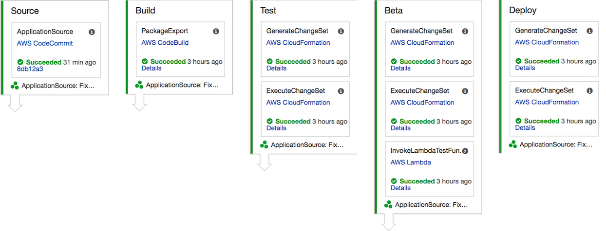

## Environment Setup

Each of the following sections provide an implementation overview and detailed, step-by-step instructions. The overview should provide enough context for you to complete the implementation if you're already familiar with the AWS Management Console or you want to explore the services yourself without following a walkthrough.

If you're using the latest version of the Chrome, Firefox, or Safari web browsers the step-by-step instructions won't be visible until you expand the section.

### 1. Update CodeStar IAM Roles

CodeStar generates IAM Roles and Policies that control access to AWS resources.  In this module, we will add permissions to Roles using IAM Managed Policies to support the customizations we will make to the CodePipeline pipeline by adding additional deployment environments and serverless unit testing.

#### 1a. Update `CodeStarWorker-uni-api-Lambda`IAM  Role

1. In the AWS Management Console choose **Services** then select **IAM** under Security, Identity & Compliance.

1. Select Role in the left navigation, type `CodeStarWorker-uni-api-Lambda` in the filter text box, and click the Role name link in the Role table.

    
 
1. On the Role Summary page, click the **Attach Policy** button in the **Managed Policies** section of the **Permissions** tab.

    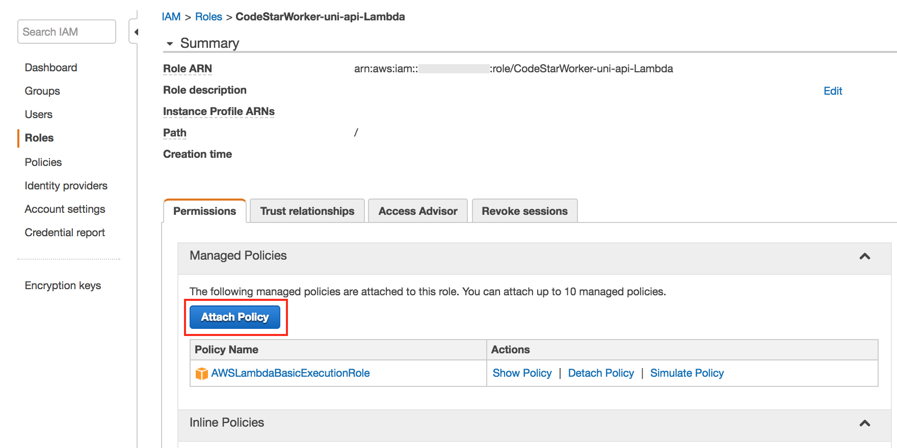
 
1. Type `AWSCodePipelineCustomActionAccess` in the filter text box, select the checkbox next to the **AWSCodePipelineCustomActionAccess** Managed Policy.

    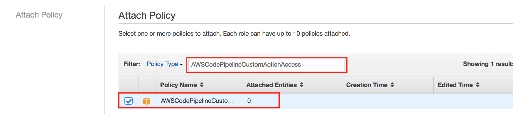

1. Type `AWSCloudFormationReadOnlyAccess` in the filter text box, select the checkbox next to the **AWSCloudFormationReadOnlyAccess** Managed Policy.

    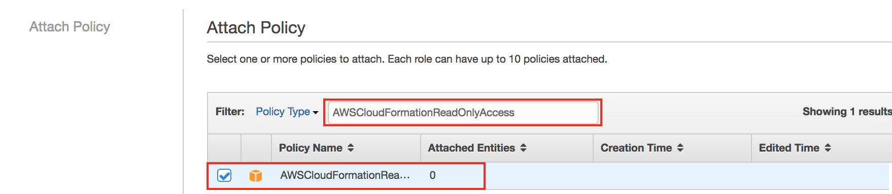

1. Type `AmazonDynamoDBFullAccess` in the filter text box, select the checkbox next to the **AmazonDynamoDBFullAccess** Managed Policy, and click the **Attach Policy** button.

    

1. Type `AWSLambdaRole` in the filter text box, select the checkbox next to the **AWSLambdaRole** Managed Policy, and click the **Attach Policy** button.

    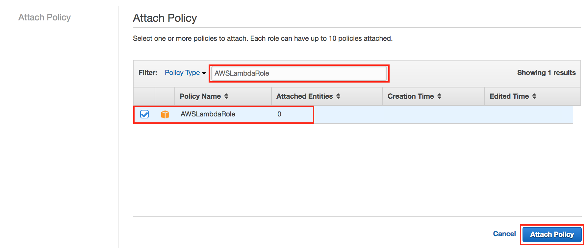

1. The Role Summary will now include the **AWSCodePipelineCustomActionAccess**, **AWSCloudFormationReadOnlyAccess**, and **AWSLambdaRole** policies in the list of **Managed Policies**.

    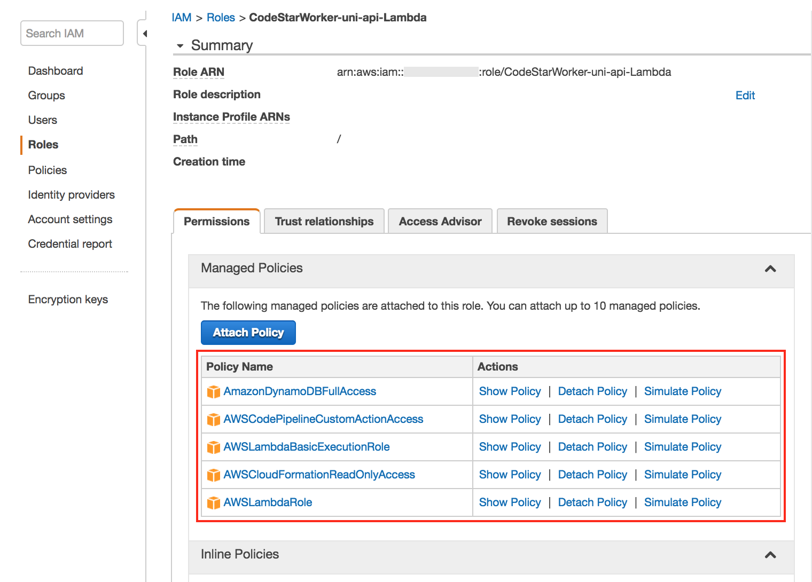

#### 1b. Update `CodeStarWorker-uni-api-CodePipeline` IAM Role

1. In the AWS Management Console choose **Services** then select **IAM** under Security, Identity & Compliance.

1. Select Role in the left navigation, type `CodeStarWorker-uni-api-CodePipeline` in the filter text box, and click the Role name link in the Role table.

    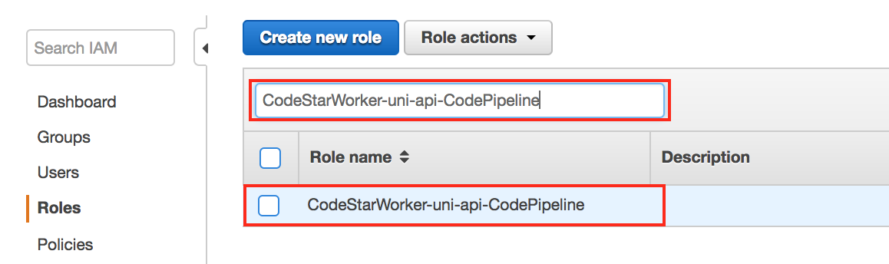
 
1. On the Role Summary page, click the **Attach Policy** button in the **Managed Policies** section of the **Permissions** tab.

    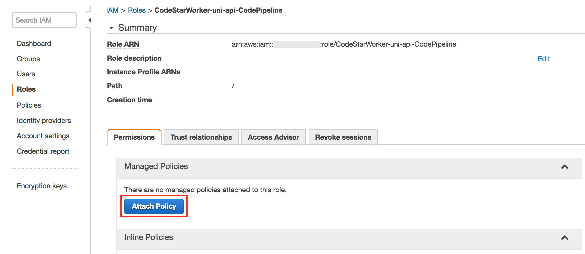

1. Type `AWSCodePipelineReadOnlyAccess` in the filter text box, select the checkbox next to the **AWSCodePipelineReadOnlyAccess** Managed Policy.

    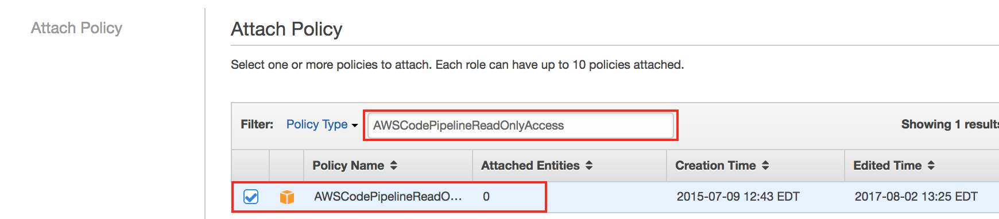

1. Type `AWSLambdaRole` in the filter text box, select the checkbox next to the **AWSLambdaRole** Managed Policy and click the **Attach Policy** button.

    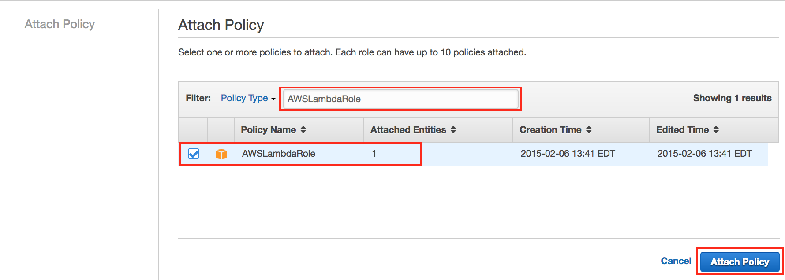

1. The Role Summary will now include the **AWSCodePipelineReadOnlyAccess** and **AWSLambdaRole** policies in the list of **Managed Policies**.

    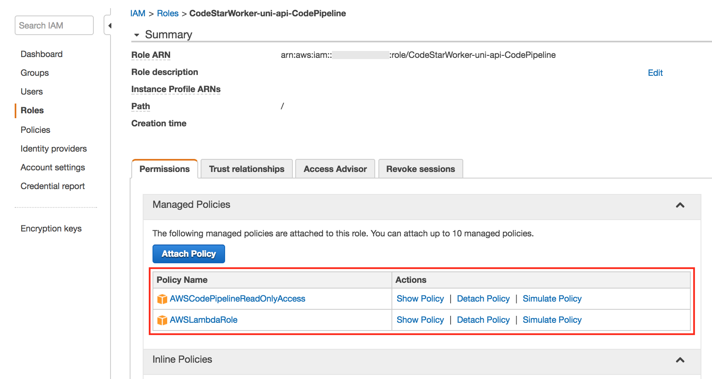

#### 1c. Update `CodeStarWorkerCodePipelineRolePolicy` IAM Policy 
      
1. Click **Edit Policy** for the `CodeStarWorkerCodePipelineRolePolicy` in the **Inline Policies** section.

    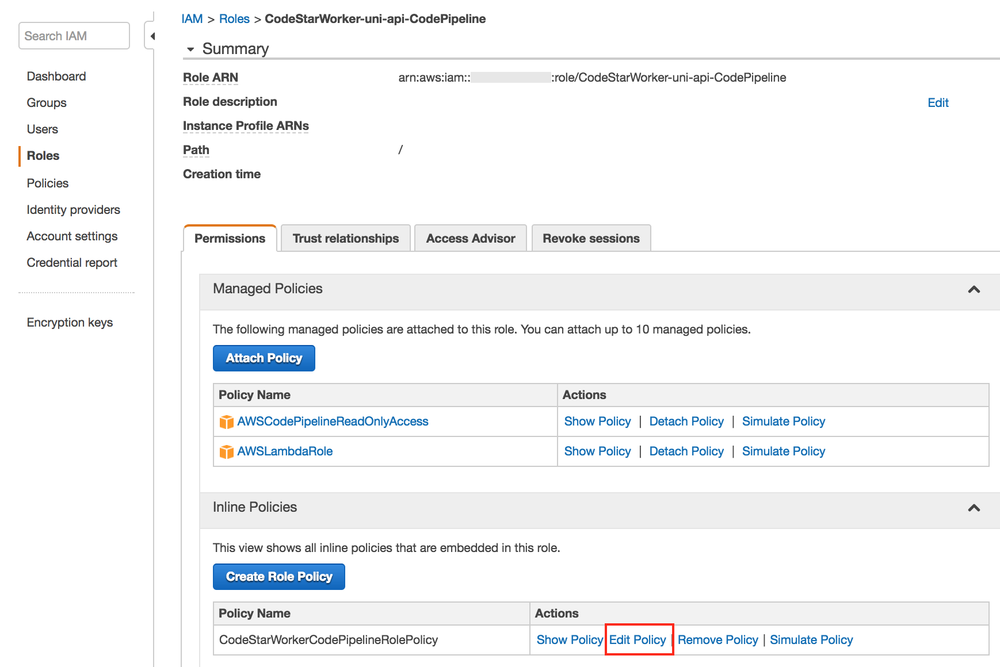
    
1. Update the allowed CloudFormation Resource pattern in the policy (substitute your AWS Region and AccountId) a click **Save**.
        
    Before: `arn:aws:cloudformation:{region}:{accountId}:stack/awscodestar-uni-api-lambda/*`
    
    After: `arn:aws:cloudformation:{region}:{accountId}:stack/awscodestar-uni-api-lambda*`

    

### 2. Seed the `uni-api` CodeCommit Git repository

1. Each module has corresponding source code used to seed the CodeStar CodeCommit Git repository to support the workshop.  To seed the CodeCommit Git repository, click on the **Launch Stack** button for your region below:

    Region| Launch
    ------|-----
    EU (Ireland) | [](https://console.aws.amazon.com/cloudformation/home?region=eu-west-1#/stacks/create/review?stackName=Seed-4-MultipleEnvironments&templateURL=https://s3.amazonaws.com/fsd-aws-wildrydes-eu-west-1/codecommit-template.yml&param_sourceUrl=https://s3-eu-west-1.amazonaws.com/fsd-aws-wildrydes-eu-west-1/uni-api-4-v2.zip&param_targetRepositoryName=uni-api&param_targetRepositoryRegion=eu-west-1)
    Asia Pacific (Sydney) | [](https://console.aws.amazon.com/cloudformation/home?region=ap-southeast-2#/stacks/create/review?stackName=Seed-4-MultipleEnvironments&templateURL=https://s3.amazonaws.com/fsd-aws-wildrydes-ap-southeast-2/codecommit-template.yml&param_sourceUrl=https://s3-ap-southeast-2.amazonaws.com/fsd-aws-wildrydes-ap-southeast-2/uni-api-4-v2.zip&param_targetRepositoryName=uni-api&param_targetRepositoryRegion=ap-southeast-2)


1. The CloudFormation template has been prepopulated with the necessary fields for this module.  No changes are necessary

1. Select the **I acknowledge that AWS CloudFormation might create IAM resources.** checkbox to grant CloudFormation permission to create IAM resources on your behalf

1. Click the **Create** button in the lower right corner of the browser window to create the CloudFormation stack and seed the CodeCommit repository.

    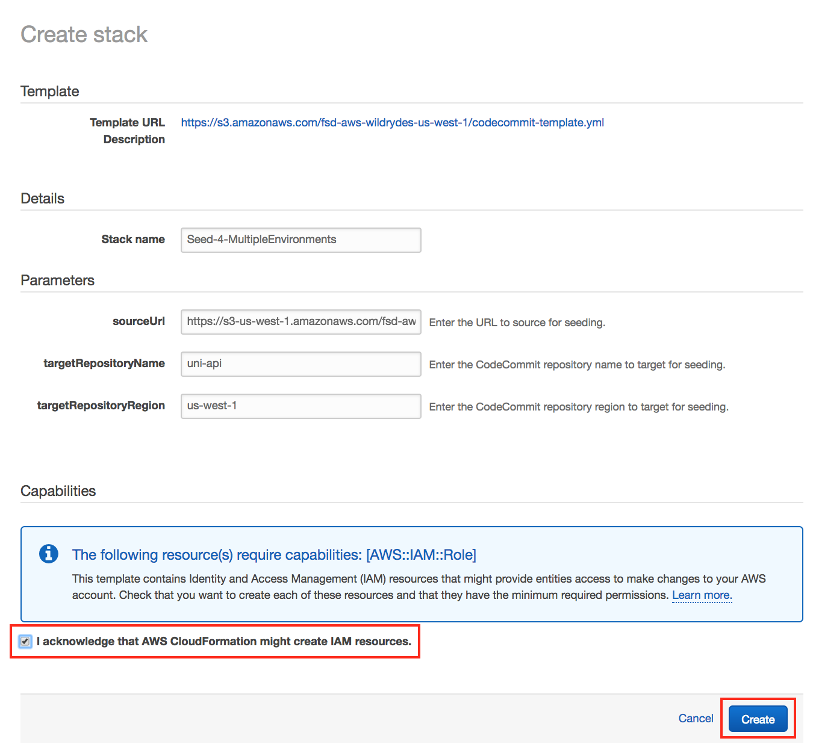

1. There will be a short delay as the Git repository seeded with the new source code.  Upon successful completion, the CloudFormation will show Status ``CREATE_COMPLETE``.

    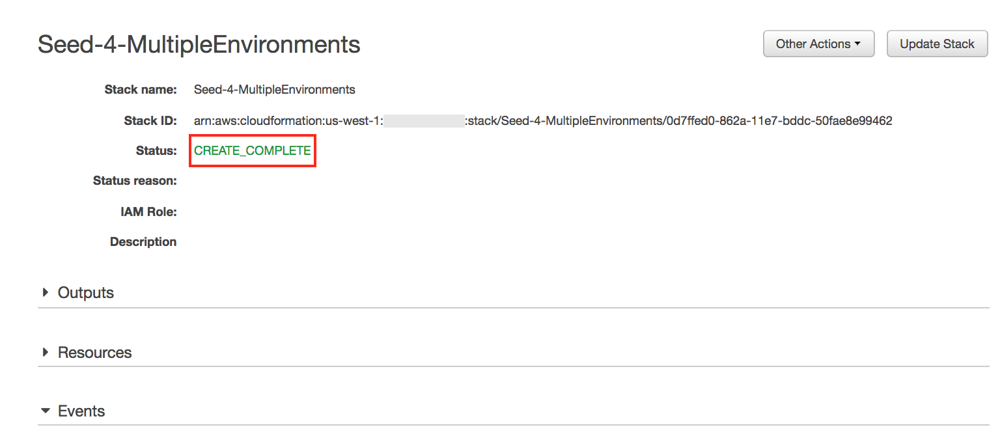

### 3. Fetch CodeCommit Git Repository

Now that the CodeCommit Git repository has been seeded with new source code, you will need to fetch the changes locally so that you may modify the code.  Typically, this is accomplished using the `git pull` command, however for the workshop we have replaced the repository with a new history and different Git commands will be used.

Using your preferred Git client, run the commands on your local **uni-api** Git repository:

* `git fetch --all`
* `git reset --hard origin/master`

### 4. Add Test Stage

#### 4a. Edit CodePipeline

1. In the AWS Management Console choose **Services** then select **CodeStar** under Developer Tools.

1. Select the `uni-api` project

    

1. Click on the **AWS CodePipeline details** link at the bottom of the **Continuous deployment** tile on the right of the browser window.

    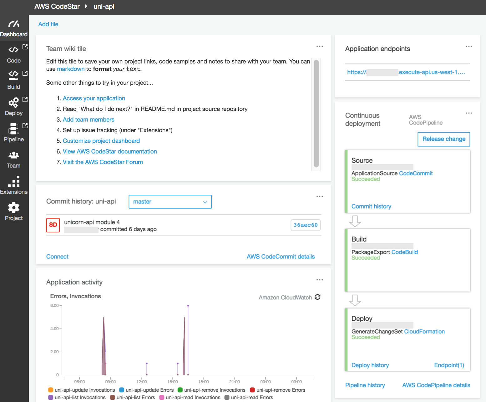
    
1. On the CodePipeline page, click **Edit**.

#### 4b. Add Test Stage

1. Choose **+Stage** below the Build stage of the pipeline.

   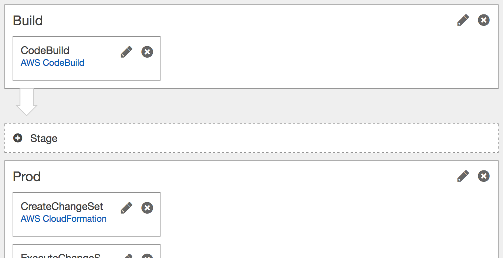

1. Enter `Test` for the **Stage Name**.

#### 4c. Add GenerateChangeSet Action to Test Stage

1. Choose `+Action` below `Test`.

1. In the **Add action** dialog, select `Deploy` for the **Action category**.

1. Enter `GenerateChangeSet` for the **Action name**.

1. Select `AWS CloudFormation` for the **Deployment provider**.

   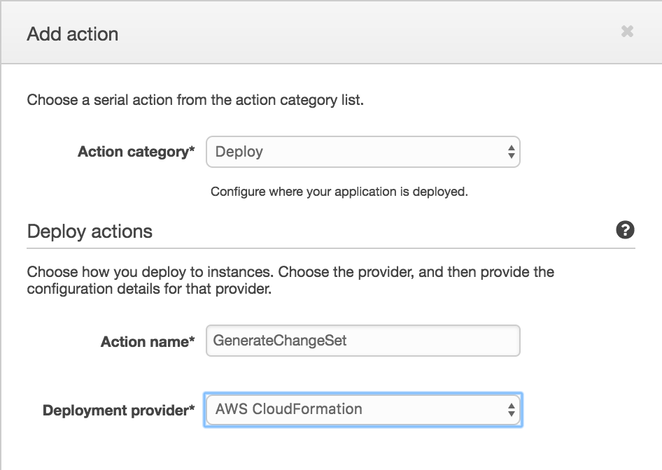

1. Select `Create or replace a change set` for **Action mode**

1. Enter `awscodestar-uni-api-lambda-test` for **Stack name**

1. Enter `pipeline-changeset` for **Change set name**

1. Enter `uni-api-BuildArtifact::test-template-export.yml` for **Template**

1. Select `CAPABILITY_IAM` for **Capabilities**

1. Enter `CodeStarWorker-uni-api-CloudFormation` for **Role name**

1. Expand the **Advanced** section and enter `{ "ProjectId": "uni-api" }` for Parameter overrides

1. Enter `uni-api-BuildArtifact` for **Input artifacts #1**

   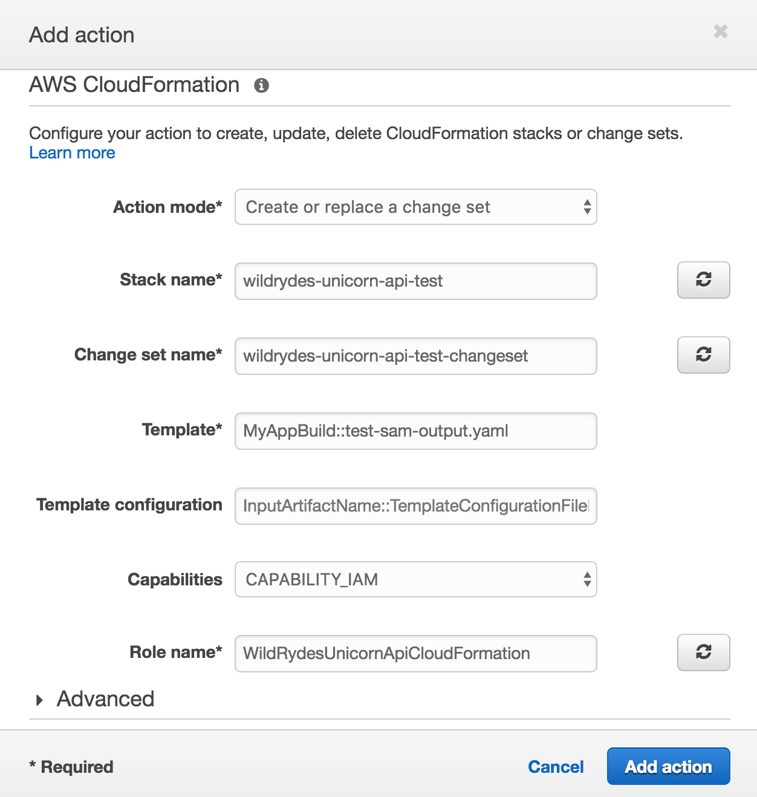

1. Choose **Add Action**

#### 4d. Add ExecuteChangeSet Action to Test Stage

1. Choose `+Action` below `GenerateChangeSet`.

   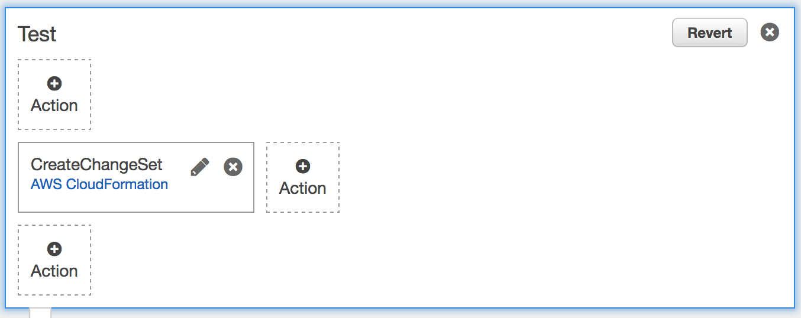

1. In the **Add action** dialog, select `Deploy` for the **Action category**.

1. Enter `ExecuteChangeSet` for the **Action name**.

1. Select `AWS CloudFormation` for the **Deployment provider**.

   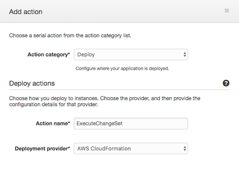

1. Select `Execute a change set` for **Action mode**

1. Enter `awscodestar-uni-api-lambda-test` for **Stack name**

1. Enter `pipeline-changeset` for **Change set name**

   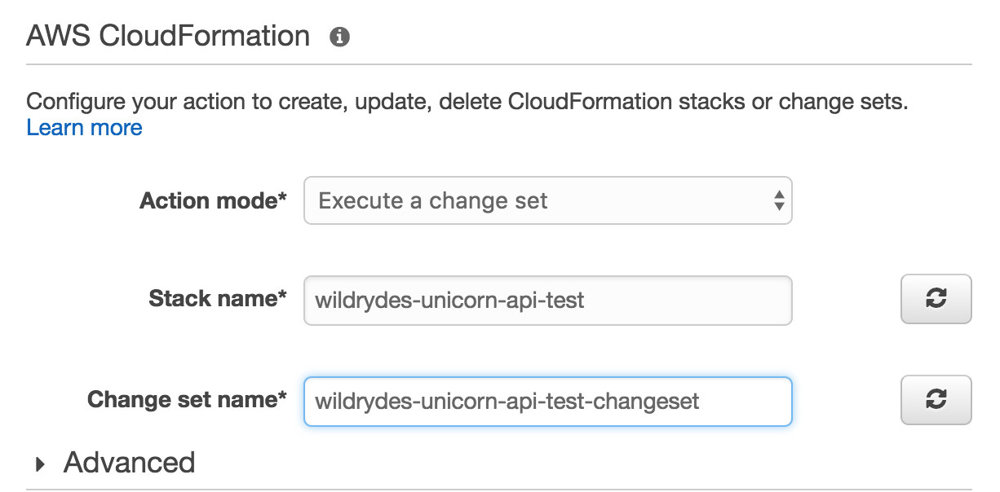

1. Choose **Add Action**

#### 4e. Save CodePipeline Changes

The pipeline should look like the following screenshot after adding the new Test stage.

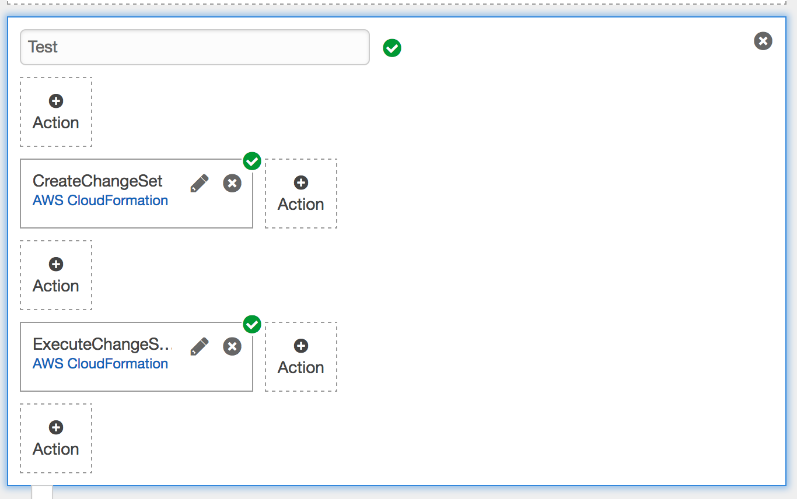

1. Scroll to the top of the pipeline and choose `Save pipeline changes`

1. Choose `Save and Continue` when prompted by the Save Pipeline Changes dialog.

## Test Stage Validation

The addition of the Test stage is complete.  You will now validate the Test stage is working by triggering the pipeline execution, and then monitoring the completion of the pipeline.

### 1. Release Change

1. Choose the **Release change** button to start the pipeline.

1. Choose **Release** when prompted by the dialog box.

### 2. Confirm CodePipeline Completion

1. From the AWS Management Console, click on **Services** and then select **CodePipeline** in the Developer Tools section.

1. Choose `uni-api-Pipeline` from the list of pipelines.

1. Observe that each stage's color will turn blue during execution and green on completion.  Following the successful execution of all stages, the pipeline should look like the following screenshot.

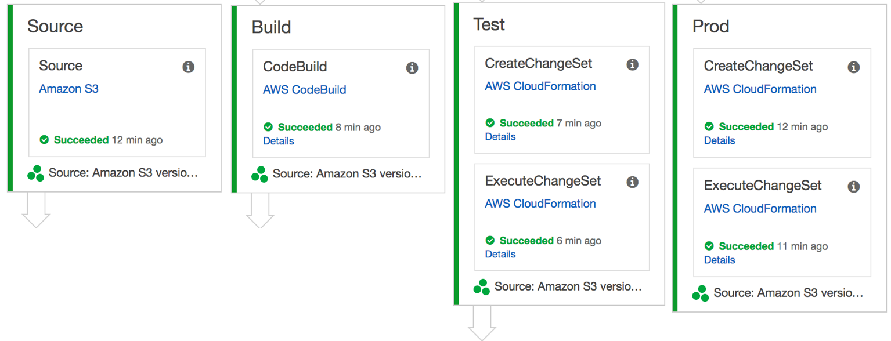

## Beta Stage Addition

### 1. Add Beta Stage

#### 1a. Edit CodePipeline

1. In the AWS Management Console choose **Services** then select **CodeStar** under Developer Tools.

1. Select the `uni-api` project

    

1. Click on the **AWS CodePipeline details** link at the bottom of the **Continuous deployment** tile on the right of the browser window.

    
    
1. On the CodePipeline page, click **Edit**.

#### 1b. Add Beta Stage

1. Choose `+Stage` below the Test stage of the pipeline.

   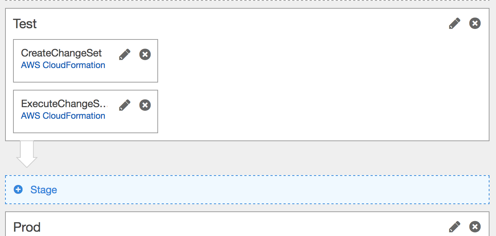

1. Enter `Beta` for the **Stage Name**.

#### 1c. Add GenerateChangeSet to Beta Stage

1. Choose `+Action` below `Beta`.

1. In the **Add action** dialog, select `Deploy` for the **Action category**.

1. Enter `GenerateChangeSet` for the **Action name**.

1. Select `AWS CloudFormation` for the **Deployment provider**.

   

1. Select `Create or replace a change set` for **Action mode**

1. Enter `awscodestar-uni-api-lambda-beta` for **Stack name**

1. Enter `pipeline-changeset` for **Change set name**

1. Enter `uni-api-BuildArtifact::template-export.yml` for **Template**

1. Select `CAPABILITY_IAM` for **Capabilities**

1. Enter `CodeStarWorker-uni-api-CloudFormation` for **Role name**

1. Expand the **Advanced** section and enter `{ "ProjectId": "uni-api", "CustomSuffix": "-beta" }` for **Parameter overrides**

1. Enter `uni-api-BuildArtifact` for **Input artifacts #1**

   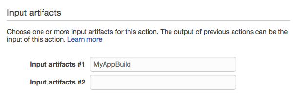

1. Choose **Add Action**

#### 1d. Add ExecuteChangeSet to Beta Stage

1. Choose `+Action` below `GenerateChangeSet`.

   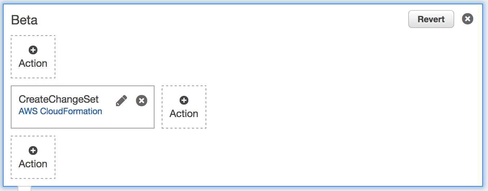

1. In the **Add action** dialog, select `Deploy` for the **Action category**.

1. Enter `ExecuteChangeSet` for the **Action name**.

1. Select `AWS CloudFormation` for the **Deployment provider**.

   

1. Select `Execute a change set` for **Action mode**

1. Enter `awscodestar-uni-api-lambda-beta` for **Stack name**

1. Enter `pipeline-changeset` for **Change set name**

   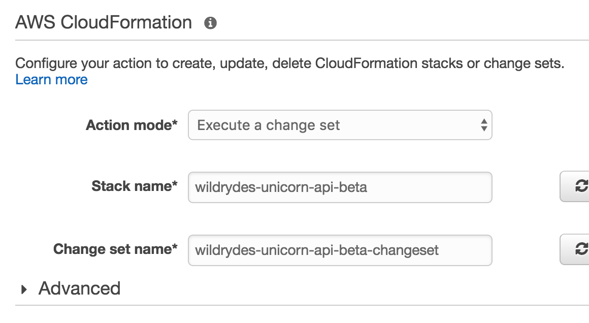

1. Choose **Add Action**

#### 1e. Add Invoke to Beta Stage

1. Choose `+Action` below `ExecuteChangeSet`.

   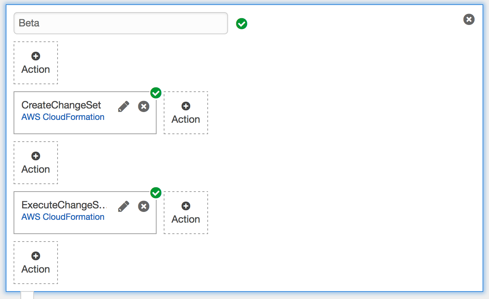

1. In the **Add action** dialog, select `Invoke` for the **Action category**.

1. Enter `InvokeLambdaTestFunction` for the **Action name**.

1. Select `AWS Lambda` for the **Deployment provider**.

1. Enter `uni-api-test-setup` for **Function name**.

1. Enter `awscodestar-uni-api-lambda-beta` for **User parameters**.

1. Choose **Add Action**

#### 1f. Save CodePipeline Changes

The pipeline should look like the following screenshot after adding the new Test stage.

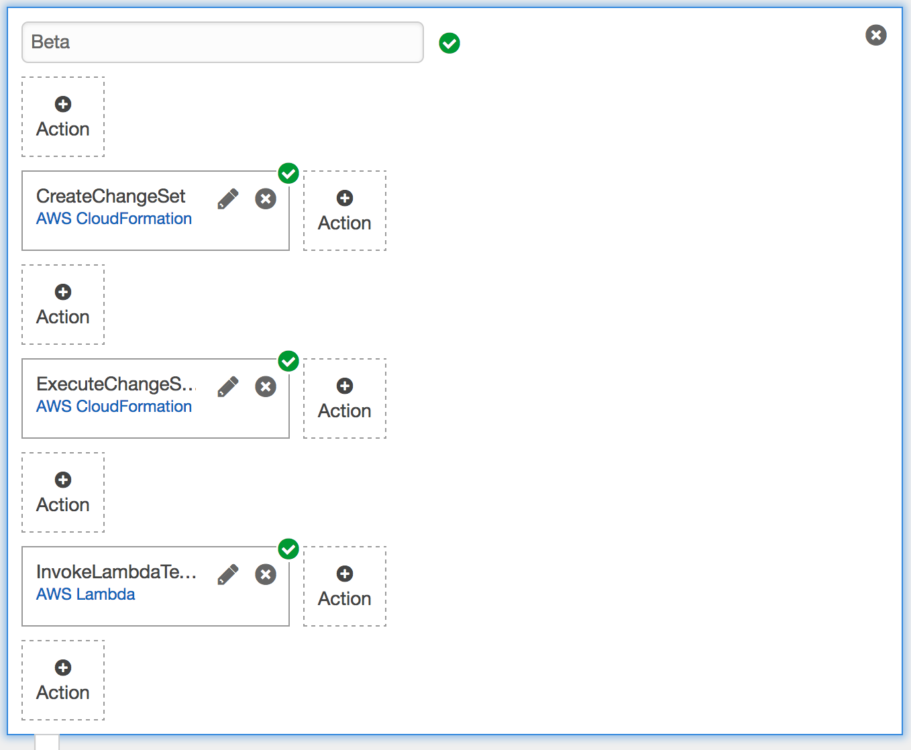

1. Scroll to the top of the pipeline and choose `Save pipeline changes`

1. Choose `Save and Continue` when prompted by the Save Pipeline Changes dialog.

## Beta Stage Validation

The addition of the Beta stage is complete.  You will now validate the Beta stage is working by triggering a release of the current change.

### 1. Release Change

1. Choose the **Release change** button to start the pipeline.

1. Choose **Release** when prompted by the dialog box.

### 2. Confirm CodePipeline Completion

1. From the AWS Management Console, click on **Services** and then select **CodePipeline** in the Developer Tools section.

1. Choose `uni-api-Pipeline` from the list of pipelines.

1. Observe that each stage's color will turn blue during execution and green on completion.  You should see that the `InvokeLambdaTestFunction` action in the `Beta` stage fails, causing the stage to turn red, like the following image.

   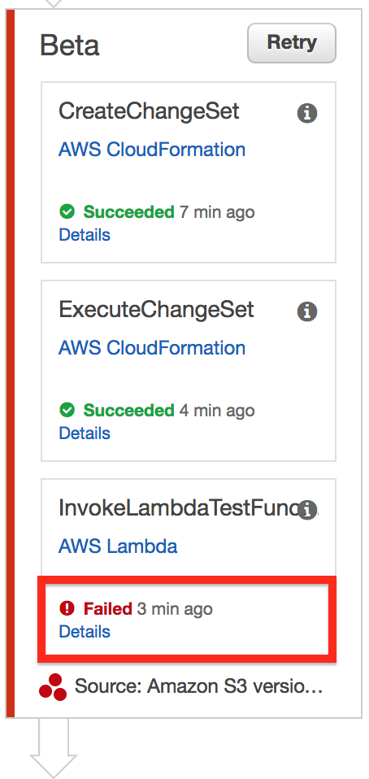

1. Choose the **Details** link in the failed action to see the details of the failed job.

   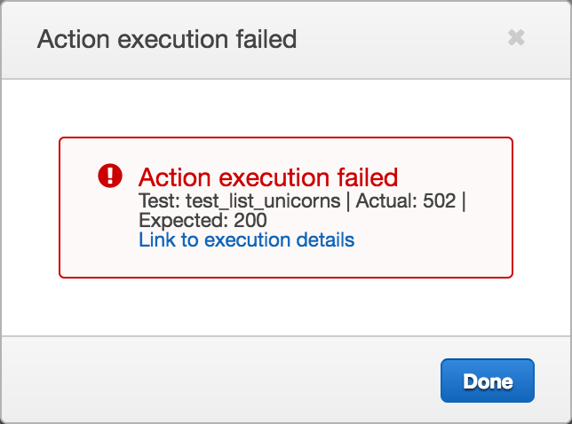

The `test_list_unicorns` integration test has failed!  Next, let's locate and fix the bug.

## Remediation

### 1. Fix Code Bug

1.  On your workstation, open the `uni-api/app/list.js` file and naviagte to line 17, which should look like the following code snippet:

   ```
   docClient.scan(params, function(error, data) {
     // Comment or Delete the following line of code to remove simulated error
     error = Error("something is wrong");
   ```

1. Comment or delete Line 17 to fix the code bug

1. Save the `uni-api/app/list.js` file.

### 2. Commit the change to local Git repository

1. Using your Git client, add the local changes to the Git index, and commit with a message.  For example:

    ```
    git add -u
    git commit -m "Fix bug"
    ```

1. Using your Git client, push the Git repository updates to the origin.  For example:

    ```
    git push origin
    ```

## Remediation Validation

1. From the AWS Management Console, click on **Services** and then select **CodePipeline** in the Developer Tools section.

1. Choose `uni-api-Pipeline` from the list of pipelines.

1. Observe that each stage's color will turn blue during execution and green on completion.  You should see that the `InvokeLambdaTestFunction` in the `Beta` stage passes, causing the stage to turn green, like the following image.

   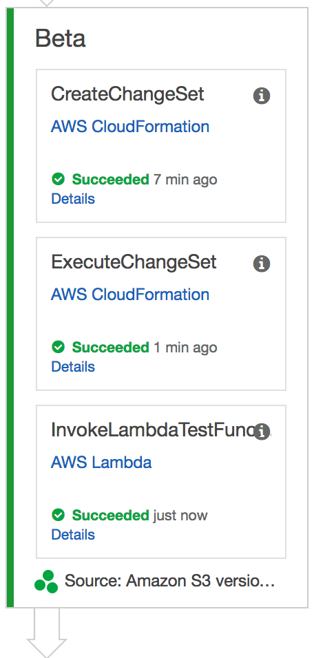

Following the successful execution of all stages, the pipeline should look like the following screenshot.

   

## Completion

Congratulations, you've successfully completed the Multiple Environment CI/CD Pipeline Module!
