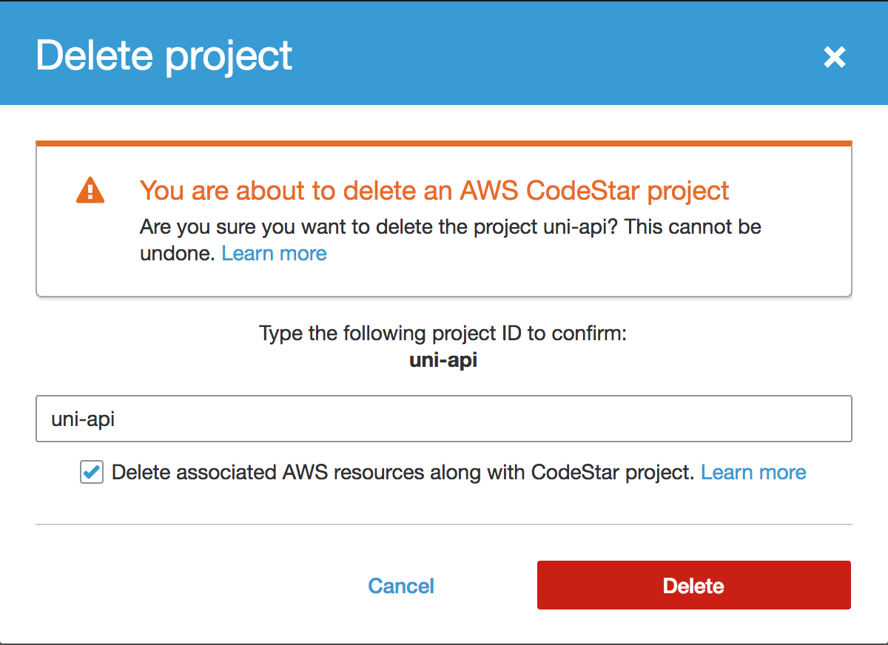

# 워크숍 정리

이 페이지에서는 이번 워크숍에서 생성한 AWS 자원들을 정리 하는 방법에 대해서 안내 하도록 하겠습니다.

## 자원 정리 가이드

### 1. CodeStarWorker 역할 추가된 IAM 정책 분리 하기

#### 1a. `CodeStarWorker-uni-api-CloudFormation` 역활에서 IAM 정책 분리

1. AWS Management 콘솔에서 **Services**를 선택한 다음 Security, Identity & Compliance 아래 **IAM**을 선택하시기 바랍니다.

1. 왼쪽 네비게이션바에서 **Roles** 을 선택하시기 바랍니다.

1. **Filter** 입력란에 `CodeStarWorker-uni-api-CloudFormation` 를 입력하시고 역활 목록 중 **CodeStarWorker-uni-api-CloudFormation**를 클릭하시기 바랍니다.

1. 추가된 IAM Managed 정책들에 대하여 **Detach Policy**를 클릭하시고 나타난 확인 창에서 **Detach**를 클릭 하셔서 정책을 분리 하시기 바랍니다.
    >**주의** 아래 AWS Managed 정책들만 분리 하시기 바랍니다. Inline Policy를 삭제하실 경우 리소스 삭제가 원할이 되지 않으실수 있으십니다.
    * **AWSLambdaReadOnlyAccess**

#### 1b. `CodeStarWorker-uni-api-CodePipeline` 역활에서 IAM 정책 분리

1. AWS Management 콘솔에서 **Services**를 선택한 다음 Security, Identity & Compliance 아래 **IAM**을 선택하시기 바랍니다.

1. 왼쪽 네비게이션바에서 **Roles** 을 선택하시기 바랍니다.

1. **Filter** 입력란에 `CodeStarWorker-uni-api-CodePipeline` 를 입력하시고 역활 목록 중 **CodeStarWorker-uni-api-CodePipeline**를 클릭하시기 바랍니다.

1. 추가된 IAM Managed 정책들에 대하여 **Detach Policy**를 클릭하시고 나타난 확인 창에서 **Detach**를 클릭 하셔서 정책을 분리 하시기 바랍니다.
    >**주의** 아래 AWS Managed 정책들만 분리 하시기 바랍니다. Inline Policy를 삭제하실 경우 리소스 삭제가 원할이 되지 않으실수 있으십니다.
    * **AWSCodePipelineReadOnlyAccess**
    * **AWSLambdaRole**

#### 1c. `CodeStarWorker-uni-api-Lambda` 역활에서 IAM 정책 분리

1. AWS Management 콘솔에서 **Services**를 선택한 다음 Security, Identity & Compliance 아래 **IAM**을 선택하시기 바랍니다.

1. 왼쪽 네비게이션바에서 **Roles** 을 선택하시기 바랍니다.

1. **Filter** 입력란에 `CodeStarWorker-uni-api-Lambda`를 입력하시고 역활 목록 중 **CodeStarWorker-uni-api-Lambda**를 클릭하시기 바랍니다.

1. 추가된 IAM Managed 정책들에 대하여 **Detach Policy**를 클릭하시고 나타난 확인 창에서 **Detach**를 클릭 하셔서 정책을 분리 하시기 바랍니다.
    >**주의** 아래 AWS Managed 정책들만 분리 하시기 바랍니다. Inline Policy를 삭제하실 경우 리소스 삭제가 원할이 되지 않으실수 있으십니다.
    * **AmazonDynamoDBFullAccess**
    * **AWSCodePipelineCustomActionAccess**
    * **AWSCloudFormationReadOnlyAccess**
    * **AWSLambdaRole**
    * **AWSXrayWriteOnlyAccess**

### 2. CodeStar 프로젝트 삭제

1. AWS Management 콘솔에서 **Services**를 선택한 다음 Developer Tools 아래 **CodeStar**를 선택하시기 바랍니다.

1. `uni-api` 프로젝트의 **...** 아이콘을 클릭하신 다음 **Delete**를 선택하시기 바랍니다.

    

1. `uni-api`를 **project ID** 입력란에 입력하신 다음 **Delete** 버튼을 클릭 하시기 바랍니다.

    

### 2. CloudFormation CodeCommit 시작 스택 삭제

1. AWS Management 콘솔에서 **Services**를 선택한 다음 Management Tools 아래 **CloudFormation**을 선택하시기 바랍니다.

1. 아래의 단계를 나열된 CloudFormation 스택들에 대해서 반복 하시기 바랍니다.

    * **Seed-1-ServerlessApplicationModel**
    * **Seed-2-ContinuousDelivery**
    * **Seed-3-XRay**
    * **Seed-4-MultipleEnvironments**

    a. 스택 좌측의 체크 박스를 클릭 하시기 바랍니다.

    b. 스택 항목 상단에 있는 **Actions** 드롭다운를 선택 하시기 바랍니다.

    c. **Delete Stack**를 선택

    d. **Yes, Delete**를 선택

### 3. CodeStar 프로젝트 S3 버킷 삭제

1. AWS Management 콘솔에서 **Services**를 선택한 다음 Storage 아래 **S3**를 선택하십시오.

1. **Filter** 입력란에 `uni-api`를 입력하시기 바랍니다.

1. `aws-codestar-{AWS::Region}-{AWS::AccountId}-uni-api-pipe`와 같은 형식의 이름을 가지는 S3 버킷의 버킷 아이콘을 클릭 하시기 바랍니다.

1. 버킷 항목의 상단에 있는 **Delete Bucket** 버튼을 클릭 하시기 바랍니다.

1. 해당 버킷의 이름을 입력하시고 **Confirm** 버튼을 클릭하여 버킷의 삭제를 완료하시기 바랍니다.
