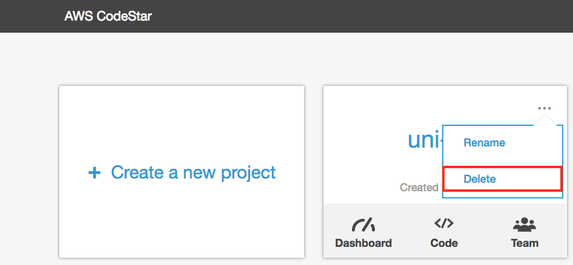
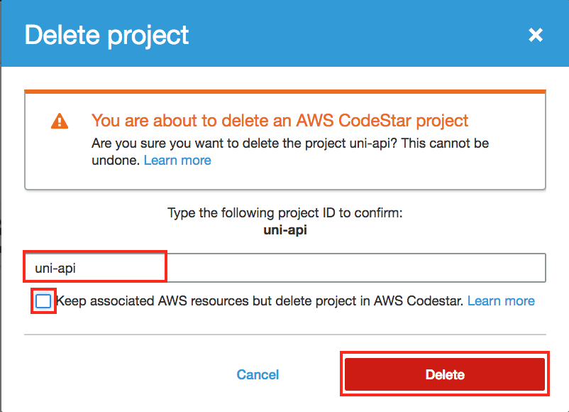

# Workshop Cleanup

This page provides instructions for cleaning up the resources created during the preceding modules.

## Resource Cleanup Instructions

### 1. Delete CodeStar Project

1. In the AWS Management Console choose **Services** then select **CodeStar** under Developer Tools.

1. Click the **...** icon in the `uni-api` project and select **Delete**.

    

1. Type `uni-api` as the project ID to confirm,  **Unselect** the checkbox to delete the CloudFormation resources, and click the **Delete* *button.

    

### 1. Delete CloudFormation CodeCommit Seed Stacks

1. In the AWS Management Console, click **Services** then select **CloudFormation** under Management Tools.

1. Repeat the following steps for each of the following CloudFormation Stacks:

    * **Seed-1-ServerlessApplicationModel**
    * **Seed-2-ContinuousDelivery**
    * **Seed-3-XRay**
    *  **Seed-4-MultipleEnvironments**

    a. Click the checkbox to the left of the stack
    
    b. Select the Actions dropdown menu above the list of Stacks.
    
    c. Select **Delete Stack**.
    
    d. Select **Yes, Delete**.

### 1. Delete CodeStar Project S3 Bucket

1. In the AWS Management Console, click **Services** then select **S3** under Storage.

1. Type `uni-api` in the Filter checkbox.

1. Click the bucket icon next to the S3 bucket that matches the format: `aws-codestar-{AWS::Region}-{AWS::AccountId}-uni-api-pipe`.

1. Click the **Delete Bucket** button at the top of the Bucket list.

1. Type the name of the bucket to confirm the deletion and click **Confirm**.
