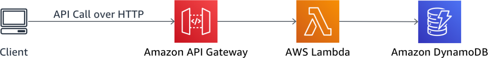
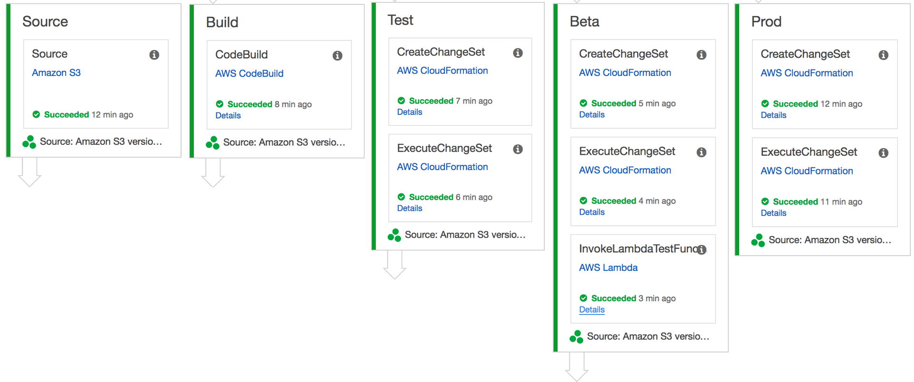

# 서버리스 데브옵스(DevOps) 워크샵

이 워크샵에서는 RESTful API를 배포하여 사용자로 하여금 Wild Rydes 유니콘 마굿간(Stable)을 관리할 수 있게 합니다. 여러분은 서버리스 어플리케이션 모델([Serverless Application Model (SAM)](https://github.com/awslabs/serverless-application-model))를 이용하여 API 인터페이스, 비지니스 로직 그리고 데이터베이스를 여러분의 계정에 배포할 것입니다. RESful API는 사용자로 하여금 Wild Rydes 마굿간에 유니콘들을 list, create, view, update 그리고 delete 할 수 있게 합니다.

이 인프라를 구축하기위해 [AWS Lambda](https://aws.amazon.com/lambda/), [Amazon API Gateway](https://aws.amazon.com/api-gateway/), [Amazon DynamoDB](https://aws.amazon.com/dynamodb/)과 같은 AWS의 서비스를 이용합니다. API는 Lambda and API Gateway를 이용하여 만들고 유니콘 데이터 저장소로는 DynamoDB를 사용합니다.

아래 그림은 API 아키텍쳐입니다.

지속적 통합 및 전달(CI/CD) 데브옵스 파이프라인을 구축하기 위해서는 [AWS CodePipeline](https://aws.amazon.com/codepipeline/), [AWS CodeBuild](https://aws.amazon.com/codebuild/), 그리고 [Amazon S3](https://aws.amazon.com/s3/)를 사용합니다. CodePipeline은 코드가 업데이트 됨에 따라 각 스텝별 빌드, 테스트, 그리고 배포를 관리 및 조율합니다. CodeBuild는 소스코드를 컴파일 하고 테스트를 수행하여 배포할 수 있는 패키징된 결과물을 생성합니다.

아래 그림은 모듈4에서 생성할 지속적 통합 및 전달 파이프라인의 개요입니다.

아래 사전 준비 사항이 이미 갖추어 지셨다면 [CodeStar Project](0_CodeStar)를 클릭하셔서 바로 워크샵을 진행 하실 수 있으십니다.

## 사전 준비 사항

### AWS 계정

이 워크샵을 완료하려면 AWS IAM, S3, DynamoDB, Lambda, API Gateway, CodePipeline, CodeBuild resources를 만들 수 있는 액세스 권한이 있는 AWS 계정 및 리전에서 실행하셔야 합니다. 이 워크샵의 코드와 지침은 한번에 한명의 학생에게만 주어진 AWS 계정을 사용한다고 가정합니다. 다른 학생과 계정을 공유하려고 하면, 특정 리소스 이름에 대해서 충돌이 발생합니다. 리소스 이름에 접미어를 사용하거나 고유한 이름을 부여해서 문제를 해결할 순 있지만, 이 지침에는 관련 작업을 수행하는데 필요한 변경 사항에 대한 세부 정보는 나오지 않습니다.

본 모듈을 모두 수행하는데 있어서 계정 생성 후 12개월 미만에 주어지는 AWS 프리 티어의 무료 범위안에서 수행 가능하십니다. [AWS 프리 티어](https://aws.amazon.com/free/) 자세한 내용은 위 링크를 참조 하시기 바랍니다.

### AWS 커맨드 라인 인터페이스 (Command Line Interface(CLI))

워크샵의 첫 번째 모듈에서 웹사이트를 S3 버킷으로 복사하는 과정에서 AWS 커맨드 라인 인터페이스 (AWS Command Line Interface (CLI)를 사용합니다. 사용하시는 컴퓨터에 AWS 커맨드 라인 인터페이스가 설치 되어 있지 않으시다면 아래 링크를 클릭하셔서 설치하시기 바랍니다.

[AWS CLI 시작하기](http://docs.aws.amazon.com/cli/latest/userguide/cli-chap-getting-set-up.html) AWS 커맨드 라인 인터페이스 (Command Line Interface(CLI)) 설치 가이드

### 웹브라우저

최신 버젼의 Chrome 및 Firefox 사용을 권장 드립니다.

### 문서 편집기

설정 파일을 수정하기 위해서 문서 편집기가 필요합니다.

## 모듈

본 워크샵은 여러개의 모듈로 구성되어 있습니다. 다름 모듈을 진행하시기 위해서는 이전단계의 모듈이 성공적으로 완료 되어야 합니다.

1. [CodeStar 프로젝트(CodeStar Project)](0_CodeStar)
1. [서버리스 어플리케이션 모델(Serverless Application Model(SAM))](1_ServerlessApplicationModel)
1. [지속적 통합 및 전달 데브옵스 파이프라인(Continuous Delivery Pipeline)](2_ContinuousDeliveryPipeline)
1. [AWS X-Ray 연동(AWS X-Ray Integration)](3_XRay)
1. [다중 환경의 CI/CD 파이프라인(Multiple Environment CI/CD Pipeline)](4_MultipleEnvironments)

!!주의!! 워크샵을 마친 후에 [삭제 가이드](9_CleanUp) 에 따라 생성된 모든 리소스를 삭제 할 수 있습니다.
