# Module: AWS Step Functions를 사용하여 서버리스 이미지 처리 워크 플로우 조정

이 모듈에서는 AWS Step Functions를 사용하여 여러 AWS Lambda 함수를 조정하여 이미지 처리 워크 플로를 작성합니다.

Wild Rydes팀은 가입 후, 사용자 셀카를 업로드하는 새로운 기능을 추가하려고합니다. 이것은 몇 가지 작업을 수행합니다.

1. 좋은 고객 경험을 제공하기 위해 유니콘이 픽업 중 라이더를 쉽게 식별 할 수 있습니다. 이것은 또한 보안을 강화하여, 범죄자를 식별하여 유니콘을 타기 전에 제어가능합니다.
1. 동일한 사용자가 새 사용자 프로모션을 악용하기 위해 여러 계정에 등록하는 것을 방지합니다.


사용자가 자신의 사진을 업로드하면 몇 가지 확인 및 처리 단계가 수행되어야합니다.

1. 사진이 라이더를 식별하기 위해 app/unicorns가 사용할 수있는 깨끗한 얼굴을 보여 주는지 확인하십시오.
1. 사용자가 아직 등록하지 않았는지 확인하기 위해 이전에 색인된 얼굴 모음과 대조하십시오.
1. 응용 프로그램에 표시 할 축소판 그림으로 사진의 크기를 조정하십시오.
1. 사용자 얼굴을 콜렉션에 색인화하여 나중에 일치시킬 수 있도록하십시오.
1. 사진의 메타 데이터를 사용자 프로필과 함께 저장하십시오. 

서버리스 환경에서 위의 각 단계는 AWS Lambda 기능을 사용하여 쉽게 구현할 수 있습니다. 그러나 이전 단계가 완료된 후에 하나의 람다 함수를 호출하는 흐름을 어떻게 관리하고 각 이미지에서 일어난 일을 추적 할 수 있습니까? 람다 기능 중 하나가 시간 초과되어 재 시도해야 할 경우? 람다 함수 중 일부는 병렬 처리로 처리 지연을 줄이기 위해, 실행중인 람다 함수를 어떻게 병렬로 조정할 수 있고 끝내기를 기다릴 수 있습니까? AWS Step Functions를 사용하면 이러한 문제를 쉽게 해결할 수 있으며 감사 추적 및 시각화를 통해 각 플로우에서 발생한 문제를 추적 할 수 있습니다.

## 아키텍처 개요
이 모듈의 아키텍처는 **Amazon Rekognition**의 얼굴 탐지 기능을 활용하고, **Amazon S3**에 저장된 업로드 된 이미지의 크기를 조정하고, 사용자 프로필로 이미지 메타 데이터를 **Amazon DynamoDB**에 저장하는 여러 개의 **AWS Lambda** 함수로 구성됩니다. 람다 함수의 오케스트레이션은 **AWS Step Functions** 상태 머신에 의해 관리됩니다.

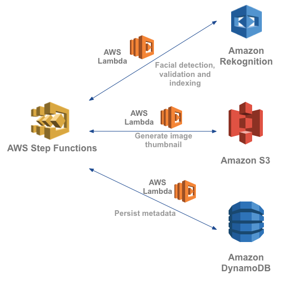

아래는 **AWS Step Functions**로 시각화 한 워크 플로우의 흐름도입니다.

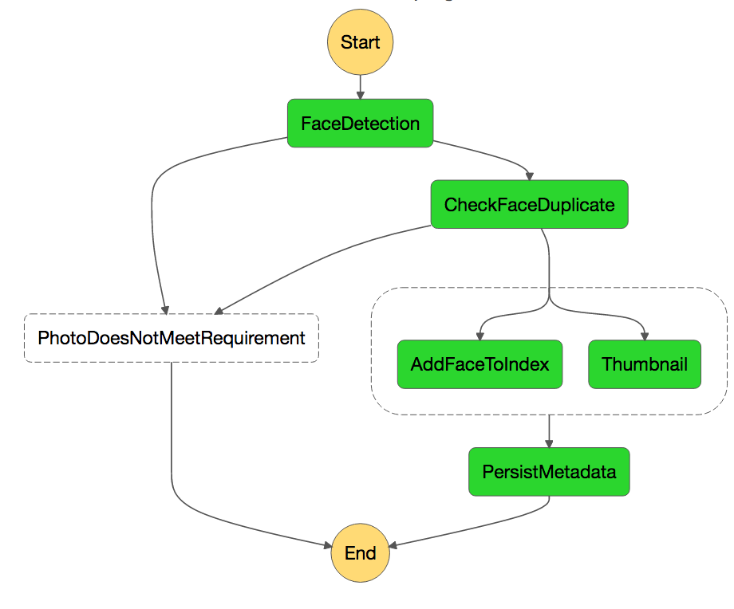

이 모듈에서는 AWS Step Functions 관리 콘솔에서 수동으로 워크 플로우를 시작합니다. 실제 응용 프로그램에서는 응용 프로그램이 호출하는 단계 함수 상태 시스템을 호출하는 Amazon API Gateway를 구성하거나 Amazon CloudWatch 이벤트 또는 S3 이벤트 알림을 통해 Amazon S3 업로드 이벤트에 의해 트리거되도록 설정할 수 있습니다.

## 구현 방법

다음 섹션에서는 구현 개요와 자세한 단계별 지침을 제공합니다. 개요는 이미 AWS Management Console에 익숙하거나 둘러보기를 거치지 않고 직접 서비스를 탐색하려는 경우 구현을 완료 할 수있는 충분한 컨텍스트를 제공해야합니다.

최신 버전의 Chrome, Firefox 또는 Safari 웹 브라우저를 사용하는 경우 섹션을 확장해야 단계별 지침이 표시됩니다.

</p></details>
 
### 1. Amazon Rekognition 컬렉션 생성하기
Face Collection은 인덱싱 된 얼굴 이미지를 검색 가능한 벡터로 저장하는 Amazon Rekognition의 컨테이너입니다.

AWS 커맨드 라인 인터페이스를 사용하여 아마존 Rekognition에서 `rider-photos` 컬렉션을 생성하십시오.

<details>
<summary><strong>단계별 지침 (자세히 보기)</strong></summary><p>

1. 터미널 창에서 다음 명령을 실행하고 `REPLACE_WITH_YOUR_CHOSEN_AWS_REGION` 부분을 선택한 리전의 문자열로 대체하십시오. ([Rekognition 리전](http://docs.aws.amazon.com/general/latest/gr/rande.html#rekognition_region) 참조)

		aws rekognition create-collection --region REPLACE_WITH_YOUR_CHOSEN_AWS_REGION --collection-id rider-photos
	
	예를 들어:
	
		aws rekognition create-collection --region us-east-1 --collection-id rider-photos
		aws rekognition create-collection --region us-west-2 --collection-id rider-photos
		aws rekognition create-collection --region eu-west-1 --collection-id rider-photos
	
	
2. 성공하면 다음과 같은 서비스에서 확인을 받아야합니다:

	```JSON
	{
    	"CollectionArn": "aws:rekognition:us-west-2:012345678912:collection/rider-photos",
    	"StatusCode": 200
	}
	```
</p></details>

### 2. AWS CloudFormation을 사용하여 Amazon S3, AWS Lambda 및 Amazon DynamoDB 리소스 배포

다음 AWS CloudFormation 템플릿은 이러한 리소스를 생성합니다.

* Amazon S3 버킷 2개:
	* **RiderPhotoS3Bucket** 라이더가 업로드 한 사진을 저장합니다.
	* 몇 개의 테스트 이미지가 **RiderPhotoS3Bucket** 버킷에 복사됩니다.
	* **ThumbnailS3Bucket** 라이더 사진의 크기가 조정 된 썸네일을 저장합니다.
* **RiderPhotoDDBTable** 라이더의 사진과 함께 라이더의 프로필 메타 데이터를 저장하는 하나의 Amazon DynamoDB 테이블
* 각 처리 단계를 수행하는 AWS Lambda 함수들

원하는 리전을 선택하세요.  

리전 | 실행하기
------|-----
US East (N. Virginia) | [](https://console.aws.amazon.com/cloudformation/home?region=us-east-1#/stacks/new?stackName=wildrydes-step-module-resources&templateURL=https://s3.amazonaws.com/wild-rydes-step-module-us-east-1/0-cfn/wild-rydes-step-module-us-east-1.output.yaml)
US West (Oregon) | [](https://console.aws.amazon.com/cloudformation/home?region=us-west-2#/stacks/new?stackName=wildrydes-step-module-resources&templateURL=https://s3-us-west-2.amazonaws.com/wild-rydes-step-module-us-west-2/0-cfn/wild-rydes-step-module-us-west-2.output.yaml)
EU (Ireland) | [](https://console.aws.amazon.com/cloudformation/home?region=eu-west-1#/stacks/new?stackName=wildrydes-step-module-resources&templateURL=https://s3-eu-west-1.amazonaws.com/wild-rydes-step-module-eu-west-1/0-cfn/wild-rydes-step-module-eu-west-1.output.yaml)

<details>
<summary><strong>AWS CloudFormation 실행 (자세히 보기)</strong></summary><p>

1. Click the **Launch Stack** link above for the region of your choice.

1. Click **Next** on the Select Template page.

1. On the Specify Details page, leave all the defaults and click **Next**.

1. On the Options page, leave all the defaults and click **Next**.

1. On the Review page, Click the checkboxes to give AWS CloudFormation permission to **"create IAM resources"** and **"create IAM resources with custom names"**

1. Click **"Create Change Set"** in the Transforms section

1. Click **"Execute"**

1. Wait for the `wildrydes-step-module-resources` stack to reach a status of `CREATE_COMPLETE`.

1. With the `wildrydes-step-module-resources` stack selected, click on the **Outputs** tab. These resources will be referenced in the later steps. 

</p></details>


### 3. Create an initial AWS Step Functions state machine

After the riders upload their photo, the first thing we need do in our processing pipeline is to run a face detection algorithm on it to verify that it has a recognizable face in the photo (zero or multiple faces in the photo doesn't help unicorns recognize the rider) and the face is not wearing sunglasses (makes it harder to identify the rider). If these validations fail, notify the user and end the workflow.

The AWS Lambda function that implements this check by leveraging the **Amazon Rekognition** deep-learning based image analysis API is already deployed by AWS CloudFormation in the previous step. Look in the **Outputs** section for `FaceDetectionFunctionArn` for the ARN of the Lambda function. 

The AWS Lambda function to be called when the validations fail is the  `NotificationPlaceholderFunction` deployed by AWS CloudFormation. The intent behind this step is to notify the user the photo validation failed and the error reason, so they can try upload a different photo. It's currently a stub implementation that just prepares the message instead of actually sending the message. 

Now you can create an AWS Step Functions state machine with the initial face detection step.

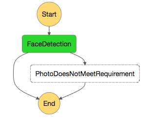

<details>
<summary><strong>Step-by-step instructions (expand for details)</strong></summary><p>

1. AWS Step Functions state machine flows are defined by a JSON document. In your favorite text editor, create a file called `rider-photo-state-machine.json`.

1. Copy and paste the following into your JSON file:

	```JSON
	{
	  "Comment": "Rider photo processing workflow",
	  "StartAt": "FaceDetection",
	  "States": {
	    "FaceDetection": {
	      "Type": "Task",
	      "Resource": "REPLACE_WITH_FaceDetectionFunctionArn",
	      "ResultPath": "$.detectedFaceDetails",
	      "End": true,
	      "Catch": [
	        {
	          "ErrorEquals": [
	            "PhotoDoesNotMeetRequirementError"
	          ],
	          "ResultPath": "$.errorInfo",
	          "Next": "PhotoDoesNotMeetRequirement"
	        }
	      ]
	    },
	    "PhotoDoesNotMeetRequirement": {
	      "Type": "Task",
	      "Resource": "REPLACE_WITH_NotificationPlaceholderFunctionArn",
	      "End": true
	    }
	  }
	}

	```
	
	The above JSON defines a state machine using the [Amazon States Language](https://states-language.net/spec.html). Take a moment to understand its structure. 
	 
	When this state machine is launched, the AWS Step Functions interpreter begins execution by identifying the Start State. It executes that state, and then checks to see if the state is marked as an End State. If it is, the machine terminates and returns a result. If the state is not an End State, the interpreter looks for a “Next” field to determine what state to run next; it repeats this process until it reaches a Terminal State (Succeed, Fail, or an End State) or a runtime error occurs.
	 
	The `ResultPath` parameter in the `FaceDetection` state causes the output of the state to be the union of the original input passed to the state and an additional `detectedFaceDetails` field that holds the output from the AWS Lambda function.
	 
	The `Catch` parameter in the `FaceDetection` state can match custom error types thrown by the AWS Lambda function and change the flow of the execution based on the error type caught. 


1. Replace the `REPLACE_WITH_FaceDetectionFunctionArn` in the JSON with the ARN of the face detection AWS Lambda function.
	> To find the ARN of the face detection AWS Lambda function, in the AWS CloudFormation Console, go to the `wildrydes-step-module-resources` stack, look in the **Outputs** section for `FaceDetectionFunctionArn`)

1. Replace the `REPLACE_WITH_NotificationPlaceholderFunctionArn` in the JSON with the ARN of the AWS Lambda function that mocks sending user notifications.
	> To find the ARN of the mock notification AWS Lambda function, in the AWS CloudFormation Console, go to the `wildrydes-step-module-resources` stack, look in the **Outputs** section for `NotificationPlaceholderFunctionArn`)
 

1. From the AWS Management Console, choose **Services** then select **Step Functions**. 

1. You might see the Get Started page if you have not used AWS Step Functions before. If that's the case, click **Get Started**, it should lead you to the page to create a new state machine. Otherwise, click the **Create a State Machine** button. 

1. Type `RiderPhotoProcessing-1` for the state machine name.

1. Paste in the JSON from your `rider-photo-state-machine.json` file into the **Code** editor portion. 

1. You can click on the &#x21ba; sign next to **Preview** to visualize the workflow:
 
	


1. Click **Create State Machine** to create the state machine.

1. In the pop-up window, select the IAM role automatically generated for you (the name should look like `StatesExecutionRole-{region-name}`).

	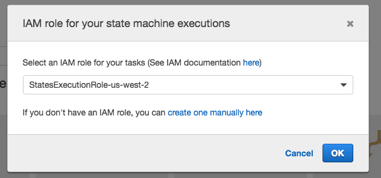

1. Click the **New execution** button to start a new execution.

1. Here you specify the input data passed into the AWS Step Functions state machine to process.

   Each execution of a Step Functions state machine has an unique ID. You can either specify one when starting the execution, or have the service generate one for you. In the text field that says "enter your execution id here",  you can specify an execution ID, or leave it blank. 
   
   For the input data, type in the follow JSON. Make sure to substitute the `s3Bucket` field with your own values. 
   
	For `s3Bucket` field, look in the **Outputs** section of the `wildrydes-step-module-resources` stack for `RiderPhotoS3Bucket`. 
	
	The `userId` field is needed because in later processing steps, the userId is used to record which user the profile picture is associated with.

	
	```JSON
	{
	  "userId": "user_a", 
	  "s3Bucket": "REPLACE_WITH_YOUR_BUCKET_NAME",
	  "s3Key": "1_happy_face.jpg"
	} 
	```
	> this tells the image processing workflow the userId that uploaded the picture and the Amazon S3 bucket and keys the photo is at.  
	
	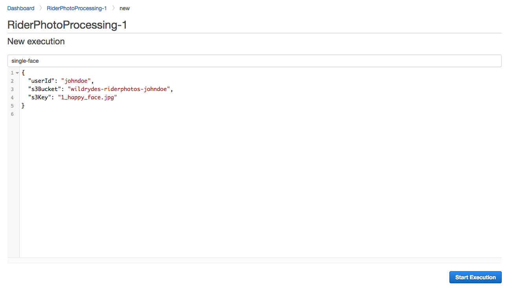

1. You can now see the state machine execution in action. Explore the different tabs in the Console to see what information is available to you for this execution:

	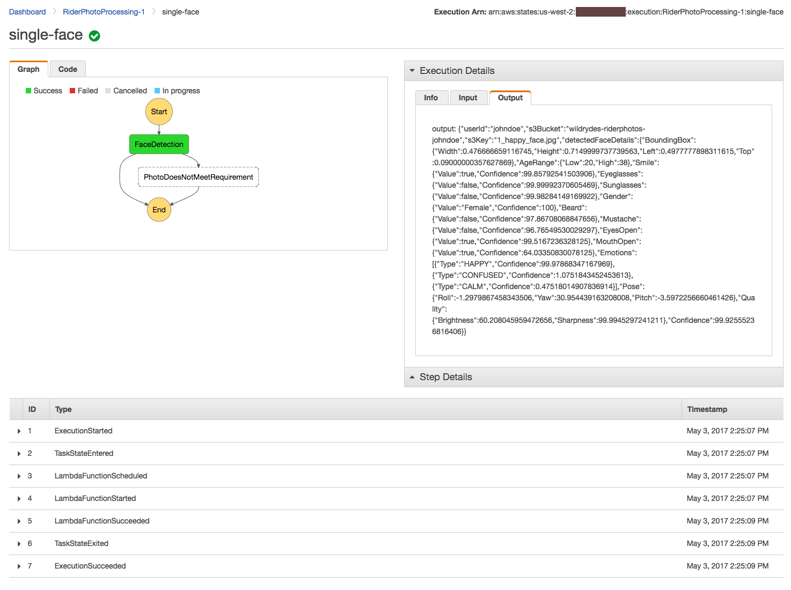

1. Create another execution by passing in the s3 key of a photo that wears sunglasses, see how the execution differs:  

	```JSON
	{
	  "userId": "user_b",
	  "s3Bucket": "REPLACE_WITH_YOUR_BUCKET_NAME",
	  "s3Key": "2_sunglass_face.jpg"
	} 
	```
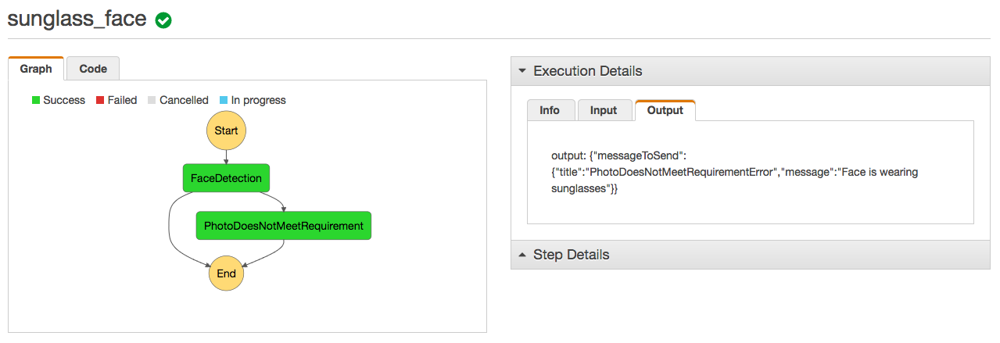
</p></details>


### 4. Add steps to prevent duplication and add face to index

If the uploaded photo has passed the basic face detection checks, the next step is to ensure the face has not been stored in our collection already to prevent the same user from signing up multiple times. In this section, you will add a **CheckFaceDuplicate** step to your state machine by leveraging the `FaceSearchFunction` AWS Lambda function.

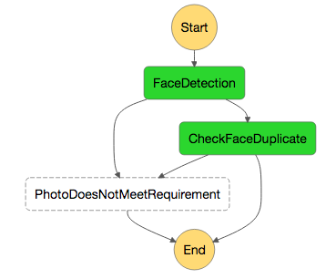

<details>
<summary><strong>Step-by-step instructions (expand for details)</strong></summary><p>

1. Edit your `rider-photo-state-machine.json` file to add a new step to the workflow. 

   First, add a new state `CheckFaceDuplicate` following the `PhotoDoesNotMeetRequirement` state. Then, replace the `REPLACE_WITH_FaceSearchFunctionArn` with the `FaceSearchFunctionArn` from the AWS CloudFormation output: 


	```JSON
	,
    "CheckFaceDuplicate": {
      "Type": "Task",
      "Resource": "REPLACE_WITH_FaceSearchFunctionArn",
      "ResultPath": null,
      "End": true,
      "Catch": [
        {
          "ErrorEquals": [
            "FaceAlreadyExistsError"
          ],
          "ResultPath": "$.errorInfo",
          "Next": "PhotoDoesNotMeetRequirement"
        }
      ]
    }
	```
1. Find the line in the `FaceDetection` state that marks it as the End state of the state machine

	```JSON
	     	 "End": true,

	```
	and replace it with
	
	```JSON
      		"Next": "CheckFaceDuplicate",

	```
	This tells AWS Step Functions if the  `FaceDetection` state runs successfully, go on to run the `CheckFaceDuplicate` state as the next step in the process. 

1. At this point, your `rider-photo-state-machine.json` file should look like this (the AWS Lambda ARNs are examples): 
	<details>
	<summary><strong>(expand to see)</strong></summary><p>

	```JSON
	{
	  "Comment": "Rider photo processing workflow",
	  "StartAt": "FaceDetection",
	  "States": {
	    "FaceDetection": {
	      "Type": "Task",
	      "Resource": "arn:aws:lambda:us-west-2:012345678912:function:wild-ryde-step-module-FaceDetectionFunction-4AYSKX2EGPV0",
	      "ResultPath": "$.detectedFaceDetails",
	      "Next": "CheckFaceDuplicate",
	      "Catch": [
	        {
	          "ErrorEquals": [
	            "PhotoDoesNotMeetRequirementError"
	          ],
	          "ResultPath": "$.errorInfo",
	          "Next": "PhotoDoesNotMeetRequirement"
	        }
	      ]
	    },
	    "PhotoDoesNotMeetRequirement": {
	      "Type": "Task",
	      "Resource": "arn:aws:lambda:us-west-2:012345678912:function:wild-ryde-step-module-NotificationPlaceholderFunct-CDRLZC8BRFWP",
	      "End": true
	    },
	    "CheckFaceDuplicate": {
	      "Type": "Task",
	      "Resource": "arn:aws:lambda:us-west-2:012345678912:function:wild-ryde-step-module-FaceSearchFunction-1IT67V4J214DC",
	      "ResultPath": null,
	      "End": true,
	      "Catch": [
	        {
	          "ErrorEquals": [
	            "FaceAlreadyExistsError"
	          ],
	          "ResultPath": "$.errorInfo",
	          "Next": "PhotoDoesNotMeetRequirement"
	        }
	      ]
	    }
	  }
	}
	```
	</p></details>

1. Go back the AWS Step Functions Console, create a new state machine `RiderPhotoProcessing-2` by copy-pasting the updated JSON definition:

	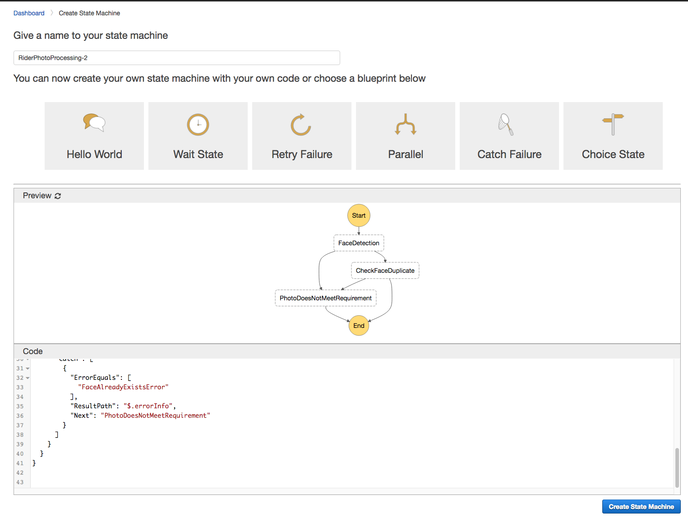

	> **Note**: AWS Step Functions state machines are immutable. Therefore, every time you want to change the state machine definition, you must always create a new state machine. 
	
1. Test the new state machine with the test input you've used before:

	```JSON
	{
	  "userId": "user_a",
	  "s3Bucket": "REPLACE_WITH_YOUR_BUCKET_NAME",
	  "s3Key": "1_happy_face.jpg"
	} 
	```
	Because we haven't added the step yet to index the face in the photo into the Rekognition collection, the `CheckFaceDuplicate` step will always succeed at this point. 


</p></details>

### 5. Add parallel processing step

If the uploaded photo passes both the `FaceDetection` and `CheckFaceDuplicate` stage, we can now proceed to index the rider's face and resize the photo for displaying in the app. Since these two steps don't depend on one another, they can be run in parallel. We will add a Parallel state in AWS Step Functions to run these steps. 

The ARNs of the two AWS Lambda functions that performs face index and generate thumbnails can be found in the AWS CloudFormation output `IndexFaceFunctionArn` and `ThumbnailFunctionArn` respectively. 

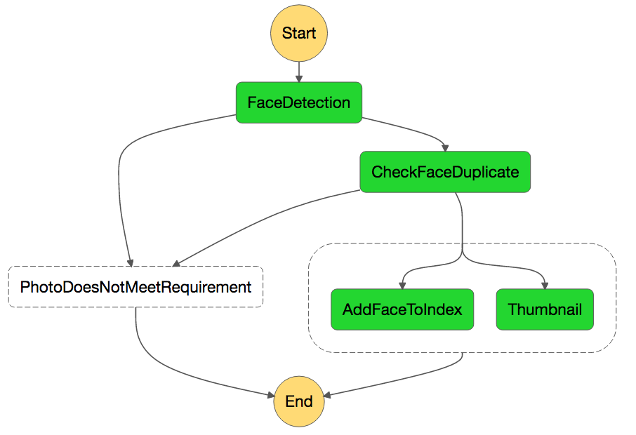

<details>
<summary><strong>Step-by-step instructions (expand for details)</strong></summary><p>

1. Edit your `rider-photo-state-machine.json` file to add a parallel step (with two sub-steps) to the workflow. 

   First, add a new state `ParallelProcessing` following the `CheckFaceDuplicate` state. Also make sure:
   
   *   Replace the `REPLACE_WITH_IndexFaceFunctionArn` with the `IndexFaceFunctionArn` from the AWS CloudFormation output.
   *   Replace the `REPLACE_WITH_ThumbnailFunctionArn` with the `ThumbnailFunctionArn` from the AWS CloudFormation output. 

	```JSON
    ,
    "ParallelProcessing": {
      "Type": "Parallel",
      "Branches": [
        {
          "StartAt": "AddFaceToIndex",
          "States": {
            "AddFaceToIndex": {
              "Type": "Task",
              "Resource": "REPLACE_WITH_IndexFaceFunctionArn",
              "End": true
            }
          }
        },
        {
          "StartAt": "Thumbnail",
          "States": {
            "Thumbnail": {
              "Type": "Task",
              "Resource": "REPLACE_WITH_ThumbnailFunctionArn",
              "End": true
            }
          }
        }
      ],
	   "ResultPath": "$.parallelResult",
      "End": true
    }
	```
	
1. Find the line in the `CheckFaceDuplicate` state that marks it as the End state of the state machine.

	```JSON
	     	 "End": true,

	```
	and replace it with
	
	```JSON
      		"Next": "ParallelProcessing",

	```
	This tells AWS Step Functions if the  `CheckFaceDuplicate ` state runs successfully, go on to run the `ParallelProcessing ` state as the next step in the process. 

1. At this point, your `rider-photo-state-machine.json` file should look like this (the AWS Lambda ARNs are examples): 
	
	<details>
	<summary><strong>(expand to see)</strong></summary><p>

	```JSON
	{
	  "Comment": "Rider photo processing workflow",
	  "StartAt": "FaceDetection",
	  "States": {
	    "FaceDetection": {
	      "Type": "Task",
	      "Resource": "arn:aws:lambda:us-west-2:012345678912:function:wild-ryde-step-module-FaceDetectionFunction-4AYSKX2EGPV0",
	      "ResultPath": "$.detectedFaceDetails",
	      "Next": "CheckFaceDuplicate",
	      "Catch": [
	        {
	          "ErrorEquals": [
	            "PhotoDoesNotMeetRequirementError"
	          ],
	          "ResultPath": "$.errorInfo",
	          "Next": "PhotoDoesNotMeetRequirement"
	        }
	      ]
	    },
	    "PhotoDoesNotMeetRequirement": {
	      "Type": "Task",
	      "Resource": "arn:aws:lambda:us-west-2:012345678912:function:wild-ryde-step-module-NotificationPlaceholderFunct-CDRLZC8BRFWP",
	      "End": true
	    },
	    "CheckFaceDuplicate": {
	      "Type": "Task",
	      "Resource": "arn:aws:lambda:us-west-2:012345678912:function:wild-ryde-step-module-FaceSearchFunction-1IT67V4J214DC",
	      "ResultPath": null,
	      "Next": "ParallelProcessing",
	      "Catch": [
	        {
	          "ErrorEquals": [
	            "FaceAlreadyExistsError"
	          ],
	          "ResultPath": "$.errorInfo",
	          "Next": "PhotoDoesNotMeetRequirement"
	        }
	      ]
	    },
	    "ParallelProcessing": {
	      "Type": "Parallel",
	      "Branches": [
	        {
	          "StartAt": "AddFaceToIndex",
	          "States": {
	            "AddFaceToIndex": {
	              "Type": "Task",
	              "Resource": "arn:aws:lambda:us-west-2:012345678912:function:wild-ryde-step-module-IndexFaceFunction-15658V8WUI67V",
	              "End": true
	            }
	          }
	        },
	        {
	          "StartAt": "Thumbnail",
	          "States": {
	            "Thumbnail": {
	              "Type": "Task",
	              "Resource": "arn:aws:lambda:us-west-2:012345678912:function:wild-ryde-step-module-ThumbnailFunction-A30TCJMIG0U8",
	              "End": true
	            }
	          }
	        }
	      ],
	      "ResultPath": "$.parallelResult",
	      "End": true
	    }
	  }
	}
	```
	</p></details>

1. Go back the AWS Step Functions Console, create a new state machine `RiderPhotoProcessing-3` by copy-pasting the updated JSON definition:

	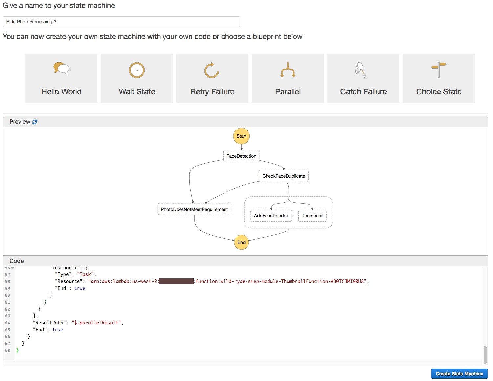

	> **Note**: AWS Step Functions state machines are immutable. Therefore, every time you want to change the state machine definition, you must always create a new state machine. 
	
1. Test the new state machine with the test input you've used before:

	```JSON
	{
	  "userId": "user_a",
	  "s3Bucket": "REPLACE_WITH_YOUR_BUCKET_NAME",
	  "s3Key": "1_happy_face.jpg"
	} 
	```

1. If last step succeeds, you can use the AWS CLI to check the list of faces indexed in your Rekognition collection (replace the `REPLACE_WITH_YOUR_CHOSEN_AWS_REGION` portion with the region string of your chosen region):

	```
	aws rekognition list-faces --collection-id rider-photos --region REPLACE_WITH_YOUR_CHOSEN_AWS_REGION
	```
	
	> You might find the `delete-faces` command useful when testing:

	```
	aws rekognition delete-faces --collection-id rider-photos --face-ids REPLACE_WITH_ID_OF_FACE_TO_DELETE --region REPLACE_WITH_YOUR_CHOSEN_AWS_REGION
	```

1. You can also use the Amazon S3 Console to check the Amazon S3 bucket created by AWS CloudFormation to store the resized thumbnail images. You should find resized thumbnail images in the bucket.

	> The name of the S3 bucket can be found in the in AWS CloudFormation output `ThumbnailS3Bucket`. You can also simply search for it in the S3 Console for `wildrydes-step-module-resources-thumbnails3bucket`

1. What happens if you start a new workflow with a different `userId` but the same s3key and s3bucket parameters?  


</p></details>

### 6. Add metadata persistence step

The last step of our image processing workflow is to persist the metadata of the profile photo with the user's profile.

The ARN of the AWS Lambda function that persists the metadata can be found in the in AWS CloudFormation output `PersistMetadataFunctionArn`.


<details>
<summary><strong>Step-by-step instructions (expand for details)</strong></summary><p>

1. Edit your `rider-photo-state-machine.json` file to add the final persistence step. 
 
   First, add a new state `PersistMetadata` following the `ParallelProcessing` state. Also make sure:
   
   *   Replace the `REPLACE_WITH_PersistMetadataFunctionArn` with the `PersistMetadataFunctionArn ` from the AWS CloudFormation output

	```JSON
	    ,
	    "PersistMetadata": {
	      "Type": "Task",
	      "Resource": "REPLACE_WITH_PersistMetadataFunctionArn",
	      "ResultPath": null,
	      "End": true
	    }

	```

1. Find the line in the `ParallelProcessing` state that marks it as the End state of the state machine.

	```JSON
	     	 "End": true

	```
	and replace it with
	
	```JSON
      		"Next": "PersistMetadata"

	```
	> **Note**: be careful to edit the `"End"` line at the `ParallelProcessing` level, not the individual branch level within the parallel state. 
	
	This tells AWS Step Functions if the `ParallelProcessing` state runs successfully, go on to run the `PersistMetadata` state as the next step in the process. 

1. At this point, your `rider-photo-state-machine.json` file should look like this (the AWS Lambda ARNs are examples): 
	<details>
	<summary><strong>(expand to see)</strong></summary><p>

	```JSON
	{
	  "Comment": "Rider photo processing workflow",
	  "StartAt": "FaceDetection",
	  "States": {
	    "FaceDetection": {
	      "Type": "Task",
	      "Resource": "arn:aws:lambda:us-west-2:012345678912:function:wild-ryde-step-module-FaceDetectionFunction-4AYSKX2EGPV0",
	      "ResultPath": "$.detectedFaceDetails",
	      "Next": "CheckFaceDuplicate",
	      "Catch": [
	        {
	          "ErrorEquals": [
	            "PhotoDoesNotMeetRequirementError"
	          ],
	          "ResultPath": "$.errorInfo",
	          "Next": "PhotoDoesNotMeetRequirement"
	        }
	      ]
	    },
	    "PhotoDoesNotMeetRequirement": {
	      "Type": "Task",
	      "Resource": "arn:aws:lambda:us-west-2:012345678912:function:wild-ryde-step-module-NotificationPlaceholderFunct-CDRLZC8BRFWP",
	      "End": true
	    },
	    "CheckFaceDuplicate": {
	      "Type": "Task",
	      "Resource": "arn:aws:lambda:us-west-2:012345678912:function:wild-ryde-step-module-FaceSearchFunction-1IT67V4J214DC",
	      "ResultPath": null,
	      "Next": "ParallelProcessing",
	      "Catch": [
	        {
	          "ErrorEquals": [
	            "FaceAlreadyExistsError"
	          ],
	          "ResultPath": "$.errorInfo",
	          "Next": "PhotoDoesNotMeetRequirement"
	        }
	      ]
	    },
	    "ParallelProcessing": {
	      "Type": "Parallel",
	      "Branches": [
	        {
	          "StartAt": "AddFaceToIndex",
	          "States": {
	            "AddFaceToIndex": {
	              "Type": "Task",
	              "Resource": "arn:aws:lambda:us-west-2:012345678912:function:wild-ryde-step-module-IndexFaceFunction-15658V8WUI67V",
	              "End": true
	            }
	          }
	        },
	        {
	          "StartAt": "Thumbnail",
	          "States": {
	            "Thumbnail": {
	              "Type": "Task",
	              "Resource": "arn:aws:lambda:us-west-2:012345678912:function:wild-ryde-step-module-ThumbnailFunction-A30TCJMIG0U8",
	              "End": true
	            }
	          }
	        }
	      ],
	      "ResultPath": "$.parallelResult",
	      "Next": "PersistMetadata"
	    },
	    "PersistMetadata": {
	      "Type": "Task",
	      "Resource": "arn:aws:lambda:us-west-2:012345678912:function:wild-ryde-step-module-PersistMetadataFunction-9PDCT2DT7K70",
	      "ResultPath": null,
	      "End": true
	    }
	  }
	}	
	```
	</p></details>

1. Go back the AWS Step Functions Console, create a new state machine `RiderPhotoProcessing-4` by copy-pasting the updated JSON definition:

	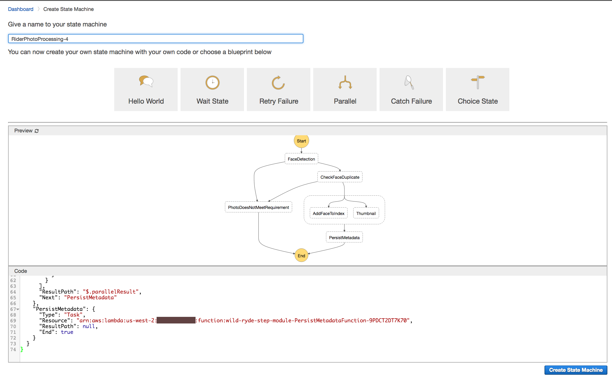
	
1. Test the new state machine with test input:

	```JSON
	{
	  "userId": "user_a",
	  "s3Bucket": "REPLACE_WITH_YOUR_BUCKET_NAME",
	  "s3Key": "1_happy_face.jpg"
	} 
	```
	
	If you reference an image that's already indexed when you were testing the previous state machine, the execution would fail the `CheckFaceDuplicate` step like this:
	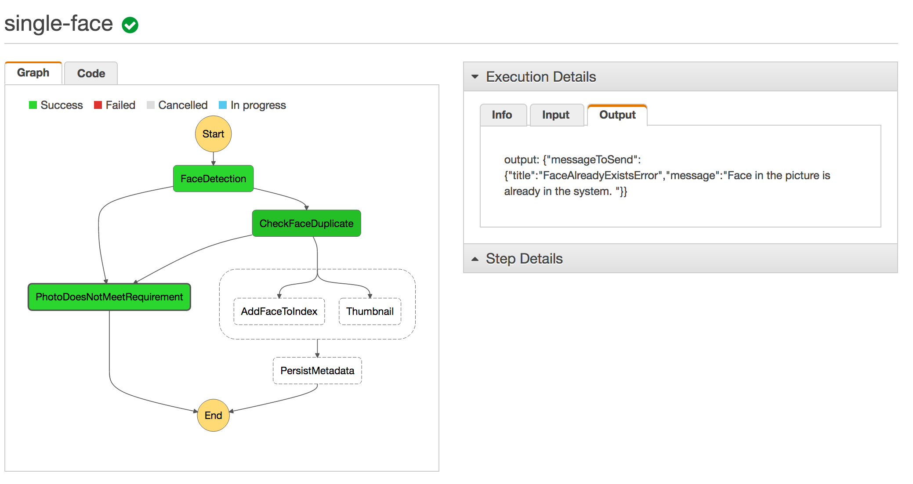

	You can use the `aws rekognition list-faces` and `aws rekognition delete-faces` commands to clean up the previous indexed faces during testing. Or you can upload a different picture to the `RiderPhotoS3Bucket` and use the s3 key of the new picture to test. 
	
	
</p></details>

## Implementation Validation

1. Test the final state machine (`RiderPhotoProcessing-4`) with different test images provided 

	Photo with sunglasses:

	```JSON
	{
	  "userId": "user_b",
	  "s3Bucket": "REPLACE_WITH_YOUR_BUCKET_NAME",
	  "s3Key": "2_sunglass_face.jpg"
	} 
	```

	Photo with multiple faces in it:
	
	```JSON
	{
	  "userId": "user_c",
	  "s3Bucket": "REPLACE_WITH_YOUR_BUCKET_NAME",
	  "s3Key": "3_multiple_faces.jpg"
	} 
	```
	
	Photo with no faces in it:

	```JSON
	{
	  "userId": "user_d",
	  "s3Bucket": "REPLACE_WITH_YOUR_BUCKET_NAME",
	  "s3Key": "4_no_face.jpg"
	} 
	```
	
1. Upload some pictures you have to S3, test some executions. If you have more than one picture of the same person, upload them both and run the workflow on each picture (make sure to use different `userId` fields in the test input). Verify the **CheckFaceDuplicate** step will prevent the same face from being indexed more than once. 

1. Go to the Amazon DynamoDB console, look for a table with name starting with "wildrydes-step-module-resources-RiderPhotoDDBTable" (you can also find the table name in the CloudFormation stack output). Check out the items of the table. 
	
	

1. Go to the Amazon S3 console, verify the thumbnail images of the photos you processed are in the thumbnail S3 Bucket. 

Now you have built a multi-step image processing workflow using AWS Step Functions! The workflow can be integrated to your app by fronting it with AWS API Gateway or triggered from an Amazon S3 upload event.  

## Extra credit
The intent of the **PhotoDoesNotMeetRequirement**  step is to send notification to the user that the verification of their profile photo failed so they might try uploading a different picture. It currently uses the AWS Lambda function `NotificationPlaceholderFunction` which simply returns the message instead of actually sending the notification. Implement sending email notifications in the Lambda function using Amazon Simple Email Service (SES). 

## Clean-up 

1. Delete the `RiderPhotoProcessing-*` state machines from the AWS Step Functions console.

	<details>
	<summary><strong>Step-by-step instructions (expand for details)</strong></summary><p>
	
	In the AWS Step Functions Management Console, go to **Dashboard**, select the state machine to delete, then click **Delete**.
	
	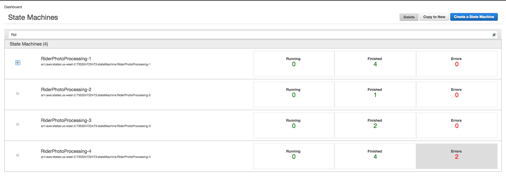 
	
	</p></details>

1. Empty the Amazon S3 buckets used to store rider images and thumbnails.

	<details>
	<summary><strong>Step-by-step instructions (expand for details)</strong></summary><p>
	
	1. In the Amazon S3 Management Console, click on the  icon next to Amazon S3 bucket used to store rider photos (The S3 bucket should have a name similar to `wildrydes-step-module-resource-riderphotos3bucket-7l698ggkdcf3`).
	 
		 
	1. Click on the **Empty Bucket** button.
	
		
		
	1. Copy/paste the bucket name into the pop-up box, then click **Confirm**.
	
		
		
	1. Repeat the steps to empty the Amazon S3 bucket used to store photo thumbnails (it should have a name similar to `wildrydes-step-module-resources-thumbnails3bucket-1j0t3m28k7mxo`).

	</p></details>

1. Delete the `wildrydes-step-module-resources` AWS CloudFormation stack that launched the AWS Lambda functions, Amazon S3 buckets and Amazon DynamoDB table.

	<details>
	<summary><strong>Step-by-step instructions (expand for details)</strong></summary><p>
	
	1. In the AWS CloudFormation Management Console, select the `wildrydes-step-module-resources` stack.
	
 	1. Select **Delete Stack** under **Actions**.
 	
		
	
	1. Click **Yes, Delete**
	
	</p></details>
	
1. Delete the Amazon Rekognition collection.


	<details>
	<summary><strong>Step-by-step instructions (expand for details)</strong></summary><p>
	
	1. In a terminal window, run the following command and replace the `REPLACE_WITH_YOUR_CHOSEN_AWS_REGION` portion with the AWS region you have used. 

			aws rekognition delete-collection --region REPLACE_WITH_YOUR_CHOSEN_AWS_REGION --collection-id rider-photos
	
		For example:
	
			aws rekognition delete-collection --region us-east-1 --collection-id rider-photos
			aws rekognition delete-collection --region us-west-2 --collection-id rider-photos
			aws rekognition delete-collection --region eu-west-1 --collection-id rider-photos
	
	
	2. If successful, you should get an acknowledgment from the service that looks like:

		```JSON
		{
	    	"StatusCode": 200
		}
		```
	
	</p></details>
