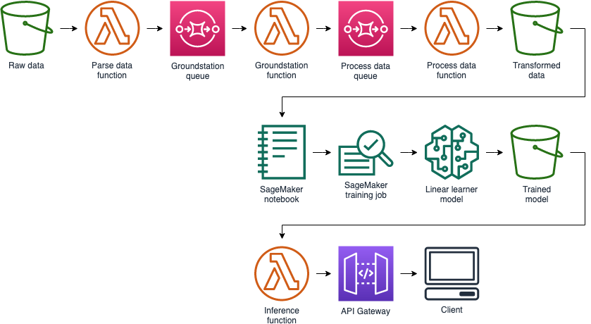

# Module 0: Leveraging External Data in Exploratory Work

In data analysis you often have hunches that you need to prove or disprove.  This module walks through the steps of loading and cleansing an external dataset - in this case, 3rd party weather data (see below for data set details).

**TODO**
Here are the Cloudformation templates to launch the full stack in it's completed state:

Region| Launch
------|-----
US East (N. Virginia) | [](https://console.aws.amazon.com/cloudformation/home?region=us-east-1#/stacks/new?stackName=your-stack-name&templateURL=https://s3.amazonaws.com/wildrydes-us-east-1/WorkshopTemplate/1_ExampleTemplate/example.yaml)
US West (Oregon) | [](https://console.aws.amazon.com/cloudformation/home?region=us-west-2#/stacks/new?stackName=your-stack-name&templateURL=https://s3.amazonaws.com/wildrydes-us-west-2/WorkshopTemplate/1_ExampleTemplate/example.yaml)

<details>
<summary><strong>CloudFormation Launch Instructions (expand for details)</strong></summary><p>

**TODO**

1. Click the **Launch Stack** link above for the region of your choice.

1. Click **Next** on the Select Template page.

1. Provide a globally unique name for the **Website Bucket Name** such as `wildrydes-yourname` and click **Next**.
    

1. On the Options page, leave all the defaults and click **Next**.

1. On the Review page, check the box to acknowledge that CloudFormation will create IAM resources and click **Create**.
    

    This template uses a custom resource to copy the static website assets from a central S3 bucket into your own dedicated bucket. In order for the custom resource to write to the new bucket in your account, it must create an IAM role it can assume with those permissions.

1. Wait for the `wildrydes-webapp-1` stack to reach a status of `CREATE_COMPLETE`.

1. With the `wildrydes-webapp-1` stack selected, click on the **Outputs** tab and click on the WebsiteURL link.

1. Verify the Wild Rydes home page is loading properly and move on to the next module, [User Management](../2_UserManagement).

</p></details>


## Solution Architecture



Source for Draw.io: [diagram xml](assets/WildRydesML.xml)


## Implementation Overview

**TODO**

This section should provide students with the high level steps required to complete the solution. It should enumerate all the components and major configuration tasks required, but should not get to the detail of providing step-by-step instructions for which console buttons to click, etc.

Sample:

The following provides an overview of the steps needed to complete this module. This section is intended to provide enough details to complete the module for students who are already familiar with the AWS console and CLI. If you'd like detailed, step-by-step instructions, please use the heading links to jump to the appropriate section.

*Create an S3 Bucket* - Use the console or CLI to create an S3 bucket. If you'd like to use a custom domain to host the site make sure you name your bucket using the full domain name (e.g. wildrydesdemo.example.com). Read more about custom domain names for S3 buckets here.

*Upload content* - Copy the content from the example bucket, xyz. There is also a zip archive available at xyz that you can download locally and extract in order to upload the content via the console.

*Add a bucket policy to allow public reads* - Bucket policies can be updated via the console or CLI. You can use the provided policy document or build your own. See the documentation for more information.

*Enable public web hosting*


## The Dataset
The dataset we're using is [NOAA Global Historical Climatology Network Daily (GHCN-D)](https://registry.opendata.aws/noaa-ghcn/) ([dataset readme](https://docs.opendata.aws/noaa-ghcn-pds/readme.html)).  We're only interested in the NY groundstations:

```
US1NYNY0074  40.7969  -73.9330    6.1 NY NEW YORK 8.8 N                              
USC00305798  40.6000  -73.9667    6.1 NY NEW YORK BENSONHURST                        
USC00305799  40.8667  -73.8833   27.1 NY NEW YORK BOTANICAL GRD                      
USC00305804  40.7333  -73.9333    3.0 NY NEW YORK LAUREL HILL                        
USC00305806  40.8500  -73.9167   54.9 NY NEW YORK UNIV ST                            
USC00305816  40.7000  -74.0167    3.0 NY NEW YORK WB CITY                            
USW00014732  40.7794  -73.8803    3.4 NY NEW YORK LAGUARDIA AP                  72503
USW00014786  40.5833  -73.8833    4.9 NY NEW YORK FLOYD BENNETT FLD                  
USW00093732  39.8000  -72.6667   25.9 NY NEW YORK SHOALS AFS                         
USW00094728  40.7789  -73.9692   39.6 NY NEW YORK CNTRL PK TWR              HCN 72506
USW00094789  40.6386  -73.7622    3.4 NY NEW YORK JFK INTL AP                   74486
```

### Trimming Down the dataset with Athena
*Copy the dataset from the public location to your own S3 bucket*
```
aws athena start-query-execution \
--query-string "CREATE EXTERNAL TABLE IF NOT EXISTS default.noaatmp (  `id` string,  `year_date` string,  `element` string,  `data_value` string,  `m_flag` string,  `q_flag` string,  `s_flag` string,  `obs_time` string ) ROW FORMAT SERDE 'org.apache.hadoop.hive.serde2.lazy.LazySimpleSerDe' WITH SERDEPROPERTIES (  'serialization.format' = ',',  'field.delim' = ',') LOCATION 's3://noaa-ghcn-pds/csv/' TBLPROPERTIES ('has_encrypted_data'='false');" \
--result-configuration "OutputLocation=s3://[YOUR PRIVATE S3 BUCKET]/output/" \
--region us-east-1
```

*Convert your CSV dataset into Parquet*
```
aws athena start-query-execution \
--query-string "CREATE table default.noaatmpparquet WITH (format='PARQUET', external_location='s3://[YOUR PRIVATE S3 BUCKET]/parquet/') AS SELECT * FROM default.noaatmp WHERE q_flag = '' AND id IN ('US1NYNY0074', 'USC00305798', 'USC00305799', 'USC00305804', 'USC00305806', 'USC00305816', 'USW00014732', 'USW00014786', 'USW00093732', 'USW00094728', 'USW00094789') AND year_date LIKE '2019%';" \
--region us-east-1
```

```
aws athena get-query-execution \
--region us-east-1 \
--query-execution-id "${last_query_id}"
```

Now from inside your sagemaker notebook you can reference this athena table: https://aws.amazon.com/blogs/machine-learning/run-sql-queries-from-your-sagemaker-notebooks-using-amazon-athena/
