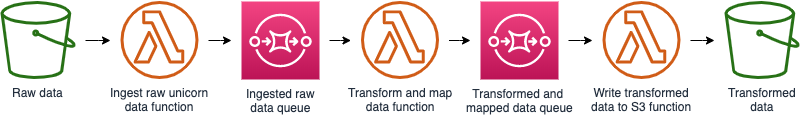
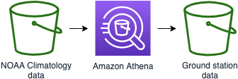
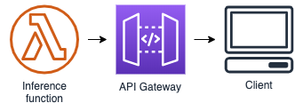

# Module 0: Leveraging External Data in Exploratory Work

## Introduction

Welcome to the Wild Rydes Unicorn Efficiency team! We are a lean team of one; you! You'll need to wear many hats such as developer, data scientist, and operations. Your goal is to help unicorns maximize their efficiency while they deliver riders around the globe. Our unicorns generate data with each ride and we capture data points such as distance traveled, energy points consumed, and magic points consumed. We have received anecdotal reports that some unicorns use too many magic points. We have collected data from rides and need your help identifying the root cause.

This module has a few difficulty levels:

* Figure it Out mode :metal: = You'll be given high level directions and you need to figure out the details.
* Hold My Hand mode :white_check_mark: = You'll be given detailed directions with little to figure out.
* Do it For Me mode :see_no_evil: = Just run some commands to get the work done.

## Solution Architecture

Our plan is to create a serverless data processing pipeline using AWS Lambda, Amazon S3, and Amazon SQS. You will then use AWS Machine Learning services to train a model. Finally you will make inferences against the model using AWS Lambda so our costs are appropriately controlled.


Source for Draw.io: [diagram xml](assets/WildRydesML.xml)

## Implementation

### Set up your development environment

We are going to use AWS Cloud9 as our cloud-based integrated development environment. It will get you bootstrapped with the right tools and access on Day 1.

<details>
<summary><strong>Figure It Out :metal: (expand for details)</strong></summary><p>
1. Create a Cloud9 environment.
</p></details>

<details>
<summary><strong>Hold My Hand :white_check_mark: (expand for details)</strong></summary><p>
Create your Cloud9 instance by following these steps:

1. Navigate to AWS Cloud9 [in the console](https://us-east-1.console.aws.amazon.com/cloud9)
1. Click **Create environment**
1. Provide a name and optional description
1. Click **Next step**
1. Leave all defaults
1. Click **Next step**
1. Click **Create environment**

After a minute or so, your environment will be ready. Go ahead and:

1. Close the "Welcome" tab
1. Drag the lower section up so you have a comfortable amount of space
1. Find the tab that looks like a terminal (hint: it will have `...~/environment $`)
1. Run a command to list S3 buckets: `aws s3 ls`

*Hint: New editors and terminals can be created by clicking the green "+" icon in a circle*

Let's get our code and start working. Inside the terminal:

1. Run the following command to get our code:
    ```
    git clone https://github.com/jmcwhirter/aws-serverless-workshops/
    ```
1. Navigate to our module:
    ```
    cd aws-serverless-workshops/MachineLearning/0_ExternalData/
    ```
1. Explore the directory structure:
  * The `cloudformation` directory contains CloudFormation templates we will use to create resources
  * The `data` directory contains ride data collected from unicorns
  * The `lambda-functions` directory contains all of the code we'll use to process data and make inferences
  * The `notebooks` directory contains a linear learner iPython notebook

</p></details>

Do it For Me :see_no_evil: (not available)

### Create data processing pipeline



<details>
<summary><strong>Figure It Out :metal: (expand for details)</strong></summary><p>

1. Create an S3 bucket
1. Create an execution role for Lambda
1. Create a Lambda function based on `lambda-functions/process-unicorn-data/index.py`
1. Create an SQS queue to buffer the ingest function
1. Create a Lambda function based on `lambda-functions/find-closest-groundstation/index.py`
1. Create an SQS queue to buffer the groundstation function
1. Create a Lambda function based on `lambda-functions/unicorn-groundstation-data-to-s3/index.py`

</p></details>

<details>
<summary><strong>Hold My Hand :white_check_mark: (expand for details)</strong></summary><p>

1. 

</p></details>

<details>
<summary><strong>Do it For Me :see_no_evil: (expand for details)</strong></summary><p>
1. Navigate to your Cloud9 environment
1. Run the following command:
    ```
    aws cloudformation create-stack \
    --stack-name wildrydes-ml-mod0-1 \
    --capabilities CAPABILITY_NAMED_IAM \
    --template-body file://cloudformation/1_data-pipeline.yml
    ```

</p></details>

### Upload raw travel data

We have data collected from our unicorns of which we're going to focus on two attributes: magic points and distance. We hold a strong belief that a unicorn is heavily utilized when the number of magic points is more than 50 times the distance traveled. We can apply this business logic as a new attribute to our data using AWS Lambda.

Use the console or CLI to upload travel data to an S3 bucket. Once you upload the raw travel data file, a process will be started involving three AWS Lambda functions and two Amazon Simple Queue Service (SQS) queues. You can use the [Amazon SQS console](https://console.aws.amazon.com/sqs/home?region=us-east-1) to track how your Lambda functions are processing the data and/or use the [CloudWatch Dashboard](https://console.aws.amazon.com/cloudwatch/home?region=us-east-1#dashboards:name=Wild_Rydes_Machine_Learning;start=PT1H) built as part of this lab.

High level steps:

1. upload ride_data.json into the data bucket, under a directory named `raw/`
1. S3 event automatically triggers the Parse Unicorn Data function
1. Parse Unicorn Data function will read the JSON file and places each entry on an SQS queue
1. Find Nearest Ground Station function reads from the SQS queue, finds the closest weather station, and applies a label indicating if the ride was a "heavy utilization" scenario
1. Find Nearest Ground Station function places the record on another SQS queue
1. Processed Data to S3 function puts the record back into S3 in CSV format

<details>
<summary><strong>:white_check_mark: Step-by-step directions (expand for details)</strong></summary><p>

Console:

1. Navigate to your [AWS CloudFormation](https://console.aws.amazon.com/cloudformation/home?region=us-east-1) stack in the AWS Console
1. In the outputs tab, take note of the **DataBucketName** value
1. Open [Amazon S3](https://s3.console.aws.amazon.com/s3/home?region=us-east-1) in the AWS Console
1. Navigate to the data bucket and click into it
1. Click **Create Folder**, type `raw`, and click save
1. Click the new `raw` directory to navigate into it
1. Click **Upload**
1. Click **Add files**
1. Select `ride_data.json` from the `data` directory in this repository

CLI:
```
aws cloudformation describe-stacks \
  --stack-name wildrydes-machine-learning-module-0 \
  --query "Stacks[0].Outputs[?OutputKey=='DataBucketName'].OutputValue" \
  --output text | xargs -I {} \
      aws s3 cp data/ride_data.json s3://{}
```
</p></details><br>

The upload takes about 8 minutes to process. Remember you can check out [Amazon SQS console](https://console.aws.amazon.com/sqs/home?region=us-east-1) and/or [CloudWatch Dashboard](https://console.aws.amazon.com/cloudwatch/home?region=us-east-1#dashboards:name=Wild_Rydes_Machine_Learning;start=PT1H) to track the progress.

Once our travel data has been processed and stored back in S3, we want to see if weather is impacting the magic points used by our unicorns. Let's get some weather related data to fold in.

### Ground Station Data Prep

The dataset we're using is [NOAA Global Historical Climatology Network Daily (GHCN-D)](https://registry.opendata.aws/noaa-ghcn/) ([dataset readme](https://docs.opendata.aws/noaa-ghcn-pds/readme.html)).  There are roughly one billion records in this public data set. We should pair that down. Since our unicorns operate within the New York City area, we're only interested in those ground stations:

```
US1NYNY0074  40.7969  -73.9330    6.1 NY NEW YORK 8.8 N
USW00014732  40.7794  -73.8803    3.4 NY NEW YORK LAGUARDIA AP
USW00094728  40.7789  -73.9692   39.6 NY NEW YORK CNTRL PK TWR
USW00094789  40.6386  -73.7622    3.4 NY NEW YORK JFK INTL AP
```

:white_check_mark: **Step-by-step directions**

1. Navigate to your [AWS CloudFormation](https://console.aws.amazon.com/cloudformation/home?region=us-east-1) stack in the AWS Console
1. In the outputs tab, grab the **AthenaSelectQuery** value
1. Open [Amazon Athena](https://console.aws.amazon.com/athena/home?region=us-east-1) and run that command.
1. Go back to [AWS CloudFormation](https://console.aws.amazon.com/cloudformation/home?region=us-east-1), in the outputs tab, click into the **AthenaCSVLocation** link and drill into today's date until you find a CSV for the query you just ran.  It will contain the results of your query in CSV format that you can later provide the path to your notebook.
1. Check the box next to the CSV file, click **Actions**, **Copy**
1. Navigate to your data bucket
1. Create a new folder by clicking **Create folder** and type `nygroundstationdata`
1. Navigate into **nygroundstationdata**, click **Actions**, **Paste**
1. Now you have the relevant weather data in CSV format in our transformed data bucket.

Without provisioning any servers we were able to use Amazon Athena to get the records we need from 94 GB of data in about 20 seconds. Now our ride data has been augmented with business logic and we have weather data from relevant weather stations. We can now mold this data using our SageMaker notebook.

### Additional Data Prep and Model Training



The role of a data scientist involves pulling data from various sources. We will use a SageMaker notebook to walk through additional data preparation and model training. Below are directions to access the notebook. Within the notebook you'll find another set of detailed directions.

New to Amazon Sagemaker? Never used a Sagemaker Notebook? [Check out this quick start guide for a crash course](sagemaker-intro.md)

:white_check_mark: **Step-by-step directions**

1. Navigate to [Amazon SageMaker](https://console.aws.amazon.com/sagemaker/home?region=us-east-1#/notebook-instances) in AWS Console
1. Open the notebook instance named `WildRydesNotebook-***`
1. Click the **Open Jupyter** link under Actions
1. When redirected to the notebook instance, click **New** (upper right), then select **Terminal** from list.
1. A new tab will open. When in the terminal, run the following command:
    ```
    curl https://raw.githubusercontent.com/jmcwhirter/aws-serverless-workshops/master/MachineLearning/0_ExternalData/notebooks/linear_learner.ipynb -o SageMaker/linear_learner.ipynb && exit
    ```
1. Exit the terminal tab/window
1. Open the **linear_learner.ipynb** notebook and follow the instructions.

At this point, you should have a trained model in S3. You may have set up the optional endpoint to test your work. Instead of using an endpoint with an always on server, let's explore using Lambda to make inferences against our model.

### Make inferences against the model



At this point, we have a trained model on s3.  Now, we're ready to load the model into lambda at runtime and make inferences against the model.  The Lambda function that will make inferences is hosted behind an API Gateway that will accept POST HTTP requests.

First we need to update the Lambda function environment variable to reference our trained model on s3.  Then we can issue HTTP POST requests with a JSON body via our client of choice to see our model in action!

:white_check_mark: **Step-by-step directions**

1. Go back to CloudFormation, in the resources tab, find the `DataBucket` and click on the link.  Drill into the the path that starts will `linear-learner-*` until you find `model.tar.gz`.  Select the checkmark next to this file, and select "Copy Path"
1. Go back to CloudFormation, in the resources tab, find the `ModelInferenceFunction` and click on the link.  Scroll down to the environment variables section and update the `MODEL_PATH` parameter with the value you copied from the previous step.  Delete the `s3://BUCKET_NAME/` from the pasted value so that only the key (folder + filename) remains.  Save the changes.
1. Go back to CloudFormation, in the outputs tab, copy the curl command for making inferences against your function hosting your model.
1. _Optional_: You can also test the lambda function by putting using the test API UI in the API Gateway console.


## Clean up

Remove the data from your data bucket. Once this is complete, you can delete the stack via CLI or console.

<details>
<summary><strong>:white_check_mark: Step-by-step directions (expand for details)</strong></summary><p>

Manually:

*TODO*

CLI:
1. Delete data in your bucket
    ```
    aws cloudformation describe-stacks \
      --stack-name wildrydes-machine-learning-module-0 \
      --query "Stacks[0].Outputs[?OutputKey=='DataBucketName'].OutputValue" \
      --output text | xargs -I {} \
          aws s3 rm s3://{} --recursive
    ```
1. Delete the stack
    ```
    aws cloudformation delete-stack \
      --stack-name wildrydes-machine-learning-module-0
    ```
</p></details>
