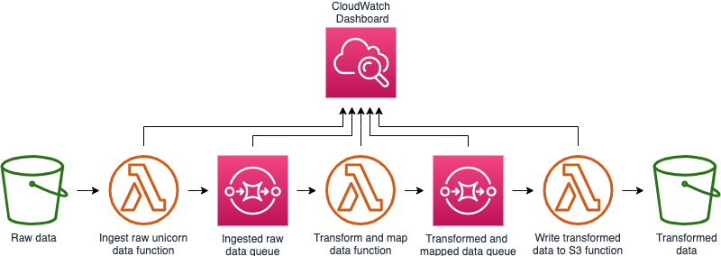

### Create data processing pipeline

**Time to complete:** 45-60 minutes.



**:metal: Figure It Out**

1. Create an S3 bucket
1. Create an SQS queue to buffer the ground station function
1. Create an SQS queue to buffer the ingest function
1. Create an execution role for Lambda that allows access to the S3 bucket you created, the SQS queues you created, and all CloudWatch Logs access.
1. Create a Lambda function based on `lambda-functions/process-unicorn-data/index.py`
1. Create a Lambda function based on `lambda-functions/find-closest-groundstation/index.py`
1. Create a Lambda function based on `lambda-functions/unicorn-groundstation-data-to-s3/index.py`

<details>
<summary><strong>:white_check_mark: Hold My Hand (expand for details)</strong></summary><p>

Create an S3 bucket:

1. Navigate to [Simple Storage Service](https://s3.console.aws.amazon.com/) in the console
1. Click **Create bucket**
1. Give the bucket a globally unique name
1. Keep all other options and click **Create**

Create an SQS queue to buffer the ground station function:

1. Navigate to [Simple Queue Service](https://console.aws.amazon.com/sqs) in the console
1. Click **Create New Queue**
1. Provide a queue name such as **GroundstationQueue**
1. Choose **Standard Queue**
1. Click **Quick-Create Queue**

Create an SQS queue to buffer the ingest function:

1. Click **Create New Queue**
1. Provide a queue name such as **IngestQueue**
1. Choose **Standard Queue**
1. Click **Quick-Create Queue**

Create the correct policy Lambda:

1. Navigate to [Identify and Access Management](https://console.aws.amazon.com/iam) in the console
1. Click **Policies**
1. Click **Create policy**
1. Select the service: **S3**
1. Select **All S3 actions**
1. In the resource section:
    1. Choose to add a bucket ARN and specify the bucket name you just created
    1. Choose to add an object ARN, specifying the bucket name you just created and selecting **Any** for the objects
1. Select **Add additional permissions**
1. Select the service **SQS**
1. Select **All SQS actions**
1. In the resource section, choose to add a queue ARN and specify any region and any queue name
1. Select **Add additional permissions**
1. Select the service **CloudWatch Logs**
1. Select **All CloudWatch Logs actions**
1. In the resource, section choose **All resources**
1. Click **Review policy**
1. Provide a name, such as **AllowLambdaFunctionality**
1. Click **Create policy**

Create an execution role:

1. Click **Roles**
1. Click **Create role**
1. Select **Lambda** as the service that will use the role
1. Click **Next: Permissions**
1. Select the policy you just created
1. Click **Next: Tags**
1. Click **Next: Review**
1. Provide a role name such as **AllowLambdaFunctionality**
1. Click **Create Role**

Create a Lambda function to process unicorn data:

1. Navigate to [Lambda](https://console.aws.amazon.com/lambda) in the console
1. Click **Functions**
1. Click **Create function**
1. Select **Author from scratch**
1. Provide a function name such as **ProcessUnicornData**
1. Choose **Python 3.7** for the runtime
1. Choose to use an existing execution role and select the one you just created
1. Click **Create function**
1. Copy and paste the code from `lambda-functions/process-unicorn-data/index.py` to the editor
1. Create an environment variable with:
    * Key == "OUTPUT_QUEUE"
    * Value == `https://sqs.<your-region>.amazonaws.com/<your_account_number>/<your_ingest_queue_name>`
1. Set the memory to 256 MB
1. Set the timeout to 15 min
1. In the Designer view, click **Add trigger**
1. Select **S3**
1. Choose the data bucket you created
1. For the prefix, type `raw/`
1. Click **Add**
1. Click **Save**

Create a Lambda function to find ground station data:

1. Click the "hamburger" menu on the left side
1. Click **Functions**
1. Click **Create function**
1. Select **Author from scratch**
1. Provide a function name such as **TransformUnicornData**
1. Choose **Python 3.7** for the runtime
1. Choose to use an existing execution role and select the one you just created
1. Click **Create function**
1. Copy and paste the code from `lambda-functions/find-closest-groundstation/index.py` to the editor
1. Create an environment variable with:
    * Key == "OUTPUT_QUEUE"
    * Value == `https://sqs.<your-region>.amazonaws.com/<your_account_number>/<your_groundstation_queue_name>`
1. Set the memory to 128 MB
1. Set the timeout to 3 sec
1. In the Designer view, click **Add trigger**
1. Select **SQS**
1. Choose the ingest queue you created
1. Click **Add**
1. Click **Save**

Create a Lambda function to send data to S3:

1. Click the "hamburger" menu on the left side
1. Click **Functions**
1. Click **Create function**
1. Select **Author from scratch**
1. Provide a function name such as **WriteData**
1. Choose **Python 3.7** for the runtime
1. Choose to use an existing execution role and select the one you just created
1. Click **Create function**
1. Copy and paste the code from `lambda-functions/unicorn-groundstation-data-to-s3/index.py` to the editor
1. Create an environment variable with:
    * Key == "OUTPUT_BUCKET"
    * Value == *The name of the data bucket you created earlier*
1. Set the memory to 128 MB
1. Set the timeout to 3 sec
1. In the Designer view, click **Add trigger**
1. Select **SQS**
1. Choose the ground station queue you created
1. Click **Add**
1. Click **Save**

</p></details>

<details>
<summary><strong>:see_no_evil: Do it For Me (expand for details)</strong></summary><p>

1. Navigate to your Cloud9 environment
1. Run the following commands to create your resources:
    ```
    cd ~/environment/aws-serverless-workshops/MachineLearning/0_ExternalData
    aws cloudformation create-stack \
    --stack-name wildrydes-ml-mod0-1 \
    --capabilities CAPABILITY_NAMED_IAM \
    --template-body file://cloudformation/1_data-pipeline.yml
    ```
1. Run the following command until you get `CREATE_COMPLETE` in the output:
    ```
    aws cloudformation describe-stacks \
    --stack-name wildrydes-ml-mod0-1 \
    --query 'Stacks[0].StackStatus' \
    --output text
    ```

</p></details>

### Upload raw travel data

**Time to complete:** 15-20 minutes.

We have data collected from our unicorns of which we're going to focus on two attributes: magic points and distance. We hold a strong belief that a unicorn is heavily utilized when the number of magic points is more than 50 times the distance traveled. We can apply this business logic as a new attribute to our data using AWS Lambda.

Use the console or CLI to upload travel data to an S3 bucket. Once you upload the raw travel data file, a process will be started involving three AWS Lambda functions and two Amazon Simple Queue Service (SQS) queues. You can use the [Amazon SQS console](https://console.aws.amazon.com/sqs/home?region=us-east-1) to track how your Lambda functions are processing the data and/or use the [CloudWatch Dashboard](https://console.aws.amazon.com/cloudwatch/home?region=us-east-1#dashboards:name=Wild_Rydes_Machine_Learning;start=PT1H) built as part of this lab.

**:metal: Figure It Out**

1. upload ride_data.json into the data bucket, under a directory named `raw/`
1. S3 event automatically triggers the Parse Unicorn Data function
1. Parse Unicorn Data function will read the JSON file and places each entry on an SQS queue
1. Find Nearest Ground Station function reads from the SQS queue, finds the closest weather station, and applies a label indicating if the ride was a "heavy utilization" scenario
1. Find Nearest Ground Station function places the record on another SQS queue
1. Processed Data to S3 function puts the record back into S3 in CSV format

<details>
<summary><strong>:white_check_mark: Hold My Hand (expand for details)</strong></summary><p>

1. Navigate to the data bucket you created in the previous section and click into it
1. Click **Create Folder**, type `raw`, and click save
1. Click the new `raw` directory to navigate into it
1. Click **Upload**
1. Click **Add files**
1. Select `ride_data.json` from the `data` directory in this repository

</p></details>

<details>
<summary><strong>:see_no_evil: Do it For Me (expand for details)</strong></summary><p>

1. Navigate to your Cloud9 environment
1. Run the following command:
    ```
    aws cloudformation describe-stacks \
      --stack-name wildrydes-ml-mod0-1 \
      --query "Stacks[0].Outputs[?OutputKey=='DataBucketName'].OutputValue" \
      --output text | xargs -I {} \
          aws s3 cp data/ride_data.json s3://{}
    ```

</p></details><br>

The upload takes about 8 minutes to process. Remember you can check out [Amazon SQS console](https://console.aws.amazon.com/sqs/home?region=us-east-1) and/or [CloudWatch Dashboard](https://console.aws.amazon.com/cloudwatch/home?region=us-east-1#dashboards:name=Wild_Rydes_Machine_Learning;start=PT1H) to track the progress.

Once our travel data has been processed and stored back in S3, we want to see if weather is impacting the magic points used by our unicorns. Let's get some weather related data to fold in.

### Ground Station Data Prep

**Time to complete:** 15-20 minutes.


The dataset we're using is [NOAA Global Historical Climatology Network Daily (GHCN-D)](https://registry.opendata.aws/noaa-ghcn/) ([dataset readme](https://docs.opendata.aws/noaa-ghcn-pds/readme.html)).  There are roughly one billion records in this public data set. We should pair that down. Since our unicorns operate within the New York City area, we're only interested in those ground stations:

```
US1NYNY0074  40.7969  -73.9330    6.1 NY NEW YORK 8.8 N
USW00014732  40.7794  -73.8803    3.4 NY NEW YORK LAGUARDIA AP
USW00094728  40.7789  -73.9692   39.6 NY NEW YORK CNTRL PK TWR
USW00094789  40.6386  -73.7622    3.4 NY NEW YORK JFK INTL AP
```

**:metal: Figure It Out**

1. Use Amazon Athena to reduce the size of ground station data
1. Save the reduced data set in your S3 bucket

<details>
<summary><strong>:white_check_mark: Hold My Hand (expand for details)</strong></summary><p>

1. Navigate to your Cloud9 environment
1. Run the following commands to create your resources:
    ```
    cd ~/environment/aws-serverless-workshops/MachineLearning/0_ExternalData
    aws cloudformation create-stack \
    --stack-name wildrydes-ml-mod0-2 \
    --capabilities CAPABILITY_NAMED_IAM \
    --template-body file://cloudformation/2_ground-station.yml
    ```
1. Navigate to the `wildrydes-ml-mod0-2` stack in [AWS CloudFormation](https://console.aws.amazon.com/cloudformation/home?region=us-east-1)
1. In the outputs tab, grab the **AthenaSelectQuery** value
1. Open [Amazon Athena](https://console.aws.amazon.com/athena/home?region=us-east-1) and run that command.
1. Go back to [AWS CloudFormation](https://console.aws.amazon.com/cloudformation/home?region=us-east-1), in the outputs tab, click into the **AthenaCSVLocation** link and drill into today's date until you find a CSV for the query you just ran.  It will contain the results of your query in CSV format that you can later provide the path to your notebook.
1. Check the box next to the CSV file, click **Actions**, **Copy**
1. Navigate to your data bucket
1. Create a new folder by clicking **Create folder** and type `nygroundstationdata`
1. Navigate into **nygroundstationdata**, click **Actions**, **Paste**
1. Now you have the relevant weather data in CSV format in our transformed data bucket.

Without provisioning any servers we were able to use Amazon Athena to get the records we need from 94 GB of data in about 20 seconds. Now our ride data has been augmented with business logic and we have weather data from relevant weather stations. We can now mold this data using our SageMaker notebook.

</p></details>

**:see_no_evil: Do it For Me (not available)**

### Additional Data Prep and Model Training

**Time to complete:** 30-45 minutes.


The role of a data scientist involves pulling data from various sources. We will use a SageMaker notebook to walk through additional data preparation and model training. Below are directions to access the notebook. Within the notebook you'll find another set of detailed directions.

New to Amazon SageMaker? Never used a SageMaker Notebook? [Check out this quick start guide for a crash course](sagemaker-intro.md)

**:metal: Figure It Out**

1. Create an Amazon SageMaker notebook
1. Download the linear learner notebook provided in this workshop
1. Execute the instructions in the notebook

<details>
<summary><strong>:white_check_mark: Hold My Hand (expand for details)</strong></summary><p>

1. Navigate to [Amazon SageMaker](https://console.aws.amazon.com/sagemaker/home?region=us-east-1#/notebook-instances) in AWS Console
1. Open the notebook instance named `WildRydesNotebook-***`
1. Click the **Open Jupyter** link under Actions
1. When redirected to the notebook instance, click **New** (upper right), then select **Terminal** from list.
1. A new tab will open. When in the terminal, run the following command:
    ```
    curl https://raw.githubusercontent.com/jmcwhirter/aws-serverless-workshops/master/MachineLearning/0_ExternalData/notebooks/linear_learner.ipynb -o SageMaker/linear_learner.ipynb && exit
    ```
1. Exit the terminal tab/window
1. Open the **linear_learner.ipynb** notebook and follow the instructions.

</p></details>

**:see_no_evil: Do it For Me (not available)**

At this point, you should have a trained model in S3. You may have set up the optional endpoint to test your work. Instead of using an endpoint with an always on server, let's explore using Lambda to make inferences against our model.

### Make inferences against the model

**Time to complete:** 15-20 minutes.


At this point, we have a trained model on s3.  Now, we're ready to load the model into lambda at runtime and make inferences against the model.  The Lambda function that will make inferences is hosted behind an API Gateway that will accept POST HTTP requests.

**Figure It Out :metal:**

Our model has been trained and is stored on S3.  Now we need a serverless environment to do inferences within.  Remember that the model was trained in an algorithm based on Apache MXNet.  To make inferences against the model in lambda, we'll need a version of MXNet built for the [current lambda runtime](https://docs.aws.amazon.com/lambda/latest/dg/lambda-runtimes.html).

1. _Expert Optional step requiring extra time (skip to step 3):_ Follow the [instructions](building-mxnet-1.2.1.md) to build MXNet from source
1. _Expert Optional step requiring extra time (skip to step 3):_ Use the code from [lambda_function.py](lambda-functions/inference/lambda_function.py) as the `index.py`, and prepare a python lambda function with the additional dependencies (using [these](https://docs.aws.amazon.com/lambda/latest/dg/lambda-python-how-to-create-deployment-package.html#python-package-dependencies) instructions as a guide).  You can use `pip install` to get the remaining dependencies install based on their imports in `index.py`.
1. The previous 2 steps have already been completed for you as MXNet can take 20-30 minutes to build from source depending on the compute resources you're using.  You can find the finished artifacts in this [code zip archive](assets/inferencefunction.zip).
1. Create a new python 2.7 lambda function based on this zip file.
1. Update the `MODEL_PATH` environment variable in your lambda function configuration to your model s3 location from the training job in the previous section.  Do not include the `s3://BUCKET_NAME/` prefix.
1. Create a new API Gateway with a method that proxies request to your lambda function
1. Deploy your API gateway and issue HTTP requests against it to make inferences!

<details>
<summary><strong>Hold My Hand :white_check_mark: (expand for details)</strong></summary><p>

1. Create a new python 2.7 lambda function with the provided 
1. Update the `MODEL_PATH` environment variable in your lambda function configuration to your model s3 location from the training job in the previous section.  Do not include the `s3://BUCKET_NAME/` prefix.
1. Create a new API Gateway with a single root `POST` method action that proxies requests to the function you created in step 1. Accept any dialogues requesting to add invoke permissions from API Gateway to your lambda function.
1. Deploy the API Gateway via a stage called `prod`.
1. Copy the stage url, and invoke a `POST` request against your new HTTP endpoint to make an inference! _Example:_ `curl -d '{ "distance": 30, "healthpoints": 30, "magicpoints": 2500, "TMAX": 333, "TMIN": 300, "PRCP": 0 }' -H "Content-Type: application/json" -X POST STAGE_URL/prod`

</p></details>
<details>
<summary><strong>Do it For Me :see_no_evil: (expand for details)</strong></summary><p>

1. Navigate to your Cloud9 environment
1. Run the following command:
    ```
    aws cloudformation create-stack \
    --stack-name wildrydes-ml-mod0-4 \
    --capabilities CAPABILITY_NAMED_IAM \
    --template-body file://cloudformation/4_inference.yml
    ```
1. Go back to CloudFormation, in the resources tab, find the `DataBucket` and click on the link.  Drill into the the path that starts will `linear-learner-*` until you find `model.tar.gz`.  Select the checkmark next to this file, and select "Copy Path"
1. Go back to CloudFormation, in the resources tab, find the `ModelInferenceFunction` and click on the link.  Scroll down to the environment variables section and update the `MODEL_PATH` environment variable with the value you copied from the previous step.  Delete the `s3://BUCKET_NAME/` from the pasted value so that only the key (folder + filename) remains.  Save the changes.
1. Go back to CloudFormation, in the outputs tab, copy the curl command for making inferences against your function hosting your model and execute.
1. _Optional_: You can also test the lambda function by putting using the test API UI in the API Gateway console.

</p></details><br>

## Now What?
Let's recap - you've put together a pipeline, that:
* On the front end, ingests ride telemetry data from our unicorns
* enhances the data with the nearest weather station ID
* train a machine learning model to predict heavier than usual magic point usage
* created an HTTP interface to make predictions against?

#### How can Wild Rydes use this to improve the business?
With the ability to now, get real-time information of whether or not a ride is going to "cost" more to the unicorn based on mileage _plus_ weather (instead of just mileage), our pricing workflow can be updated to include this http endpoint.  Enabling our company to give better, more realistic pricing based on actual usage.

#### What does this mean to Wild Rydes customers?
Not to be forgotten, how can this improve the end users' experience?  Well, in true customer obsession, if we're _under_ pricing during inclement weather, isn't it reasonable to question if we're _over_ charging the customer in ideal conditions?  Or maybe, without the losses in inclement conditions, we can pass the savings back on to the customers in ideal conditions? With this architecture in place, we can iterate on it over time to improve accuracy of models and ultimately test this hypothesis.

## Clean up

**:metal: Figure It Out**

1. Remove the data from your data bucket.
2. Once this is complete, you can delete the stack via CLI or console.

<details>
<summary><strong>:white_check_mark: Hold My Hand (expand for details)</strong></summary><p>

1. Navigate to [Lambda](https://console.aws.amazon.com/lambda) in the console
1. Delete the functions you created
1. Navigate to [Simple Queue Service](https://console.aws.amazon.com/sqs) in the console
1. Delete the queues you created
1. Navigate to [Identify and Access Management](https://console.aws.amazon.com/iam) in the console
1. Delete the policy and role you created
1. Open [Amazon S3](https://s3.console.aws.amazon.com/s3/home?region=us-east-1) in the console
1. Delete the data bucket you created
1. Navigate to [Amazon SageMaker](https://console.aws.amazon.com/sagemaker/home?region=us-east-1#/notebook-instances) in console
1. Delete the notebook you created

</p></details>

<details>
<summary><strong>:see_no_evil: Do it For Me (expand for details)</strong></summary><p>

1. Delete data in your bucket
    ```
    aws cloudformation describe-stacks \
      --stack-name wildrydes-ml-mod0-1 \
      --query "Stacks[0].Outputs[?OutputKey=='DataBucketName'].OutputValue" \
      --output text | xargs -I {} \
          aws s3 rm s3://{} --recursive
    ```
1. Delete the stacks
    ```
    aws cloudformation delete-stack \
      --stack-name wildrydes-ml-mod0-1

    aws cloudformation delete-stack \
      --stack-name wildrydes-ml-mod0-2

    aws cloudformation delete-stack \
      --stack-name wildrydes-ml-mod0-3

    aws cloudformation delete-stack \
      --stack-name wildrydes-ml-mod0-4
    ```

</p></details>
