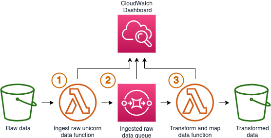

# Create data processing pipeline

## What are we building?


We'll be building a pipeline that consists of:

1. A Lambda function to take ride telemetry data from S3 and leverage a fan-out process to invoke multiple downstream Lambda processing functions (annotated item #1)
1. An SQS queue to trigger the downstream consumers from the fan-out Lambda function (annotated item #2)
1. A Lambda function consumer (annotated item #3) that will take items from the queue, look up the relevant weather station ID (based on lat/long proximity), and write the data record(s) out to a new location in S3

## Why are we building it?
If you recall, we're trying to build a system to predict if a unicorn will request service after a ride.  To do that, we need to get our data in order.  We need a pipeline that will take our unicorn ride data, join it with the relevant weather station data, and output to a location that can be used downstream by our data scientist from within the Amazon SageMaker notebook.  This is the beginning stages of building our training datasets.

We recommend creating a file in Cloud9 where you can compile a few values. If you follow our detailed instructions, the file will be created for you in the home directory. If you want attempt the steps on your own, we recommend creating the file in your home directory to match our convention. In the end, the file will have the following values:
1. Your bucket name
1. The URL for your SQS queue
1. The Amazon Resource Name (ARN) for your SQS queue

### Short Route: Deploy the pipeline for me :see_no_evil:

The purpose of this module is machine learning inference using serverless technologies. While data processing and ETL is an important component, we recommend using the provided CloudFormation template to ensure you complete the section on time. If you are very comfortable with Lambda and SQS, try the alternative route below with detailed steps.

**Time to complete:** 15-20 minutes.

1. Navigate to your Cloud9 environment
1. Make sure you're in the correct directory first
    ```
    cd ~/environment/aws-serverless-workshops/MachineLearning/1_DataProcessing
    ```
1. Run the following command to create your resources:
    ```
    aws cloudformation create-stack \
      --stack-name wildrydes-ml-mod1 \
      --capabilities CAPABILITY_NAMED_IAM \
      --template-body file://cloudformation/99_complete.yml
    ```
1. Monitor the status of your stack creation (takes about 3 minutes to complete). **EITHER:**
    1. Monitor via [CloudFormation in the AWS Console](https://console.aws.amazon.com/cloudformation) **OR**
    1. Run the following command in Cloud9 until you get `CREATE_COMPLETE` in the output:
        ```
        aws cloudformation describe-stacks \
          --stack-name wildrydes-ml-mod1 \
          --query 'Stacks[0].StackStatus' \
          --output text
        ```
    **:heavy_exclamation_mark: DO NOT move past this point until you see CREATE_COMPLETE as the status for your CloudFormation stack**
1. Set the autogenerated bucket name as an environment variable
    ```
    bucket=$(aws cloudformation describe-stacks --stack-name wildrydes-ml-mod1 --query "Stacks[0].Outputs[?OutputKey=='DataBucketName'].OutputValue" --output text)
    ```
1. Verify the variable is set
    ```
    echo $bucket
    ```
1. Add the bucket name to your scratchpad for future use
    ```
    echo "Bucket name:" $bucket >> ~/environment/scratchpad.txt
    ```
1. Run this command to upload the ride data
    ```
    aws s3 cp assets/ride_data.json s3://$bucket/raw/ride_data.json
    ```
1. Run this command to verify the file was uploaded (you should see the file name listed)
    ```
    aws s3 ls s3://$bucket/raw/
    ```

### Long Route: Build the pipeline yourself :white_check_mark:

If you would like to learn more about serverless ETL, have experience working with Lambda and SQS, or want to take your time regardless of the duration then this route is a fit for you. This route will deploy the same components as described above. You will need to configure them to communicate with each other.

**Time to complete:** 30-60 minutes.

<details>
<summary><strong>Expand for detailed instructions</strong></summary><p>

### Step 1: Create an S3 Bucket
This is where your data will live before, during, and after formatting. It's also where your machine learning model will output to.

<details>
<summary>Create an S3 bucket with a globally unique name and save the name to a scratchpad.txt file that we will use later. (Expand for detailed instructions)</summary><p>

1. Navigate to your Cloud9 environment
1. Run this command to set your desired bucket name as an environment variable (Replacing YOUR_BUCKET_NAME with your desired bucket name)
    ```
    bucket="YOUR_BUCKET_NAME"
    ```
1. Run this command to create your bucket
    ```
    aws s3 mb s3://$bucket
    ```
1. If the above command is successful, run the following command. If you get an error, your bucket name is likely already taken. Repeat these steps with a new name.
    ```
    echo "Bucket name:" $bucket >> ~/environment/scratchpad.txt
    ```
1. Run this command to verify your bucket was created successfully
    ```
    aws s3 ls s3://$bucket
    # If you don't see an error you're good.
    ```
</p></details>

### Step 2: Create an SQS queue for fan-out
Our vehicle fleet generates ride data in a single, massive .json file, [ride_data.json](assets/ride_data.json). Feel free to check it out.  It includes the raw ride telemetry.  We need to split out the file into individual JSON entries, one for each ride data event entry.

To take advantage of the parallelism available with Lambda, we are going to fan-out each entry to a queue that will be picked up by individual Lambda functions.

<details>
<summary>Create an SQS queue and name it `IngestedRawDataFanOutQueue`. Save the queue URL and ARN to a `scratchpad.txt` file that we will use later. (Expand for detailed instructions)</summary><p>

1. Navigate to your Cloud9 environment
1. Make sure you're in the correct directory first
    ```
    cd ~/environment/aws-serverless-workshops/MachineLearning/1_DataProcessing
    ```
1. Run the following command to create your queue:
    ```
    aws sqs create-queue --queue-name IngestedRawDataFanOutQueue
    ```
1. Set the queue URL as an environment variable
    ```
    queue_url=$(aws sqs get-queue-url --queue-name IngestedRawDataFanOutQueue --output text)
    ```
1. Verify the queue URL is set and put the value in your scratchpad for future use
    ```
    echo $queue_url && echo "Queue URL: " $queue_url >> ~/environment/scratchpad.txt
    ```
1. Get the queue ARN and set it as an environment variable
    ```
    queue_arn=$(aws sqs get-queue-attributes --queue-url $queue_url --attribute-names QueueArn --query 'Attributes.QueueArn' --output text)
    ```
1. Verify the queue ARN is set and put the value in your scratchpad for future use
    ```
    echo $queue_arn && echo "Queue ARN: " $queue_arn >> ~/environment/scratchpad.txt
    ```
</p></details>


### Step 3: Create the remaining infrastructure

<details>
<summary>Create a CloudFormation stack from `cloudformation/1_lambda_functions.yml` named `wildrydes-ml-mod1`. (Expand for detailed instructions)</summary><p>

1. Navigate to your Cloud9 environment
1. Run the following command to create your infrastructure
    ```
    # Command should be ran from /home/ec2-user/environment/aws-serverless-workshops/MachineLearning/1_DataProcessing in your cloud 9 environment
    # run `pwd` to see your current directory

    aws cloudformation create-stack \
        --stack-name wildrydes-ml-mod1 \
        --parameters ParameterKey=DataBucket,ParameterValue=$bucket \
        ParameterKey=IngestedRawDataFanOutQueueArn,ParameterValue=$queue_arn \
        --capabilities CAPABILITY_NAMED_IAM \
        --template-body file://cloudformation/1_lambda_functions.yml
    ```
1. Monitor the status of your stack creation. **EITHER:**
    1. Go to [CloudFormation in the AWS Console](https://console.aws.amazon.com/cloudformation) **OR**
    1. Run the following command in Cloud9 until you get `CREATE_COMPLETE` in the output:
        ```
        # Run this command to verify the stack was successfully created. You should expect to see "CREATE_COMPLETE".
        # If you see "CREATE_IN_PROGRESS", your stack is still being created. Wait and re-run the command.
        # If you see "ROLLBACK_COMPLETE", pause and see what went wrong.
        aws cloudformation describe-stacks \
            --stack-name wildrydes-ml-mod1 \
            --query "Stacks[0].StackStatus"
        ```
</p></details><br>

**:heavy_exclamation_mark: DO NOT move past this point until you see CREATE_COMPLETE as the status for your CloudFormation stack**

After CloudFormation is done creating your infrastructure, you will have:
* Lambda function skeletons
* Dead Letter Queues (DLQ)
* IAM permissions
* CloudWatch dashboard

While these are necessary components of our data processing pipeline, they're not the focus of this part of the lab.  This is why we're creating them in a CloudFormation template for you.

### Step 4: Wire up the Lambda functions
The previous step gave you the foundation for the Lambda functions that will either be triggered by S3 events or our SQS queue.  Now, you need to wire up the Lambda functions to appropriate event sources and set some environment variables. We're going to use values from scratchpad.txt, so have that handy.

Expand each substep for detailed instructions, if needed.

<details>
<summary>1. Update the <code>OUTPUT_QUEUE</code> environment variable in <code>IngestUnicornRawDataFunction</code>. Set the value to your Queue URL (in scratchpad.txt).</summary><p>

1. Open the [Lambda console](https://console.aws.amazon.com/lambda)
1. Open the function containing `IngestUnicornRawDataFunction` in the name
1. Scroll down and populate the `OUTPUT_QUEUE` key with the Queue URL value from your scratchpad
1. Click **Save**
</p></details>

<details>
<summary>2. Add an S3 trigger to <code>IngestUnicornRawDataFunction</code>. Trigger off your S3 bucket and `raw/` prefix.</summary><p>

1. Scroll up and click **Add trigger** in the Designer view
1. Select **S3**
1. Choose the data bucket you created
1. For the prefix, type `raw/`
1. Click **Add**

If the trigger won't save, make sure the S3 bucket does not have an identical active event ([Bucket](https://console.aws.amazon.com/s3) > Properties > Events).
</p></details>

<details>
<summary>3. Update the <code>OUTPUT_BUCKET</code> environment variable in <code>TransformAndMapDataFunction</code>. Set the value to your bucket name.</summary><p>

1. Open the [Lambda console](https://console.aws.amazon.com/lambda)
1. Open the function containing  `TransformAndMapDataFunction` in the name
1. Scroll down and populate the `OUTPUT_BUCKET` key with the Bucket Name value from your scratchpad. Keep in mind, just provide the name of the data bucket you created earlier; it should not fully qualified.
1. Click **Save**
</p></details>

<details>
<summary>4. Add an SQS trigger to <code>TransformAndMapDataFunction</code>. Trigger off your <code>IngestedRawDataFanOutQueue</code> queue.</summary><p>

1. Scroll up and click **Add trigger** in the Designer view
2. Select **SQS**
3. Choose the `IngestedRawDataFanOutQueue` queue you created
4. Click **Add**
</p></details><br>

Let's recap what we created:
* Serverless data processing pipeline:
  1. A Lambda function that reads a large JSON file from S3 and places a message in a queue for each ride
  1. A queue that buffers messages for each ride
  1. A Lambda function that picks up messages in the queue and matches the nearest weather station
    * Review the code for `TransformAndMapDataFunction`, the function is doing a lookup for the nearest weather station
* Preconfigured IAM role for the Lambda functions scoped to the appropriate services
* We also have a [CloudWatch dashboard](https://console.aws.amazon.com/cloudwatch/home?#dashboards:name=Wild_Rydes_Machine_Learning) to monitor progress!

### Step 5: Test your pipeline
It's time to upload our ride telemetry data into our pipeline.

<details>
<summary>Upload <code>assets/ride_data.json</code> into <code>YOUR_DATA_BUCKET/raw/</code> (Expand for detailed instructions)</summary><p>

1. In your Cloud9 terminal, run the following code:
    ```
    # Run this command to upload the ride data
    aws s3 cp assets/ride_data.json s3://$bucket/raw/ride_data.json

    # Run this command to verify the file was uploaded (you should see the file name listed)
    aws s3 ls s3://$bucket/raw/
    ```
</p></details>

</p></details>

### Your fan-out is in progress!

It will take ~8 minutes to process all ~20k entries. Monitor the progress using:
* [CloudWatch dashboard](https://console.aws.amazon.com/cloudwatch/home?#dashboards:)
  * This shows you the number of invocations for each Lambda function on the left and some SQS message metrics on the right.
  * Refresh the dashboard to see how the plotted invocation count changes. When you see the invocation count settle back to zero, that indicates all of your data has been processed. Until then, feel free to explore the graphs and options.
* [SQS console](https://console.aws.amazon.com/sqs)
  * This shows the number of messages flowing through `IngestedRawDataFanOutQueue`. There are also dead letter queues set up in case things go wrong.
* Run `aws s3 ls s3://$bucket/processed/ | wc -l` in your Cloud9 terminal
  * This provides a count of the number of entries in your processed folder as the pipeline progresses.
  * When complete you should have 19,995 records.

## Next step:

We're ready to proceed with building and training a [machine learning model](../2_ModelBuilding).
