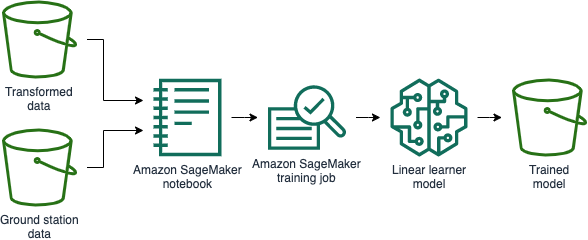

# Create a machine learning model

**Time to complete:** 45-60 minutes

### What are we building?


Amazon Athena is an interactive query service that makes it easy to analyze data in Amazon S3 using standard SQL. Athena is serverless, so you won't be managing any infrastructure.

We will start by using Athena to extract a subset of data we're interested in from a much larger data source.



Amazon SageMaker is a fully managed machine learning service, so you don't have to manage servers. With SageMaker, data scientists and developers can quickly and easily build and train machine learning models.

We will use a SageMaker notebook as a development space to join the [data we processed in the last section](../1_DataProcessing) with our reduced ground station dataset. Inside of the notebook we will run training jobs against the data and produce a model that is stored in Amazon S3.

## Why are we building it?

The dataset we're using is [NOAA Global Historical Climatology Network Daily (GHCN-D)](https://registry.opendata.aws/noaa-ghcn/) ([dataset readme](https://docs.opendata.aws/noaa-ghcn-pds/readme.html)). There are roughly one billion records in this public data set. We should pair that down. Since our unicorns operate within the New York City area, we're only interested in those ground stations:

```
US1NYNY0074  40.7969  -73.9330    6.1 NY NEW YORK 8.8 N
USW00014732  40.7794  -73.8803    3.4 NY NEW YORK LAGUARDIA AP
USW00094728  40.7789  -73.9692   39.6 NY NEW YORK CNTRL PK TWR
USW00094789  40.6386  -73.7622    3.4 NY NEW YORK JFK INTL AP
```

Amazon SageMaker provides an integrated Jupyter authoring notebook instance for easy access to your data sources for exploration and analysis. It also provides common machine learning algorithms that are optimized to run efficiently against extremely large data in a distributed environment. During this lab you'll be asked to import data from multiple sources, manipulate the data, and format it to the syntax required to take advantage of the built in SageMaker provided algorithms. This will be completed within a SageMaker notebook.

### Step 1: Create an Amazon SageMaker notebook
Amazon SageMaker notebooks are backed by Elastic Compute Cloud (EC2). These are not available instantly, so create it now and we will come back to it later.

<details>
<summary><strong>Create a CloudFormation stack from `cloudformation/3_sagemaker.yml` named `wildrydes-ml-mod2-3`.</strong></summary><p>

1. Navigate to your Cloud9 environment
1. Run the following commands to create your resources:
    ```
    cd ~/environment/aws-serverless-workshops/MachineLearning/2_ModelBuilding
    aws cloudformation create-stack \
    --stack-name wildrydes-ml-mod2-3 \
    --capabilities CAPABILITY_NAMED_IAM \
    --template-body file://cloudformation/3_sagemaker.yml
    ```

</p></details>

### Step 2: Create an AWS Glue database and table against the NOAA data set

<details>
<summary><strong>Create a CloudFormation stack from `cloudformation/2_ground-station.yml` named `wildrydes-ml-mod2-2`.</strong></summary><p>

1. Navigate to your Cloud9 environment
1. Run the following commands to create your resources:
    ```
    cd ~/environment/aws-serverless-workshops/MachineLearning/2_ModelBuilding
    aws cloudformation create-stack \
    --stack-name wildrydes-ml-mod2-2 \
    --template-body file://cloudformation/2_ground-station.yml
    ```
1. Open [AWS CloudFormation](https://console.aws.amazon.com/cloudformation/)
1. Find the `wildrydes-ml-mod2-2` stack in the list of stacks
1. Wait for the status of the stack to be **CREATE_COMPLETE**

**Hint:** Click the circular arrow icon to refresh the list if it does not auto-refresh.

**DO NOT move past this point until you see CREATE_COMPLETE as the status**

</p></details>

### Step 3: Use Amazon Athena to reduce the size of ground station data

1. Click on the `wildrydes-ml-mod2-2` stack name
1. In the outputs tab, copy the **AthenaSelectQuery** value
1. Open [Amazon Athena](https://console.aws.amazon.com/athena/)
1. Click **Get Started** if you have not used Athena in this region before.
1. Paste the value you copied into the **New query 1** section.
1. Click **Run query**
1. Wait until the query completes, typically 20-30 seconds.

Without provisioning any servers we were able to use Amazon Athena to get the records we need from 94 GB of data in under a minute.

### Step 4: Save the reduced data set in your S3 bucket
1. Close the Athena tab and go back to [AWS CloudFormation](https://console.aws.amazon.com/cloudformation/)
1. Make sure you're viewing the `wildrydes-ml-mod2-2` stack
1. In the outputs tab, click into the **AthenaCSVLocation** link to go to Amazon S3
1. Drill into today's date until you find a CSV for the query you just ran.
    1. Click the **current year**
    1. Click the **current month**
    1. Click the **current day**
    1. Find the file ending in `.csv`
1. Check the box next to the CSV file, click **Actions**, **Copy**
1. Navigate to your data bucket
1. Create a new folder by clicking **Create folder**, type `nygroundstationdata`, click **Save**
1. Navigate into **nygroundstationdata**, click **Actions**, **Paste**
1. Now you have the relevant weather data in CSV format in our data bucket.
1. Close the S3 tab

### Step 5: Download the linear learner notebook provided in this workshop
1. Open [AWS CloudFormation](https://console.aws.amazon.com/cloudformation/)
1. Find the `wildrydes-ml-mod2-3` stack in the list of stacks
1. Verify the status of the stack is **CREATE_COMPLETE**
    * **Hint:** Click the circular arrow icon to refresh the list if it does not auto-refresh.
    * **DO NOT move past this point until you see CREATE_COMPLETE as the status**
1. Open [Amazon SageMaker](https://console.aws.amazon.com/sagemaker)
1. Navigate to **Notebook instances**
1. Find the notebook instance named `WildRydesNotebook-***`
1. Click the **Open Jupyter** link under Actions
1. When redirected to the notebook instance, click **New** (upper right), then select **Terminal** from list.
1. A new tab will open. When in the terminal, run the following command:
    ```
    curl https://raw.githubusercontent.com/jmcwhirter/aws-serverless-workshops/master/MachineLearning/2_ModelBuilding/notebooks/linear_learner.ipynb \
    -o SageMaker/linear_learner.ipynb && exit
    ```
1. Exit the terminal tab/window
1. Verify you see a file named **linear_learner.ipynb**

### Step 6: Execute the instructions in the notebook
1. Click on the **linear_learner.ipynb** file and follow the instructions.
    * You can run the notebook document step-by-step (one cell a time) by pressing `shift + enter`.
    * You can run the whole notebook in a single step by clicking on the menu `Cell -> Run All`.
    * To restart the kernel (i.e. the computational engine), click on the menu `Kernel -> Restart`. This can be useful to start over a computation from scratch (e.g. variables are deleted, open files are closed, etc…).
1. Once complete, you should have a trained model in S3.

## Learn more:
* [First Time SageMaker User](https://docs.aws.amazon.com/sagemaker/latest/dg/whatis.html#first-time-user)
* [Security in SageMaker](https://docs.aws.amazon.com/sagemaker/latest/dg/security.html)
* [Amazon SageMaker Example Notebooks](https://github.com/awslabs/amazon-sagemaker-examples)

## Next steps:
Instead of using an endpoint with an always on server, let's explore [using Lambda to make inferences against our model](../3_Inference).
