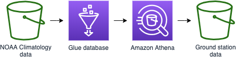

# Create a machine learning model

**Time to complete:** 30-45 minutes

### What are we building?

Amazon SageMaker provides an integrated Jupyter notebook instance for easy access to your data sources for exploration and analysis. It also provides common machine learning algorithms that are optimized to run efficiently against extremely large data in a distributed environment. During this lab you'll be asked to import data from multiple sources, manipulate the data, and format it to the syntax required to take advantage of the built in SageMaker provided algorithms. This will all be completed within a SageMaker notebook.



Within the notebook we willl take advantage of Amazon Athena to query data directly from S3.  Amazon Athena is a serverless query service allowing our entire data prep and training process to avoid provisioning any servers.  Amazon Athena will enable us to query the data we processed earlier as well as query a [public weather dataset](https://docs.opendata.aws/noaa-ghcn-pds/readme.html).  Finally we'll transform our Amazon Athena query results into Python dataframes to server as inputs into training our data model.

### Step 1: Create an Amazon SageMaker notebook
Amazon SageMaker notebooks are backed by Elastic Compute Cloud (EC2). These are not available instantly, so create it now and we will come back to it later.

<details>
<summary><strong>Create a CloudFormation stack from `cloudformation/3_sagemaker.yml` named `wildrydes-ml-mod2`.</strong></summary><p>

1. Navigate to your Cloud9 environment
1. Make sure you're in the correct directory first
    ```
    cd ~/environment/aws-serverless-workshops/MachineLearning/2_ModelBuilding
    ```
1. Run the following command to create your resources:
    ```
    aws cloudformation create-stack \
    --stack-name wildrydes-ml-mod2 \
    --capabilities CAPABILITY_NAMED_IAM \
    --template-body file://cloudformation/2_sagemaker.yml
    ```

</p></details>


### Step 2: Download the linear learner notebook provided in this workshop
1. Open [AWS CloudFormation](https://console.aws.amazon.com/cloudformation/)
1. Find the `wildrydes-ml-mod2` stack in the list of stacks
1. Verify the status of the stack is **CREATE_COMPLETE**
    * **Hint:** Click the circular arrow icon to refresh the list if it does not auto-refresh.
    * **DO NOT move past this point until you see CREATE_COMPLETE as the status**
1. Open [Amazon SageMaker](https://console.aws.amazon.com/sagemaker)
1. Navigate to **Notebook instances**
1. Find the notebook instance named `WildRydesNotebook-***`
1. Click the **Open Jupyter** link under Actions
1. When redirected to the notebook instance, click **New** (upper right), then select **Terminal** from list.
1. A new tab will open. When in the terminal, run the following command:
    ```
    curl https://raw.githubusercontent.com/jmcwhirter/aws-serverless-workshops/master/MachineLearning/2_ModelBuilding/notebooks/linear_learner.ipynb \
    -o SageMaker/linear_learner.ipynb && exit
    ```
1. Exit the terminal tab/window
1. Verify you see a file named **linear_learner.ipynb**

### Step 3: Execute the instructions in the notebook
1. Click on the **linear_learner.ipynb** file and follow the instructions.
    * You can run the notebook document step-by-step (one cell a time) by pressing `shift + enter`.
    * You can run the whole notebook in a single step by clicking on the menu `Cell -> Run All`.
    * To restart the kernel (i.e. the computational engine), click on the menu `Kernel -> Restart`. This can be useful to start over a computation from scratch (e.g. variables are deleted, open files are closed, etc…).
1. Once complete, you should have a trained model in S3. Verify you have a model by:
    1. Navigate to [Amazon S3](https://console.aws.amazon.com/s3/) in the console
    1. Navigate to the data bucket you created
    1. Navigate to a directory with a name containing `linear-learner-TODAYS_DATE`
    1. Navigate to `output` directory
    1. Verify you see `model.tar.gz`
1. Close out of all SageMaker tabs
1. Close S3 tab

## Learn more:
* [First Time SageMaker User](https://docs.aws.amazon.com/sagemaker/latest/dg/whatis.html#first-time-user)
* [Security in SageMaker](https://docs.aws.amazon.com/sagemaker/latest/dg/security.html)
* [Amazon SageMaker Example Notebooks](https://github.com/awslabs/amazon-sagemaker-examples)

## Next step:
Instead of using an endpoint with an always on server, let's explore [using Lambda to make inferences against our model](../3_Inference).
