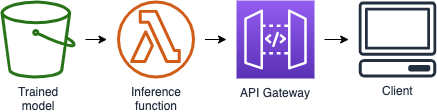

# Make inferences against the model

**Time to complete:** 15-20 minutes.

## What are we building?


Now that are model is trained, we need a way to make inferences against it.  In this section we'll be building an HTTP rest endpoint (API Gateway) where we can POST JSON data against our model sitting on S3.  A Lambda function will load the model, and make an inference directly against the model and return it in the HTTP response.

We will be doing model inferences *outside* of Amazon SageMaker.

## Why are we building it?
With the ability to now, get real-time information of whether or not a ride is going to "cost" more to the unicorn based on mileage _plus_ weather (instead of just mileage), our pricing workflow can be updated to include this http endpoint.  Enabling our company to give better, more realistic pricing based on actual usage.

Why Lambda?  Our unicorn fleet isn't a single breed.  We offer the largest selection of rare unicorn breeds for customers of all needs.  We expect that after further research, each breed is actually responding differently to various weather conditions.  By hosting our models on S3 and using Lambda to make inferences, we can have a dynamic HTTP interface to make predictions against a ML model specific to a unicorn breed without having to pay for separate Amazon SageMaker endpoints (1 per unicorn breed - we have thousands).

### Short cut: Deploy everything for me

We don't recommend this route unless you ran into a snag and are worried about completing the workshop on time.

<details>
<summary><strong>:see_no_evil: BREAK GLASS! (use in case of emergency)</strong></summary><p>

1. Navigate to your Cloud9 environment
1. Make sure you're in the correct directory first
    ```
    cd ~/environment/aws-serverless-workshops/MachineLearning/3_Inference
    ```
1. Upload the inference code to Lambda
    ```
    aws s3 cp lambda-functions/inferencefunction.zip s3://$bucket/code/inferencefunction.zip
    ```
1. Create your resources
    ```
    aws cloudformation create-stack \
      --stack-name wildrydes-ml-mod3 \
      --parameters ParameterKey=DataBucket,ParameterValue=$bucket \
                   ParameterKey=DataProcessingExecutionRoleName,ParameterValue=$(aws cloudformation describe-stack-resources --stack-name wildrydes-ml-mod1 --logical-resource-id DataProcessingExecutionRole --query "StackResources[0].PhysicalResourceId" --output text) \
                   ParameterKey=TrainedModelPath,ParameterValue=$(aws s3 ls s3://$bucket/linear-learner --recursive | grep 'model' | cut -c 32-) \
      --capabilities CAPABILITY_NAMED_IAM \
      --template-body file://cloudformation/99_complete.yml
    ```
1. Scroll down to the section on testing your API

</p></details>

### Step 1: Get CloudFormation parameters
<details>
<summary>Grab the name of your IAM DataProcessingExecutionRole and add it to scratchpad.txt for use later. (Expand for detailed instructions)</summary><p>

1. Navigate to your Cloud9 environment
1. Set the data processing execution role as an environment variable
    ```
    execution_role=$(aws cloudformation describe-stack-resources --stack-name wildrydes-ml-mod1 --logical-resource-id DataProcessingExecutionRole --query "StackResources[0].PhysicalResourceId" --output text)
    ```
1. Verify the variable is set
    ```
    echo $execution_role
    ```
1. Add the data processing execution role to your scratchpad for future use
    ```
    echo "Data processing execution role:" $execution_role >> ~/environment/scratchpad.txt
    ```
</p></details>

### Step 2: Upload Inference Function Zip
<details>
<summary>Upload <code>lambda-functions/inferencefunction.zip</code> to <code>YOUR_BUCKET_NAME/code</code>. (Expand for detailed instructions)</summary><p>

1. Navigate to your Cloud9 environment
1. Run the following command to upload the Lambda function for inference
    ```
    # Command should be ran from /home/ec2-user/environment/aws-serverless-workshops/MachineLearning/3_Inference in your cloud 9 environment
    cd ~/environment/aws-serverless-workshops/MachineLearning/3_Inference

    # Run this command to upload the ride data
    aws s3 cp lambda-functions/inferencefunction.zip s3://$bucket/code/inferencefunction.zip

    # Run this command to verify the file was uploaded (you should see the file name listed)
    aws s3 ls s3://$bucket/code/
    ```
</p></details>

### Step 3: Create Lambda function and API Gateway skeletons
At this point, we have a trained model on S3.  Now, we're ready to load the model into Lambda at runtime and make inferences against the model.  The Lambda function that will make inferences is hosted behind an API Gateway that will accept POST HTTP requests.

<details>
<summary>Create Lambda function for Model Inferences named <code>ModelInferenceFunction</code> and an HTTP API by launching <code>cloudformation/3_lambda_function.yml</code> Stack and naming it <code>wildrydes-ml-mod3</code>. (Expand for detailed instructions)</summary><p>

1. Navigate to your Cloud9 environment
1. Run the following command to create your resources:
    ```
    # Command should be ran from /home/ec2-user/environment/aws-serverless-workshops/MachineLearning/3_Inference in your cloud 9 environment
    cd ~/environment/aws-serverless-workshops/MachineLearning/3_Inference

    aws cloudformation create-stack \
      --stack-name wildrydes-ml-mod3 \
      --parameters ParameterKey=DataBucket,ParameterValue=$bucket \
                   ParameterKey=DataProcessingExecutionRoleName,ParameterValue=$execution_role \
      --capabilities CAPABILITY_NAMED_IAM \
      --template-body file://cloudformation/3_lambda_function.yml
    ```
1. Monitor the status of your stack creation. **EITHER:**
    1. Go to [CloudFormation in the AWS Console](https://console.aws.amazon.com/cloudformation) **OR**
    1. Run the following command in Cloud9 until you get `CREATE_COMPLETE` in the output:
        ```
        # Run this command to verify the stack was successfully created. You should expect to see "CREATE_COMPLETE".
        # If you see "CREATE_IN_PROGRESS", your stack is still being created. Wait and re-run the command.
        # If you see "ROLLBACK_COMPLETE", pause and see what went wrong.
        aws cloudformation describe-stacks \
            --stack-name wildrydes-ml-mod3 \
            --query "Stacks[0].StackStatus"
        ```
</p></details><br>

**:heavy_exclamation_mark: DO NOT move past this point until you see CREATE_COMPLETE as the status for your CloudFormation stack**

### Step 4: Update Lambda Function
The previous step gave us a Lambda function that will load the ML model from S3, make inferences against it in Lambda, and return the results from behind API Gateway.  For this to work, we need to connect some critical pieces.

<details>
<summary>1. Update the <code>MODEL_PATH</code> environment variable in <code>ModelInferenceFunction</code>. Set the value to your bucket name. (Expand for detailed instructions)</summary><p>

1. Run this command in your Cloud9 console:
    ```
    aws s3 ls s3://$bucket/linear-learner --recursive | grep 'model' | cut -c 32-
    ```
1. Copy the returned value. You'll need it below.
1. Open the [Lambda console](https://console.aws.amazon.com/lambda)
1. Open the function containing `ModelInferenceFunction` in the name
1. Scroll down and populate the `MODEL_PATH` key with the location of your model (what you just copied)
  * Replace the entire existing value with the string you copied.
  * Make sure the full string looks like this: `linear-learner-yyyy-mm-dd-00-40-46-627/output/model.tar.gz`
1. Click **Save**

</p></details>

<details>
<summary>2. Take a moment to review the code in <code>lambda-functions/lambda_function.py</code>. (Expand for detailed instructions)</summary><p>

*Note: If you're not interested in learning how to host your own ML model on Lambda, you can stop reading now and close this step and continue in the README.  There are no steps here to complete, only additional information on steps required to recreate this yourself.*

Amazon SageMaker can be used to build, train, and deploy machine learning models.  We're leveraging it to build and train our model.  Due to our business possibly having thousands of models, 1 per unicorn breed, its actually better for us to host this model ourselves on Lambda.  Below are the high level steps that we've completed on your behalf for this workshop, but you're free to explore if you need to recreate this.

1. Build MXNet from source for 1) the current support Lambda runtime and 2) the current MXNet version that Amazon SageMaker uses. [Instructions here](building-mxnet-1.2.1.md).
1. The code in [lambda-functions/lambda_function.py](lambda-functions/lambda_function.py) will load the model from S3, load MXNet, and make inferences against our model.  You'd need to install these dependencies locally in an environment similar to the runtime for Lambda and package those dependencies following [this instructions](https://docs.aws.amazon.com/Lambda/latest/dg/Lambda-python-how-to-create-deployment-package.html#python-package-dependencies).  If you unzip [lambda-functions/inferencefunction.zip](lambda-functions/inferencefunction.zip), you'll see the result of those steps as reference.
1. **`download_model` function**: Once we've got MXNet built for our environment, and the Lambda package built, we can proceed reviewing the code.  The Lambda function loads the model from S3 on the fly at the time of request and unzips it locally.
1. **`create_data_iter` function**: The HTTP request data is formatted in a NumPy array, required by the MXNet linear learner model interface to make inferences
1. **`make_prediction` function**: An inference is made and then packaged for an HTTP response to the caller.

</p></details>

### Step 5: Wire up API Gateway
The last thing we need to connect is the HTTP API Gateway to your `ModelInferenceFunction`

<details>
<summary>1. Update the <code>ModelInferenceApi</code> API Gateway root resource to proxy requests to your <code>ModelInferenceFunction</code>. (Expand for detailed instructions)</summary><p>

1. Open the [API Gateway console](https://console.aws.amazon.com/apigateway)
1. Click `ModelInferenceApi`
1. Select the root `/` resource
1. Click **Actions** > **Create Method**
1. Select `ANY` in the dropdown
1. Click the checkbox next to it
1. Verify `Lambda Function` is selected as the **Integration type**
1. Check the box next to **Use Lambda Proxy integration** so we get all request details
1. Select your `ModelInferenceFunction` in the **Lambda Function** dropdown. If it is not a dropdown, start typing 'inference' to find and select your function.
1. Click **Save**
1. Click **OK** to the permissions dialogue box
</p></details>

<details>
<summary>2. Deploy your API Gateway. (Expand for detailed instructions)</summary><p>

1. Navigate to the `ModelInferenceApi`. If not already there:
    1. Open the [API Gateway console](https://console.aws.amazon.com/apigateway)
    1. Click `ModelInferenceApi`
    1. Select the root `/` resource
1. Click **Actions** > **Deploy API**
1. Select `[New Stage]` for **Deployment Stage**
1. Type `prod` for **Stage name**
1. Click **Deploy**
</p></details><br>

Take note of your **Invoke URL**

## Testing your API

1. Navigate to your Cloud9 environment
1. Run the following command to get a premade cURL command you can use to call your model:
    ```
    # Command should be ran from /home/ec2-user/environment/aws-serverless-workshops/MachineLearning/3_Inference in your cloud 9 environment
    cd ~/environment/aws-serverless-workshops/MachineLearning/3_Inference

    aws cloudformation describe-stacks --stack-name wildrydes-ml-mod3 \
      --query "Stacks[0].Outputs[?OutputKey=='InferenceFunctionTestCommand'].OutputValue" --output text
    ```
1. Copy the output and execute the command that looks like: `curl -d { ... }`
1. _Optional_: You can also test the Lambda function by putting using the test API UI in the API Gateway console.

What did your `curl` command return?  What's this mean? 

Lets look at the `curl` command first:

    curl -d '{ "distance": 30, "healthpoints": 30, "magicpoints": 1500, "TMAX": 333, "TMIN": 300, "PRCP": 100 }' -H "Content-Type: application/json" -X POST STAGE_URL

This is asking our deployed model how likely a unicorn traveling a distance of 30, burning 1500 magic points in the weather conditions = "TMAX": 333, "TMIN": 300, "PRCP": 100 (PRCP = Precipitation (tenths of mm), TMAX = Maximum temperature (tenths of degrees C), and TMIN = Minimum temperature (tenths of degrees C)).

The decimal returned from our API is actually a decimal representation of the liklihood that a unicorn experiencing the conditions in the CURL command is going to require service.

### Now What?
Let's recap - you've put together a pipeline, that:
* On the front end of the data pipeline, we collect and ingest ride telemetry data from our unicorns
* We've enhanced that data with the nearest, active weather station ID
* We've trained a machine learning model to predict heavier than usual magic point usage based on different weather characteristics for that day
* We've hosted this model behind an HTTP interface that loads the model dynamically

#### How can Wild Rydes use this to improve the business?
We're now able to predict real time, when each unicorn is going to need to be serviced.  Leveraging this new capability, we're able to perform preventative repairs on the unicorns before the more costly repairs are required and the unicorn is removed from service.

## Next step:
Once you're done testing the API call to your model, you can [clean up the resources](../4_Cleanup) so you're not charged.
