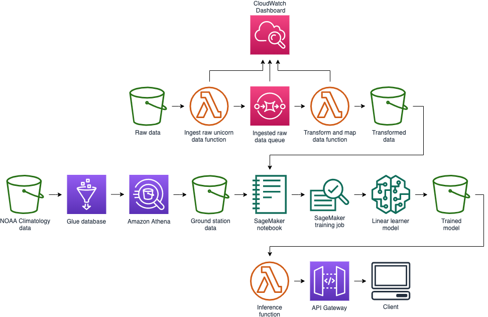

# Serverless Inference Workshop

Welcome to the Wild Rydes Unicorn Efficiency team! We are a lean team of one; you! You'll need to wear many hats such as developer, data scientist, and operations. If you recall, [Wild Rydes](http://www.wildrydes.com/) is an app based ride sharing service where unicorns are dispatched to get riders to their destinations fast and hassle-free. At Wild Rydes, we pride ourselves on operational excellence. We want all of our unicorns transporting all of our customers all of the time.

Anything less than 100% unicorn uptime is unacceptable. We have noticed a significant number of unicorns are requesting service between rides. Service related requests include damaged horn, muddy hooves, tangled tail, no more sparkle in the tank, etc. Luckily, we're a data driven company and have been tracking if a unicorn requested service after each ride. We think the issue is related to weather, but we're not sure. We need to find a way to predict the likelihood that a ride in progress will result in the unicorn requesting service.

This module has a few difficulty levels:

* :metal: Figure It Out mode
  * You'll be given high level directions and you need to figure out the details.
  * This mode is intended for participants who want a significant challenge and are willing to not finish.
  * Don't be afraid to show the details if you fall behind.
* :white_check_mark: Hold My Hand mode
  * You'll be given detailed directions with little to figure out.
  * This mode is intended for participants who want to learn and explore in a structured way.
  * You should be positioned to finish on time, but consider using our "Break Glass" routes if you fall behind.
* :see_no_evil: Do It for Me mode
  * This mode is intended for participants who want to skip sections or need to make up time.

_Time Commitment Expectations: This workshop was created to be completed in approximately 2 hours.  In "Do it For Me" mode, the workshop can be completed in roughly 30-45 minutes based on AWS experience._

## Considerations for Each Role
As the team lead on this lean team of one, you'll need to wear multiple hats.  Below are some things we'll cover from the perspective of each role:
* Developer - You'll write lambda code to stitch our ETL data pipeline together.  Each function will take advantage of a queue based system to pass messages back and forth.
* Data Scientist - You'll need to load the data into your machine learning development environment.  Once loaded, you'll massage the data to test different assumptions and ultimately use a machine learning algorithm to enable your company to predict the probability of a request for service.
* Operations - You'll need to understand how this solution is hosted.  How will it handle large batches of data?  Is the solution tightly coupled?  What does a serverless inference environment mean from an operations perspective?

## Goals

At minimum, at the end of this workshop, you should have a machine learning model hosted on AWS lambda behind an API (HTTP endpoint) that accepts temperature, precipitation amounts, and mileage. The API and will return a probability that the unicorn will request service after the ride is completed.

## Solution Architecture

Our plan is to create a serverless data processing pipeline using AWS Lambda, Amazon S3, and Amazon SQS. You will then use AWS Machine Learning services to train a model. Finally you will make inferences against the model using AWS Lambda so our costs are appropriately controlled.

Source for Draw.io: [diagram xml](assets/WildRydesML.xml)

## Prerequisites

Provide a list of prerequisites that are required to successfully complete your workshop. This should include setting up an AWS account (note if you support multiple students sharing a single account), installing and configuring the CLI, and setting up any other tools students may need. Additionally, if there are specific skills or technologies students need to have existing knowledge of, you should list those here.

Add a subsection for each prerequisite.

Supported regions:
* us-east-1 (N. Virginia)
* us-east-2 (Ohio)
* us-west-2 (Oregon)
* ap-southeast-1 (Singapore)
* ap-northeast-1 (Tokyo)
* eu-central-1 (Frankfurt)
* eu-west-1 (Ireland)

## Modules

1. [Module 0: Setting up your development environment](0_Setup)
1. [Module 1: Build a data processing pipeline and get external data](1_DataProcessing)
1. [Module 2: Build and train a model](2_ModelBuilding)
1. [Module 3: Serverless inference](3_Inference)
1. [Module 4: Clean up](4_Cleanup)
