# Building the Wild Rydes Backend Components Layer

In this module, you will deploy backend application components to AWS. These
backend components include several AWS Lambda functions, two API Gateway Endpoints and 
DynamoDB tables. You will also create the IAM polices and roles required by
these components.

There are two ways to complete this module.  For learning purposes, we
recommend that workshop participants step through the *Console step-by-step
instructions* while deploying the primary Ireland region, and then for time reasons,
use the provided CloudFormation instructions to quickly set up the second Singapore
region during module 3.

Both sets of instructions are provided below – simply expand your preferred path.

<strong>Console step-by-step instructions (expand for details)</strong>

The following objects will be used as you create the resources in the console for this module:

* `wild-rydes-dynamodb-get.json` - This is the policy needed in order to read
  from DynamoDB using the `tickets-get.js` and `health-check.js` Lambda functions
* `wild-rydes-dynamodb-post.json` - This is the policy needed in order to write
  to DynamoDB using the `tickets-post.js` Lambda function
* `health-check.js` - Lambda function for checking the status of our application health
* `tickets-get.js` - Lambda function triggered by API Gateway to put application data
  into DynamoDB
* `tickets-post.js` - Lambda function triggered by API Gateway to read application
  data from DynamoDB

There are several steps needed to deploy the API and Lambda functions via the
console. The basic steps are:

1. Create the appropriate IAM policies and roles our AWS Lambda functions
2. Create the required Amazon DynamoDB table
3. Create the needed AWS Lambda functions
4. Create the Amazon API Gateway for the region you are currently deploying
5. Testing to ensure our backend components are all working as expected

## 1. Create IAM Policies and Roles

Let’s go ahead and create all the needed polices and roles for our workshop.
Because IAM roles and policies are global in nature, you only need to do this once.
*You may skip this step when you are asked to deploy the failover region*

Log into the AWS Console then select the **IAM** service. Now select
**Policies** from the left and click on the **Create policy** button.  Then
select the *JSON* tab and paste the code below into the editing window.

Download policy: [TicketGetPolicy](wild-rydes-dynamodb-get.json)

**IMPORTANT** When downloading each policy, click on *Raw* before you copy in order
to avoid validation errors when you paste the *JSON* into the AWS Console.

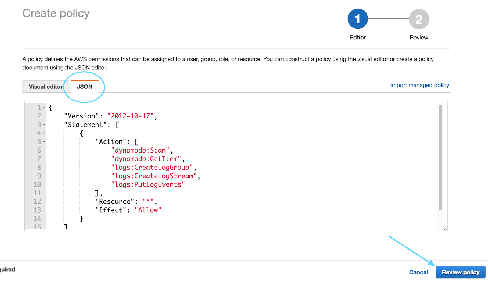

Click on **Review Policy**

Name your policy `TicketGetPolicy` and click **Create policy**

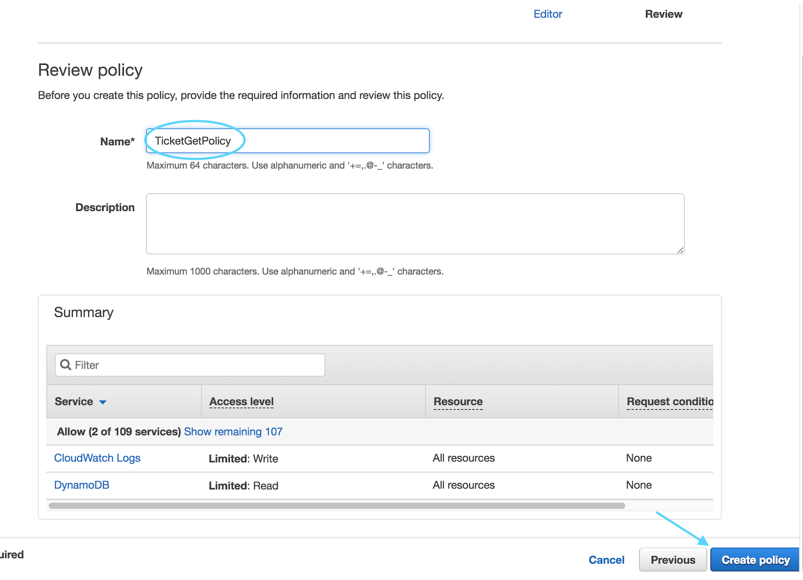

Now repeat these exact same steps one more time in order to create the
following additional policy that will be needed during the workshop.

**Download policy**: [TicketPostPolicy](wild-rydes-dynamodb-post.json)

Next you will create the three roles that correspond to the polices that
were just created. Each of these roles will be used by a different Lambda
function thereby limiting the permissions of each function. This follows the
AWS Best Practice of granting [least privilege](http://docs.aws.amazon.com/IAM/latest/UserGuide/best-practices.html#grant-least-privilege).

In the Console, select the **IAM** service and choose **Roles** from the left,
and click on the “Create role” button:

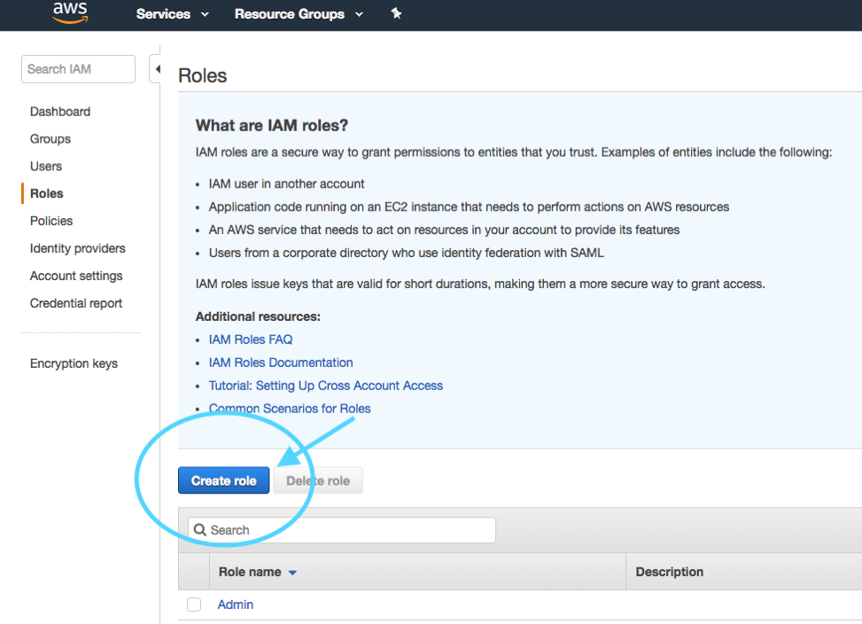

Select the type of “AWS Service” and choose Lambda from the list below then
select **Next: Permissions**.

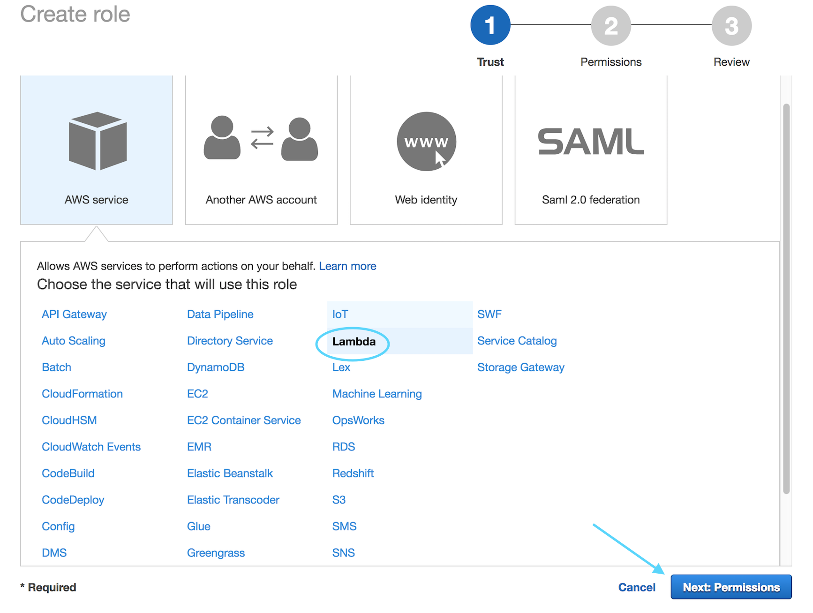

Find the `TicketGetPolicy` policy you just created on the next screen
and select **Next: Review** (Hint: Use the *Customer Managed* filter)

On the next screen, enter `TicketGetRole` for the Role Name and select **Create role**

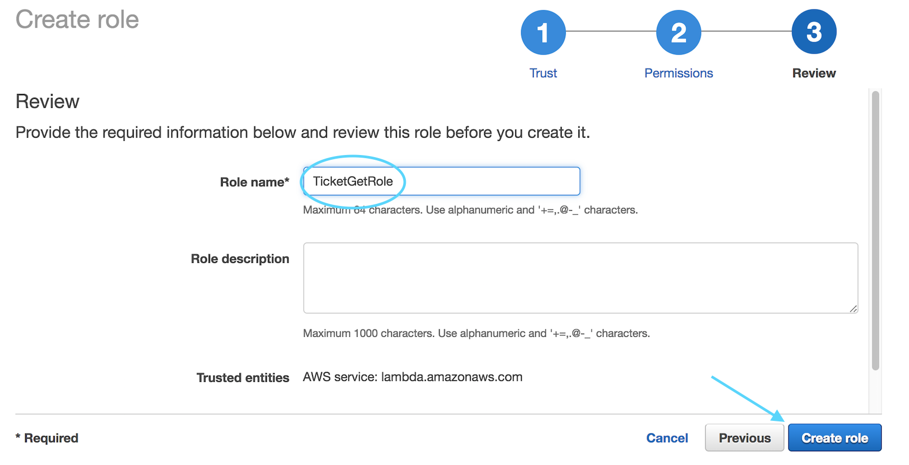

Repeat the same steps one more time, this time creating the role for
`TicketPostRole` and attaching the corresponding policy you created earlier.

## 2. Create the DynamoDB Table

Next we will create the DynamoDB Table for our application data. Ensure you
are set to the region you are currently deploying -  Ireland (eu-west-1) or
Singapore (ap-southeast-1) in the upper right corner of the console. If
you mistakenly create the DynamoDB table in the wrong region, the application
will not work.

In the console, open **DynamoDB** (it can be found under Database).  Select
**Create Table**. Your screen may be slightly different depending on whether
this is your first DynamoDB table in this region or not.

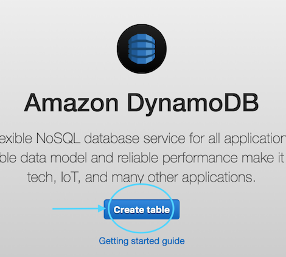

For the table name, enter `SXRTickets` and enter `id` as the Primary Key
Partition Key and keep *String* as the type, then click **Create**.
That’s all that is required for now to set up the table.

## 3. Create Three Lambda functions

Next, you will create three Lambda functions. First, navigate to **Lambda** in
the console (again ensuring you are still in the correct region) and click
**Create a function**  Ensure you choose **Author from scratch**

Change the runtime to `Node.js 6.10`.  ('Node.js 8.10' should work but it
has not been tested)

Name your first function `TicketGetFunction` and assign the role with the **matching**
name you created previously to it and click **Create function** and move on to the main
Lambda interface.

For the Handler, enter `tickets-get.handler` and then paste the following code into the
editor you see on your screen:

[TicketGetFunction](tickets-get.js)

Next, under `Environment Variables`, enter the key **TABLE_NAME** and the value **SXRTickets**

*Note that entering these Environment Variables exactly as shown is very important -
your function will not work - case matters*

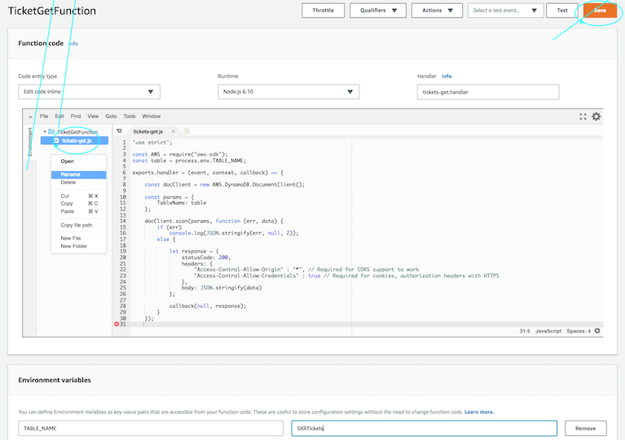

Once everything is set correctly, click **Save** near the top center of the screen.

**IMPORTANT NOTE** When editing the Lambda code using the console, it is VERY important that
your file name match the 'Handler Name' in the table below.  You must rename the file from
the defaut of index.js or your function will not work!  For example, if your handler name is
*tickets-get.handler* then your Lambda file name should be *tickets-get.js*

We still need to create two more lambda functions.  All of them use `Node.js 6.10`
as the runtime.  Repeat the same steps you used above.  The table below provides the
information needed for all three functions.  Note that you have already done the first one.

| Function Name          | Handler Name          | Execution Role                  | Env Var Key   | Env Var Value  |
| ---------------------  | --------------------- | ------------------------------- | ------------- | -------------- |
| [TicketGetFunction](tickets-get.js)  | tickets-get.handler   | TicketGetRole           | TABLE_NAME    | SXRTickets     |
| [TicketPostFunction](tickets-post.js)  | tickets-post.handler   | TicketPostRole           | TABLE_NAME    | SXRTickets     |
| [SXRHealthCheckFunction](health-check.js) | health-check.handler  | TicketGetRole           | TABLE_NAME    | SXRTickets     |

## 4. Create API Gateway Endpoint

In the console, under Application Services, open Amazon API Gateway and click on
**Get Started**.  Click on **OK** if you are given a *Create Example API* dialogue.

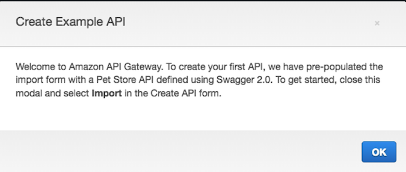

Select **New API** and enter the API Name of `wild-rydes-api` and choose the
Endpoint Type of *Regional* and then click **Create API**

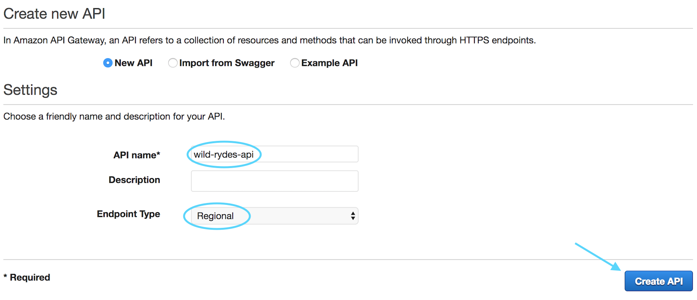

Next, from the *Actions* drop-down, choose **Create Resource** and name the resource
`ticket` and select the *Enable API Gateway CORS* option and then click **Create Resource**

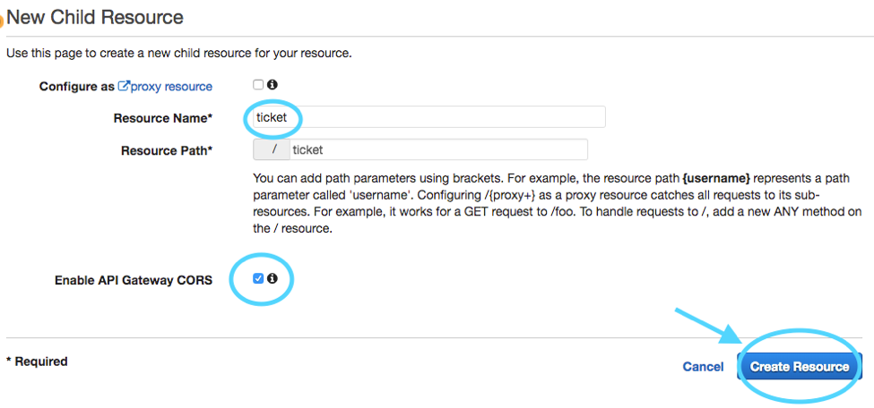

Repeat the same steps one more time, this time creating the resource `health`.
Ensure this resource is at the same level (directly below the root) as `ticket`

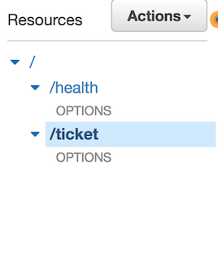

Next we will create two methods – one for GET and one for POST

Select `ticket` under *resources*, and from the *Actions* drop-down select
**Create Method** and then choose `GET` as your first method and select the
check-box to confirm creation:

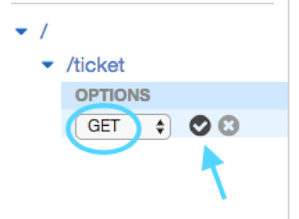

Keep *Lambda Function* selected, enable *Use Lambda Proxy Integration* and choose
`eu-west-1` as the Lambda Region and then start typing in the Lambda Function box
and choose *TicketGetFunction* and then click **Save**

Click OK when asked to *Add Permission to Lambda Function*

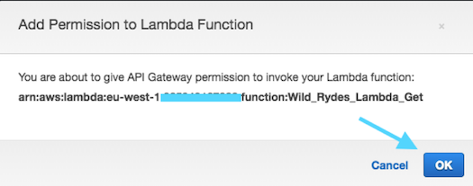

Repeat this step one more time but choose the POST method this time. Ensure you
choose *TicketPostFunction* as your function this time.

Last we will create a `GET` method under the `health` resource.  You will select
the *SXRHealthCheckFunction* for the Lambda function.

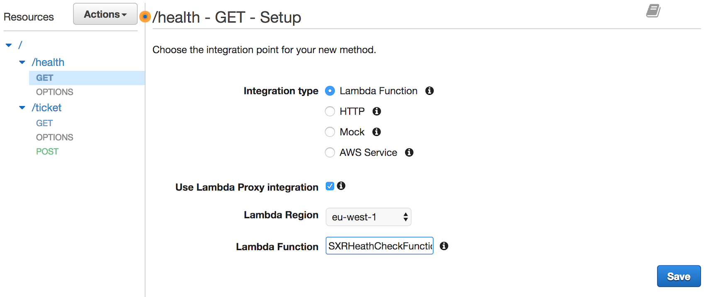

Again, click **OK** when asked to *Add Permission to Lambda Function*

Finally, we will enable Cross-Origin.
Select `ticket` under *resources*, and from the *Actions* drop-down select **Enable CORS**

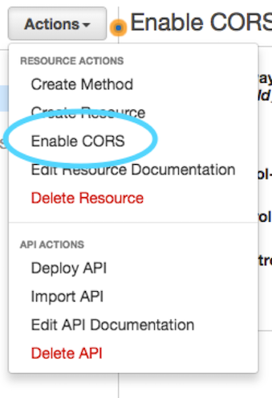

Simply Accept the Default Settings and click on the
 **Enable CORS and Replace Existing CORS Headers** button:

Click **Yes, replace existing values** if prompted.

Repeat the same step once more time, this time choosing `health` as the resource.

Next we will deploy the API – this is done from the *Actions* pull-down, selecting *Deploy API*

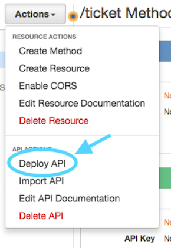

Then select *New Stage* for Deployment Stage and enter the Stage Name of `prod` and
click **Deploy**.  Note that *prod* needs to be all lowercase or you will run into
problems later on.

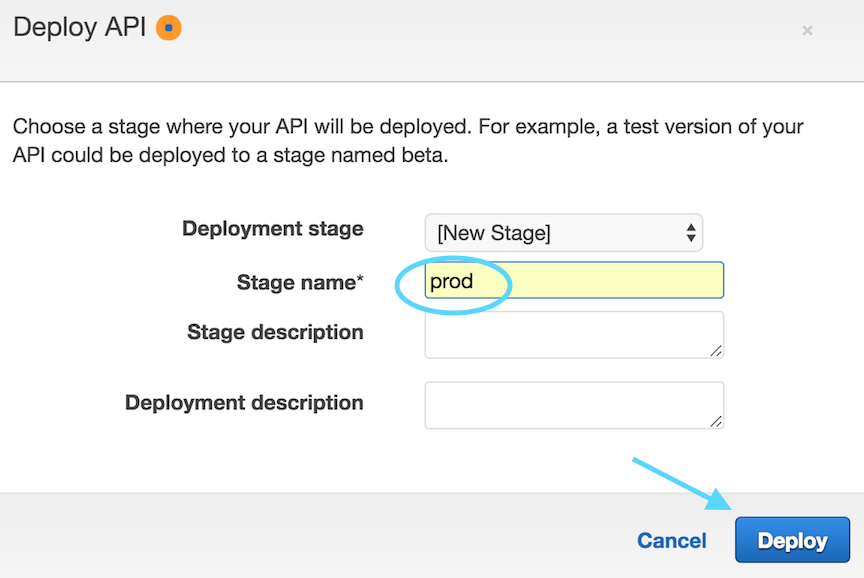

You have now completed the setup of all the API and backend components needed for
your primary region

## 5. Test your API Gateway Endpoints

While still in API Gateway, select **Stages** from the left menu under your
API Endpoint.  Next, expand "prod", and select `POST` or `GET` from the *ticket*
resource (either choice will provide the same API URL)

You'll see a link to your API EndPoint. **Click** on the link and you should
see something like the below in your browser if the test is successful:

    {
        "body":"{"Items":[],"Count":0,"ScannedCount":0}"
    }

You can also perform the same test but select `GET` from the *health* resource
instead.  You should get something like the following in your browser:

    {
        "region":"eu-west-1",
        "message":"Successful response reading from DynamoDB table."
    }

Make note of the API Endpoint URL - you will need this in Module 2_UI.

<strong>CLI step-by-step instructions (expand for details)</strong>

Navigate to the `1_API` folder within your local Git repository and take a look at the
files within. You will see several files - here are descriptions of each:

* `wild-rydes-api.yaml` – This is a CloudFormation template (using SAM syntax) that
  describes the infrastructure needed to for the API and how each component should be configured.
* `tickets-get.js` – This is the Node.js code required by our Lambda function needed
  to retrieve tickets from DynamoDB
* `tickets-post.js` – This is the Node.js code required by our second Lambda function
  to create new tickets in DynamoDB
* `health-check.js` - Lambda function for checking the status of our application health

There is no modification necessary to this application code so we can go ahead and
deploy it to AWS. Since it comes with a CloudFormation template, we can use this to
upload our code and create all of the necessary AWS resources for us rather than doing
this manually using the console which would take much longer. We recommend deploying the
primary region using the Console step-by-step instructions and then deploying the failover
region using the CloudfFormation template  Feel free to open the template and take a look
at the resources it is creating and how they are defined.

## 1. Create an S3 bucket to store the app code

We'll first need a bucket to store our source code in AWS.

#### High-level Instructions

Go ahead and create a bucket using the AWS Console or the CLI. S3 bucket names must be
globally unique so choose a name for your bucket using something unique to you such as
your name e.g. `wildrydes-firstname-lastname`. If you get an error that your bucket name
already exists, try adding additional numbers or characters until you find an unused name.

You can create a bucket using the CLI with the following command:

*Ireland* (choose a unique bucket name)
     aws s3 mb s3://wildrydes-multiregion-blake-mitchell-eu-west-1 --region eu-west-1

*Singapore*
     aws s3 mb s3://wildrydes-multiregion-blake-mitchell-ap-southeast-1 --region ap-southeast-1

Note that in this and in the following CLI commands, we are explicitly passing in the
region. Like many things in AWS, S3 buckets are regional. If you do not specify a region,
a default will be used which may not be what you want.

## 2. Package up the API code and push to S3

Because this is a SAM Template, we must first package it. This process will upload the
source code to our S3 bucket and generate a new template referencing the code in S3
where it can be used by AWS Lambda.

#### High-level instructions

Go ahead and create two new Lambda functions using the the Node.js code from
`tickets-post.js` and `tickets-get.js`.

You can do this using the following CLI command. Note that you must replace
`[bucket-name]` in this command with the bucket you just created):

*Ireland*

    aws cloudformation package \
    --region eu-west-1 \
    --template-file wild-rydes-api-primary-region.yaml \
    --output-template-file wild-rydes-api-primary-region-output.yaml \
    --s3-bucket [eu_west_bucket_name_you_created_above]

**IMPORTANT** DO NOT deploy any resources to Singapore during your initial pass
on Module 1. You will come back in Module 3 and then deploy the same components
to Singapore. We are providing the commands for both regions here for your
convenience.

*Singapore* (do not deploy during your first pass on Module 1_API)

    aws cloudformation package \
    --region ap-southeast-1 \
    --template-file wild-rydes-api-failover-region.yaml \
    --output-template-file wild-rydes-api-failover-region-output.yaml \
    --s3-bucket [ap_southeast_bucket_name_you_created_above]

If all went well, you should get a success message and instructions to deploy your new template.  
Follow those instructions.  *NOTE: You will need to add '--capabilities CAPABILITY_IAM' to the*
*command in order to successfully deploy*

## 3. Deploy a stack of resources

Next, we need to spin up the resources needed to run our code and expose it as an API.

#### High-level instructions

You can now take the newly generated template and use it to create resources in AWS.
Go ahead and run the following CLI command:

*Ireland*

    aws cloudformation deploy \
    --region eu-west-1 \
    --template-file wild-rydes-api-primary-region-output.yaml \
    --stack-name wild-rydes-api-primary \
    --capabilities CAPABILITY_IAM

**IMPORTANT** DO NOT deploy any resources to Singapore during your initial pass
on Module 1. You will come back in Module 3 and then deploy the same components
to Singapore. We are providing the commands for both regions here for your
convenience.

*Singapore* (do not deploy during your first pass on Module 1_API)

    aws cloudformation deploy \
    --region ap-southeast-1 \
    --template-file wild-rydes-api-failover-region-output.yaml \
    --stack-name wild-rydes-api-failover \
    --capabilities CAPABILITY_IAM

This command may take a few minutes to run. In this time you can hop over to the console
and watch all of the resources being created for you Open up the AWS Console in your browser
and check you are in the correct region (EU Ireland) before selecting the CloudFormation
service from the menu. You should your stack listed as `wild-rydes-api`. You can click
on this stack to see all of the resources it created.

Once your stack has successfully completed, navigate to the Outputs tab of your stack
where you will find an API URL. Take note of this URL as we will need it later to configure
the website UI in the next module.

You can also take a look at some of the other resources created by this template. Under
the Resources section of the Cloudformation stack you can click on the Lambda functions
and the API Gateway. Note how the gateway was configured with the `GET` method calling
our `TicketGetFunction` Lambda function and the `POST` method calling our `TicketPostFunction`
Lambda function. You can also see that an empty DynamoDB table was set up as well as IAM
roles to allow our functions to speak to DynamoDB.

TODO: Instructions for setting up DynamoDB global table. MUST DO THIS BEFORE NEXT STEP. CANT HAVE DATA IN TABLE BEFORE SETTING UP GLOBAL REPLOICATION

You can confirm that your API is working by copying your API URL and appending `/ticket`
to it before navigating to it into your browser. It should return the following:

    {"Items":[],"Count":0,"ScannedCount":0}

You can also run the health check by copying your API URL and appending `/health`
to it before navigating to it into your browser. It should return the following:

    {
        "region":"eu-west-1",
        "message":"Successful response reading from DynamoDB table."
    }

Make note of the API Endpoint URL - you will need this in Module 2_UI.

## Completion

Congratulations you have configured the backend components required by the
ticketing application. In the next module you will deploy a frontend that uses
these components.

Module 2: [Build a UI layer](../2_UI/README.md)
