# Building a UI layer

Now that we have a working API, let's deploy a UI that can expose this
functionality to our users.  Note that we will only deploy this UI in our *Primary*
region.  We don't attempt to address failing over a full web application in this
workshop.  Our failover efforts are focused on the backend API components deployed
in the first module.

Navigate to the `2_UI/cfn` folder in your local Git repository using your ***Cloud9 IDE***

## 1. Create the AWS Cognito Identity Pool and S3 hosting bucket

Our first task is to setup AWS Cognito to allow our UI application to
authenticate users and gain access credentials to allow our UI to call the
API. As in *Module 1*, a CloudFormation template is available to create all the
necessary resources for us. This template does not rely on any local code so
no package step is needed.

For time reasons we are not proving console instructions for this section.  Do
feel free to review the CloudFormation template to see what is being created.

*From your Cloud9 CLI* go ahead and deploy this template in the primary region using the `aws
cloudformation deploy` CLI command as before.  

For the Ireland region, the full command will look like:

    aws cloudformation deploy \
    --region eu-west-1 \
    --template-file web-ui-stack.yaml \
    --stack-name ticket-service-ui \
    --capabilities CAPABILITY_IAM

Again, you can confirm that this was created successfully and see the resource
in the AWS Console. Navigate to the CloudFormation service and take a look at
the Outputs tab. This time you will see three keys:

* `CognitoIdentityPoolId`
* `BucketName`
* `BucketURL`

Take note of the values for each of these, you will need them in the next steps.

## 2. Set Up A CloudFront Distribution and Point at the S3 Bucket

We need to set up a CloudFront distribution and point it at your S3 bucket (this is one of the outputs from the CloudFormation you just ran) which will host your website's static UI.  We need to use a CloudFront distribution due to some restrictions that FaceBook has put in place with when in developer mode.

Navidate to CloudFront in the AWS Console and click on ***Create Distribution***

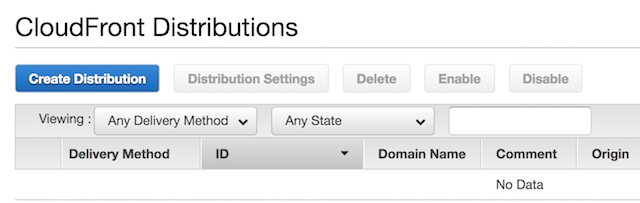  

Select ***Web*** as your content distribution method and click *Get Started*

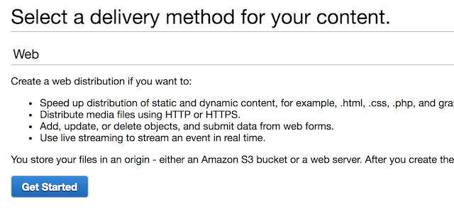

Select the S3 Static Website Bucket as your ***Origin Domain Name*** - it should automatically be in the list of possible origins

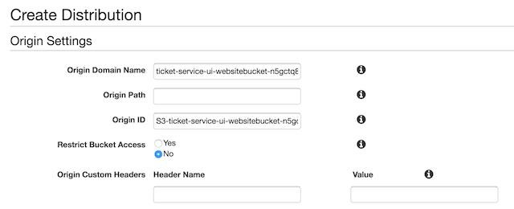

Set the default behavior to redirect to HTTPS

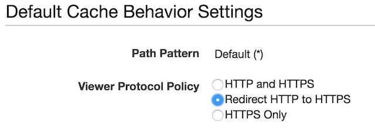

Set Defult and Max TTLs to 120 Seconds

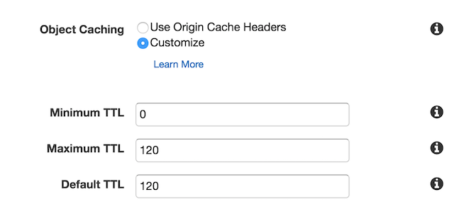

And then set *index.html* as your root document

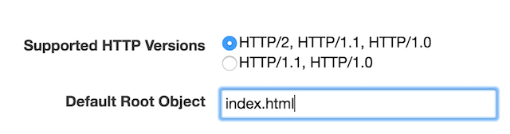

Once done, go ahead and create the distribution and move on to the next step.  We are creating the distribution now in order to give CloudFront time to fully deploy while you continue on with with the workshop.

Make note of your CloudFront domain name - you will need it to set up your FaceBook application

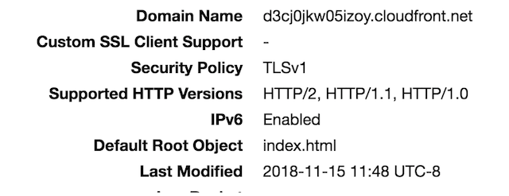

## 3. Configure Federated Identities with Cognito

Now we'll set up our login with Facebook capability. You will need to set up a
Facebook Web Application so that your riders can log in
to the UI and submit their Unicorn issues.

Go into your Facebook Developer account and create an new application by
[following these steps](https://developers.facebook.com/apps/).

Click on **Add a New App** in the upper right corner

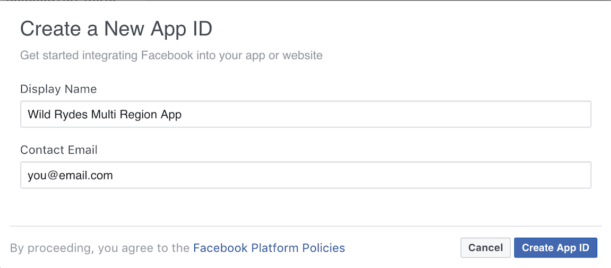

Name your App anything you would like, and then click **Create App ID**

Once you have created your App, you will need to select *Settings* and *Basic* from the left menu

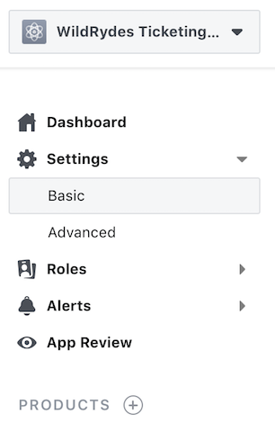

Paste the CloudFront Domain name into the *App Domain* field, nand then choose **Add Platform** from the bottom of the Settings screen (this is very far down the screen).

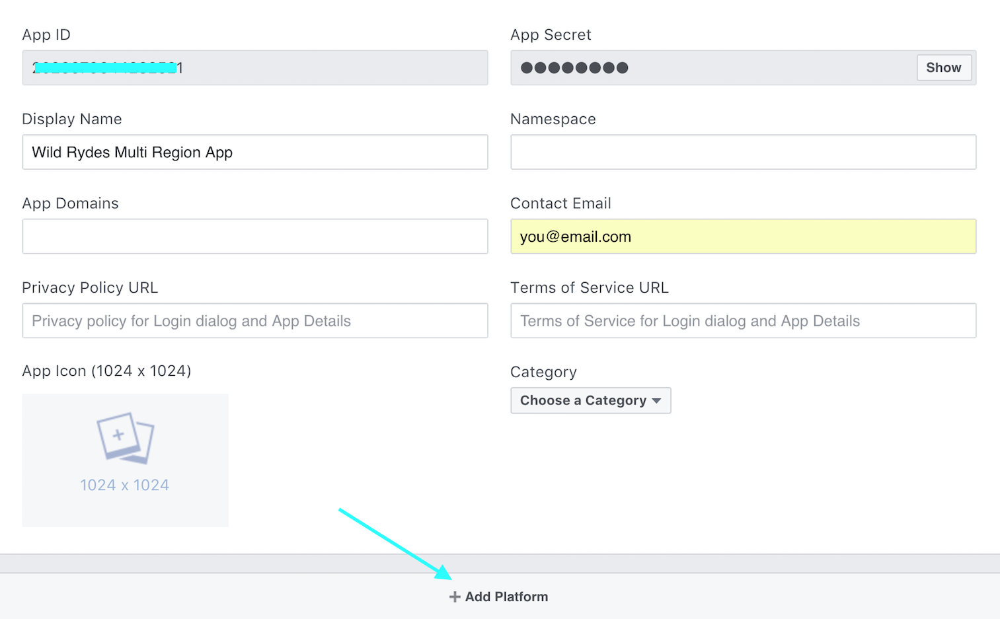

Choose **Website** from the list of choices that comes up

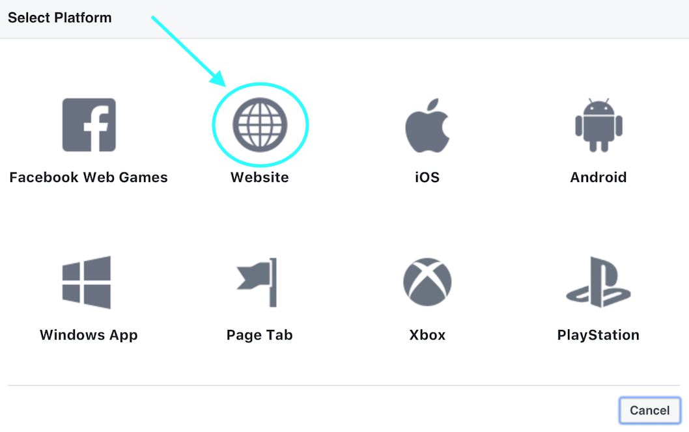

Then enter the CloudFront Domain again into the *Site URL* dialog
and then select **Save Changes** from the lower right

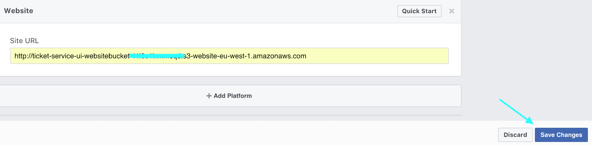

Once you are done with this, make note of the Facebook App ID - you will need this
in the next step as well as when you build the website code in the next section.

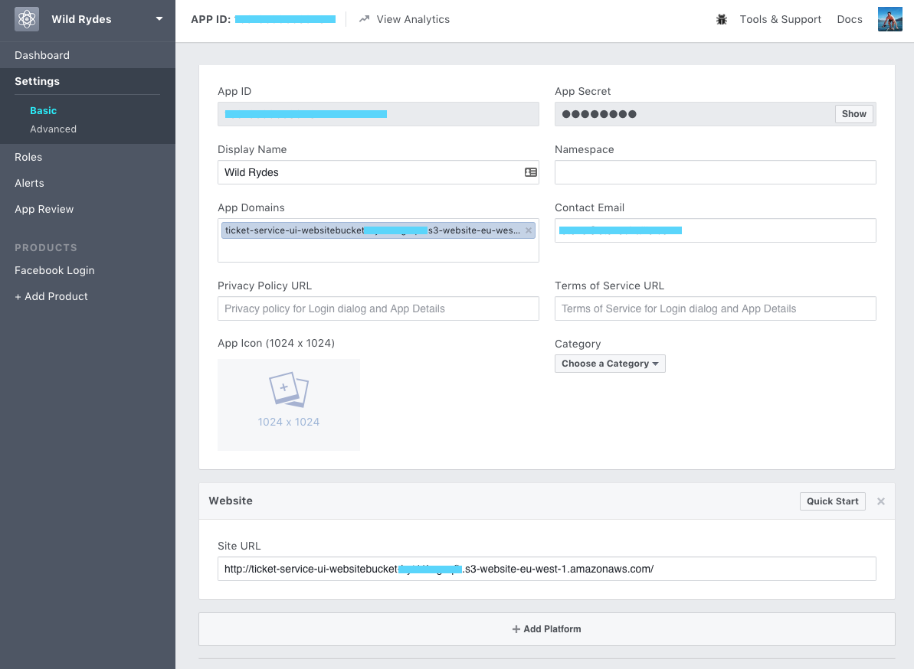

Next, we must configure the Cognito Identity Pool to use Facebook as our
identity provider. To do this, open up the AWS Console in your browser and
navigate to Cognito from the menu. Double check that you are still in the
primary region (EU Ireland).

1. Choose **Manage Identity Pools** and then select the SXRIdentityPool.
2. Click the Edit Identity Pool button in the top right
3. Take note of the Identity pool ID noted at the top of this page
4. Navigate to the Authentication Providers section.
5. Select the Facebook tab, hit Unlock then specify your Facebook App ID
6. Save Changes at the bottom of the page.

## 3. Configure and build the application code

Our application will need to know the location of the API in order to push and
pull data from it. In addition, the application will need to know our Facebook
App ID and Cognito Identity Pool ID so it can authenticate our users. See the
Prerequisites section at the beginning of this guide if you have not already
setup your Facebook Developer account and App ID.

All of these attributes must be configured in `2_UI/src/environments/environment.ts`.
Use the file editor built into Cloud9 (you will see it on the left side of the web console).
Please be sure to address all of the parameters the file requires or things wil fail.
If you used the console instructions to deploy Module 1, then you can obtain the API 
Gateway Endpoint using the same method you used when youtested at the end of the previous
module.  Ensure you do *NOT* append `ticket` to the end of the URL but make sure you do
have a `/` at the end like the comments in the file request.

You can obtain the Cognito Identity Pool ID from the *Outputs* of the CloudfFormation
template you deployed in Module 2_UI.  Ensure that you copy the entire string,
including the AWS region (in this case, it should be `eu-west-1`)

Since you are using Cloud9 for your IDE, node.js is instaled.  Ensrue you followed all
of the setup instructions in the pre-requisites and updated nvm to 8.12.0 using ***nvm install 8.12.0***  

- navigate to the root folder of the ui project, i.e. 2_UI.  

- run `node --version` and make sure output is v8.12.0

- run `npm install` to install project dependencies

- build your app with by running `npm run build`

If you get an error about NPM command not found, then go back and check the
prerequisites section of the README to find instructions to install NPM.

This will produce a `dist/` folder containing the compiled application with your
custom settings.

## 4. Upload the application

Next, you'll need to upload the UI to the S3 website bucket specified in step 1. You can
do this with:

    aws s3 sync --acl public-read --delete dist/ s3://[bucket_name_from_cloudformation_ui_stack]

Note that you must replace `[bucket-name]` in this command with the bucket
name output from the CloudFormation stack in step 1.

To confirm everything went as expected, navigate to your CloudFront Domain Name.
You should see our simple ticketing application. Go ahead and login using your Facebook
account and then submit a couple of tickets to check that everything is working.

If you have trouble in this step, double check your configured settings and
Facebook Developer account configuration. Note that if you change any
of the settings you will need to run *npm run build* again and then upload the website
code to your S3 bucket again.

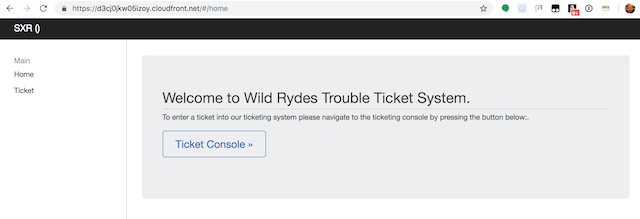

## Completion

Congratulations! You have successfully deployed a user interface for our users
on S3. In the next module you will learn how to replicate this app to a second
region and configure automatic failover using Route53.

Module 3: [Replicate to a second region](../3_Replication/README.md)
