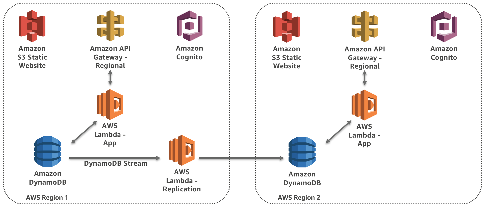

# Module: Build a Multi-Region Serverless Application for Resilience and High Availability

In this workshop you will use Amazon API Gateway, AWS Lambda and Amazon
DynamoDB to build a Customer Ticketing application so we can provide a great
experience to Wild Rydes users.

The Wild Rydes team wants this application to meet the following requirements:

1. Users must be able to submit and view support tickets
2. Users must be able to log in with their Facebook user id
3. The application should use an entirely serverless architecture (we don't
   have an operations team to manage our infrastructure!)
4. The application must be able to failover to another region in the case of a
   disaster. The **RTO** and **RPO** must both be less than 15 minutes.
    * **RTO:** Recovery time objective – the targeted duration of time and a service
    level within which a business process must be restored after a disaster.
    * **RPO:** Recovery point objective –  the maximum targeted period in which data
    might be lost from a service due to a major incident.

## Architecture Overview

The application will utilize three layers:

1. A UI layer built using HTML, Javascript and CSS and hosted directly from
   AWS S3
2. An API layer built using Node.js running on AWS Lambda and exposed via
   Amazon API Gateway.
3. A data layer storing customer tickets in DynamoDB.

For the purposes of this workshop, our failover is focused on the path from
our application (in this case, a web application) through API Gateway,
Lambda and DynamoDB.  We do not address replication of the website UI layer
itself to a second region, although this could be achieved using something
like S3 [Cross Region
Replication](http://docs.aws.amazon.com/AmazonS3/latest/dev/crr.html).

The backend components will be replicated to the second region so that we can
failover in the event of a disaster. In addition, all data in DynamoDB will be
replicated from the primary region to the secondary region ensuring that our
application data will be available when we failover.

A few additional components will be utilized to assist us including AWS
Cognito to allow the application to authenticate users and authorize access to
the API layer. AWS Route53 will be used for DNS and will allow us to perform
health checks on our primary region, and upon detecting an issue,
automatically switching to our secondary region using Route53 DNS updates.

## Prerequisites

### AWS Account

In order to complete this workshop you'll need an AWS Account with access to
create AWS IAM, S3, DynamoDB, Lambda and API Gateway. The code and
instructions in this workshop assume only one student is using a given AWS
account at a time. If you try sharing an account with another student, you'll
run into naming conflicts for certain resources. You can work around these by
appending a unique suffix to the resources that fail to create due to
conflicts, but the instructions do not provide details on the changes required
to make this work.

### Domain Name

You will also need to either purchase a domain, or repurpose an existing
unused domain you already own.  You will need to delegate DNS to Route53 if
the domain is not already acquired through AWS.  You may also need access to
the email account associated with the domain name registration.

### Facebook Developer Account and App ID

Our application requires a Facebook federated identity to
allow users to login with an existing account. In order to set this up you
will need a Facebook Developer account.

You can sign up using [this link](https://developers.facebook.com/docs/apps/register/).

Note that you will create the App ID later on in this guide using the
URL you set up.

### AWS Command Line Interface

To complete parts of this workshop you'll need the AWS Command Line Interface
(CLI) installed on your local machine. Make sure you have the latest version
installed.

Follow the [AWS CLI Getting Started
guide](http://docs.aws.amazon.com/cli/latest/userguide/installing.html) to
install and configure the CLI on your machine.

Please also configure an IAM user on the AWS account you intend to use with
Programatic Access and run **aws configure** and supply the need Access Key
and Secret Access Key.  We recommend that this user have Administrator Access
to the account for the duration of the workshop.

### A local environment with Git, Node.js and NPM

If you are not familiar with setting up a development environment, we have
separate instructions under
[README_InstallDevDependencies.md](README_InstallDevDependencies.md). This
also includes setting up an EC2 instance if you would prefer to do this in the
Cloud rather than your local machine. Follow those and then come back here.
We also offer the ability to use a pre-configuted EC2 instance as well.

### Browser

We recommend you use the latest version of Chrome or Firefox when testing the
web application UI.

### Text Editor

You will need a local text editor for making minor updates to configuration
files.  Good options are Atom, Sublime, VI/VIM, TextEdit or NotePad

## Implementation Instructions

This workshop is broken up into multiple modules. In each, we will walk
through a high level overview of how to implement or test a part of this
architecture. Some guidance is given regarding commands but if you need more
detailed step-by-step instructions at any time, you can expand sections for
more detail. You must complete each module before proceeding to the next.

### Region Selection

We will be using the following two regions for this workshop. Please remember
these and check before creating resources to ensure you are in the correct
region:
* Primary: `eu-west-1` (Ireland)
* Secondary: `ap-southeast-1` (Singapore)

### Modules

1. [Build an API layer](1_API/README.md)
2. [Build a UI layer](2_UI/README.md)
3. [Replicate to a second region](3_Replication/README.md)
4. [Test failover](4_Testing/README.md)
