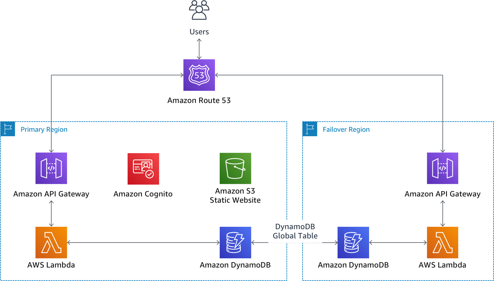

# Module: Build a Multi-Region Serverless Application for Resilience and High Availability

In this workshop you will use Amazon API Gateway, AWS Lambda, Amazon DynamoDB and a variety of other AWS services to build a Customer Ticketing application so we can provide a great experience to Wild Rydes users.

The Wild Rydes team wants this application to meet the following requirements:

1. Users must be able to submit and view support tickets
2. Users must be able to log in with their Facebook user id
3. The application should use an entirely serverless architecture (we don't
   have an operations team to manage our infrastructure!)
4. The application must be able to failover to another region in the case of a
   disaster. The **RTO** and **RPO** must both be less than 15 minutes.
    * **RTO:** Recovery time objective – the targeted duration of time and a service
    level within which a business process must be restored after a disaster.
    * **RPO:** Recovery point objective –  the maximum targeted period in which data
    might be lost from a service due to a major incident.

## Architecture Overview

The application will utilize three layers:

1. A UI layer built using HTML, Javascript and CSS and hosted directly from
   AWS S3
2. An API layer built using Node.js running on AWS Lambda and exposed via
   Amazon API Gateway.
3. A data layer storing customer tickets in DynamoDB.

For the purposes of this workshop, our failover is focused on the path from
our application (in this case, a web application) through API Gateway,
Lambda and DynamoDB.  We do not address replication of the website UI layer
itself to a second region, although this could be achieved using something
like S3 [Cross Region Replication](http://docs.aws.amazon.com/AmazonS3/latest/dev/crr.html).

The backend components will be replicated to the second region so that we can
failover in the event of a disaster. In addition, all data in DynamoDB will be
replicated from the primary region to the secondary region using DynamoDB Global
Tables ensuring that our application data will be available when we failover.

A few additional components will be utilized to assist us including AWS
Cognito to allow the application to authenticate users and authorize access to
the API layer. AWS Route53 will be used for DNS and will allow us to perform
health checks on our primary region, and upon detecting an issue,
automatically switching to our secondary region using Route53 DNS updates.

## Implementation Instructions

This workshop is broken up into multiple modules. In each, we will walk
through a high level overview of how to implement or test a part of this
architecture. You will expand sections for detailed command or console instructions.

### Region Selection

We will be using the following two regions for this workshop. Please remember
these and check before creating resources to ensure you are in the correct
region:
* Primary: `eu-west-1` (Ireland)
* Secondary: `ap-southeast-1` (Singapore)

Using the two regions above for this workshop is mandatory.  We will start with `eu-west-1` (Ireland).  You will not deploy anything in `ap-southeast-1` (Singapore) until Module 3.

### Modules

1. [Build an API layer](1_API/README.md)
2. [Build a UI layer](2_UI/README.md)
3. [Replicate to a second region](3_Replication/README.md)
4. [Test failover](4_Testing/README.md)
5. [Cleaning Up](5_Cleanup/README.md)

## Prerequisites
(please read these carefully and do not jump ahead and start setting things up
unless specifically called out)

### Get Set Up! Follow this link to get things going....  

[README_InstallDevDependencies](README_InstallDevDependencies.md)  

### AWS Account

In order to complete this workshop you'll need an AWS Account with access to
create AWS IAM, EC2, Cognito, CloudFront, Cloud9, S3, DynamoDB, Lambda, and
API Gateway.  The code and instructions in this workshop assume only one participant
is using a given AWS account at a time. If you try sharing an account, you'll run
into naming conflicts for certain resources - we do not recommend this as there ma
be unpredictable results or difficult to identify configuration issues.

### Domain Name (this is covered in Module 3)

You will also need to either purchase a domain, or repurpose an existing
unused domain you already own.  You will need to delegate DNS to Route53 if
the domain is not already acquired through AWS.  You may also need access to
the email account associated with the domain name registration or to the
DNS server assigend to the domain in order to prove you own the domain when
creating SSL certiticates in Amazon Certificate Manager.  
  
(re:Invent 2018 participants - please see the workshop team if you need to "borrow"
a domain in order to complete the workshop)

### Facebook Developer Account and App ID

Our application requires a Facebook federated identity to
allow users to login with an existing account. In order to set this up you
will need a Facebook Developer account.  You may set up the account now, but
do not start configuring anything else yet.

You can sign up using [this link](https://developers.facebook.com/docs/apps/register/).

Note that you will create the App ID later on in this guide using the website
URL you will set up in Module 2.  You may delete the Facebook account once you
have completed the workshop.

### Amazon Cloud9

In order to remove as many dependencies as possible and not rely on the specific
configuration of a workshop participant's Windows, Mac, or Linux workstation, we
will be utilizing the Amazon Cloud 9 IDE.  This will ensure that you have everything
you need in one place as you work your way through each module.

* Included in the Cloud9 IDE:  AWS CLI, Git, VI/VIM, Node.js, NPM, Python and
anything else you might need to complete the workshop.

### Browser

We recommend you use the latest version of Chrome or Firefox when testing the
web application UI.

