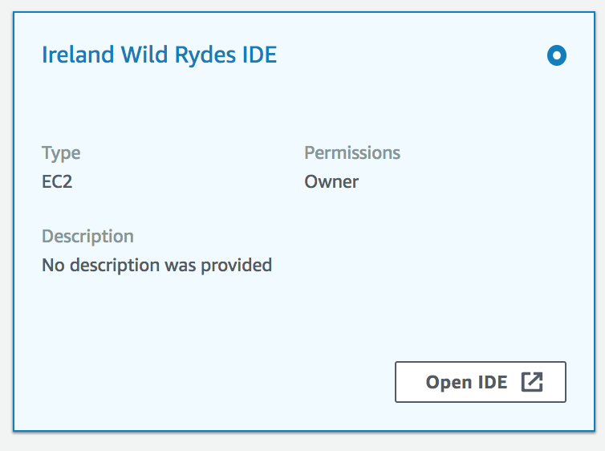
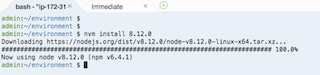
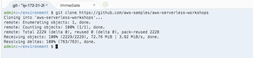

## About

This README provides brief instructions on setting up a dev environment
that you can use to clone the project, edit project files, build the UI
and deploy the application.  You can also deploy any of the CloudFormation
templates from any module using the Cloud9 IDE as well!

We strongly recommend you use Cloud9 which will have the necessary
dependencies, i.e. AWS CLI, git, node/npm, angular cli already installed
and configured - you'll only need to clone the git repository and update
the version of nvm used.

Our Cloud9 instance will be in `eu-west-1` (Ireland)

## Using the Cloud9 IDE Instance

The Cloud9 service allows you to complete the entire workshop using just your web browser - including conneting to the command line on your development instance - its really simple to set up.  We are going to use the EC2 Instance method

[Cloud9 Setup Documentation](https://docs.aws.amazon.com/cloud9/latest/user-guide/create-environment.html)

Make sure you are in `eu-west-1` region.

## Connect to the instance via the web console

## Install the correct version of nvm  

nvm install 8.12.0

## Clone the workshop project

git clone https://github.com/awslabs/aws-serverless-workshops.git

This will pull down all of the files and directories you will need to complete
the workshop and keep them on the local file system.

**Note** If you decide to open a second tab or command line in your Cloud9 environment,  or
the instance is not used for a long perioud of time, you will need to re-install the correct version
of nvm again.

## Building the UI

You should now be able to build the UI when you get to that step in the second
module, as well as deploy CloudFormation templates, and do any other workshop
activities that require command line activities.

One you have the instance up and running and you have connected to it, you can move forward.

## Completion

Now you are ready to get back to the Workshop. Go back to the
[README](README.md#implementation-instructions)
