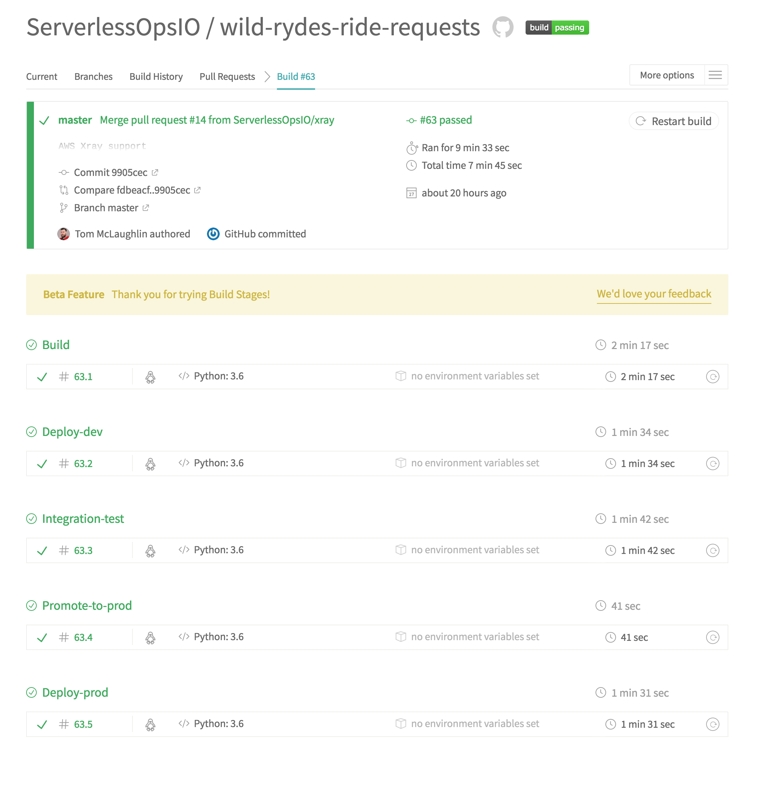

# Module 3: Feature Deployment

In this module we will now deploy our new feature to dev and production.  A merge to master will trigger the deploy pipeline to run.  Our CI/CD pipeline uses [Travis](https://travis-ci.org/ServerlessOpsIO) to build, test, and deploy.  We chose Travis for its simplicity and familiarity.

At the end of this module you will have
1. Understand how the Travis CI/CD pipeline is configured and why.

## CI/CD architecture

The standard CI/CD pipeline for each Wild Rydes project is written with three goals in mind.

- Pipeline consistency across projects
- Modularity to aide consistency and build failure troubleshooting.
- A single artifact that is tested and deployed to all environments

Consistency is achieved through a (mostly) standardized project Travis configuration file.  A configuration file can be copied from one project to another, new deploy credentials set, and a project is up and running with Travis.

All projects go through 4-5 build stages:

- unit test / build artifact
- development environment deployment
- integration testing (optional - now frontend testing currently)
- artifact promotion to production
- production environment deployment

The build is also modular, employing multiple build stages.  While this adds overhead in build time it makes finding the point at which the build broke easier.  It also makes making custom changes to a project easier and less error prone because the changes in most cases will only affect a single stage.

Finally at the end of unit testing a deployable artifact is created by using `sls package`.  This artifact is then archived in S3 and retrieved by subsequent stages.  This ensures all testing and deployments have consistent dependencies installed.



## Setting up Travis

The majority of Travis configuration is managed in a project's [_.travis.yml_](https://github.com/ServerlessOpsIO/wild-rydes-ride-requests/blob/master/.travis.yml) file.  Some configuration, such as authentication tokens, is stored in the Travis project configuration on their website.  
### Encrypting secrets
<!-- We'll soon be switching to a single user and using STS to assume roles. -->
Encrypting sensitive information can be done using the Travis CLI command.  In our configuration we encrypt the AWS access and secret keys for the Travis deployment users in dev and prod.

To add an encrypted value you would perform the following steps.

1. Install the Travis CLI
```
$ gem install travis
```

2. Encrypt an environment variable
```
$ travis encrypt AWS_ACCESS_KEY_ID_DEV='<ACCESS_KEY_ID>' --add
```

3. Annotate the encrypted environment variable in _.travis.yml_.  Since the tool does not add the name of the environmental variable that was encrypted, it's useful to annotate the name of the environment variable.
<!-- We want to switch to a single set of Travis CI/CD credentials. -->

```
env:
  global:
    - DIST_DIR="${PWD}/dist"
    - PROJECT_NAME=$(basename ${PWD})
    - ARTIFACT="${TRAVIS_BUILD_NUMBER}-${TRAVIS_COMMIT}.zip"
    - S3_BUCKET_PREFIX="serverlessops-deploy"
    - S3_BUCKET_DEV="${S3_BUCKET_PREFIX}-training-dev"
    - S3_BUCKET_PROD="${S3_BUCKET_PREFIX}-training-prod"
    - AWS_REGION=us-east-1
    # AWS_ACCESS_KEY_ID_DEV
    - secure: <SECRET_VALUE>
    # AWS_SECRET_ACCESS_KEY_DEV
    - secure: <SECRET_VALUE>
    # AWS_ACCESS_KEY_ID_PROD
    - secure: <SECRET_VALUE>
    # AWS_SECRET_ACCESS_KEY_PROD
    - secure: <SECRET_VALUE>
```

_NOTE: As an alternative you may wish to store something like AWS access keys in the project settings on the Travis website.  These are just here to demonstrate how to handle storing encrypted values in the file which is a common occurrence._


### Build stages

The build is divided into multiple stages.  This makes it easier to quickly asses where in the build a failure occurred.  It also makes it easier to make changes in the build with less fear of disturbing other parts of the build.  Out build process also builds a single artifact that is tested and deployed to all environments.

An example build can be found here:
* https://travis-ci.org/ServerlessOpsIO/wild-rydes-ride-requests/builds/359651509

Let's walk through each stage now.

#### Build

This stage installs dependencies for the service, performs unit tests (the same ones from the previous module), and upon successful completion bundles an artifact that is stored in AWS S3.  This artifact will be used in all subsequent stages.  This is also the only build stage executed when a PR is opened.

```yaml
- stage: build
  sudo: required
  services:
    - docker
  language: python
  python: '3.6'
  install:
    - npm install -g serverless
    - npm install
    - pip install awscli
    - aws configure set default.region $AWS_REGION
    - aws configure set aws_access_key_id $AWS_ACCESS_KEY_ID_DEV
    - aws configure set aws_secret_access_key $AWS_SECRET_ACCESS_KEY_DEV
    - pip install -r requirements.txt
    - pip install -r requirements-dev.txt
  script:
    # Fixes strange failure. ref: https://github.com/travis-ci/travis-ci/issues/7940
    - export BOTO_CONFIG=/dev/null
    - pytest -v tests/unit
    - sls package -v -r ${AWS_REGION}
  after_script:
    # Ensure our creds are cleaned up.
    - rm -rf ~/.aws
  before_deploy:
    - mkdir $DIST_DIR
    - zip -r dist/${ARTIFACT} ./ -x '*.git*' -x $DIST_DIR
  deploy:
    - provider: s3
      skip_cleanup: true
      bucket: "${S3_BUCKET_DEV}"
      upload_dir: "${PROJECT_NAME}"
      local_dir: "$DIST_DIR"
      acl: private
      access_key_id: "$AWS_ACCESS_KEY_ID_DEV"
      secret_access_key: "$AWS_SECRET_ACCESS_KEY_DEV"
```
* Example: [Build](https://travis-ci.org/ServerlessOpsIO/wild-rydes-ride-requests/jobs/359651510)

#### Deploy-dev

This stage will retrieve the build artifact and deploy it to the dev environment

```yaml
- stage: deploy-dev
  sudo: required
  services:
    - docker
  language: python
  python: '3.6'
  install:
    - pip install awscli
    # Our SLS setup expects to find an AWS profile so let's just manage
    # our creds this way.
    - aws configure set default.region $AWS_REGION
    - aws configure set aws_access_key_id $AWS_ACCESS_KEY_ID_DEV
    - aws configure set aws_secret_access_key $AWS_SECRET_ACCESS_KEY_DEV
    - npm install -g serverless
  script:
    - aws s3 cp "s3://${S3_BUCKET_DEV}/${PROJECT_NAME}/${ARTIFACT}" ./
    - mkdir ${DIST_DIR}
    - unzip -q ${ARTIFACT} -d ${DIST_DIR}
    - cd ${DIST_DIR}
    # We have to use `sls deploy` without the package argument because
    # otherwise the zone name is already resolved.
    - export SLS_HOSTED_ZONE_NAME=dev.training.serverlessops.io
    - sls deploy -v
  after_script:
    # Ensure our creds are cleaned up.
    - rm -rf ~/.aws

```

* Example: [Deploy-dev](https://travis-ci.org/ServerlessOpsIO/wild-rydes-ride-requests/jobs/359651511)

#### Integration-test

This stage runs integration tests against the dev instance of the service.  With the amount of AWS resources that can go into making up a single service, not to mention interactions between your own services, it's important to ensure the entire functional path is working correctly.  A unit test can't detect a missing IAM permission but integration tests can.

```yaml
- stage: integration-test
  sudo: required
  services:
    - docker
  language: python
  python: '3.6'
  install:
    - pip install awscli
    # Our SLS setup expects to find an AWS profile so let's just manage
    # our creds this way.
    - aws configure set default.region $AWS_REGION
    - aws configure set aws_access_key_id $AWS_ACCESS_KEY_ID_DEV
    - aws configure set aws_secret_access_key $AWS_SECRET_ACCESS_KEY_DEV
    - npm install -g serverless
    - pip install -r requirements.txt
    - pip install -r requirements-dev.txt
  script:
    - pytest -v tests/integration
  after_script:
    # Ensure our creds are cleaned up.
    - rm -rf ~/.aws

```

* Example: [Integration-test](https://travis-ci.org/ServerlessOpsIO/wild-rydes-ride-requests/jobs/359651514)

#### Promote-to-prod

This stage retrieves the build artifact from the dev S3 bucket and copies it to the production bucket.

```
- stage: promote-to-prod
  language: python
  python: '3.6'
  install:
    - pip install awscli
    # Our SLS setup expects to find an AWS profile so let's just manage
    # our creds this way.
    - aws configure set default.region $AWS_REGION
  script:
    # fetch from Dev
    - aws configure set aws_access_key_id $AWS_ACCESS_KEY_ID_DEV
    - aws configure set aws_secret_access_key $AWS_SECRET_ACCESS_KEY_DEV
    - aws s3 cp "s3://${S3_BUCKET_DEV}/${PROJECT_NAME}/${ARTIFACT}" ./
    # Send to prod
    - aws configure set aws_access_key_id $AWS_ACCESS_KEY_ID_PROD
    - aws configure set aws_secret_access_key $AWS_SECRET_ACCESS_KEY_PROD
    - aws s3 cp "${ARTIFACT}" "s3://${S3_BUCKET_PROD}/${PROJECT_NAME}/"

```
* Example: [Promote-to-prod](https://travis-ci.org/ServerlessOpsIO/wild-rydes-ride-requests/jobs/359651515)

#### Deploy-prod

This stage performs the deployment to production.

```
- stage: deploy-prod
  sudo: required
  services:
    - docker
  language: python
  python: '3.6'
  install:
    - pip install awscli
    # Our SLS setup expects to find an AWS profile so let's just manage
    # our creds this way.
    - aws configure set default.region $AWS_REGION
    - aws configure set aws_access_key_id $AWS_ACCESS_KEY_ID_PROD
    - aws configure set aws_secret_access_key $AWS_SECRET_ACCESS_KEY_PROD
    - npm install -g serverless
  script:
    - aws s3 cp "s3://${S3_BUCKET_PROD}/${PROJECT_NAME}/${ARTIFACT}" ./
    - mkdir ${DIST_DIR}
    - unzip -q ${ARTIFACT} -d ${DIST_DIR}
    - cd ${DIST_DIR}
    # We have to use `sls deploy` without the package argument because
    # otherwise the zone name is already resolved.
    - export SLS_HOSTED_ZONE_NAME=prod.training.serverlessops.io
    - sls deploy -v -s prod
  after_script:
    # Ensure our creds are cleaned up.
    - rm -rf ~/.aws

```

* Example: [Deploy-prod](https://travis-ci.org/ServerlessOpsIO/wild-rydes-ride-requests/jobs/359651517)

