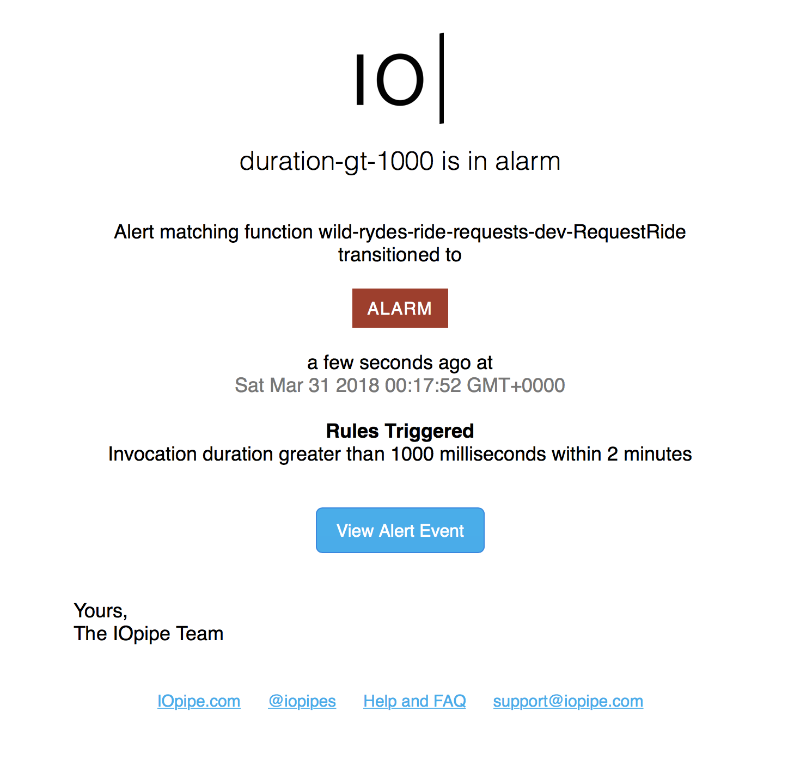
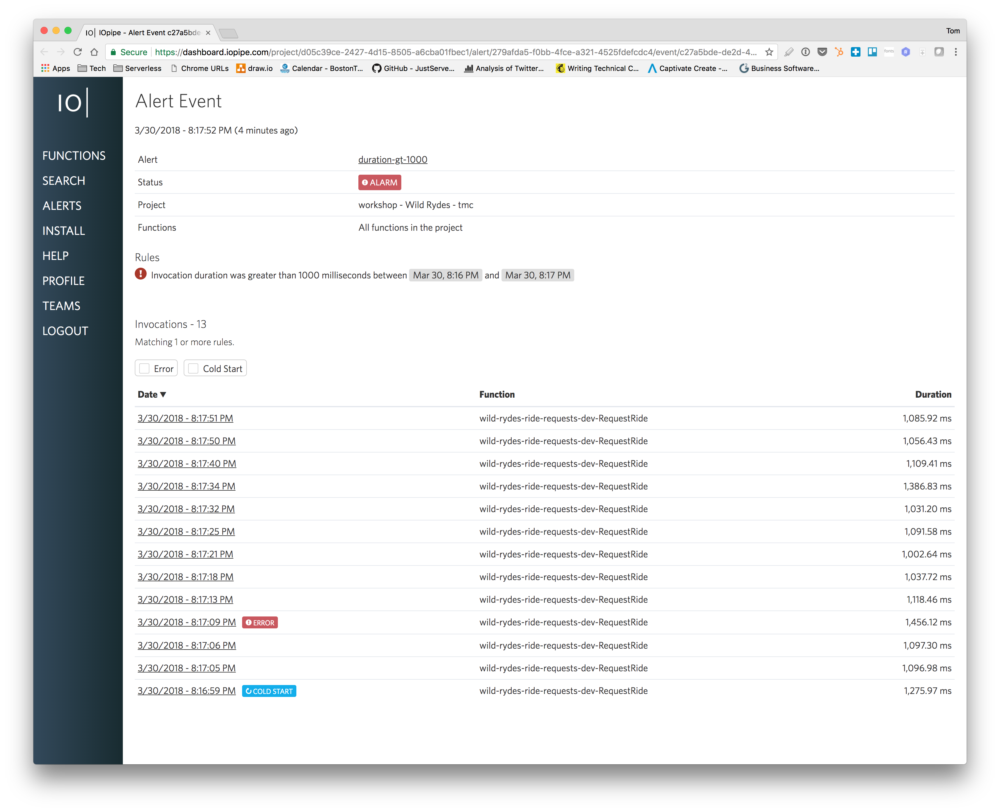
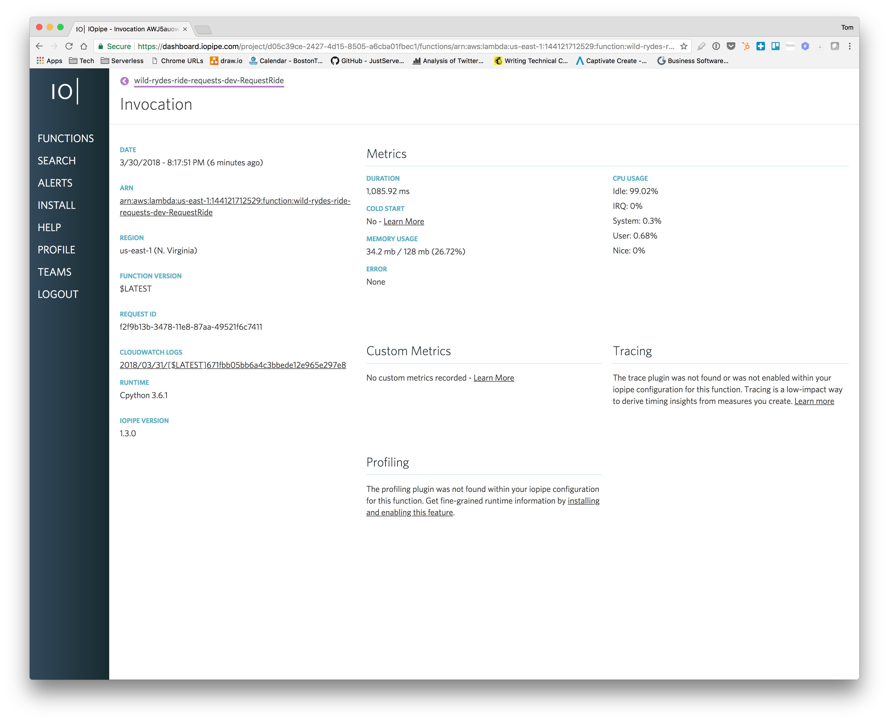
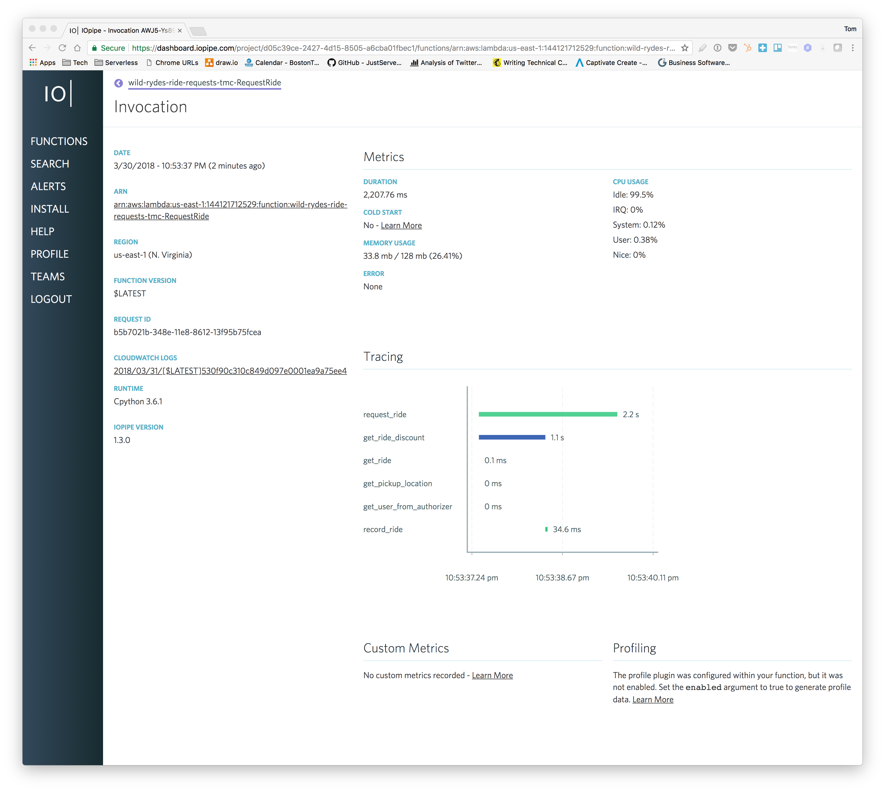

# Module 4: Debugging Failure
In this module you will go through a failure state.  We've deployed a new feature to Wild Rydes...  But there is an issue.  We're seeing slowness in request responses  but only on some requests.  Here we'll use [IOpipe](https://www.iopipe.com/) to to be alerted of the issue and then instrument our function with tracing points to find the issue.

__Objectives:__
* Familiarize ourself with IOpipe for investigating alerts and anomalies.
* Instrument a function to gain observability into how the function is performing.

__Questions:__
* Why don't we leave tracing on all the time?
* What is causing the slowness in our function?

## Instructions

### Enable IOpipe
Previous to now IOpipe has been available but dormant.  This will allow our function to communicate with the IOpipe platform.

#### 1. Deploy with IOpipe Token.
You should have received an IOpipe authentication token.  Deploy Ride Requests with the token.  

```
$ cd wild-rides-ride-requests
$ IOPIPE_TOKEN=<IOPIPE_TOKEN> sls deploy -v
```

### Run Artillery
<!-- FIXME: We need to add artillery confis. -->

Run `artillery` against your site.  You should see a large variance between the min and max request time as well as p95 and p99 values over over 1000ms in each set of results.  Your median request latency value should be closer to your minimum value.  All this means the site is functioning but some users are seeing sporadic slowness.  Remember, _9s don't matter if users are unhappy!_

#### 1. Refresh Wild Rydes site and get Auth token

Refresh your Wild Rydes site and get your current Auth token.  In the upper right corner click the auth token link to display yours.


Next, configure Artillery with your Wild Rydes site information.

```
$ npm install -g artillery
$ cd wild-rides-ride-requests
$ export WILD_RYDES_SITE=<StaticSiteS3BucketWebsiteURL>
$ export WILD_RYDES_AUTH=<AUTH_TOKEN>
$ echo "$WILD_RYDES_SITE,$WILD_RYDES_AUTH" > tests/user.csv
```

#### 2. Run Artillery

Run Artillery against

```
$ artillery run tests/artillery-slowness.yml

Started phase 0, duration: 60s @ 19:48:41(-0400) 2018-03-30
  Scenarios launched:  9
  Scenarios completed: 8
  Requests completed:  8
  RPS sent: 1
  Request latency:
    min: 339.8
    max: 2532.1
    median: 833.7
    p95: NaN
    p99: NaN
  Codes:
    201: 8

Report @ 20:17:17(-0400) 2018-03-30
  Scenarios launched:  10
  Scenarios completed: 11
  Requests completed:  11
  RPS sent: 1
  Request latency:
    min: 326.8
    max: 1740.6
    median: 440.6
    p95: 1723.6
    p99: NaN
  Codes:
    201: 9
    502: 2

<SNIP>

All virtual users finished
Summary report @ 20:17:58(-0400) 2018-03-30
  Scenarios launched:  60
  Scenarios completed: 60
  Requests completed:  60
  RPS sent: 1
  Request latency:
    min: 305.7
    max: 7947.3
    median: 426.4
    p95: 2188.7
    p99: 7429.2
  Scenario counts:
    0: 60 (100%)
  Codes:
    201: 54
    502: 6
```

During this, you should receive an email from IOpipe warning you that you have high invocation durations.

### Investigate in IOpipe

We'll use IOpipe to investigate the cause of our slowness.  IOpipe provides us with monitoring, alerting, and the ability to instrument our functions to find the cause of our issue.

1. Investigate alerts.
1. Compare duration differences.
1. Enable IOpipe tracing.
1. Deploy fix.

#### 1. Open the IOpipe alert email

IOpipe will send you an alert email that you are experiencing too many high duration functions.  This is an alert we have setup here at Wild Rydes.  Click "View Alert Event" to be taken to IOpipe.



#### 2. Investigate alert in IOpipe

On clicking the link in your email you should be brought to the alerts page



Click one of the alerts to see the alert detail.



At this point there's not much we can tell.  We should add instrumentation to our function so we can capture performance data on a regular basis for times when this happens.

#### 3. Add instrumentation to wild-rydes-ride-requests

We need to add instrumentation to the function to determine the cause of slowness.  We'll add trace mark points throughout the handler function.  This will help us narrow down the location of the slowness.

At this point you can choose to instrument the handler yourself in _wild-rydes-ride-requests_ or just deploy _wild-rydes-ride-requests-updated_.  The IOpipe Python module documentation can be found here:

* [https://github.com/iopipe/iopipe-python](https://github.com/iopipe/iopipe-python)

```diff
diff --git a/handlers/request_ride.py b/handlers/request_ride.py
index b04f33e..996bc54 100644
--- a/handlers/request_ride.py
+++ b/handlers/request_ride.py
@@ -122,6 +122,9 @@ def _record_ride(ride_item):
 @iopipe
 def handler(event, context):
     '''Function entry'''
+
+    context.iopipe.mark.start('request_ride')
+
     _logger.debug('Request: {}'.format(json.dumps(event)))

     # IOpipe state.
@@ -140,17 +143,27 @@ def handler(event, context):
         }

     else:
-        user = _get_user_from_authorizer(authorizer)
+        with context.iopipe.mark('get_user_from_authorizer'):
+            user = _get_user_from_authorizer(authorizer)
+
         body = json.loads(event.get('body'))
-        pickup_location = _get_pickup_location(body)
-        ride_resp = _get_ride(user, pickup_location)
+
+        with context.iopipe.mark('get_pickup_location'):
+            pickup_location = _get_pickup_location(body)
+
+        with context.iopipe.mark('get_ride'):
+            ride_resp = _get_ride(user, pickup_location)
+
+        with context.iopipe.mark('get_ride_discount'):
+            discount_multiplier = _get_ride_discount(user, pickup_location)
+
+        with context.iopipe.mark('record_ride'):
+            _record_ride(ride_resp)

         # Note: testing discount feature:
         discount_multiplier = _get_ride_discount(user, pickup_location)
         ride_resp['DiscountMultiplier'] = discount_multiplier

-        _record_ride(ride_resp)
-
         resp = {
             'statusCode': 201,
             'body': json.dumps(ride_resp),
@@ -158,5 +171,6 @@ def handler(event, context):
                 "Access-Control-Allow-Origin": "*",
             }
         }
+    context.iopipe.mark.end('request_ride')

     return resp
```

_NOTE: Tracing causes overhead in our function so we don't leave them in our code on a regular basis._

#### 4. Deploy instrumented function
Deploy the newly instrumented function.  Your function will now send tracing information back to IOpipe on each invocation.

```
$ cd wild-rydes-ride-requests-updated
$ npm install
$ IOPIPE_TOKEN=<IOPIPE_TOKEN> sls deploy
```

#### 5. Run Artillery to generate traces.

Run Artillery again to generate new requests.  Notice the jump in the min and median values.  This is the effect of enabling tracing.  Once you've gotten your sample of data you can revert the change adding instrumentation to return performance to normal.

```
$ artillery run tests/artillery-slowness.yml
Started phase 0, duration: 60s @ 22:52:42(-0400) 2018-03-30
Report @ 22:52:52(-0400) 2018-03-30
  Scenarios launched:  9
  Scenarios completed: 9
  Requests completed:  9
  RPS sent: 1
  Request latency:
    min: 588.9
    max: 3704.7
    median: 1359.5
    p95: NaN
    p99: NaN
  Codes:
    201: 9

Report @ 22:53:02(-0400) 2018-03-30
  Scenarios launched:  10
  Scenarios completed: 9
  Requests completed:  9
  RPS sent: 1
  Request latency:
    min: 521.4
    max: 1505.9
    median: 592.5
    p95: NaN
    p99: NaN
  Codes:
    201: 9

<SNIP>

All virtual users finished
Summary report @ 22:53:43(-0400) 2018-03-30
  Scenarios launched:  60
  Scenarios completed: 60
  Requests completed:  60
  RPS sent: 1
  Request latency:
    min: 521.4
    max: 3704.7
    median: 714.4
    p95: 3576.8
    p99: 3697
  Scenario counts:
    0: 60 (100%)
  Codes:
    201: 60

```

#### 6. Return to IOpipe to check tracing

Now that you've generated tracing information in IOpipe, select one of the long duration invocations.  On the invocation's page look at the _Tracing_ section see the total time for the `request_ride` and then look at `get_ride_discount`.  The `get_ride_discount` trace point will show it's taing up the majority of the invocation time.




