# Wild Rydes Serverless Web Application Workshop

## Introduction


[Wild Rydes][wildrydes] needs your help! With fresh funding from its seed investors, Wild Rydes is seeking to build the world’s greatest mobile/VR/AR unicorn transportation system. The scrappy startup needs a first-class webpage to begin marketing to new users and to begin its plans for global domination. Join us to help Wild Rydes build a website using a serverless architecture.

## Overview of Workshop Labs

The Wild Rydes Serverless Web Application Workshop introduces the basics of building serverless web applications using Amazon Simple Storage Service (S3), AWS Lambda, Amazon API Gateway, Amazon DynamoDB, Amazon Cognito, Amazon Simple Email Service (SES), Amazon CloudFront, and other AWS services. In this workshop, you are an early founding employee of Wild Rydes who is tasked with building out the company’s marketing website and other initiatives using a serverless architecture and AWS.

### Requirements

You'll be configuring serverless solutions in your own AWS account. All of the services required for this lab are covered under the [AWS Free Tier][free-tier] for accounts that were created within the past 12 months. Accounts that have been created within the last 24 hours might not yet have access to servers required for this workshop.

To complete this lab, you'll need:

- [AWS Account][free-tier]
- [AWS Command Line Interface][cli]
- [Google Chrome][chrome]
- [git][git]
- Text editor

### Labs

#### Lab 1: Static Website Hosting

In this module, you'll setup an Amazon S3 bucket to host your assets and configure it to serve a static website. Because Wild Rydes is a startup preparing for global scale you'll also configure an Amazon CloudFront distribution to accelerate delivery of your assets to your potential users across the world.

#### Lab 2: Beta Sign-up Mailing List

Visitors to your website who are interested in participating in your beta program can enroll by filling out a form to join your beta users mailing list. You'll create an Amazon DynamoDB table to store these email addresses and an Amazon Cognito identity pool and an AWS Identity and Access Management (IAM) policy to allow unauthenticated users to post it. Using DynamoDB Streams, AWS Lambda, and Amazon SES, beta users will receive a confirmation email thanking them for enrolling and providing further details.

#### Lab 3: Administrative Interface

Your marketing team needs an administrative interface to manage aspects of the site. In this module, you'll create an Amazon Cognito user pool for your administrator users and start building endpoints in Amazon API Gateway. You'll configure an authorizer to validate the identity of your administrators and wire up a page to view users who have signed up for the beta program.

#### Lab 4: Product Update Blog

To keep your visitors up to date on your progress building your product, your marketing team would like to publish a blog of product updates. Using your new administrative interface, you'll add an interface to publish posts to the product update blog using Amazon API Gateway and AWS Lambda which will appear on your landing page.

### Setup

1. Pick a single Region into which you'll deploy services. You'll need to ensure all required services (Amazon S3, AWS Lambda, Amazon API Gateway, Amazon Cognito, Amazon SES, Amazon DynamoDB, Amazon CloudFront, IAM) are available in the Region you choose. See the [Region Table][region-table] for details about what services are available in which Regions. [US East (N. Virginia)][us-east-1], [US West (Oregon)][us-west-2], and [EU (Ireland)][eu-west-1] offer all of the services required for this workshop. 
   
1. Clone the lab contents locally.

   ```console
   git clone git@github.com:awslabs/aws-serverless-website-workshop.git
   ```

   This repository contains files required for all four labs and a work directory for you to copy files into as you progress through the workshop.
   
1. Ensure your AWS CLI installation is configured properly. See [the documentation][cli-documentation] for instructions.

### Tips

- Open a blank text editor file for scratch notes. Whenever a step instructs you to note an item, copy and paste that item into your scratch notes for later reference.

- Look for error messages in the [Google Chrome Developer Console][developer-console] if you encounter an issue with any of the functionality loading on the site. You can access the console by pressing **Control + Shift + J** on Linux and Windows or **Command + Option + J** on macOS.

## Lab 1: Static Website Hosting

In this module, you'll setup an Amazon S3 bucket to host your assets and configure it to serve a static website. Because Wild Rydes is a startup preparing for global scale you'll also configure an Amazon CloudFront distribution to accelerate delivery of your assets to your potential users across the world.

1. Select **S3** from the AWS Management Console.
1. Click the **Create Bucket** button.
1. Enter a name for the bucket in **Bucket Name**. Bucket names must be globally unique within AWS so prefix the name of the bucket with your last name to prevent collisions. For example, in our examples we'll follow the convention of **LAST_NAME-wildrydes** so we'll use **smith-wildrydes**.
1. Select the Region in which you'll use for this lab in the **Region** drop down. See the note in the requirements section about which Region to choose. US East (N. Virginia) is called US Standard in Amazon S3 for legacy reasons.
1. Click the **Create** button.

   

1. Expand the **Permissions** section.
1. Click the **Add bucket policy** link.

   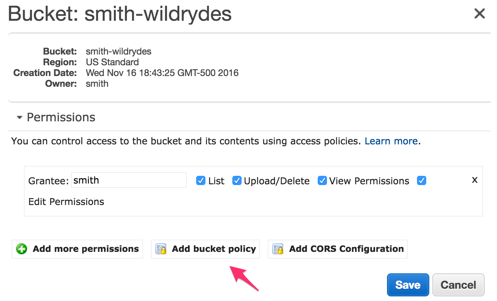
 
1. Create a bucket policy to allow anonymous read access to your bucket. This will make the bucket content publicly readable and allow Amazon S3 to serve it to web users. Ensure that you change the **INSERT_BUCKET_NAME_HERE** placeholder to the name you chose in **Step 3**.

   ```json
	{
	  "Version": "2012-10-17",
	  "Statement": [
	    {
	      "Effect": "Allow",
	      "Principal": "*",
	      "Action": "s3:GetObject",
	      "Resource": "arn:aws:s3:::INSERT_BUCKET_NAME_HERE/*"
	    }
	  ]
	}
   ```
   
  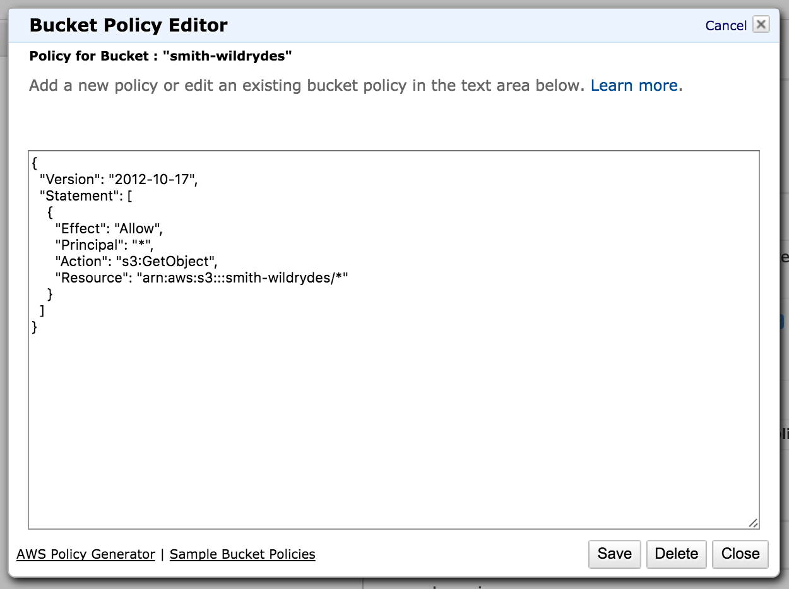
   
1. Click the **Save** button.
1. Expand the **Static Website Hosting** section.
1. Select **Enable website hosting**.
1. Enter **index.html** as the website's **Index Document**. This will redirect requests to the root of your website to the object **index.html**.
1. Note the hostname in **Endpoint**.

   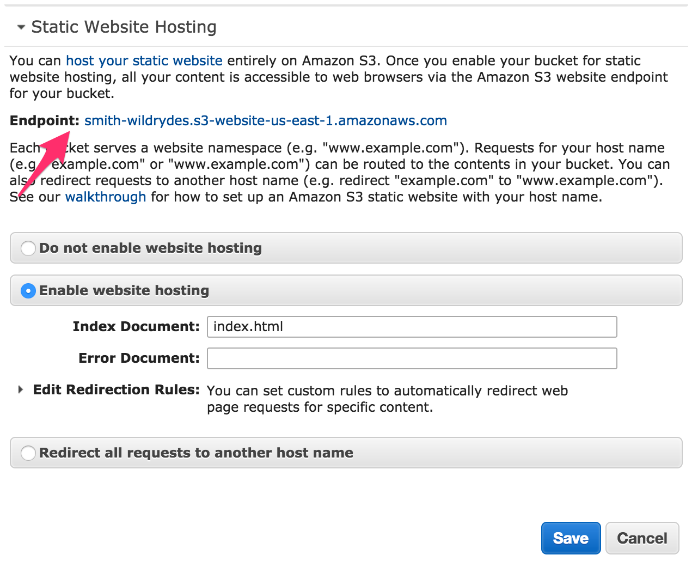

1. Click the **Save** button.
1. Copy the Wild Rydes static website files from `lab1/` to your work directory. The work directory will act as a staging area for  our static site while we build it. We'll be incrementally copying files from each lab-specific directory into it and editing them as we progress through the workshop.

  On Linux and macOS:

  ```console
  cp -R lab1/ work
  ```

  On Windows:

  ```console
  copy /Y lab1 work
  ```

1. Copy the Wild Rydes static website files into your bucket. Replace the **INSERT_BUCKET_NAME_HERE** placeholder with the bucket you created earlier.

   ```console
   aws s3 sync work/ s3://INSERT_BUCKET_NAME_HERE
   ```

1. Browse to the hostname that you noted above in **Step 13** and ensure that the website loads. Verify that the links work.

   

1. In the AWS Management Console, click **Services** in the navigation bar and select **CloudFront**.
1. Click the **Create Distribution** button.
1. To create a web distribution, click the **Get Started** button under the **Web** header.
1. Enter the static hosting endpoint from the Amazon S3 bucket that you noted above in **Step 13** and browsed to in **Step 17** in **Origin Domain Name**. Ensure that you enter in the static website hosting endpoint and do not use the autocompleter as that option will configure traffic to use bucket rather than its website endpoint which cannot serve web pages correctly.

   

1. Select **Customize** from **Object Caching**.
1. Enter **5** as the **Default TTL**. This will cache objects for 5 seconds before checking for file updates with the origin. In production, this value would be set much higher but we're lowering it to 5 for demonstration purposes during the workshop.

   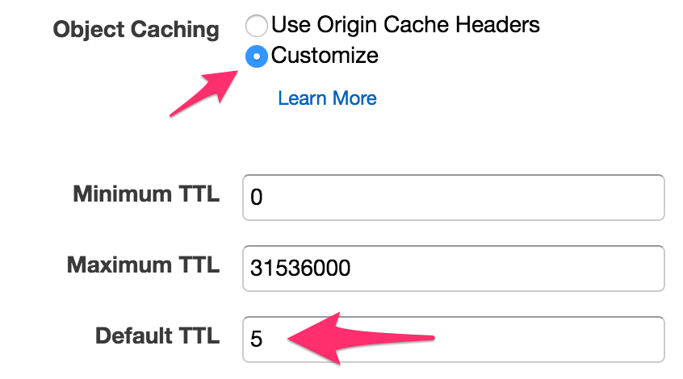

1. Click the **Create Distribution** button.
1. Wait for the **Status** field to change from **In Progress** to **Deployed**. This may take a few minutes to provision so take a break or skip to the first few steps of Lab 2 while this is in progress.

   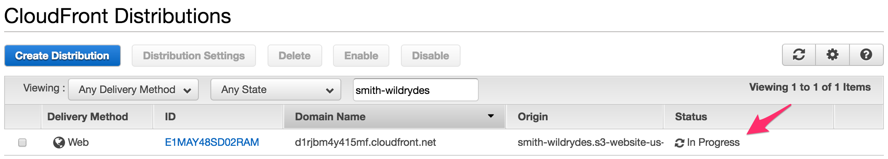

1. Once deployed, test your CloudFront distribution by putting the **Domain Name** of your distribution into a web browser. Click around and verify that the site works as it did in **Step 17**.

   

***LAB 1 COMPLETE***

In this lab you've:

- Created an Amazon S3 bucket
- Configured it for static web site hosting
- Created a Amazon CloudFront distribution to deliver your content around the world

## Lab 2: Beta Sign-up Mailing List

Visitors to your website who are interested in participating in your beta program can enroll by filling out a form to join your beta users mailing list. You'll create an Amazon DynamoDB table to store these email addresses and an Amazon Cognito identity pool and an AWS Identity and Access Management (IAM) policy to allow unauthenticated users to post it. Using DynamoDB Streams, AWS Lambda, and Amazon SES, beta users will receive a confirmation email thanking them for enrolling and providing further details.

1. Select **SES** from the AWS Management Console.
1. Click **Email Addresses** in the left hand navigation menu.
1. Click the **Verify a New Email Address** button.
1. Enter an email address where you can receive email in **Email Address**. By default, Amazon SES operates in sandbox mode which means that you must verify all email addresses used to send and receive email. This is useful for development and demonstration purposes. The email address you enter here must be able to receive emails and we'll also use it as the sender in our workshop.
1. Click the **Verify this Email Address** button.
1. Click the **Close** button.
1. Wait for the verification email from Amazon SES to arrive in the inbox of the email address you provided in **Step 4**.
1. Open the email and click the verification link.

  

  You should see a page with a header **Congratulations!** indicating that you can now send email from this address.

1. Click **Services** in the navigation bar and select **IAM**.
1. Click **Roles** in the left-hand navigation.
1. Click the **Create New Role** button.
1. Enter **LambdaSESRole** for **Role Name**.
1. Click the **Next Step** button.
1. Click the **Select** button next to **AWS Lambda**.

  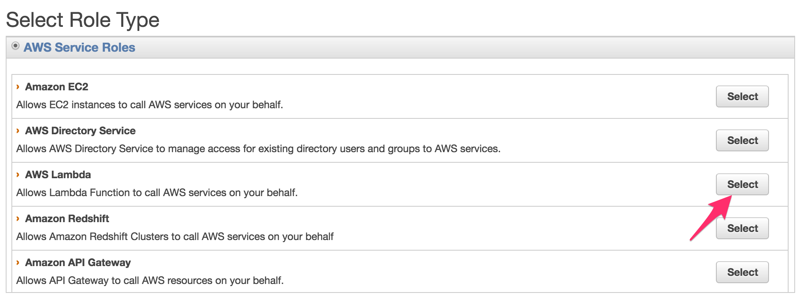

1. Attach the **AmazonSESFullAccess** and **AWSLambdaBasicExecutionRole** managed policies to the role by searching for them in the **Filter** text box and clicking the checkbox. These policies contain the permissions that your AWS Lambda function will have within your account and will allow your function to send email via Amazon SES and to send logs to Amazon CloudWatch Logs. Take a moment to look at the [AmazonSESFullAccess][ses-role] and [AWSLambdaBasicExecutionRole][lambda-role] policies to see what permissions you're granting your Lambda function.
1. Click **Next Step**.
1. Verify the **Trusted Entities** and **Policies** section against the screenshot and click **Create Role**.

  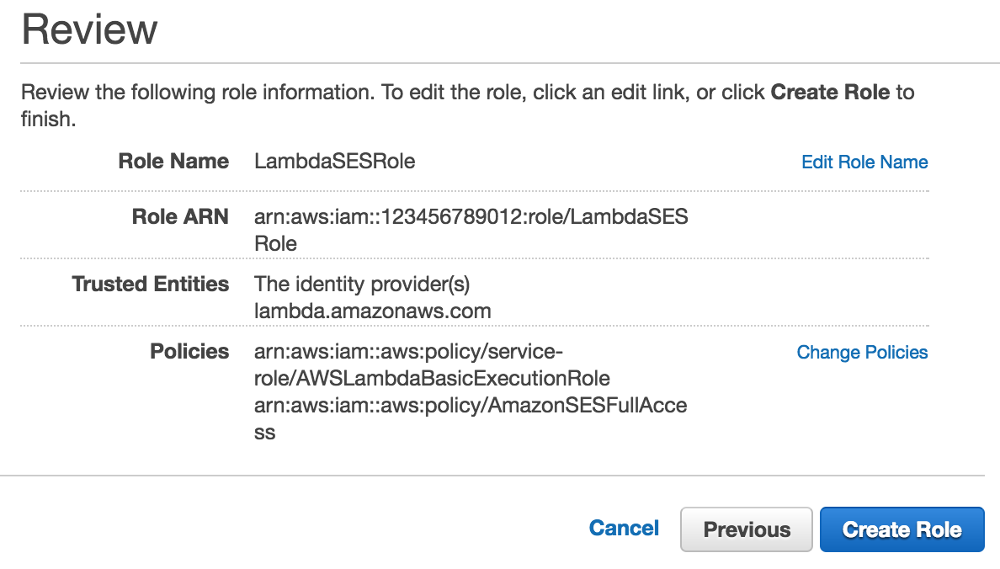

1. Click **Services** in the navigation bar and select **DynamoDB**.
1. Click the **Create table** button.
1. Enter **Wildrydes_Emails** in **Table name**. Ensure you type this exactly as displayed as DynamoDB is case sensitive.
1. Enter **Email** and select **String** in **Primary key**. Ensure you type this exactly as displayed as DynamoDB is case sensitive.
1. Leave **Use default settings** checked.

  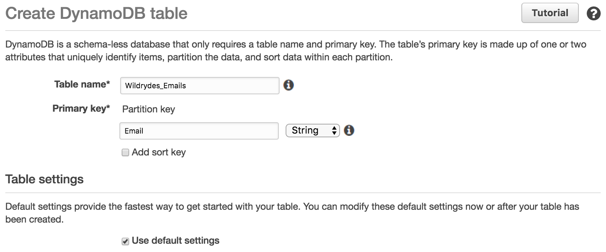

1. Click the **Create** button.
1. Scroll down to the bottom of the **Table Details** section and note the **Amazon Resource Name (ARN)**.

  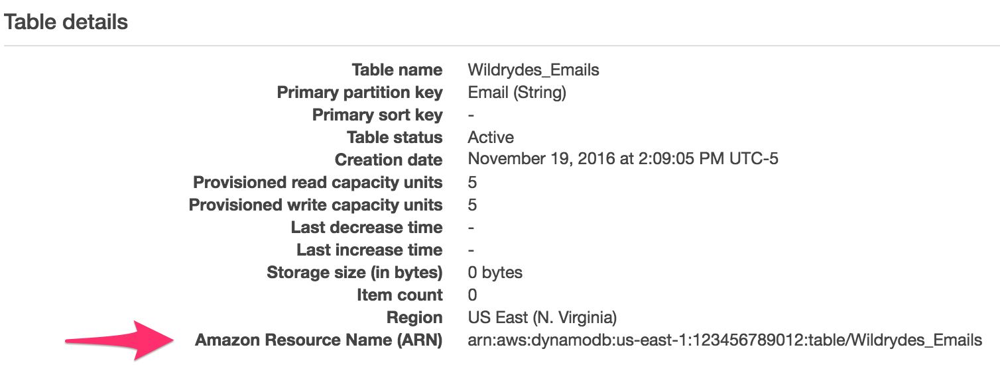

1. Click **Services** in the navigation bar and select **Cognito**.
1. Click the **Manage Federated Identities** button.
1. Click the **Create new identity pool** button.
1. Enter **wildrydes** in **Identity pool name**.
1. Check **Enable access to unauthenticated identities**.

  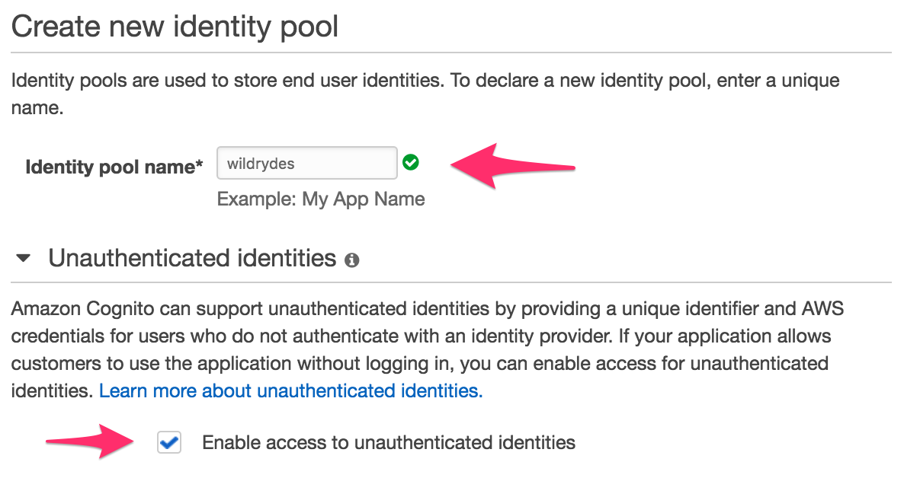

1. Click the **Create Pool** button.
1. This page will allow you to define authenticated and unauthenticated roles associated with your identity pool and the appropriate permissions for each. Expand the **View Details** section. Next, expand the **View Policy Document** section for the **Cognito_wildrydesUnauth_Role** role.
1. Click **Edit** next to the policy document. You'll be asked to ensure you've read the documentation prior to editing. Click **Ok**.
1. Replace the policy document to allow visitors to write to the Amazon DynamoDB table created in **Step 23**. Replace the **INSERT_DYNAMODB_ARN_HERE** placeholder below with the ARN you noted in **Step 24**.

   ```json
	{
	  "Version": "2012-10-17",
	  "Statement": [
	    {
          "Effect": "Allow",
          "Action": "dynamodb:PutItem",
          "Resource": "INSERT_DYNAMODB_ARN_HERE"
        }
	  ]
	}
   ```

1. Click the **Allow** button.
1. Click **Edit identity pool** in the upper right and note the **Identity pool ID**.

  

1. Copy the Wild Rydes static website files from `lab2/` to your work directory.

  On Linux and macOS:

  ```console
  cp -R lab2/ work
  ```

  On Windows:

  ```console
  copy /Y lab2 work
  ```

1. In your work directory, open **scripts/config.js** in your text editor.
1. Enter the Region in which you've created the Cognito Identity Pool in **Step 30** into the **region** attribute. This value will be the first half of the **Identity Pool ID** up to the colon you noted in **Step 35**.

    For example:

    ```javascript
    var Wildrydes = {
      config: {
        region: 'us-east-1',
        identityPoolId: '',
        userPoolId: '',
        userPoolClientId: '',
        apiUrl: '',
      }
    }
    ```

1. Enter the **Identity Pool ID** you noted in **Step 35** into the **identityPoolId** attribute.

    For example:

    ```javascript
    var Wildrydes = {
      config: {
        region: 'us-east-1',
        identityPoolId: 'us-east-1:ffffffff-ffff-ffff-ffff-ffffffffffff',
        userPoolId: '',
        userPoolClientId: '',
        apiUrl: '',
      }
    }
    ```

1. Save the file.
1. Update the contents of the Amazon S3 bucket created in Lab 1 with the new files:

   ```console
   aws s3 sync work/ s3://INSERT_BUCKET_NAME_HERE
   ```
   
1. Navigate to the URL of the Amazon CloudFront distribution created in Lab 1.
1. Scroll down to the **Sign Up** form and enter the email address you verified in **Step 4** into the form and click **Submit**. The form will be replaced with a confirmation message.

  

1. Click **Services** in the navigation bar of the AWS Management Console and select **DynamoDB**.
1. Click **Tables** in the left-hand navigation.
1. Click **Wildrydes_Emails**.
1. Select the **Items** tab and ensure that the email address you submitted has been written to the table.

  

1. Select the **Triggers** tab.
1. Click the **Create trigger** button and select **New function**.
1. Select **Wildrydes_Emails** from **DynamoDB table**. 
1. Enter *1* for **Batch Size**.
1. Select **Trim Horizon** from **Starting position**. This will instruct AWS Lambda to start processing records at the beginning of the stream.
1. Check the **Enable trigger** checkbox.

  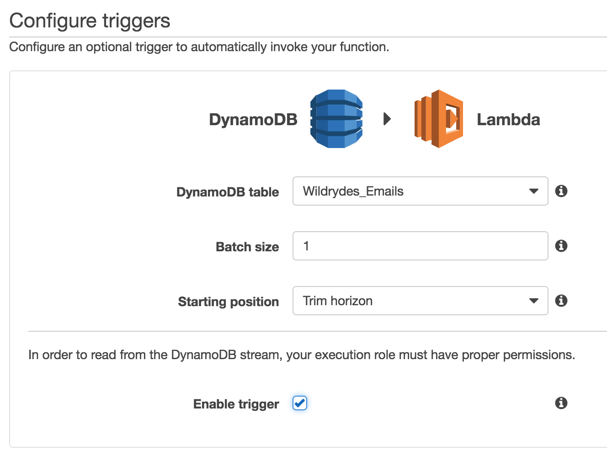

1. Click the **Next** button.
1. Enter **ConfirmationEmail** in **Name**.
1. Select **Node.js 4.3** from **Runtime**.
1. Use the code below for the **Lambda function code**.

	```javascript
	var AWS = require('aws-sdk');
	var ses = new AWS.SES({apiVersion: '2010-12-01'});
	
	exports.handler = (event, context, callback) => {
	  event.Records.forEach((record) => {
	    var params = {
	      Source: process.env.EMAIL_ADDRESS,
	      Destination: {
	        ToAddresses: [record.dynamodb.NewImage.Email.S]
	      },
	      Message: {
	        Body: {
	          Html: {
	            Data: '<html><h1>Thank you!</h1><p>Wild Rydes is coming soon! Stay tuned for more info about unicorns near you!</p></html>'
	          },
	          Text: {
	            Data: 'Wild Rydes is coming soon! Stay tuned for more info about unicorns near you!'
	          }
	        },
	        Subject: {
	          Data: 'Wild Rydes Limited Private Beta Confirmation'
	        }
	      }
	    };
	
	    ses.sendEmail(params, (err, data) => {
	      if (err) context.fail(err);
	      else     context.succeed(null);
	    });
	  });
	};
	```
1. Add an environment variable for the email address from which to send the confirmation email. Enter **EMAIL_ADDRESS** as the **Key** and the email address you defined in Amazon SES in **Step 4** as the **Value**.

  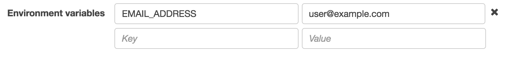

1. Select **Choose an existing role** from **Role**.
1. Select **LambdaSESRole** from **Existing role**.
1. Click the **Next** button.
1. Click the **Create Function** button.
1. Open your web browser and open the landing page of the Wild Rydes marketing site using the CloudFront URL you created in Lab 1.
1. Submit a [sub-address][sub-addressing] of the email address you verified in **Step 4**. For example, if you're using gmail, you can append a plus sign with a random label to your email to write new records to the table that will be delivered to your address. For example, **example+1@gmail.com** will be delivered to **example@gmail.com**.
1. Wait for the function to begin processing records which could take a few moments. Check the triggers tab in your Lambda function and wait for **Last result** to change to **OK**. You can also check the function's logs and metrics in the monitoring tab.

  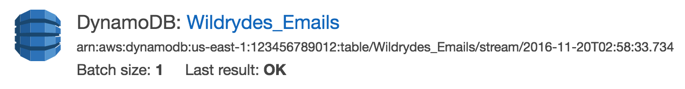

1. Open your email inbox and verify you receive confirmation messages when you fill out and submit the form.

  

***LAB 2 COMPLETE***

In this lab you've:

- Validated an email address within Amazon SES from which marketing emails are delivered.
- Created an Amazon DynamoDB table to capture the email address of visitors to your site.
- Configured an Amazon Cognito identity pool that allows anonymous users to post to an Amazon DynamoDB table.
- Added a trigger to the Amazon DynamoDB table to email users who sign up for your beta program.

## Lab 3: Administrative Interface

Your marketing team needs an administrative interface to manage aspects of the site. In this module, you'll create an Amazon Cognito user pool for your administrator users and start building endpoints in Amazon API Gateway. You'll configure an authorizer to validate the identity of your administrators and wire up a page to view users who have signed up for the beta program.

1. Select **Cognito** from the AWS Management Console.
1. Click the **Manage your User Pools** button.
1. Click the **Create a User Pool** button.
1. Enter **Wildrydes_Admin** in **Pool name**.
1. Click the **Review Defaults** link.
1. Click the pen icon in the box that contains the **Required attributes** attribute.
1. Deselect **email**.
1. Click the **Save changes** button.
1. Click the pen icon in the box that contains the **User sign ups allowed?** attribute.
1. Select **Only allow administrators to create users** from **Do you want to allow users to sign themselves up?**
1. Click the **Save changes** button.
1. Click the pen icon in the box that contains the **Verifications** attribute.
1. Deselect **Email** from **Do you want to require verification of emails or phone numbers?**
1. Click the **Save changes** button.
1. Click the **Add client...** link in the box that contains **Apps**.
1. Click the **Add an app** link.
1. Enter **web** as the **App name**.
1. Deselect **Generate client secret**.
1. Click the **Create app** button.
1. Click the **Save changes** button.
1. Click the **Create pool** button.	
1. Note the **Pool Id** in the **Pool details** section.

  

1. Click **Apps** on the left hand navigation menu.
1. Note the **App client id**.

  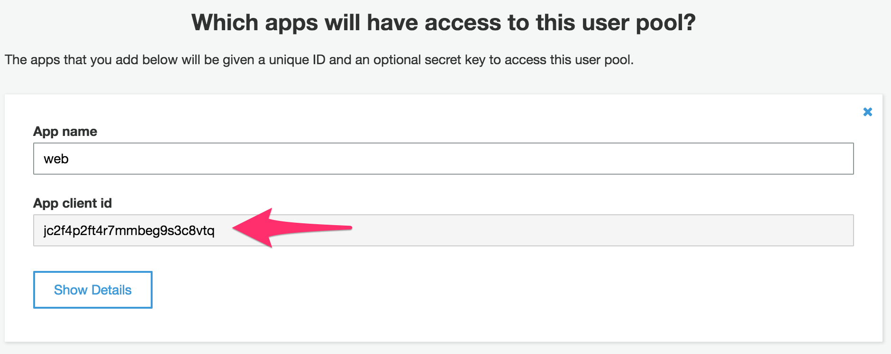

1. Click **Users** on the left-hand navigation.
1. Click the **Create user** button.
1. Enter your email address in **Username (required)**.
1. Enter a password into **Temporary password**. Create and note a password that meets the default password policy requirements of at least eight characters containing at least one upper case letter, number, and symbol.
1. Deselect **Send an invitation to this new user?**, **Mark phone number as verified?**, **Mark email as verified?**.

  

1. Click the **Create user** button.
1. Click the AWS logo in the navigation bar and click on **IAM**.
1. Click **Roles** in the left-hand navigation.
1. Click the **Create New Role** button.
1. Enter **LambdaDynamoDBRole** for **Role Name**.
1. Click the **Next Step** button.
1. Click the **Select** button next to **AWS Lambda**.
1. Attach the **AmazonDynamoDBFullAccess** and **AWSLambdaBasicExecutionRole** managed policies to the role by searching for them in the **Filter** text box and clicking the checkbox.
1. Click **Next Step**.
1. Click **Create Role**.
1. Click **Services** in the navigation bar and select **Lambda**.
1. Click the **Create a Lambda function** button.
1. Click **Blank Function** to start with an empty blueprint.
1. Skip configuring triggers by clicking on the **Next** button.
1. Enter **GetAllEmails** as the **Name** of the Lambda function.
1. Select **Node.js 4.3** as **Runtime**.
1. Use the code below for the **Lambda function code**.

   ```javascript
   var aws = require('aws-sdk');
   var dynamodb = new aws.DynamoDB({});

   exports.handler = (event, context, callback) => {
     var params = {
       TableName: "Wildrydes_Emails"
     };

     dynamodb.scan(params, function(err, data) {
       if (!err) {
         var emails = [];
         data.Items.forEach((item) => emails.push(item.Email.S));

         context.succeed({
           statusCode: '200',
           headers: { 'Access-Control-Allow-Origin': '*'},
           body: JSON.stringify({ Emails: emails })
         });
       } else {
         context.fail(err);
       }
     });  
   };
   ```

1. Select **Choose an existing role** from **Role**.
1. Select **LambdaDynamoDBRole** from **Existing role**.

  

1. Click the **Next** button.
1. Click the **Create Function** button.
1. Click **Services** in the navigation bar and select **API Gateway**.
1. Click the **Get Started** button to create a new API.
1. Select **New API**.
1. Enter **Wildrydes** as the **API name**.
1. Click the **Create API** button. This will default to an example API. Click on the **OK** button to dismiss the modal.
1. Click the **Authorizers** link in the left hand navigation menu.
1. Click the **Create** button with the drop-down list and click **Cognito User Pool Authorizer**.
1. Select the Region you're using from **Cognito Region**.
1. Select **Wildrydes_Admin** from the **Cognito user pool** drop-down list.
1. Leave **Wildrydes_Admin** in **Authorizer name**.
1. Leave **method.request.header.Authorization** in **Identity token source**.

  

1. Click the **Create** button.
1. Click the **Resources** link in the left-hand navigation.
1. Click on the **Actions** button.
1. Click on the **Create Resource** link.
1. Enter **emails** as **Resource Name**.
1. Select **Enable API Gateway CORS**.
1. Click the **Create Resource** button.
1. Click the **Actions** button.
1. Click the **Create Method** link.
1. Select **GET** from the drop down and click the check mark.
1. Check **Use Lambda Proxy integration**.
1. Select the Region you're using from **Lambda Region**.
1. Enter **GetAllEmails** as **Lambda Function**.

  

1. Click the **Save** button. You will be prompted to give permission to API Gateway to invoke your Lambda function. Click the **OK** button.
1. Click **Method Request**.
1. Click the pen icon in **Authorization**.
1. Select **Wildrydes_Admin** under **Cognito user pool authorizers** and click the check mark.
1. Click the **Actions** button.
1. Click **Deploy API** link.
1. Select **[New Stage]** from **Deployment stage**.
1. Enter *prod* as the **Stage name**.
1. Click on the **Deploy button**.
1. Note the **Invoke URL** of your new API.

  

1. Copy the Wild Rydes static website files from `lab3/` into your work directory.

  On Linux and macOS:

  ```console
  cp -R lab3/ work
  ```

  On Windows:

  ```console
  copy /Y lab3 work
  ```

1. In your work directory, open **scripts/config.js** in your text editor.
1. Enter the **User Pool ID** from the user pool you noted in **Step 22** as the **userPoolId** attribute.

    For example:

    ```javascript
    var Wildrydes = {
      config: {
        region: 'us-east-1',
        identityPoolId: 'us-east-1:ffffffff-ffff-ffff-ffff-ffffffffffff',
        userPoolId: 'us-east-1_0Vt8rntSI',
        userPoolClientId: '',
        apiUrl: '',
      }
    }
    ```

1. Enter the **Client ID** from the **web** app you added to the user pool you noted in **Step 24** as the **userPoolClientId** attribute.

    For example:

    ```javascript
    var Wildrydes = {
      config: {
        region: 'us-east-1',
        identityPoolId: 'us-east-1:ffffffff-ffff-ffff-ffff-ffffffffffff',
        userPoolId: 'us-east-1_0Vt8rntSI',
        userPoolClientId: 'jc2f4p2ft4r7mmbeg9s3c8vtq',
        apiUrl: '',
      }
    }
    ```

1. Enter the **Invoke URL** from the API you noted in **Step 84** as the **apiUrl** attribute.

    For example:

    ```javascript
    var Wildrydes = {
      config: {
        region: 'us-east-1',
        identityPoolId: 'us-east-1:ffffffff-ffff-ffff-ffff-ffffffffffff',
        userPoolId: 'us-east-1_0Vt8rntSI',
        userPoolClientId: 'jc2f4p2ft4r7mmbeg9s3c8vtq',
        apiUrl: 'https://aaaaaaaaaaaa.execute-api.us-east-1.amazonaws.com/prod',
      }
    }
    ```

1. Update the contents of the Amazon S3 bucket created in Lab 1 with the new files:

   ```console
   aws s3 sync work/ s3://INSERT_BUCKET_NAME_HERE
   ```

1. Open your web browser and open the admin page of the Wild Rydes marketing site using the CloudFront URL you created in Lab 1 and append **/admin** to it.

    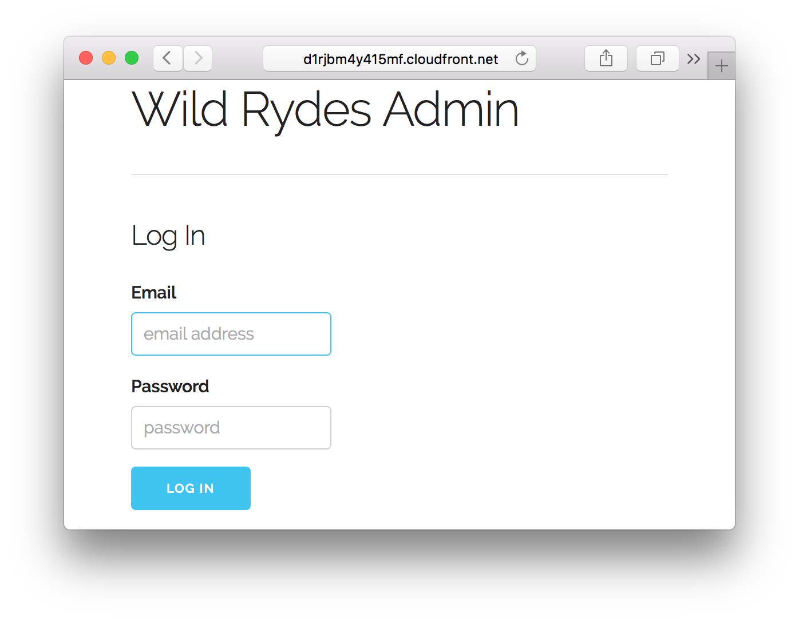

1. Log into the admin site using the credentials you created in **Step 30**.
1. Click on the **View Emails** link.
1. Verify that you see a full list of emails that have been submitted to the site. Submit other email addresses and reload this page to ensure they are also returned.

***LAB 3 COMPLETE***

In this lab you've:

- Created an Amazon Cognito user pool to manage identities for your administrator users.
- Created an Amazon DynamoDB function to return email addresses through a Amazon API Gateway proxy to an AWS Lambda method.
- Added an API for our site and added an emails resource with a GET method only accessible to authenticated administrator users.

## Lab 4: Product Update Blog

To keep your visitors up to date on your progress building your product, your marketing team would like to publish a blog of product updates. Using your new administrative interface, you'll add an interface to publish posts to the product update blog using API Gateway and Lambda which will appear on your landing page.

1. Select **DynamoDB** from the AWS Management Console.
1. Click the **Create table** button.
1. Enter **Wildrydes_Posts** in **Table name**. Ensure that you type this exactly as displayed because Amazon DynamoDB is case sensitive.
1. Enter **Blog** and select **String** in **Primary key**. Ensure that you type this exactly as displayed because Amazon DynamoDB is case sensitive.
1. Check **Add sort key**.
1. Enter **Timestamp** and select **Number** in the **Sort key** field that appears under the check box. Ensure that you type this exactly as displayed because Amazon DynamoDB is case sensitive.
1. Leave **Use default settings** checked.

   

1. Click the **Create** button.
1. Click **Services** in the navigation bar and select **Lambda**.
1. Click the **Create a Lambda function** button.
1. Select the **Blank Function** blueprint.
1. Skip configuring triggers by clicking the **Next** button.
1. Enter **CreatePost** as the **Name** of the Lambda function.
1. Select **Node.js 4.3** as **Runtime**.
1. Use the code below for the **Lambda function code**.

   ```javascript
   var aws = require('aws-sdk');
   var dynamodb = new aws.DynamoDB({});

   exports.handler = (event, context, callback) => {
     var body = JSON.parse(event.body);
     var params = {
       TableName: 'Wildrydes_Posts',
       Item: {
		 Blog: { S: 'product-updates' },
		 Timestamp: { N: body.Timestamp },
		 Title: { S: body.Title },
	     Body: { S: body.Body }
       }
     };

     dynamodb.putItem(params, (err, data) => {
       if (!err) {
		  context.succeed({
           statusCode: '200',
           headers: { 'Access-Control-Allow-Origin': '*'},
           body: JSON.stringify({})
		  });
       } else {
		  context.fail(err);
       }
     });
   };
   ```

1. Select **Choose an existing role** from **Role**.
1. Select **LambdaDynamoDBRole** from **Existing role**.
1. Click the **Next** button.
1. Click the **Create Function** button.
1. Click **Dashboard** in the left-hand navigation and click the **Create a Lambda Function** button.
1. Select the **Blank Function** blueprint.
1. Skip configuring triggers by clicking on the **Next** button.
1. Enter **GetAllPosts** as the **Name** of the Lambda function.
1. Select **Node.js 4.3** as **Runtime**.
1. Use the code below for the **Lambda function code**.

   ```javascript
   var aws = require('aws-sdk');
   var dynamodb = new aws.DynamoDB({});

   exports.handler = (event, context, callback) => {
     var params = {
       TableName: 'Wildrydes_Posts',
       ScanIndexForward: false,
       KeyConditions: {
			Blog: {
				ComparisonOperator: 'EQ',
				AttributeValueList: [ { S: 'product-updates' } ],
			}
       }
     };

     dynamodb.query(params,(err, data) => {
       if (!err) {
         var posts = [];
         
         data.Items.forEach((item) => {
           posts.push({
             Timestamp: item.Timestamp.N,
             Title: item.Title.S,
             Body: item.Body.S
           })             
         });
         
         context.succeed({
           statusCode: '200',
           headers: { 'Access-Control-Allow-Origin': '*'},
           body: JSON.stringify({ Posts: posts })
         });
       } else {
	     context.fail(err);
       }
     });  
   };
   ```

1. Select **Choose an existing role** from **Role**.
1. Select **LambdaDynamoDBRole** from **Existing role**.
1. Click the **Next** button.
1. Click the **Create Function** button.
1. Click **Services** in the navigation bar and select **API Gateway**.
1. Click the **Wildrydes** API.
1. Click the **Actions** button.
1. Click the **Create Resource** link.
1. Enter **posts** as **Resource Name**.
1. Select **Enable API Gateway CORS**.

   

1. Click the **Create Resource** button.
1. Click the **Actions** button.
1. Click the **Create Method** link.
1. Select **POST** from the drop-down list and click the check mark.
1. Check **Use Lambda Proxy integration**.
1. Select the Region you're using from **Lambda Region**.
1. Enter **CreatePost** as **Lambda Function**.

  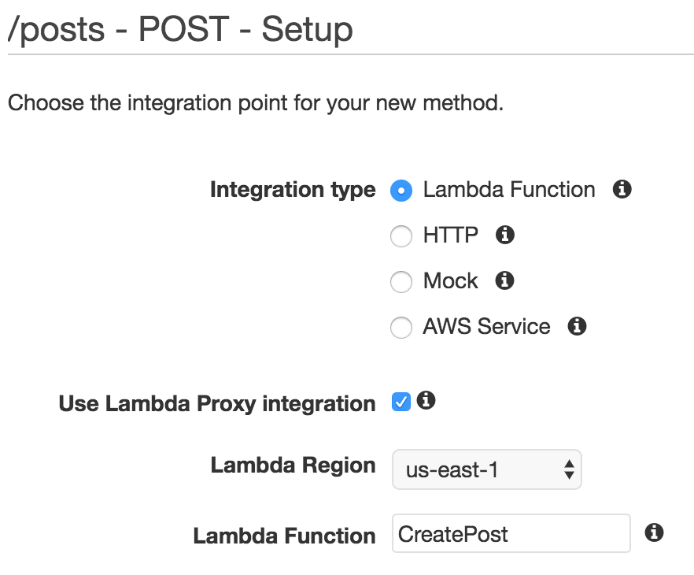

1. Click the **Save** button. You will be prompted to give permission to API Gateway to invoke your Lambda function. Click the **OK** button.
1. Click **Method Request**.
1. Click the pen icon in **Authorization**.
1. Select **Wildrydes_Admin** under **Cognito user pool authorizers** and click the check mark.

  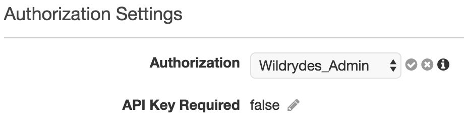

1. Click the **Actions** button.
1. Click the **Create Method** link.
1. Select **GET** from the drop-down list and click the check mark.
1. Check **Use Lambda Proxy integration**.
1. Select the Region you're using from **Lambda Region**.
1. Enter **GetAllPosts** as **Lambda Function**.
1. Click the **Save** button. You will be prompted to give permission to API Gateway to invoke your Lambda function. Click the **OK** button.
1. Click the **Actions** button.
1. Click **Deploy API** link.
1. Select *prod* from the **Deployment stage** drop-down list.
1. Click the **Deploy button**.
1. Copy the Wild Rydes static website files from `lab4/` into your work directory.

  On Linux and macOS:

  ```console
  cp -R lab4/ work
  ```

  On Windows:

  ```console
  copy /Y lab4 work
  ```

1. Update the contents of the Amazon S3 bucket created in Lab 1 with the new files:

   ```console
   aws s3 sync work/ s3://INSERT_BUCKET_NAME_HERE
   ```

1. Go to the admin section of the web site, log in if prompted, and click **New Post**.
1. Add a new post by filling out **Title** and **Body** and click **Post**.

  

1. Verify that you're redirected to the blog page and that you see the post you just created.

  


***LAB 4 COMPLETE***

In this lab you've:

- Created an Amazon DynamoDB table for blog posts.
- Added pages and endpoints in Amazon API Gateway to show blog posts to visitors and to allow administrator users to create blog posts.

[wildrydes]: http://www.wildrydes.com
[free-tier]: https://aws.amazon.com/free/
[region-table]: https://aws.amazon.com/about-aws/global-infrastructure/regional-product-services/
[us-east-1]: https://console.aws.amazon.com/console/home?region=us-east-1
[us-west-2]: https://console.aws.amazon.com/console/home?region=us-west-2
[eu-west-1]: https://console.aws.amazon.com/console/home?region=eu-west-1
[cli-documentation]: http://docs.aws.amazon.com/cli/latest/userguide/cli-chap-getting-started.html
[cli]: https://aws.amazon.com/cli/
[chrome]: https://www.google.com/chrome/
[git]: https://git-scm.com/
[developer-console]: https://developers.google.com/web/tools/chrome-devtools/console/
[ses-role]: https://console.aws.amazon.com/iam/home?region=us-east-1#/policies/arn:aws:iam::aws:policy/AmazonSESFullAccess
[lambda-role]: https://console.aws.amazon.com/iam/home?region=us-east-1#/policies/arn:aws:iam::aws:policy/service-role/AWSLambdaBasicExecutionRole
[sub-addressing]: https://en.wikipedia.org/wiki/Email_address#Sub-addressing
