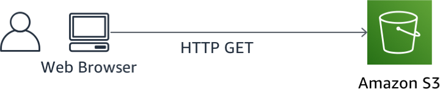
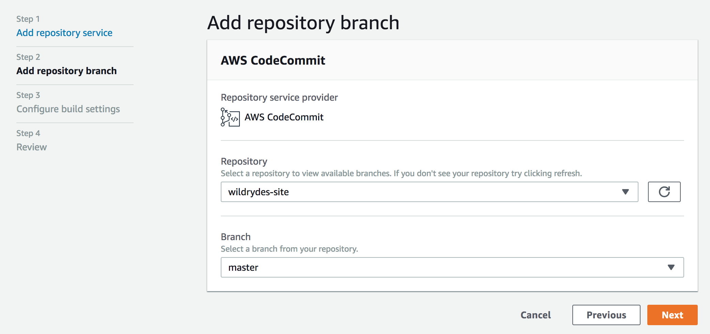
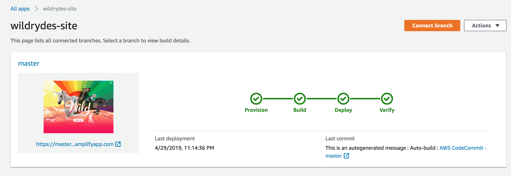
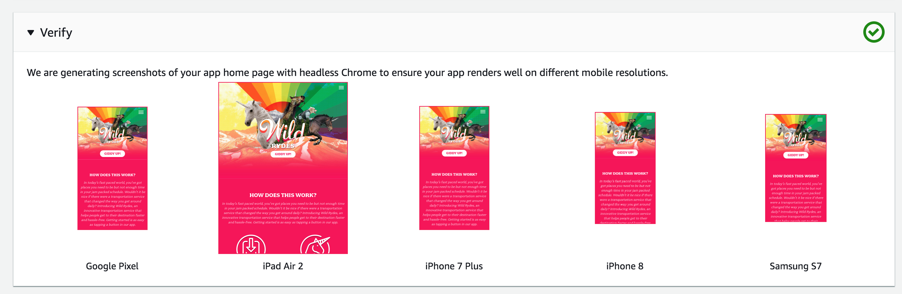
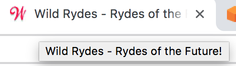

# Module 1: Static Web Hosting with AWS Amplify Console

In this module you'll configure AWS Amplify Console to host the static resources for your web application. In subsequent modules you'll add dynamic functionality to these pages using JavaScript to call remote RESTful APIs built with AWS Lambda and Amazon API Gateway.

## Architecture Overview

The architecture for this module is very straightforward. All of your static web content including HTML, CSS, JavaScript, images and other files will be managed by AWS Amplify Console and served via Amazon CloudFront. Your end users will then access your site using the public website URL exposed by AWS Amplify Console. You don't need to run any web servers or use other services in order to make your site available.



## Implementation Instructions

:heavy_exclamation_mark: Ensure you've completed the [setup guide][setup] before beginning
the workshop.

Each of the following sections provides an implementation overview and detailed, step-by-step instructions. The overview should provide enough context for you to complete the implementation if you're already familiar with the AWS Management Console or you want to explore the services yourself without following a walkthrough.

### Region Selection

This workshop step can be deployed in any AWS region that supports the following services:

- AWS Amplify Console
- AWS CodeCommit

You can refer to the [AWS region table][region-services] in the AWS documentation to see which regions have the supported services. Among the supported regions you can choose are:
* North America: N. Virginia, Ohio, Oregon
* Europe: Ireland, London, Frankfurt
* Asia Pacific: Tokyo, Seoul, Singapore, Sydney, Mumbai

Once you've chosen a region, you should deploy all of the resources for this workshop there. Make sure you select your region from the dropdown in the upper right corner of the AWS Console before getting started.


### Create the git repository
You have two options to manage the source code for this module:

* [AWS CodeCommit][commit] - CodeCommit access is included in the [AWS Free Tier][codecommit-free].
* [GitHub.com][github] - If you're more comfortable with GitHub.com and already have an account.

#### Option 1: Using AWS CodeCommit
**:white_check_mark: Step-by-step directions**

The AWS Cloud9 development environment comes with AWS managed temporary credentials that are associated with your IAM user. You use these credentials with the AWS CLI credential helper. Enable the credential helper by running the following two commands in the terminal of your Cloud9 environment.

```bash
git config --global credential.helper '!aws codecommit credential-helper $@'
git config --global credential.UseHttpPath true
```

Next you need to create the repository and clone it to your Cloud9 environment:
1. Open the [AWS CodeCommit console][codecommit-console]
1. Select **Create Repository**
1. Set the *Repository name** to "wildrydes-site"
1. Select **Create**
1. From the *Clone URL* drop down, select *Clone HTTPS*

Now from your Cloud9 development environment:
1. From a terminal window run `git clone` and the HTTPS URL of the respository:
    ```
    ec2-user:~/environment $ git clone https://git-codecommit.us-east-1.amazonaws.com/v1/repos/wildrydes-site
    Cloning into 'wildrydes-site'...
    warning: You appear to have cloned an empty repository.
    ec2-user:~/environment $ 
    ```
#### Option 2: Using GitHub.com 
**:white_check_mark: Step-by-step directions**

1. Follow the instructions on [GitHub][github] to [Create a repository][create-repo]. NOTE: You should not create a first commit, just create the repository.
1. Clone the repository locally using your GitHub credentials
    1. If you do not have credentially locally, or want to use Cloud9 for today's lab, follow these steps to [Generating a new SSH key and adding it to the ssh-agent][github-new-sshkey]
    1. [Clone the repository][github-clone]

#### Populate the git repository
Once you've used either AWS CodeCommit or GitHub.com to create your git repository and clone it locally, you'll need to copy the web site content from an existing publicly accessible S3 bucket associated with this workshop and add the content to your repository.

**:white_check_mark: Step-by-step directions**
From your Cloud9 development environment(or local environment)
1. Change directory into your repository:
    ```
    cd wildrydes-site/
    ```
1. Copy the files from S3:
    ```
    aws s3 cp s3://wildrydes-us-east-1/WebApplication/1_StaticWebHosting/website ./ --recursive
    ```
1. Commit the files to your git service (you might need to enter an email and user name for the commit):
    ```
    $ git add .
    $ git config --global user.email "<EMAIL ADDRESS>"
    $ git config --global user.name "<USER NAME>"
    $ git commit -m "initial checkin of website code"
    $ git push
    
    Username for 'https://git-codecommit.us-east-1.amazonaws.com': wildrydes-codecommit-at-xxxxxxxxx
    Password for 'https://wildrydes-codecommit-at-xxxxxxxxx@git-codecommit.us-east-1.amazonaws.com': 
    Counting objects: 95, done.
    Compressing objects: 100% (94/94), done.
    Writing objects: 100% (95/95), 9.44 MiB | 14.87 MiB/s, done.
    Total 95 (delta 2), reused 0 (delta 0)
    To https://git-codecommit.us-east-1.amazonaws.com/v1/repos/wildrydes-site
     * [new branch]      master -> master
    ```

### Deploy the site with the AWS Amplify Console
Next you'll use the [AWS Amplify Console][amplify-console] to deploy the website you've just commited to git. The Amplify Console takes care of the work of setting up a place to store your static web application code and provides a number of helpful capabilities to simplify both the lifecycle of that application as well as enable best practices.

**:white_check_mark: Step-by-step directions**
1. Launch the [Amplify Console console page][amplify-console-console]
1. Click **Get Started** under Deploy with Amplify Console
1. Select the *Repository service provider* used today and select **Next**
    1. If you used GitHub, you'll need to authorize AWS Amplify to your GitHub account
1. From the dropdown select the *Repository* and *Branch* created today
    
    
1. On the "Configure build settings" page leave all the defaults and select **Next**
1. On the "Review" page select **Save and deploy**
    
    The process takes a couple of minutes for Amplify Console to create the neccesary resources and to deploy your code.
    
    

Once completed, click on the site image to launch your Wild Rydes site.


If you click on the link for *Master* you'll see various pieces of information about your website deployment, including sample renderings on various platforms:



### Modify the website
The AWS Amplify Console will rebuild and redeploy the app when it detects changes to the connected repository. Make a change to the main page to test out this process.

**:white_check_mark: Step-by-step directions**
1. From your Cloud9 environment open the ```index.html``` file in the root directory of the repository.
1. Modify the title line:
    ```
      <title>Wild Rydes</title>
    ```
    So that it says:
    ```
      <title>Wild Rydes - Rydes of the Future!</title>
    ```
    Save the file
1. Commit again to your git repository the changes:
    ```
    $ git add index.html 
    $ git commit -m "updated title"
    [master dfec2e5] updated title
     1 file changed, 1 insertion(+), 1 deletion(-)
    
    $ git push
    Counting objects: 3, done.
    Compressing objects: 100% (3/3), done.
    Writing objects: 100% (3/3), 315 bytes | 315.00 KiB/s, done.
    Total 3 (delta 2), reused 0 (delta 0)
    remote: processing 
    To https://git-codecommit.us-east-1.amazonaws.com/v1/repos/wildrydes-site
       2e9f540..dfec2e5  master -> master
   ```
    Amplify Console will begin to build the site again soon after it notices the update to the repository. It will happen pretty quickly! Head back to the [Amplify Console console page][amplify-console-console] to watch the process. 

1. Once completed, re-open the Wild Rydes site and notice the title change.
    
    

### :star: Recap

:key: AWS Amplify Console makes it really easy to deploy static websites following a continuous integration and delivery model. It has capabilities for "building" more complicated javascript framework based applications and can show you a preview of your application as it would rendor on popular mobile platforms.

:wrench: In this module, you've created static website which will be the base for our Wild Rydes business.

### Next

:white_check_mark: Proceed to the next module, [User Management][user-management], 
wherein you'll configure Amazon Cognito User Pools to manage the users for our application.

[setup]: ../0_Setup/
[commit]: https://aws.amazon.com/codecommit
[github]: https://github.com
[iam-console]: https://console.aws.amazon.com/iam/home
[codecommit-free]: https://aws.amazon.com/codecommit/pricing/
[codecommit-console]: https://console.aws.amazon.com/codesuite/codecommit/repositories
[create-repo]: https://help.github.com/en/articles/create-a-repo
[github-new-sshkey]: https://help.github.com/en/articles/generating-a-new-ssh-key-and-adding-it-to-the-ssh-agent
[github-clone]: https://help.github.com/en/articles/cloning-a-repository
[amplify-console]: https://aws.amazon.com/amplify/console/
[amplify-console-console]: https://console.aws.amazon.com/amplify/home
[user-management]: ../2_UserManagement/
[region-services]: https://aws.amazon.com/about-aws/global-infrastructure/regional-product-services/
