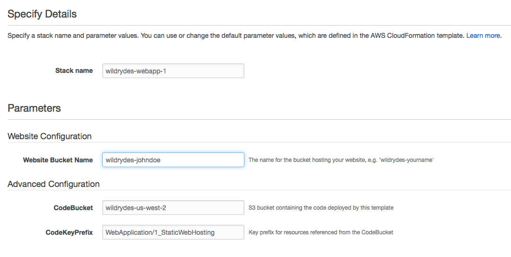
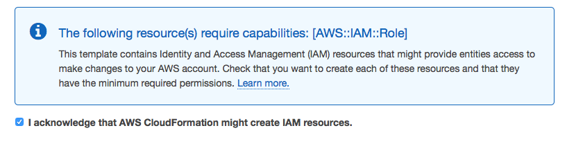
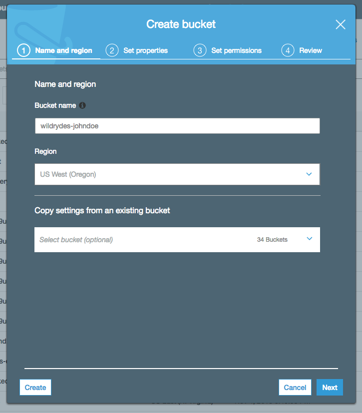
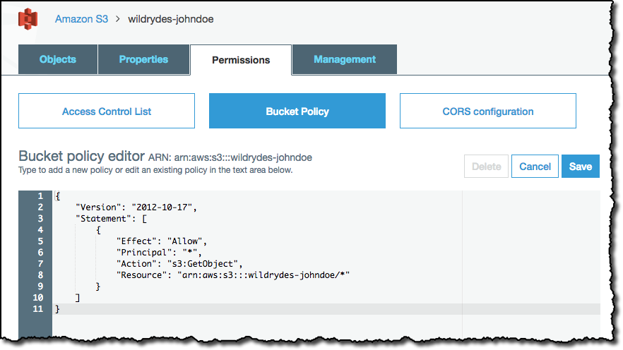
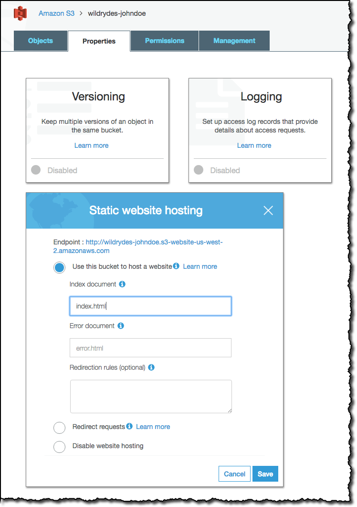

# Module 1: Static Web Hosting with Amazon S3

In this module you'll configure Amazon Simple Storage Service (S3) to host the static resources for your web application. In subsequent modules you'll add dynamic functionality to these pages using JavaScript to call remote RESTful APIs built with AWS Lambda and Amazon API Gateway.

If you're already comfortable working with Amazon S3, or you just want to skip ahead to working with Lambda and API Gateway, you can launch one of these AWS CloudFormation templates in the Region of your choice to build the necessary resources automatically.

Region| Launch
------|-----
US East (N. Virginia) | [](https://console.aws.amazon.com/cloudformation/home?region=us-east-1#/stacks/new?stackName=wildrydes-webapp-1&templateURL=https://s3.amazonaws.com/wildrydes-us-east-1/WebApplication/1_StaticWebHosting/webapp-static-hosting.yaml)
US East (Ohio) | [](https://console.aws.amazon.com/cloudformation/home?region=us-east-2#/stacks/new?stackName=wildrydes-webapp-1&templateURL=https://s3.amazonaws.com/wildrydes-us-east-2/WebApplication/1_StaticWebHosting/webapp-static-hosting.yaml)
US West (Oregon) | [](https://console.aws.amazon.com/cloudformation/home?region=us-west-2#/stacks/new?stackName=wildrydes-webapp-1&templateURL=https://s3.amazonaws.com/wildrydes-us-west-2/WebApplication/1_StaticWebHosting/webapp-static-hosting.yaml)
EU (Frankfurt) | [](https://console.aws.amazon.com/cloudformation/home?region=eu-central-1#/stacks/new?stackName=wildrydes-webapp-1&templateURL=https://s3.amazonaws.com/wildrydes-eu-central-1/WebApplication/1_StaticWebHosting/webapp-static-hosting.yaml)
EU (Ireland) | [](https://console.aws.amazon.com/cloudformation/home?region=eu-west-1#/stacks/new?stackName=wildrydes-webapp-1&templateURL=https://s3.amazonaws.com/wildrydes-eu-west-1/WebApplication/1_StaticWebHosting/webapp-static-hosting.yaml)
EU (London) | [](https://console.aws.amazon.com/cloudformation/home?region=eu-west-2#/stacks/new?stackName=wildrydes-webapp-1&templateURL=https://s3.amazonaws.com/wildrydes-eu-west-2/WebApplication/1_StaticWebHosting/webapp-static-hosting.yaml)
Asia Pacific (Tokyo) | [](https://console.aws.amazon.com/cloudformation/home?region=ap-northeast-1#/stacks/new?stackName=wildrydes-webapp-1&templateURL=https://s3.amazonaws.com/wildrydes-ap-northeast-1/WebApplication/1_StaticWebHosting/webapp-static-hosting.yaml)
Asia Pacific (Seoul) | [](https://console.aws.amazon.com/cloudformation/home?region=ap-northeast-2#/stacks/new?stackName=wildrydes-webapp-1&templateURL=https://s3.amazonaws.com/wildrydes-ap-northeast-2/WebApplication/1_StaticWebHosting/webapp-static-hosting.yaml)
Asia Pacific (Sydney) | [](https://console.aws.amazon.com/cloudformation/home?region=ap-southeast-2#/stacks/new?stackName=wildrydes-webapp-1&templateURL=https://s3.amazonaws.com/wildrydes-ap-southeast-2/WebApplication/1_StaticWebHosting/webapp-static-hosting.yaml)
Asia Pacific (Mumbai) | [](https://console.aws.amazon.com/cloudformation/home?region=ap-south-1#/stacks/new?stackName=wildrydes-webapp-1&templateURL=https://s3.amazonaws.com/wildrydes-ap-south-1/WebApplication/1_StaticWebHosting/webapp-static-hosting.yaml)


<details>
<summary><strong>CloudFormation Launch Instructions (expand for details)</strong></summary><p>

1. Click the **Launch Stack** link above for the region of your choice.

1. Click **Next** on the Select Template page.

1. Provide a globally unique name for the **Website Bucket Name** such as `wildrydes-yourname` and click **Next**.
    

1. On the Options page, leave all the defaults and click **Next**.

1. On the Review page, check the box to acknowledge that CloudFormation will create IAM resources and click **Create**.
    

    This template uses a custom resource to copy the static website assets from a central S3 bucket into your own dedicated bucket. In order for the custom resource to write to the new bucket in your account, it must create an IAM role it can assume with those permissions.

1. Wait for the `wildrydes-webapp-1` stack to reach a status of `CREATE_COMPLETE`.

1. With the `wildrydes-webapp-1` stack selected, click on the **Outputs** tab and click on the WebsiteURL link.

1. Verify the Wild Rydes home page is loading properly and move on to the next module, [User Management](../2_UserManagement).

</p></details>


## Architecture Overview

The architecture for this module is very straightforward. All of your static web content including HTML, CSS, JavaScript, images and other files will be stored in Amazon S3. Your end users will then access your site using the public website URL exposed by Amazon S3. You don't need to run any web servers or use other services in order to make your site available.


For the purposes of this module you'll use the Amazon S3 website endpoint URL that we supply. It takes the form `http://{your-bucket-name}.s3-website-{region}.amazonaws.com` or `bucket-name.s3-website.region.amazonaws.com` depending on the region you use. For most real applications you'll want to use a custom domain to host your site. If you're interested in using a your own domain, follow the instructions for [setting up a static website using a custom domain](http://docs.aws.amazon.com/AmazonS3/latest/dev/website-hosting-custom-domain-walkthrough.html) in the Amazon S3 documentation.

## Implementation Instructions

Each of the following sections provides an implementation overview and detailed, step-by-step instructions. The overview should provide enough context for you to complete the implementation if you're already familiar with the AWS Management Console or you want to explore the services yourself without following a walkthrough.

If you're using the latest version of the Chrome, Firefox, or Safari web browsers the step-by-step instructions won't be visible until you expand the section.

### Region Selection

This workshop can be deployed in any AWS region that supports the following services:

- Amazon Cognito
- AWS Lambda
- Amazon API Gateway
- Amazon S3
- Amazon DynamoDB

You can refer to the [region table](https://aws.amazon.com/about-aws/global-infrastructure/regional-product-services/) in the AWS documentation to see which regions have the supported services. Among the supported regions you can choose are N. Virginia, Ohio, Oregon, Ireland, London, Frankfurt, Tokyo, Seol, Mumbai, and Sydney.

Once you've chosen a region, you should deploy all of the resources for this workshop there. Make sure you select your region from the dropdown in the upper right corner of the AWS Console before getting started.


### 1. Create an S3 Bucket

Amazon S3 can be used to host static websites without having to configure or manage any web servers. In this step you'll create a new S3 bucket that will be used to host all of the static assets (e.g. HTML, CSS, JavaScript, and image files) for your web application.

#### High-Level Instructions

Use the console or AWS CLI to create an Amazon S3 bucket. Keep in mind that your bucket's name must be globally unique across all regions and customers. We recommend using a name like `wildrydes-firstname-lastname`. If you get an error that your bucket name already exists, try adding additional numbers or characters until you find an unused name.

<details>
<summary><strong>Step-by-step instructions (expand for details)</strong></summary><p>

1. In the AWS Management Console choose **Services** then select **S3** under Storage.

1. Choose **+Create Bucket**

1. Provide a globally unique name for your bucket such as `wildrydes-firstname-lastname`.

1. Select the Region you've chosen to use for this workshop from the dropdown.

1. Choose **Create** in the lower left of the dialog without selecting a bucket to copy settings from.

    

</p></details>

### 2. Upload Content

Upload the website assets for this module to your S3 bucket. You can use the AWS Management Console (requires Google Chrome browser), AWS CLI, or the provided CloudFormation template to complete this step. If you already have the AWS CLI installed and configured on your local machine, we recommend using that method. Otherwise, use the console if you have the latest version of Google Chrome installed.

<details>
<summary><strong>CLI step-by-step instructions (expand for details)</strong></summary><p>

If you already have the CLI installed and configured, you can use it to copy the necessary web assets from `s3://wildrydes-us-east-1/WebApplication/1_StaticWebHosting/website` to your bucket.

Execute the following command making sure to replace `YOUR_BUCKET_NAME` with the name you used in the previous section and `YOUR_BUCKET_REGION` with the region code (e.g. us-east-2) where you created your bucket.

    aws s3 sync s3://wildrydes-us-east-1/WebApplication/1_StaticWebHosting/website s3://YOUR_BUCKET_NAME --region YOUR_BUCKET_REGION

If the command was successful, you should see a list of objects that were copied to your bucket.
</p></details>

<details>
<summary><strong>CloudFormation step-by-step instructions (expand for details)</strong></summary><p>

If you are unable to use either of the previous methods you can launch the provided CloudFormation template in order to copy the necessary assets into your S3 bucket.

Region| Launch
------|-----
US East (N. Virginia) | [](https://console.aws.amazon.com/cloudformation/home?region=us-east-1#/stacks/new?stackName=wildrydes-copy-objects&templateURL=https://s3.amazonaws.com/wildrydes-us-east-1/WebApplication/1_StaticWebHosting/webapp-copy-objects.yaml)
US East (Ohio) | [](https://console.aws.amazon.com/cloudformation/home?region=us-east-2#/stacks/new?stackName=wildrydes-copy-objects&templateURL=https://s3.amazonaws.com/wildrydes-us-east-2/WebApplication/1_StaticWebHosting/webapp-copy-objects.yaml)
US West (Oregon) | [](https://console.aws.amazon.com/cloudformation/home?region=us-west-2#/stacks/new?stackName=wildrydes-copy-objects&templateURL=https://s3.amazonaws.com/wildrydes-us-west-2/WebApplication/1_StaticWebHosting/webapp-copy-objects.yaml)
EU (Frankfurt) | [](https://console.aws.amazon.com/cloudformation/home?region=eu-central-1#/stacks/new?stackName=wildrydes-copy-objects&templateURL=https://s3.amazonaws.com/wildrydes-eu-central-1/WebApplication/1_StaticWebHosting/webapp-copy-objects.yaml)
EU (Ireland) | [](https://console.aws.amazon.com/cloudformation/home?region=eu-west-1#/stacks/new?stackName=wildrydes-copy-objects&templateURL=https://s3.amazonaws.com/wildrydes-eu-west-1/WebApplication/1_StaticWebHosting/webapp-copy-objects.yaml)
EU (London) | [](https://console.aws.amazon.com/cloudformation/home?region=eu-west-2#/stacks/new?stackName=wildrydes-copy-objects&templateURL=https://s3.amazonaws.com/wildrydes-eu-west-2/WebApplication/1_StaticWebHosting/webapp-copy-objects.yaml)
Asia Pacific (Tokyo) | [](https://console.aws.amazon.com/cloudformation/home?region=ap-northeast-1#/stacks/new?stackName=wildrydes-copy-objects&templateURL=https://s3.amazonaws.com/wildrydes-ap-northeast-1/WebApplication/1_StaticWebHosting/webapp-copy-objects.yaml)
Asia Pacific (Seoul) | [](https://console.aws.amazon.com/cloudformation/home?region=ap-northeast-2#/stacks/new?stackName=wildrydes-copy-objects&templateURL=https://s3.amazonaws.com/wildrydes-ap-northeast-2/WebApplication/1_StaticWebHosting/webapp-copy-objects.yaml)
Asia Pacific (Sydney) | [](https://console.aws.amazon.com/cloudformation/home?region=ap-southeast-2#/stacks/new?stackName=wildrydes-copy-objects&templateURL=https://s3.amazonaws.com/wildrydes-ap-southeast-2/WebApplication/1_StaticWebHosting/webapp-copy-objects.yaml)
Asia Pacific (Mumbai) | [](https://console.aws.amazon.com/cloudformation/home?region=ap-south-1#/stacks/new?stackName=wildrydes-copy-objects&templateURL=https://s3.amazonaws.com/wildrydes-ap-south-1/WebApplication/1_StaticWebHosting/webapp-copy-objects.yaml)

1. Click the **Launch Stack** link above for the region where you created your website bucket.

1. Click **Next** on the Select Template page.

1. Enter the name of your S3 bucket (e.g. `wildrydes-yourname`) for **Website Bucket Name** and click **Next**.

1. On the Options page, leave all the defaults and click **Next**.

1. On the Review page, check the box to acknowledge that CloudFormation will create IAM resources and click **Create**.
    

    This template uses a custom resource to copy the static website assets from a central S3 bucket into your own dedicated bucket. In order for the custom resource to write to the new bucket in your account, it must create an IAM role it can assume with those permissions.

1. Wait for the `wildrydes-copy-objects` stack to reach a status of `CREATE_COMPLETE`.

</p></details>

### 3. Add a Bucket Policy to Allow Public Reads

You can define who can access the content in your S3 buckets using a bucket policy. Bucket policies are JSON documents that specify what principals are allowed to execute various actions against the objects in your bucket.

#### High-Level Instructions

You will need to add a bucket policy to your new Amazon S3 bucket to let anonymous users view your site. By default your bucket will only be accessible by authenticated users with access to your AWS account.

See [this example](http://docs.aws.amazon.com/AmazonS3/latest/dev/example-bucket-policies.html#example-bucket-policies-use-case-2) of a policy that will grant read only access to anonymous users. This example policy allows anyone on the Internet to view your content. The easiest way to update a bucket policy is to use the console. Select the bucket, choose the permission tab and then select Bucket Policy.

<details>
<summary><strong>Step-by-step instructions (expand for details)</strong></summary><p>

1. In the S3 console, select the name of the bucket you created in section 1.

1. Choose the **Permissions** tab, then choose **Bucket Policy**.

1. Enter the following policy document into the bucket policy editor replacing `YOUR_BUCKET_NAME` with the name of the bucket you created in section 1:

    ```json
    {
        "Version": "2012-10-17",
        "Statement": [
            {
                "Effect": "Allow",
                "Principal": "*",
                "Action": "s3:GetObject",
                "Resource": "arn:aws:s3:::YOUR_BUCKET_NAME/*"
            }
        ]
    }
    ```

    

1. Choose **Save** to apply the new policy.

</p></details>

### 4. Enable Website Hosting

By default objects in an S3 bucket are available via URLs with the structure `http://<Regional-S3-prefix>.amazonaws.com/<bucket-name>/<object-key>`. In order to serve assets from the root URL (e.g. /index.html), you'll need to enable website hosting on the bucket. For more details about using this feature, please see the [Website Endpoints](https://docs.aws.amazon.com/AmazonS3/latest/dev/WebsiteEndpoints.html) documentation. This will make your objects available at the AWS Region-specific website endpoint of the bucket. Please refer to the [Amazon Simple Storage Service Website Endpoints](https://docs.aws.amazon.com/general/latest/gr/rande.html#s3_website_region_endpoints) to find the domain used for your region.

You can also use a custom domain for your website. For example http://www.wildrydes.com is hosted on S3. Setting up a custom domain is not covered in this workshop, but you can find detailed instructions in our [documentation](http://docs.aws.amazon.com/AmazonS3/latest/dev/website-hosting-custom-domain-walkthrough.html).

#### High-Level Instructions

Using the console, enable static website hosting. You can do this on the Properties tab after you've selected the bucket. Set `index.html` as the index document, and leave the error document blank. See the documentation on [configuring a bucket for static website hosting](https://docs.aws.amazon.com/AmazonS3/latest/dev/HowDoIWebsiteConfiguration.html) for more details.

<details>
<summary><strong>Step-by-step instructions (expand for details)</strong></summary><p>

1. From the bucket detail page in the S3 console, choose the **Properties** tab.

1. Choose the **Static website hosting** card.

1. Select **Use this bucket to host a website** and enter `index.html` for the Index document. Leave the other fields blank.

1. Note the **Endpoint** URL at the top of the dialog before choosing **Save**. You will use this URL throughout the rest of the workshop to view your web application. From here on this URL will be referred to as your website's base URL.

1. Click **Save** to save your changes.

    

</p></details>


## Implementation Validation

After completing these implementation steps you should be able to access your static website by visiting the website endpoint URL for your S3 bucket.

Visit your website's base URL (this is the URL you noted in section 4) in the browser of your choice. You should see the Wild Rydes home page displayed. If you need to lookup the base URL, visit the S3 console, select your bucket and then click the **Static Web Hosting** card on the **Properties** tab.

If the page renders correctly (see below for an example screenshot), you can move on to the next module, [User Management](../2_UserManagement).


