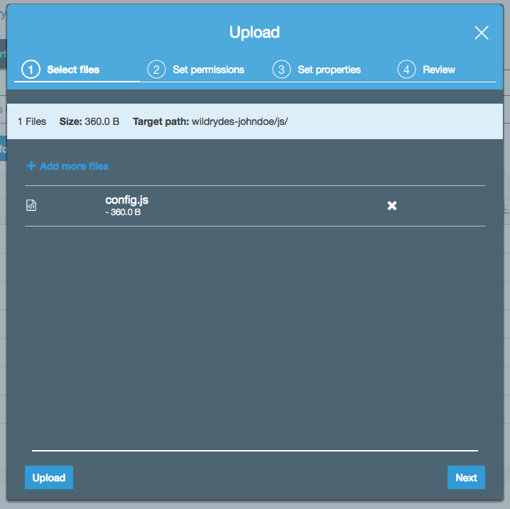

# 모듈 2: Amazon Cognito User Pools를 이용한 사용자 인증 및 등록

이 모듈에서는 Amazon Cognito user pool 을 만들어 사용자의 계정을 관리합니다. 고객이 새 사용자로 등록하고 이메일 주소를 확인하고 사이트에 로그인 할수있는 웹 페이지를 배포합니다.

다음 모듈로 건너 뛰려면, 원하는 지역에서 AWS CloudFormation 템플릿 중 하나를 시작해서 필요한 리소스를 자동으로 구축하십시오.

Region| Launch
------|-----
US East (N. Virginia) | [](https://console.aws.amazon.com/cloudformation/home?region=us-east-1#/stacks/new?stackName=wildrydes-webapp-2&templateURL=https://s3.amazonaws.com/wildrydes-us-east-1/WebApplication/2_UserManagement/user-management.yaml)
US East (Ohio) | [](https://console.aws.amazon.com/cloudformation/home?region=us-east-2#/stacks/new?stackName=wildrydes-webapp-2&templateURL=https://s3.amazonaws.com/wildrydes-us-east-2/WebApplication/2_UserManagement/user-management.yaml)
US West (Oregon) | [](https://console.aws.amazon.com/cloudformation/home?region=us-west-2#/stacks/new?stackName=wildrydes-webapp-2&templateURL=https://s3.amazonaws.com/wildrydes-us-west-2/WebApplication/2_UserManagement/user-management.yaml)
EU (Frankfurt) | [](https://console.aws.amazon.com/cloudformation/home?region=eu-central-1#/stacks/new?stackName=wildrydes-webapp-2&templateURL=https://s3.amazonaws.com/wildrydes-eu-central-1/WebApplication/2_UserManagement/user-management.yaml)
EU (Ireland) | [](https://console.aws.amazon.com/cloudformation/home?region=eu-west-1#/stacks/new?stackName=wildrydes-webapp-2&templateURL=https://s3.amazonaws.com/wildrydes-eu-west-1/WebApplication/2_UserManagement/user-management.yaml)
EU (London) | [](https://console.aws.amazon.com/cloudformation/home?region=eu-west-2#/stacks/new?stackName=wildrydes-webapp-2&templateURL=https://s3.amazonaws.com/wildrydes-eu-west-2/WebApplication/2_UserManagement/user-management.yaml)
Asia Pacific (Tokyo) | [](https://console.aws.amazon.com/cloudformation/home?region=ap-northeast-1#/stacks/new?stackName=wildrydes-webapp-2&templateURL=https://s3.amazonaws.com/wildrydes-ap-northeast-1/WebApplication/2_UserManagement/user-management.yaml)
Asia Pacific (Seoul) | [](https://console.aws.amazon.com/cloudformation/home?region=ap-northeast-2#/stacks/new?stackName=wildrydes-webapp-2&templateURL=https://s3.amazonaws.com/wildrydes-ap-northeast-2/WebApplication/2_UserManagement/user-management.yaml)
Asia Pacific (Sydney) | [](https://console.aws.amazon.com/cloudformation/home?region=ap-southeast-2#/stacks/new?stackName=wildrydes-webapp-2&templateURL=https://s3.amazonaws.com/wildrydes-ap-southeast-2/WebApplication/2_UserManagement/user-management.yaml)
Asia Pacific (Mumbai) | [](https://console.aws.amazon.com/cloudformation/home?region=ap-south-1#/stacks/new?stackName=wildrydes-webapp-2&templateURL=https://s3.amazonaws.com/wildrydes-ap-south-1/WebApplication/2_UserManagement/user-management.yaml)


<details>
<summary><strong>CloudFormation 실행 지침 (자세한 내용을 보려면 펼쳐주세요)</strong></summary><p>

1. 위의 **Launch Stack** 링크를 선택하십시오.

1. Select Template 페이지에서 **Next** 를 선택하십시오.

1. **Website Bucket Name** (예: `wildrydes-yourname`) 에 모듈 1의 웹사이트 버킷 이름을 입력하고 **Next** 를 선택하십시오.

    **참고:** 이전 모듈에서 사용한 것과 동일 버킷 이름을 지정해야 합니다. 존재하지 않거나 쓰기 권한이 없는 버킷이름을 제공하면 생성중에 CloudFormation 스택이 실패합니다.

    

1. 옵션 페이지에서, 모든 기본값을 그대로 두고 **Next** 를 선택하십시오.

1. 리뷰 페이지에서, acknowledge that CloudFormation will create IAM resources 체크박스를 선택하고 **Create** 을 선택합니다.
    

    이 템플릿은 사용자 지정 리소스를 사용하여 Amazon Cognito user pool 및 클라이언트를 만들고, 사용자 풀에 연결 및 웹사이트 버킷에 업로드하는데 필요한 세부 정보가 포함된 구성 파일을 생성합니다. 템플릿은 이런 리소스를 만들고 설정 파일을 버킷에 업로드 할 수 있는 액세스 권한을 제공하는 역할을 합니다.

1. `wildrydes-webapp-2` 스택이 `CREATE_COMPLETE` 상태가 될 때까지 기다립니다.

1. [구현 확인](#implementation-verification) 섹션에 설명 된 단계에 따라 다음 모듈로 이동할 준비가 되었는지 확인하십시오.

</p></details>

## 아키텍쳐 개요

사용자가 웹 사이트를 방문하면 먼저 새로운 사용자 계정을 등록합니다. 이 실습의 목적을 위해 우리는 이메일 주소와 암호를 넣도록 요구할것입니다. 하지만 Amazon Cognito 가 자신의 응용 프로그램에 추가 속성을 요구하도록 구성할 수 있습니다.

사용자 등록을 완료하면, Amazon Cognito 는 확인 코드가 포함된 검증 이메일을 제공한 주소로 보냅니다. 계정을 확인하기 위해 사용자는 사이트도 돌아와 이메일 주소와 받은 인증코드를 입력합니다. 가짜 이메일 주소를 테스트 하려는 경우 Amazon Cognito 콘솔을 사용해서 사용자 계정을 확인할수도 있습니다.

사용자가 확인한 계정 (이메일 확인 프로세스 또는 콘솔을 통한 수동 확인) 이면, 로그인을 할 수 있습니다. 로그인 할때 사용자의 이름 (혹은 이메일) 과 암호를 입력합니다. JavaScript 함수는 Amazon Cognito와 통신하고, Secure Remote Password protocol (SRP 프로토콜)을 사용하여 인증하고, JSON Web Tokens (JWT)을 수신합니다. JWT는 사용자의 인증에 대한 정보를 포함하고있어서 다음 모듈에서 Amazon API Gateway로 빌드한 RESTful API를 인증하는데 사용됩니다.


## 구현 지침

다음 섹션에서는 구현 개요와 자세한 단계별 지침을 제공합니다. 개요는 이미 AWS Management Console에 익숙하거나 둘러보기를 거치지 않고 직접 서비스를 탐색하려는 경우 구현을 완료하는 데 충분한 내용을 제공합니다.

최신 버전의 Chrome, Firefox, 혹은 Safari 웹 브라우저를 사용하는 경우 섹션을 펼쳐야 단계별 지침이 표시됩니다.

### 1. Amazon Cognito User Pool 만들기

Amazon Cognito 콘솔을 사용하여 기본 설정을 이용해서 새 사용자 풀을 만듭니다. 사용자 풀이 생성되면, Pool Id 를 메모장에 기록해놓으십시요. 나중에 이 값을 사용합니다.

<details>
<summary><strong>단계별 지침 (자세한 내용을 보려면 펼쳐주세요)</strong></summary><p>

1. AWS 콘솔에서 **Services** 를 클릭한 다음, 모바일 서비스에서 **Cognito** 를 선택하십시오.

1. **Manage your User Pools** 를 선택하십시오.

1. **Create a User Pool** 를 선택하십시오.

1. `WildRydes`와 같은 사용자 풀 이름을 입력한 다음, **Review Defaults**를 선택하십시오.

    

1. 리뷰 페이지에서, **Create pool**을 클릭하십시오.

1. 새로 생성된 user pool 의 세부정보 페이지에서 **Pool Id** 를 확인하십시오. (메모장에 기록해놓으면 좋습니다)

</p></details>

### 2. User Pool에 앱 클라이언트 추가

Amazon Cognito 콘솔에서 user pool 을 선택한 다음 **App clients** 섹션을 선택합니다. 새 앱을 추가하고 Generate client secret option 의 선택이 해제되어 있는지 확인하십시오. Client secrets 옵션은 JavaScript SDK에서 지원되지 않습니다. 생성된 암호로 앱을 만드는 경우 암호를 삭제하고 올바른 구성으로 새 암호를 만듭니다.

<details>
<summary><strong>단계별 지침 (자세한 내용을 보려면 펼쳐주세요)</strong></summary><p>

1. 사용자 풀에 대한 세부 정보 페이지의 왼쪽 탐색기 메뉴에서 **App clients** 를 선택합니다.

1. **Add an app client**를 선택합니다.

1. 앱에 `WildRydesWebApp` 와 같은 이름을 지정합니다.

1. **선택취소** Generate client secret 옵션의 선택은 해제하십시오. Client secrets 옵션은 웹 브라우저 기반 응용 프로그램에서는 사용할 수 없습니다.

1. **Create app client** 클릭하십시오.

   <kbd></kbd>

1. 새로 생성 된 응용 프로그램에 대한 **App client id** 를 미리 메모장에 복사해놓으십시오. 나중에 사용됩니다.

</p></details>

### 3. 웹 사이트 버킷에서 config.js 파일 업데이트

[/js/config.js](../1_StaticWebHosting/website/js/config.js) 파일에는 user pool ID, app client ID 및 Region에 대한 설정이 들어있습니다. 이전 단계에서 생성한 사용자 풀 및 앱의 설정으로 이 파일을 업데이트하고 파일을 S3 버킷에 다시 업로드 하십시오.

<details>
<summary><strong>단계별 지침 (자세한 내용을 보려면 펼쳐주세요)</strong></summary><p>

1. 이 저장소의 첫번째 모듈 웹 사이트의 디렉토리에서 [config.js](../1_StaticWebHosting/website/js/config.js) 파일을 로컬 시스템으로 다운로드하십시오.

1. 원하는 텍스트 편집기를 사용하여 다운로드 한 파일을 엽니다.

1. `cognito` 섹션을 방금 생성한 사용자 풀과 앱에 대한 올바른 값으로 수정하십시오.

    생성한 사용자 풀을 선택하면 Amazon Cognito 콘솔의 Pool Details 페이지에서 `userPoolId` 값을 확인할 수 있습니다.

    

    왼쪽 네비게이션 바에서 **App clients** 를 선택해서 `userPoolClientId` 값을 확인할 수 있습니다. 이전 섹션에서 생성한 앱에 대해 **App client id** 입력란의 값을 사용합니다.

    

    `region` 의 값은 사용자 풀을 생성한 AWS 지역 코드여야 합니다. 예 `us-east-1`는 N. Virginia Region, 혹은 `us-west-2`는 Oregon Region. 서울 리전은 'ap-northeast-2' 입니다. 사용할 코드를 잘 모르는 경우 풀 세부 정보 페이지에서 Pool ARN 값을 확인 할 수 있습니다. 지역코드는 ARN의 `arn:aws:cognito-idp:` 바로 뒤에 있는 부분입니다.

    수정된 config.js 파일은 다음과 같아야 합니다.
    ```JavaScript
    window._config = {
        cognito: {
            userPoolId: 'us-west-2_uXboG5pAb', // e.g. us-east-2_uXboG5pAb
            userPoolClientId: '25ddkmj4v6hfsfvruhpfi7n4hv', // e.g. 25ddkmj4v6hfsfvruhpfi7n4hv
            region: 'us-west-2' // e.g. us-east-2
        },
        api: {
            invokeUrl: '' // e.g. https://rc7nyt4tql.execute-api.us-west-2.amazonaws.com/prod',
        }
    };
    ```

1. 수정된 파일을 저장하고 파일 이름이 여전히 `config.js`인지 확인하십시오.

1. [https://console.aws.amazon.com/s3/](https://console.aws.amazon.com/s3/) 로 접속해서 Amazon S3 콘솔을 엽니다.

1. 이전 모듈에서 작성한 Wild Rydes 웹 사이트 버킷을 선택하십시오.

1. `js` 폴더로 이동하십시오.

1. **Upload** 를 선택한 다음, **Add Files** 를 선택하십시오.

1. congig.js 파일의 로컬 수정 버전을 저장한 디렉토리를 찾아서 선택하고, **Open** 을 선택하십시오.

    

1. 대화상자의 왼쪽에서 **Upload** 를 선택하십시오.

</p></details>

<p>

**참고:** 등록, 확인 및 로그인 흐름을 관리하기 위한 브라우저 측 코드를 작성하는 대신 첫번째 모듈에 배포한 애셋에서 작동하는 구현을 제공합니다. [cognito-auth.js](../1_StaticWebHosting/website/js/cognito-auth.js) 파일에는 UI 이벤트를 처리하고 적절한 Amazon Cognito Identity SDK 메소드를 호출하는 코드가 들어있습니다. SDK에 대한 자세한 내용은 [GitHub 프로젝트 페이지](https://github.com/aws/amazon-cognito-identity-js)를 참고하십시오.

</p>

## 작성한 내용 검증하기

1. 귀하의 웹 사이트 도메인 아래에서 `/register.html` 을 방문하거나, 혹은 홈페이지에서 **Giddy Up!** 버튼을 선택하십시오.

1. 등록 양식을 작성하고 **Let's Ryde** 를 선택하십시오. 사용자가 생성되었음을 알려주는 알림이 나타납니다.

1. 다음 두 가지 방법 중 하나를 사용하여 새 사용자를 확인하십시오.

  1. 직접 사용하는 이메일 주소를 사용한 경우 웹 사이트 도메인에서 `/verify.html` 를 방문해서 이메일로 전송 된 인증 코드를 입력하여 계정 확인 절차를 완료 할 수 있습니다.

  1. 가짜 이메일 주소를 사용한 경우, Cognito 콘솔을 통해 수동으로 사용자를 확인해야 합니다.

    1. AWS 콘솔에서 서비스를 클릭한 다음, Security, Identity & Compliance 에서 **Cognito** 를 선택하십시오.
    1. **Manage your User Pools** 를 선택하십시오.
    1. `WildRydes` 사용자 풀을 선택하고 왼쪽 네비게이션바에서 **Users and groups** 를 클릭하십시오.
    1. 등록 페이지를 통해 제출한 이메일 주소에 해당하는 사용자가 표시되어야합니다. 사용자 세부 정보 페이지를 보려면 해당 사용자의 이름을 선택하십시오.
    1. **Confirm user** 를 선택하여 계정 생성 프로세스를 완료하십시오.

1. `/verify.html` 페이지 또는 Cognito 콘솔을 사용해서 사용자를 확인한 다음, `/signin.html` 페이지를 방문해서 등록 단계에서 입력한 이메일 주소와 비밀번호를 사용하여 로그인하십시오.

1. 성공하면 `/ride.html` 페이지로 이동되어야합니다. API가 구성되지 않았다는 알림이 표시되어야합니다.

    

웹 응용프로그램에 성공적으로 로그인 하면, 다음 모듈인 [서버리스 백엔드](../3_ServerlessBackend)로 넘어가시면 됩니다.
