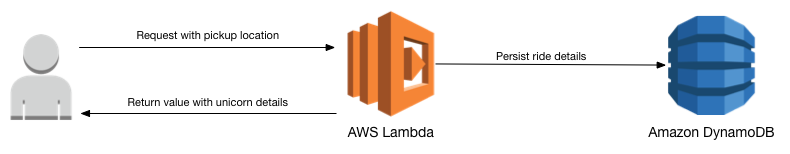
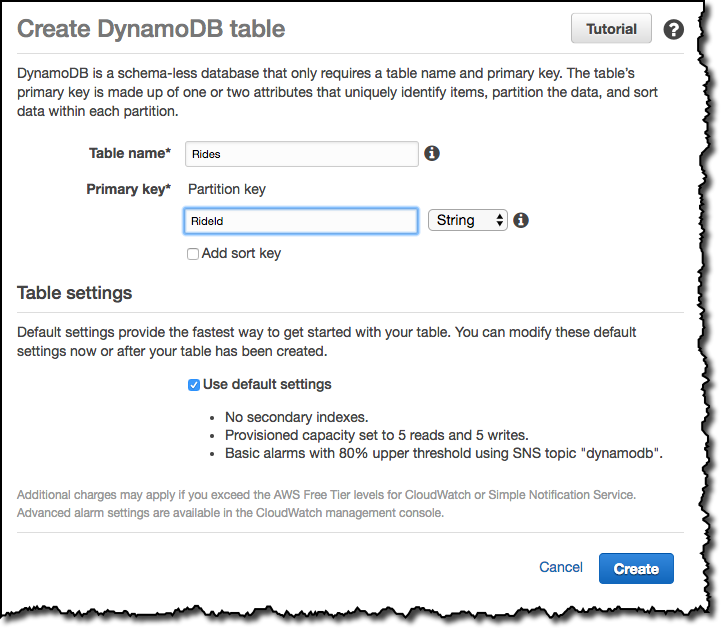
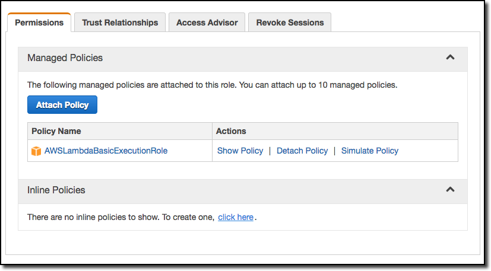
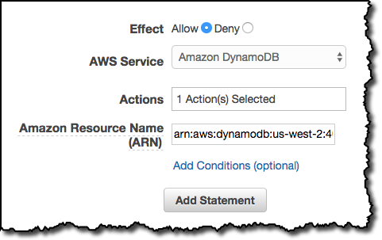
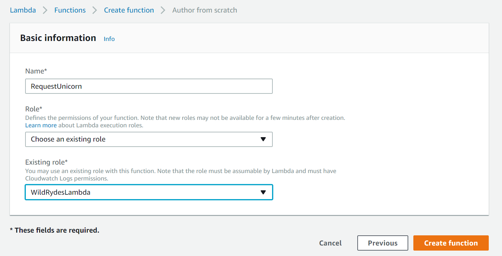
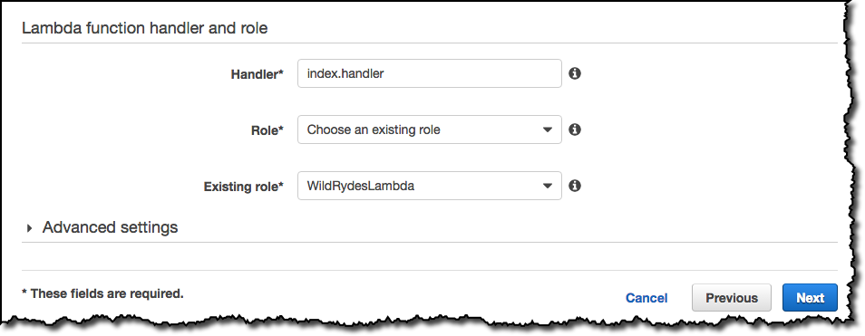
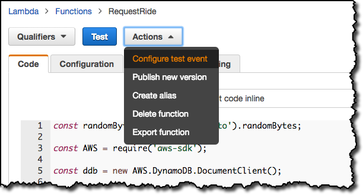
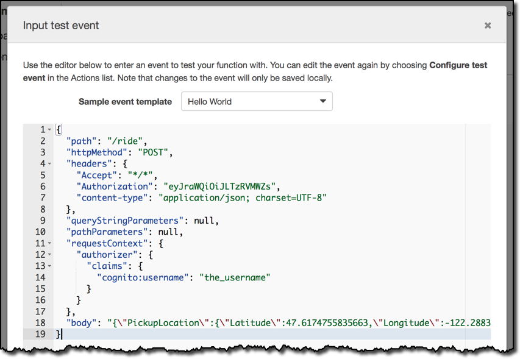

# 모듈 3: 서버리스 백엔드 서비스

이 모듈에서는 AWS Lambda 와 Amazon DynamoDB 를 사용하여 웹 애플리케이션의 요청을 처리하는 백엔드 프로세스를 빌드합니다. 첫번째 모듈에 배포한 브라우저 응용 프로그램을 사용하면 원하는 위치로 유니콘을 보내도록 요청할 수 있습니다. 이러한 요청을 충족시키려면 브라우저에서 실행되는 JavaScript가 클라우드에서 실행되는 서비스를 호출해야 합니다.

사용자가 유니콘을 요청할때마다 호출되는 람다 함수를 구현합니다. 이 함수는 함대에서 유니콘을 선택하고 DynamoDB 테이블에 요청을 기록한 다음 발송되는 유니콘에 대한 세부 정보를 프론트엔드 응용프로그램에 응답합니다.



이 함수는 Amazon API Gateway를 사용하여 브라우저에서 호출됩니다. 다음 모듈에서 해당 연결을 구현합니다. 이 모듈에서는 함수를 단독으로 테스트합니다.

## 구현 지침

다음 섹션에서는 구현 개요와 자세한 단계별 지침을 제공합니다. 개요는 이미 AWS Management Console에 익숙하거나 둘러보기를 거치지 않고 직접 서비스를 탐색하려는 경우 구현을 완료하는 데 충분한 내용을 제공합니다.

최신 버전의 Chrome, Firefox, 혹은 Safari 웹 브라우저를 사용하는 경우 섹션을 펼쳐야 단계별 지침이 표시됩니다.

### 1. Amazon DynamoDB 테이블 만들기

Amazon DynamoDB 콘솔을 사용해서 새로운 DynamoDB 테이블을 만드십시오. `Rides` 라는 테이블을 만들고 String 타입의 `RideId` 라는 파티션 키(Partition Key)를 부여하십시오. 다른 모든 설정에는 기본값을 사용하십시오.

테이블을 만든 뒤에는, 다음 단계에서 사용할 ARN 을 메모장에 복사해놓으십시오.

<details>
<summary><strong>단계별 지침 (자세한 내용을 보려면 펼쳐주세요)</strong></summary><p>

1. AWS Management 콘솔에서, **Services** 를 선택한 다음 데이터베이스에서 **DynamoDB** 를 선택하십시오.

1. **Create table** 을 선택하십시오.

1. **Table name** 에 `Rides` 를 입력하십시오.

1. **Partition key** 에 대해 `RideId` 키 유형(key type) 으로 **String** 을 선택하십시오.

1. **Use default settings** 체크박스를 선택하고 **Create** 을 선택하십시오.

    

1. 새 테이블의 개요 섹션 아래로 스크롤해서 **ARN** 을 확인하십시오. 다음 섹션에서 이것을 사용할 것입니다. 미리 메모장에 복사해놓는게 좋습니다.

</p></details>


### 2. 람다 함수에 대한 IAM 역할 만들기
IAM 콘솔을 사용하여 새 역할을 만듭니다. 이름을 `WildRydesLambda` 로 지정하고 역할 유형으로 AWS Lambda를 선택하십시오. 함수 권한을 부여하는 정책을 첨부하여 Amazon CloudWatch 로그에 기록하고 항목을 DynamoDB 테이블에 저장해야합니다.

`AWSLambdaBasicExecutionRole` 라는 관리 정책을 이 역할(role)에 추가해서 필요한 CloudWatch Logs 권한을 부여하십시오. 또한 이전 섹션에서 생성한 테이블에 대한 `ddb:PutItem` 액션을 허용하는 역할을 위한 커스텀 인라인 정책을 생성하십시오.

<details>
<summary><strong>단계별 지침 (자세한 내용을 보려면 펼쳐주세요)</strong></summary><p>

1. AWS Management Console 에서 **Services** 를 선택한 다음, Security, Identity & Compliance 섹션에서 **IAM** 을 선택하십시오.

1. 왼쪽 네비게이션바에서 **Roles** 을 선택하고 **Create new role** 를 선택하십시오.

1. 역할 유형(role type)으로 **AWS Lambda** 를 선택하십시오.

    **참고:** 역할 유형(role type)을 선택하면 AWS가 사용자를 대신해서 이 역할을 맡을 수 있도록 역할에 대한 신뢰 정책(trust policy)이 자동으로 생성됩니다. CLI, AWS CloudFormation 또는 다른 메커니즘을 사용해서 이 역할을 작성하는 경우 직접 신뢰 정책(trust policy)을 지정합니다.

1. **Filter** 압력란에 `AWSLambdaBasicExecutionRole` 를 입력하고 해당 역할 옆의 확인란을 선택하십시오.

1. **Next Step** 을 선택하십시오.

1. **Role name** 에 `WildRydesLambda` 를 입력하십시오.

1. **Create role** 을 선택하십시오.

1. 역할 페이지의 필터 입력칸에 `WildRydesLambda` 를 입력하고 방금 작성한 역할을 선택하십시오.

1. Permissions 탭에서 **Inline Policies** 섹션을 확장하고 **click here** 링크를 선택해서 새 인라인 정책을 만드십시오.

   

1. **Policy Generator** 가 선택되어 있는지 확인하고 **Select** 을 선택하십시오.

1. **AWS Service** 드롭다운 메뉴에서 **Amazon DynamoDB** 를 선택하십시오.

1. Actions 목록에서 **PutItem** 를 선택하십시오.

1. 이전 섹션에서 작성한 테이블의 ARN을 **Amazon Resource Name (ARN)** 입력칸에 붙여 넣으십시오.

    

1. **Add Statement** 를 선택하십시오.

1. **Next Step** 울 선택한 다음 **Apply Policy** 를 선택하십시오.

</p></details>

### 3. 요청 처리를 위한 람다 함수 만들기
AWS Lambda 콘솔을 사용하여 API 요청을 처리할 `RequestUnicorn` 라는 새로운 람다 함수를 만듭니다. 함수 코드에 제공된 [requestUnicorn.js](requestUnicorn.js) 예제 구현을 사용하십시오. 해당 파일을 복사하여 AWS Lambda 콘솔 편집기에 붙여넣기만 하면 됩니다.

이전 섹션에서 작성한 `WildRydesLambda` IAM 역할을 사용하도록 함수를 설정해야합니다.

<details>
<summary><strong>단계별 지침 (자세한 내용을 보려면 펼쳐주세요)</strong></summary><p>

1. **Services** 를 선택한 다음 Compute 섹션에서 **Lambda** 를 선택하십시오.

1. **Create a Lambda function** 를 선택하십시오.

1. **Author from scratch** 버튼을 선택하십시오.

1. 트리거를 지금 설정하지 마십시오. **Next** 를 선택하여 함수를 정의하는 부분을 진행합니다.

1. **Name** 입력칸에 `RequestRide` 를 입력하십시오.

1. description 입력칸은 옵션입니다.

1. **Runtime** 에 대해 **Node.js 6.10** 을 선택하십시오.

1. [requestUnicorn.js](requestUnicorn.js) 의 코드를 복사하여 코드 입력 영역에 붙여 넣으십시오.

    

1. **Handler** 입력칸에 대해 `index.handler` 의 기본값을 그대로 둡니다.

1. **Existing Role** 드롭다운에서 `WildRydesLambda` 를 선택합니다.

1. **Next** 을 선택한 다음 리뷰 페이지에서 **Create function** 를 선택하십시오.

    

</p></details>

## 작성한 내용 검증하기

이 모듈에서는 AWS Lambda 콘솔을 사용하여 작성한 함수를 테스트합니다. 다음 모듈에서는 API Gateway 가 있는 REST API를 추가하므로 첫번째 모듈에서 배포한 브라우저 기반 응용 프로그램에서 함수를 호출할 수 있습니다.

1. 작성한 함수의 기본 편집 화면에서, 먼저 **Actions** 를 선택한 다음 **Configure test event** 를 선택하십시오.

    

1. 다음 테스트 이벤트를 복사해서 편집기에 붙여넣습니다:

    ```JSON
    {
        "path": "/ride",
        "httpMethod": "POST",
        "headers": {
            "Accept": "*/*",
            "Authorization": "eyJraWQiOiJLTzRVMWZs",
            "content-type": "application/json; charset=UTF-8"
        },
        "queryStringParameters": null,
        "pathParameters": null,
        "requestContext": {
            "authorizer": {
                "claims": {
                    "cognito:username": "the_username"
                }
            }
        },
        "body": "{\"PickupLocation\":{\"Latitude\":47.6174755835663,\"Longitude\":-122.28837066650185}}"
    }
    ```

1. **Save and test** 를 선택하십시오.

    

1. 실행이 성공했고 함수 결과가 다음과 같은지 확인하십시오:
```JSON
{
    "statusCode": 201,
    "body": "{\"RideId\":\"SvLnijIAtg6inAFUBRT+Fg==\",\"Unicorn\":{\"Name\":\"Rocinante\",\"Color\":\"Yellow\",\"Gender\":\"Female\"},\"Eta\":\"30 seconds\"}",
    "headers": {
        "Access-Control-Allow-Origin": "*"
    }
}
```

람다 콘솔을 사용해서 새 함수를 성공적으로 테스트 한 뒤, 다음 모듈인 [RESTful APIs](../4_RESTfulAPIs) 로 넘어가시면 됩니다.
